# 🚀 DevOps Zero to Hero

<div align="center">


**A 100% Free, Beginner-First, Production-Grade Cloud & DevOps Curriculum.**  
From your very first Linux terminal command to multi-cluster Kubernetes, Terraform IaC, Observability, DevSecOps, and GitOps delivery.

[](https://devops01.vercel.app)
[](LICENSE)
[](https://github.com/zinoo-dez/devops-zero-to-hero/stargazers)
[](https://github.com/zinoo-dez/devops-zero-to-hero/pulls)

</div>

---

## 🌟 Features & Highlights

- **13 Mastery Courses**: Linux CLI, Git & GitHub, GitHub Actions, CI/CD Concepts, Docker Fundamentals, Docker Compose, Kubernetes Architecture, K3s Lightweight Cluster, Terraform IaC, Prometheus & Grafana, DevSecOps Hardening, ArgoCD GitOps, and a Real-world Production Capstone.
- **110+ Interactive Lessons**: Fully structured with zero fluff, plain-English analogies, copyable terminal commands, and common mistake callouts.
- **Interactive Terminal Sandbox**: Practice Linux, Git, Docker, and Kubernetes CLI commands directly in the browser.
- **Visual Architecture Roadmaps**: Interactive 2D graph roadmap built with React Flow and Mermaid.js diagrams.
- **Zero Local Setup Required**: Direct 1-click integrations with free cloud playgrounds (Killercoda, Play with Docker, GitHub Codespaces).
- **Dark & Light Mode**: Tailored White-Dark-Blue architecture with smooth theme transitions and responsive layouts.

---

## 🗺️ Curriculum Progression

```mermaid
flowchart LR
    L1["01. Linux CLI"] --> L2["02. Git & GitHub"]
    L2 --> L3["03. GitHub Actions"]
    L3 --> L4["04. CI/CD Concepts"]
    L4 --> L5["05. Docker Fundamentals"]
    L5 --> L6["06. Docker Compose"]
    L6 --> L7["07. Kubernetes Basics"]
    L7 --> L8["08. K3s Production"]
    L8 --> L9["09. Terraform IaC"]
    L9 --> L10["10. Observability (Prometheus/Grafana)"]
    L10 --> L11["11. DevSecOps & Scanning"]
    L11 --> L12["12. ArgoCD GitOps"]
    L12 --> L13["13. End-to-End Capstone"]

    style L1 fill:#064e3b,stroke:#10b981,stroke-width:2px,color:#fff
    style L7 fill:#1e3a8a,stroke:#3b82f6,stroke-width:2px,color:#fff
    style L13 fill:#581c87,stroke:#a855f7,stroke-width:2px,color:#fff
```



---

## 🛠️ Tech Stack

- **Framework**: [Next.js 16 (App Router & Turbopack)](https://nextjs.org/)
- **Styling**: [Tailwind CSS 4](https://tailwindcss.com/)
- **Interactive Diagrams**: [React Flow](https://reactflow.dev/) & [Mermaid.js](https://mermaid.js.org/)
- **Animation**: [Framer Motion](https://www.framer.com/motion/)
- **Icons**: [Lucide React](https://lucide.dev/)
- **Deployment**: [Vercel](https://devops01.vercel.app)

---

## 💻 Local Development

```bash
# 1. Clone repository
git clone https://github.com/zinoo-dez/devops-zero-to-hero.git
cd devops-zero-to-hero

# 2. Install dependencies
npm install

# 3. Start local development server
npm run dev

# 4. Open http://localhost:3000 in your browser
```

---

## 🤝 Contributing

Contributions, feedback, and suggestions are warmly welcomed!

1. Fork the repo (`https://github.com/zinoo-dez/devops-zero-to-hero/fork`)
2. Create your feature branch (`git checkout -b feature/new-lesson`)
3. Commit your changes (`git commit -m 'feat: add lesson on eBPF security'`)
4. Push to branch (`git push origin feature/new-lesson`)
5. Open a Pull Request!

---

## 📄 License & Community

Created with ❤️ by **Zin Oo** for developers, sysadmins, and students everywhere.  
Distributed under the MIT License.
