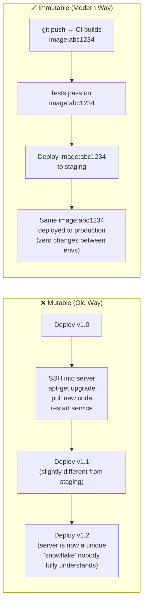
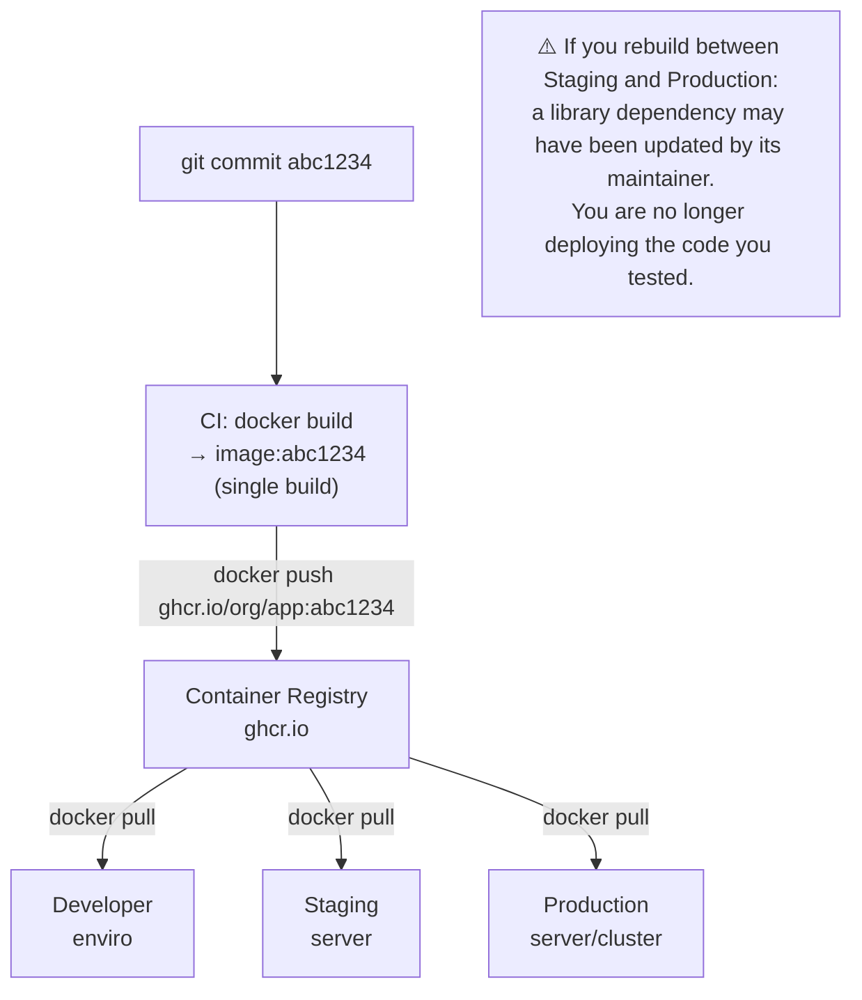

# What Is a Build Artifact?

An artifact is the immutable, tested output of a CI pipeline — the thing you actually deploy to production. The type of artifact has evolved significantly over decades:

| Era | Artifact Type | Example | Problem |
|-----|--------------|---------|---------|
| **1990s** | Raw binary / zip | `app.war`, `app.zip` | "It works on my machine" |
| **2000s** | VM image | AWS AMI, OVA | Heavy (GB), slow to transfer |
| **2010s** | Container image | Docker image | ✅ Portable, fast, layered |
| **Today** | OCI image + SBOM + signature | Signed Docker image | ✅ + secure, auditable |

The modern standard is the **OCI container image** — a portable, layered, content-addressed package that bundles the application and its exact runtime environment.

---

## The Immutable Server Pattern

The most important principle in artifact management: **once an artifact is built and tested, it is never modified**.



**Configuration Drift** is what happens when mutable servers diverge over time. Every SSH session, every manual hotfix, every one-time `apt-get` gradually makes each server a unique "snowflake" — impossible to reproduce, impossible to debug confidently, and impossible to scale reliably.

With immutable artifacts:
- Staging and Production run the **exact same image** (same SHA256 digest)
- Rollback means "switch to a previous image tag" — no code changes, no pipeline run
- Every server is replaceable — destroy one, spin up a fresh one with the same image

---

## Build Once, Deploy Everywhere



Never rebuild your image between environments. The SHA256 digest of the image is the guarantee that what you tested is what you run.

---

## Tagging Strategy: Never Use `:latest` Alone

```
❌ Anti-pattern: tagging everything as :latest
   - Deployment: docker pull myapp:latest  → Could be any version
   - Rollback: docker pull myapp:latest    → Still the broken version!
   - Debugging: what code is running?      → No idea

✅ Production tagging strategy:
   myapp:abc1234        ← Git SHA (immutable, links to exact commit)
   myapp:v1.5.2         ← SemVer (human-readable release version)
   myapp:main           ← Latest commit on main branch
   myapp:latest         ← Convenience alias (mutable — for human use only)
```

```bash
# In CI, generate all tags from git metadata
GIT_SHA=$(git rev-parse --short HEAD)
VERSION=$(git tag --points-at HEAD || echo "untagged")
BRANCH=$(git rev-parse --abbrev-ref HEAD | tr '/' '-')

# Build once
docker build -t myapp:local .

# Apply multiple tags
docker tag myapp:local ghcr.io/yourorg/myapp:${GIT_SHA}
docker tag myapp:local ghcr.io/yourorg/myapp:${BRANCH}
docker tag myapp:local ghcr.io/yourorg/myapp:latest

# On a release tag:
if [[ "$VERSION" != "untagged" ]]; then
  docker tag myapp:local ghcr.io/yourorg/myapp:${VERSION}
fi

# Push all tags
docker push ghcr.io/yourorg/myapp --all-tags
```

---

## Choosing the Right Container Registry

| Registry | Best For | Auth | Cost |
|---------|---------|------|------|
| **GitHub GHCR** (`ghcr.io`) | GitHub projects | GitHub token | Free for public; included with GitHub plans |
| **Docker Hub** (`docker.io`) | Open-source public images | Docker token | Free (rate limited); paid for private |
| **AWS ECR** | AWS (ECS/EKS) deployments | IAM roles | $0.10/GB storage |
| **Google Artifact Registry** | GCP (GKE) deployments | Service accounts | $0.10/GB storage |
| **Azure Container Registry** | Azure (AKS) deployments | Service principals | Tiered pricing |
| **Harbor** (self-hosted) | Air-gapped / enterprise | Internal | Infrastructure cost only |

### Registry Best Practices

```bash
# Use image digest (immutable) not just tag (mutable) in production
# Tag can be overwritten — digest cannot
docker pull ghcr.io/yourorg/myapp:v1.5.2
# → sha256:a1b2c3d4e5f6...

# Reference by digest in Kubernetes (truly immutable)
image: ghcr.io/yourorg/myapp@sha256:a1b2c3d4e5f6...

# Enable content trust (verify signed images before pull)
export DOCKER_CONTENT_TRUST=1
docker pull ghcr.io/yourorg/myapp:v1.5.2
# Validates signature before accepting image

# Set up registry garbage collection to clean old images
# (Registries grow large over time — tag pruning is essential)
```

---

## Software Bill of Materials (SBOM)

An SBOM is a machine-readable inventory of every component inside your artifact — every OS package, every npm library, every transitive dependency. It's the ingredient list for your software.

```bash
# Generate SBOM using Syft
syft ghcr.io/yourorg/myapp:v1.5.2 -o spdx-json > sbom.spdx.json

# Or with CycloneDX format
syft ghcr.io/yourorg/myapp:v1.5.2 -o cyclonedx-json > sbom.cyclonedx.json

# Inspect what's inside
cat sbom.spdx.json | python3 -c "
import json,sys
d=json.load(sys.stdin)
for pkg in d.get('packages',[]):
    print(f\"{pkg['name']}@{pkg['versionInfo']}\")"

# Attach the SBOM to the container image as an OCI attestation
cosign attest \
  --predicate sbom.spdx.json \
  --type spdxjson \
  ghcr.io/yourorg/myapp:v1.5.2
```

**Why SBOMs matter**:
- **Log4Shell (CVE-2021-44228)**: When this critical Java vulnerability was announced, teams without SBOMs spent days manually checking if their applications were affected. Teams with SBOMs ran a search against their inventory and had a complete answer in minutes.
- **Regulatory compliance**: NIST SP 800-218, FedRAMP, and PCI DSS increasingly require SBOMs for software supply chain security.

---

## Image Signing with Cosign (Sigstore)

Image signing proves that a specific image was produced by your trusted CI pipeline and hasn't been tampered with. Anyone with the public key can verify it:

```bash
# Install cosign
brew install sigstore/tap/cosign

# Generate a key pair (for keyless signing, use OIDC instead)
cosign generate-key-pair

# Sign an image (after pushing to registry)
cosign sign \
  --key cosign.key \
  ghcr.io/yourorg/myapp:v1.5.2
# Enters the signature as an OCI artifact in the same registry

# Verify a signature before deployment
cosign verify \
  --key cosign.pub \
  ghcr.io/yourorg/myapp:v1.5.2
# Verified OK ✅

# Keyless signing in GitHub Actions (uses OIDC, no key management)
- name: Sign image
  uses: sigstore/cosign-installer@v3
  
- name: Sign with keyless OIDC
  run: |
    cosign sign \
      --yes \
      ghcr.io/${{ github.repository }}:${{ github.sha }}
  env:
    COSIGN_EXPERIMENTAL: 1
```

---

## Integrating SBOM + Signing into CI/CD

```yaml
# .github/workflows/publish.yml
jobs:
  build-and-secure:
    runs-on: ubuntu-latest
    permissions:
      contents: read
      packages: write
      id-token: write    # Required for keyless OIDC signing

    steps:
      - uses: actions/checkout@v4

      - uses: docker/setup-buildx-action@v3
      
      - uses: docker/login-action@v3
        with:
          registry: ghcr.io
          username: ${{ github.actor }}
          password: ${{ secrets.GITHUB_TOKEN }}

      - name: Build and push
        id: build
        uses: docker/build-push-action@v5
        with:
          push: true
          tags: ghcr.io/${{ github.repository }}:${{ github.sha }}
          # Include SBOM and provenance attestation
          sbom: true
          provenance: true

      - name: Install cosign
        uses: sigstore/cosign-installer@v3

      - name: Sign image (keyless via GitHub OIDC)
        run: |
          cosign sign --yes \
            ghcr.io/${{ github.repository }}@${{ steps.build.outputs.digest }}
        env:
          COSIGN_EXPERIMENTAL: 1

      - name: Verify signature
        run: |
          cosign verify \
            --certificate-oidc-issuer https://token.actions.githubusercontent.com \
            --certificate-identity-regexp ".*" \
            ghcr.io/${{ github.repository }}@${{ steps.build.outputs.digest }}
```

---

## Artifact Retention Policies

Registries accumulate images rapidly. Without pruning, storage costs grow indefinitely:

```bash
# GitHub GHCR: delete old images via GitHub API
# Delete all images older than 90 days except the last 5 versions
gh api --method DELETE \
  /user/packages/container/myapp/versions \
  --jq '.[] | select(.metadata.container.tags | length == 0) | .id' \
  | xargs -I {} gh api --method DELETE /user/packages/container/myapp/versions/{}

# ECR lifecycle policy (auto-cleans old images)
aws ecr put-lifecycle-policy \
  --repository-name myapp \
  --lifecycle-policy-text '{
    "rules": [{
      "rulePriority": 1,
      "description": "Keep last 10 tagged images",
      "selection": {
        "tagStatus": "tagged",
        "tagPatternList": ["v*"],
        "countType": "imageCountMoreThan",
        "countNumber": 10
      },
      "action": {"type": "expire"}
    }]
  }'
```

---

## Summary

Modern artifact management is built on four pillars:
- **Immutability**: once built and tested, an artifact is never modified — configuration drift is eliminated
- **Traceability**: every artifact is tagged with the git SHA that produced it — you can always find the code for any deployed version
- **Provenance**: SBOMs document exactly what's inside; signatures (Cosign/Sigstore) prove the artifact came from your trusted pipeline
- **Retention**: prune old images on a schedule — registries are not unlimited; most teams keep the last 10–30 tagged versions

In the next lesson, you will master automated testing gates — the quality checkpoints that prevent bad code from ever reaching your artifact registry.
