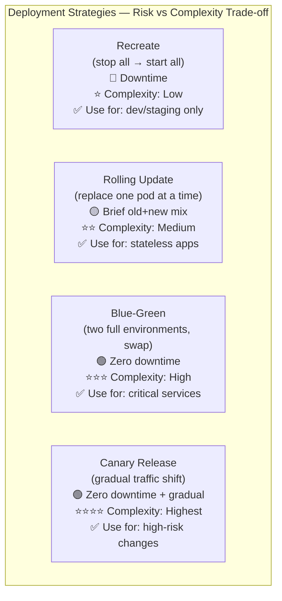
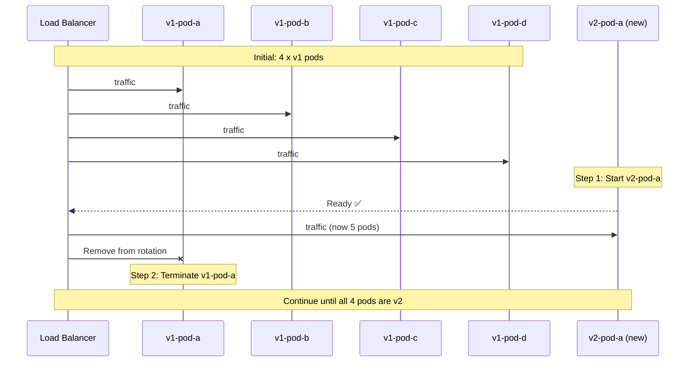
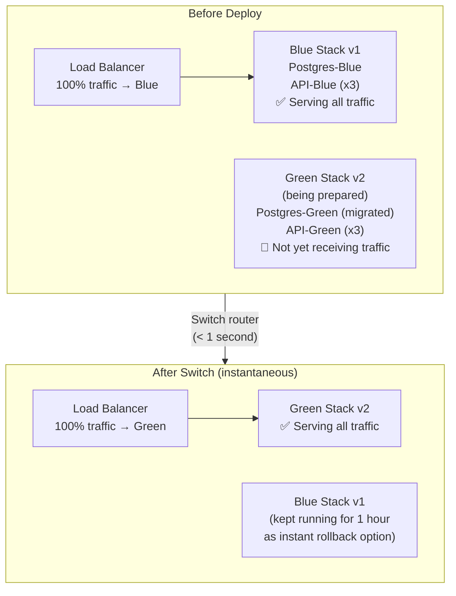
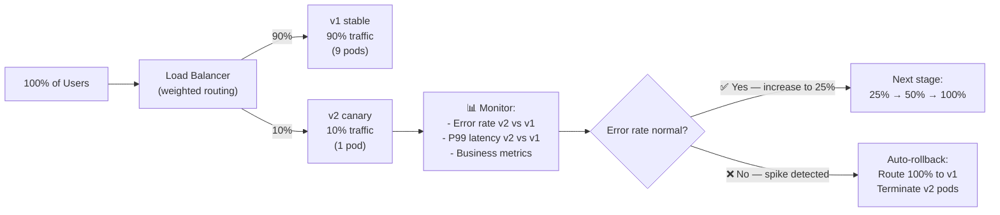

# Why Deployment Strategy Matters

The way you deploy software directly determines whether your users experience downtime and how quickly you can recover from a bad release. A naive "stop old, start new" approach causes seconds to minutes of downtime on every deploy. Production systems require sophisticated routing strategies that make deployments invisible to users.



---

## Strategy 1: Recreate (Stop All, Start All)

The simplest strategy — stop all old containers, then start all new ones. Not suitable for production.

```yaml
# In Kubernetes
spec:
  strategy:
    type: Recreate   # Stop all old pods, then start all new pods
```

```
Timeline:
T=0:00  Deployment starts
T=0:05  All old pods (v1) terminated  ← ❌ SERVICE DOWN
T=0:30  New pods (v2) starting up
T=0:45  New pods pass health checks   ← Service back up
```

**Use only for**: development, non-production environments, jobs that can't run two versions simultaneously (like database migrations with exclusive locks).

---

## Strategy 2: Rolling Update (Kubernetes Default)

Kubernetes replaces pods one (or a few) at a time. During rollout, both old and new versions handle traffic simultaneously — this is the key constraint.

```yaml
# Kubernetes Deployment with rolling update config
apiVersion: apps/v1
kind: Deployment
metadata:
  name: my-api
spec:
  replicas: 4
  strategy:
    type: RollingUpdate
    rollingUpdate:
      maxSurge: 1          # At most 1 extra pod above desired count during rollout
      maxUnavailable: 0    # No pods can be unavailable (zero-downtime guarantee)
      # With 4 replicas, maxSurge=1, maxUnavailable=0:
      # Start 1 new pod (now 5 running) → terminate 1 old (back to 4) → repeat
```



**Constraint**: During a rolling update, old and new versions of your app handle traffic simultaneously. Your new version **must be backward-compatible** with the existing database schema. You cannot rename a column in a migration and deploy in one go.

### Rolling Update Best Practice: Backward-Compatible Migrations

```sql
-- Bad: rename column in one shot (v2 expects 'email' but v1 is still running with 'email_address')
ALTER TABLE users RENAME COLUMN email_address TO email;

-- Good: expand-contract migration over multiple deploys
-- Step 1 (deploy v1.1): Add new column, populate it, both columns exist
ALTER TABLE users ADD COLUMN email VARCHAR(255);
UPDATE users SET email = email_address;

-- Step 2 (deploy v1.2 — after v1.1 is fully rolled out): app uses 'email'
-- Both columns still exist during rolling update

-- Step 3 (deploy v1.3 — after v1.2 is stable): drop old column
ALTER TABLE users DROP COLUMN email_address;
```

---

## Strategy 3: Blue-Green Deployment

Two complete, identical environments run side-by-side — "Blue" (current production) and "Green" (new version). A load balancer or DNS switch flips all traffic from Blue to Green in an instant.



### Blue-Green with Docker Compose

```bash
# Current production: "blue" stack running on port 3000
COMPOSE_PROJECT_NAME=myapp-blue docker compose \
  -f docker-compose.yml -f docker-compose.prod.yml \
  up -d

# Step 1: Start the "green" stack (new version) on a different port
IMAGE_TAG=v2.0.0 COMPOSE_PROJECT_NAME=myapp-green docker compose \
  -f docker-compose.yml -f docker-compose.prod.yml \
  up -d

# Step 2: Run migrations (green's DB before switching traffic)
docker compose -p myapp-green exec api npx prisma migrate deploy

# Step 3: Verify green is healthy
curl http://localhost:3001/health
# {"status":"ok","version":"2.0.0"}

# Step 4: Switch nginx to point to green (atomic — < 1 second of disruption)
# Update nginx upstream to point to green, then reload
sed -i 's/myapp-blue-api-1:3000/myapp-green-api-1:3000/' /etc/nginx/conf.d/default.conf
nginx -s reload

# Step 5: Monitor for 30 minutes. If OK, tear down blue
COMPOSE_PROJECT_NAME=myapp-blue docker compose down

# Step 5 (ROLLBACK): If green is bad, switch back to blue instantly
sed -i 's/myapp-green-api-1:3000/myapp-blue-api-1:3000/' /etc/nginx/conf.d/default.conf
nginx -s reload
COMPOSE_PROJECT_NAME=myapp-green docker compose down
```

**Cost**: Blue-Green requires double the infrastructure during the switch window (2x servers/pods). This is why it's typically used for large, critical services rather than small apps.

---

## Strategy 4: Canary Release (Gradual Traffic Shift)

A Canary release sends a small percentage of real traffic to the new version. If metrics look good, traffic is gradually increased. If errors spike, the release is automatically aborted.

Named after "canary in a coal mine" — a small, limited exposure to detect danger before full commitment.



### Canary in Kubernetes with Argo Rollouts

```yaml
# Install: kubectl apply -f https://github.com/argoproj/argo-rollouts/releases/latest/download/install.yaml

apiVersion: argoproj.io/v1alpha1
kind: Rollout
metadata:
  name: my-api
spec:
  replicas: 10
  strategy:
    canary:
      # Gradual traffic steps
      steps:
        - setWeight: 5     # Send 5% to canary
        - pause: { duration: 5m }   # Wait and observe metrics
        - setWeight: 20
        - pause: { duration: 10m }
        - setWeight: 50
        - pause: { duration: 10m }
        - setWeight: 100   # Full rollout

      # Automatic analysis: abort if error rate spikes
      analysis:
        templates:
          - templateName: success-rate
        startingStep: 1
        args:
          - name: service-name
            value: my-api-canary

---
# AnalysisTemplate: define what "success" means
apiVersion: argoproj.io/v1alpha1
kind: AnalysisTemplate
metadata:
  name: success-rate
spec:
  args:
    - name: service-name
  metrics:
    - name: success-rate
      interval: 1m
      successCondition: result[0] >= 0.95   # 95%+ success rate required
      failureLimit: 3                         # Abort after 3 consecutive failures
      provider:
        prometheus:
          address: http://prometheus:9090
          query: |
            sum(rate(http_requests_total{
              service="{{args.service-name}}",
              status_code!~"5.*"
            }[5m])) 
            / 
            sum(rate(http_requests_total{
              service="{{args.service-name}}"
            }[5m]))
```

### Canary with Docker Compose (Simple Nginx Weighted Upstream)

```nginx
# nginx.conf
upstream api_backend {
    server myapp-blue-api:3000 weight=9;   # 90% to v1
    server myapp-green-api:3000 weight=1;  # 10% to v2
    keepalive 32;
}
```

```bash
# Gradually increase weight as confidence grows
# Edit nginx.conf: weight=7 / weight=3
nginx -s reload

# Monitor error rates
docker compose logs green-api | grep "status=5" | wc -l

# If OK: 50/50, then 100% green
# If errors: revert to 100% blue instantly
```

---

## Feature Flags: Deploy Without Releasing

Feature flags decouple deployment from release — code ships to production but is "turned off" for most users:

```typescript
// Feature flag check using environment variable
if (process.env.FEATURE_NEW_CHECKOUT === 'true') {
  return <NewCheckout />;
}
return <OldCheckout />;

// Or with a feature flag service (LaunchDarkly, Unleash, Flagsmith)
const showNewCheckout = await featureFlags.isEnabled('new-checkout', {
  userId: user.id,
  rolloutPercentage: 10,  // Show to 10% of users
});
```

**Benefits**:
- Deploy code that's not yet visible to users (gradual reveal)
- Instantly disable a bad feature without redeployment (kill switch)
- A/B test: show v1 to 50% and v2 to 50% and measure conversion

---

## Choosing the Right Strategy

| Strategy | Downtime | Rollback speed | Infrastructure cost | Right for |
|---------|---------|---------------|---------------------|-----------|
| **Recreate** | Minutes | Minutes | Low | Dev/staging only |
| **Rolling Update** | None (if maxUnavailable=0) | ~5 minutes | None extra | Most K8s workloads |
| **Blue-Green** | None | < 1 second | 2x during window | High-traffic, critical services |
| **Canary** | None | Automatic | Low extra | High-risk feature changes |
| **Feature Flags** | None | Instant | None extra | Any size team |

---

## Database Migration Strategy Per Deployment Type

| Migration type | Rolling Update | Blue-Green | Canary |
|---------------|---------------|-----------|--------|
| **Add a new table** | ✅ Safe (backward-compatible) | ✅ | ✅ |
| **Add a nullable column** | ✅ Safe | ✅ | ✅ |
| **Add a non-null column (with default)** | ✅ Safe | ✅ | ✅ |
| **Remove a column** | ❌ Expand-contract required | ✅ (v1 is off) | ⚠️ 3-deploy process |
| **Rename a column** | ❌ Expand-contract required | ✅ (v1 is off) | ⚠️ 3-deploy process |
| **Rewrite data format** | ❌ Expand-contract required | ✅ (v1 is off) | ⚠️ Complex |

---

## Summary

Deployment strategy is one of the most important architectural decisions in a CI/CD system:
- **Recreate**: simple but causes downtime — development only
- **Rolling Update**: Kubernetes default, zero downtime, but requires backward-compatible schema changes (`maxUnavailable=0`)
- **Blue-Green**: instant traffic switch with instant rollback, requires 2x infrastructure during transition
- **Canary**: gradual traffic shift with automatic metrics-based rollback (Argo Rollouts) — highest safety for high-risk changes
- **Feature Flags**: decouple deployment from release — ship dark, reveal gradually

In the next lesson, you will learn observability in CI/CD — how to measure pipeline health, DORA metrics, and use dashboards to drive continuous improvement.
