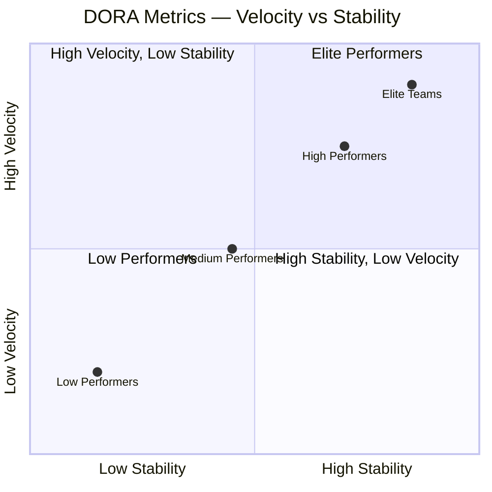
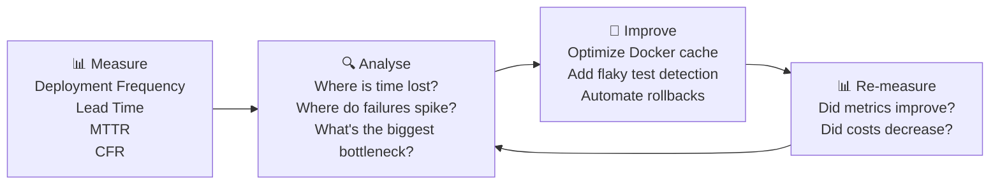

# Treating Your Pipeline as a Production System

If your CI/CD pipeline goes down, 100 developers are blocked from shipping code. Yet most teams monitor their application carefully and ignore their pipeline entirely — until it breaks at 2 AM before a critical release.

Elite DevOps teams treat the pipeline as a mission-critical production system: it gets dashboards, alerts, SLOs, and continuous optimization.

---

## DORA Metrics: The Industry Standard

The **DevOps Research and Assessment** (DORA) team at Google studied thousands of engineering teams over several years. They identified 4 metrics that statistically distinguish elite from low performers — and proved that improving these metrics directly improves business outcomes.



### The Four DORA Metrics

| Metric | Measures | Elite | Low |
|--------|---------|-------|-----|
| **Deployment Frequency** | How often code ships to production | Multiple/day | Monthly or less |
| **Lead Time for Changes** | Commit → production | < 1 hour | 1–6 months |
| **Mean Time to Recovery (MTTR)** | Incident detected → service restored | < 1 hour | 1 week–1 month |
| **Change Failure Rate** | % of deploys causing incidents | 0–15% | 46–60% |

**The key insight**: Velocity and stability are NOT in conflict. Elite teams deploy more frequently AND have fewer failures. Rigorous testing, automation, and small batch sizes enable both simultaneously.

---

## Collecting DORA Metrics

```bash
# Deployment Frequency — from GitHub API
gh api \
  /repos/OWNER/REPO/deployments \
  --jq '[.[] | select(.environment == "production")] | length' \
  -H "Accept: application/vnd.github+json"

# Lead Time — from PR merged to deployment
# (commit timestamp → production deployment timestamp)
gh api /repos/OWNER/REPO/pulls \
  --jq '.[] | {number: .number, merged_at: .merged_at, head_sha: .merge_commit_sha}' | \
  head -20

# Change Failure Rate — incidents vs deployments
INCIDENTS=$(gh api /repos/OWNER/REPO/issues \
  --jq '[.[] | select(.labels[].name == "incident" and (.created_at > "2026-01-01"))] | length')
DEPLOYS=$(gh api /repos/OWNER/REPO/deployments \
  --jq '[.[] | select(.created_at > "2026-01-01")] | length')
echo "CFR: $((INCIDENTS * 100 / DEPLOYS))%"
```

### Automated DORA with Four Keys (Google)

```bash
# Google's open-source DORA metrics tool
git clone https://github.com/GoogleCloudPlatform/fourkeys.git
cd fourkeys

# Deploy with Cloud Run + BigQuery (measures from GitHub/GitLab/Tekton events)
# Dashboard auto-generates all four DORA metrics
gcloud run deploy --source . --region us-central1
```

---

## Key Pipeline Metrics to Monitor

Beyond DORA, track these pipeline-specific metrics:

### 1. Build Duration Trend

```yaml
# GitHub Actions: track build times in job summaries
- name: Record build time
  if: always()
  run: |
    BUILD_DURATION=${{ steps.build.outputs.duration || '0' }}
    echo "## Build Metrics" >> $GITHUB_STEP_SUMMARY
    echo "| Metric | Value |" >> $GITHUB_STEP_SUMMARY
    echo "|--------|-------|" >> $GITHUB_STEP_SUMMARY
    echo "| Build Duration | ${BUILD_DURATION}s |" >> $GITHUB_STEP_SUMMARY
    echo "| Image Size | $(docker images myapp --format '{{.Size}}') |" >> $GITHUB_STEP_SUMMARY
    echo "| Cache Hit | ${{ steps.build.outputs.cache-hit }} |" >> $GITHUB_STEP_SUMMARY
```

### 2. Test Suite Health Dashboard

```yaml
# Publish JUnit test results to GitHub
- name: Publish test results
  uses: EnricoMi/publish-unit-test-result-action@v2
  if: always()
  with:
    files: |
      test-results/**/*.xml
      coverage/cobertura-coverage.xml

# Track flaky tests with a dedicated label
- name: Report flaky tests
  if: failure()
  run: |
    FAILED_TESTS=$(cat test-results.json | python3 -c "
    import json,sys
    data = json.load(sys.stdin)
    return [t['name'] for t in data['testResults'] if t['status'] == 'failed']")
    
    gh issue create \
      --title "Flaky test detected: ${FAILED_TESTS}" \
      --label "flaky-test,needs-investigation" \
      --body "Pipeline run: $GITHUB_RUN_URL"
```

### 3. Queue Time Monitoring

When CI runners are saturated, developers wait in queue before their jobs even start. This invisible wait time can dominate lead time:

```yaml
# Detect long queue times and alert
- name: Check queue time
  run: |
    QUEUED_AT="${{ github.event.workflow_run.created_at }}"
    STARTED_AT=$(date -u +%Y-%m-%dT%H:%M:%SZ)
    
    QUEUE_SECONDS=$(( $(date -d "$STARTED_AT" +%s) - $(date -d "$QUEUED_AT" +%s) ))
    
    echo "Queue time: ${QUEUE_SECONDS}s"
    
    if [ $QUEUE_SECONDS -gt 300 ]; then
      # Alert on Slack: runners are saturated
      curl -X POST "${{ secrets.SLACK_WEBHOOK }}" \
        -d "{\"text\":\"⚠️ CI Queue time ${QUEUE_SECONDS}s — consider adding more runners\"}"
    fi
```

---

## Pipeline Observability Dashboard: Grafana + GitHub Actions

Export GitHub Actions metrics to Grafana for a real-time pipeline dashboard:

```yaml
# .github/workflows/pipeline-metrics.yml
# Runs after every workflow and pushes metrics to a time-series store
on:
  workflow_run:
    workflows: ["*"]
    types: [completed]

jobs:
  publish-metrics:
    runs-on: ubuntu-latest
    steps:
      - name: Push to InfluxDB
        run: |
          curl -X POST "${{ secrets.INFLUXDB_URL }}/api/v2/write" \
            -H "Authorization: Token ${{ secrets.INFLUXDB_TOKEN }}" \
            -H "Content-Type: text/plain" \
            --data-raw "
          github_workflow,
            repo=${{ github.event.workflow_run.repository.name }},
            workflow=${{ github.event.workflow_run.name }},
            conclusion=${{ github.event.workflow_run.conclusion }}
            duration=$(( $(date -d "${{ github.event.workflow_run.updated_at }}" +%s) - 
                         $(date -d "${{ github.event.workflow_run.created_at }}" +%s) )),
            run_number=${{ github.event.workflow_run.run_number }}
            $(date -u +%s)000000000
          "
```

### Grafana Dashboard Panels

```
Pipeline Dashboard:
┌─────────────────────┬──────────────────────┬───────────────────────┐
│ Deployment Frequency│ Lead Time for Changes │ Change Failure Rate   │
│ 12 deploys/day      │ Avg: 42 minutes       │ 8.3%                 │
│ 📈 trend: +15%      │ 📉 trend: -8 min      │ 📉 trend: -2%        │
├─────────────────────┼──────────────────────┼───────────────────────┤
│ Build Duration (24h)│ Test Pass Rate (7d)  │ Queue Time (24h)      │
│ [line chart]        │ [area chart: 97.8%]  │ [bar chart: avg 45s]  │
└─────────────────────┴──────────────────────┴───────────────────────┘
```

---

## CI Cost Optimization

GitHub Actions charges by runner-minute. An unoptimized pipeline wastes money and time:

```yaml
# Cancel in-progress runs on new push (don't wait for old jobs)
concurrency:
  group: ${{ github.workflow }}-${{ github.ref }}
  cancel-in-progress: true

# Only run expensive jobs on push to main, not on every PR
scan-container:
  if: github.ref == 'refs/heads/main'
  ...

# Use caching aggressively
- uses: actions/cache@v4
  with:
    path: ~/.npm
    key: ${{ runner.os }}-node-${{ hashFiles('**/package-lock.json') }}
    restore-keys: |
      ${{ runner.os }}-node-

# Run independent jobs in parallel (not sequential)
jobs:
  unit-test:    { ... }
  lint:         { ... }     # Runs in parallel with unit-test
  type-check:   { ... }     # Runs in parallel with unit-test and lint
  integration:
    needs: [unit-test, lint, type-check]   # Only after all three pass
```

---

## Alerting on Pipeline Health

```yaml
# Slack notification on pipeline failure
notify-failure:
  needs: [build, test, deploy]
  if: failure()
  runs-on: ubuntu-latest
  steps:
    - uses: slackapi/slack-github-action@v1
      with:
        channel-id: "#ci-alerts"
        payload: |
          {
            "text": "❌ Pipeline failed on `${{ github.ref_name }}`",
            "attachments": [{
              "color": "danger",
              "fields": [
                {"title": "Repository", "value": "${{ github.repository }}", "short": true},
                {"title": "Triggered by", "value": "${{ github.actor }}", "short": true},
                {"title": "Commit", "value": "${{ github.sha }}", "short": true},
                {"title": "Run URL", "value": "${{ github.server_url }}/${{ github.repository }}/actions/runs/${{ github.run_id }}", "short": false}
              ]
            }]
          }
      env:
        SLACK_BOT_TOKEN: ${{ secrets.SLACK_BOT_TOKEN }}
```

---

## Building a Culture of Continuous Improvement

DORA metrics create a feedback loop for engineering improvement:



**Practical cadence**:
- **Weekly**: review build duration trend and flaky test count
- **Monthly**: review DORA metrics against team targets
- **Quarterly**: set improvement goals (e.g., "reduce Lead Time from 45min to 20min")

Teams that display pipeline metrics on office dashboards (or in weekly standup) gamify the improvement cycle — when the team sees Lead Time drop from 45 minutes to 20 minutes because of a Dockerfile cache optimization, it creates momentum for more improvements.

---

## Summary

Observable CI/CD pipelines are measured, alertable, and continuously improved:
- **DORA metrics** (Deployment Frequency, Lead Time, MTTR, Change Failure Rate) are the industry-standard KPIs for DevOps health — elite teams deploy frequently AND have low failure rates
- Monitor **build duration trend** (cache degradation), **queue time** (runner saturation), and **flaky test rate** (pipeline reliability)
- Export metrics to **InfluxDB + Grafana** or use **Google Four Keys** for automatic DORA dashboards
- **Cancel in-progress** runs on new push; run independent jobs in **parallel**; use **conditional job execution** to skip expensive scans on PRs
- Alert on failures via **Slack** with full context (repo, commit, actor, run URL)
- Use DORA metrics to drive a quarterly improvement cycle — measure → analyse → improve → re-measure

In the next lesson, you will learn rollback strategies and incident automation — how to recover from production failures in seconds rather than hours.
