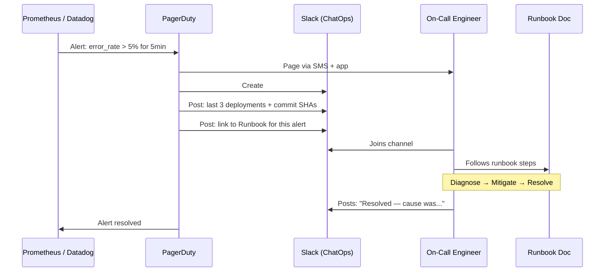
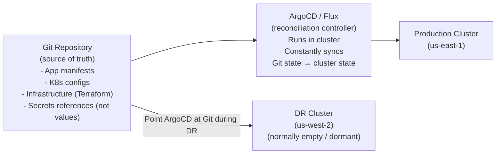

# Designing for Failure

Modern distributed systems will fail. Hardware degrades, networks partition, and despite exhaustive testing, bugs occasionally reach production. The question isn't *if* your system will fail — it's *how fast you recover* and *how little damage occurs* while you do.

The shift from traditional IT to modern DevOps is a shift from **preventing failure** to **designing for rapid recovery**.

```mermaid
flowchart TD
    subgraph OLD["Traditional IT (prevent failure)"]
        CAB["Change Advisory Board\nmeeting (days)"]
        FREEZE["Code freeze 2 weeks\nbefore release"]
        BIGBANG["Big-bang release\n(months of changes)"]
        MTTR_OLD["MTTR: 1 week–1 month\nwhen it fails anyway"]
        CAB --> FREEZE --> BIGBANG --> MTTR_OLD
    end

    subgraph NEW["Modern DevOps (design for recovery)"]
        SMALL["Small, frequent\nbatch sizes"]
        AUTOTEST["Automated quality\ngates (10 min)"]
        DEPLOY["Deploy to production\n(multiple times/day)"]
        MONITOR["Monitor error rate\n& P99 latency"]
        ROLLBACK["Automated rollback\n(< 60 seconds)"]
        MTTR_NEW["MTTR: < 1 hour"]
        SMALL --> AUTOTEST --> DEPLOY --> MONITOR
        MONITOR -->|"anomaly detected"| ROLLBACK --> MTTR_NEW
    end
```



---

## The Three Categories of Production Failure

Understanding the failure type determines the right recovery mechanism:

| Failure Type | Cause | Best Recovery |
|-------------|-------|--------------|
| **Bad deployment** | New code introduced a bug | Roll back to previous image |
| **Infrastructure failure** | Server crash, disk full, OOM | Restart / replace container |
| **External dependency** | Third-party API down | Circuit breaker + fallback |

---

## Rollback Strategy 1: Image Tag Rollback (Docker Compose)

Because every deployment uses a specific, immutable image tag, rolling back is simply a matter of redeploying the previous tag:

```bash
# You always know the previous tag because you log it in CI
# Store it as a GitHub Actions artifact or environment variable

# Current: v1.5.2  ← the bad deploy
# Previous: v1.5.1 ← known good

# Rollback in 30 seconds:
IMAGE_TAG=v1.5.1 docker compose \
  --env-file /home/deploy/.env.production \
  -f docker-compose.yml -f docker-compose.prod.yml \
  up -d --no-deps api

# Verify rollback succeeded
sleep 10
curl -f https://api.yourapp.com/health || echo "❌ Rollback also failed — escalate!"
echo "✅ Rolled back to v1.5.1"

# Now investigate what went wrong with v1.5.2
docker logs $(docker ps --filter "name=myapp-api" -q) --since 1h | grep ERROR
```

### Automating Rollback in CI/CD

```yaml
# .github/workflows/deploy.yml
deploy:
  steps:
    - name: Store previous image tag for rollback
      run: |
        PREV_TAG=$(docker compose \
          --env-file /home/deploy/.env.production \
          config | grep "image:" | head -1 | awk '{print $2}')
        echo "PREV_TAG=$PREV_TAG" >> $GITHUB_ENV

    - name: Deploy new version
      id: deploy
      run: |
        IMAGE_TAG=${{ github.sha }} docker compose \
          --env-file /home/deploy/.env.production \
          -f docker-compose.yml -f docker-compose.prod.yml \
          up -d --no-deps api

    - name: Health check with automatic rollback
      run: |
        sleep 15
        
        if ! curl -f -s https://api.yourapp.com/health; then
          echo "❌ Health check failed — rolling back to ${{ env.PREV_TAG }}"
          
          IMAGE_TAG=${{ env.PREV_TAG }} docker compose \
            --env-file /home/deploy/.env.production \
            -f docker-compose.yml -f docker-compose.prod.yml \
            up -d --no-deps api
          
          # Alert the team
          curl -X POST "${{ secrets.SLACK_WEBHOOK }}" \
            -d '{"text":"🔄 Auto-rolled back to ${{ env.PREV_TAG }} — health check failed after deploy of ${{ github.sha }}"}'
          
          exit 1
        fi
        
        echo "✅ Deployment healthy"
```

---

## Rollback Strategy 2: Traffic-Level Rollback (Blue-Green)

For Blue-Green deployments, rollback happens at the router level — no container restart, no pipeline run. Sub-second recovery:

```bash
# Current state: 100% traffic → Green (v2, broken)
# Blue (v1, stable) is still running — just not receiving traffic

# Instant rollback: reconfigure nginx
sed -i 's/myapp-green/myapp-blue/' /etc/nginx/conf.d/default.conf
nginx -s reload

# DONE. All traffic back to v1. Recovery time: < 1 second
echo "✅ Rolled back in $(date +%s) seconds"
```

---

## Rollback Strategy 3: Automated Canary Abort (Argo Rollouts)

With Argo Rollouts running a canary analysis, if the error rate of the canary exceeds the threshold, the rollout is automatically aborted:

```bash
# Manual abort (if you see something concerning before auto-abort triggers)
kubectl argo rollouts abort my-api

# Check rollout status
kubectl argo rollouts status my-api
# ✖ my-api was aborted at step 2 of 5
# Error count: 4 (threshold: 3)
# The stable version (v1) continues to serve 100% of traffic

# Resume a paused rollout (after fix)
kubectl argo rollouts promote my-api

# Rollback to stable explicitly
kubectl argo rollouts undo my-api
```

---

## Incident Response: The Automated Workflow

When an incident occurs that isn't caught by deployment health checks (e.g., disk full, memory leak, third-party API degradation):



### Setting Up Automated Incident Channels

```yaml
# PagerDuty → Slack automation using PagerDuty Slack App
# Or implement yourself with PagerDuty webhooks:

# pagerduty-webhook-handler.js (Node.js)
app.post('/webhook/pagerduty', async (req, res) => {
  const { event, payload } = req.body;
  
  if (event === 'incident.trigger') {
    const incidentId = payload.data.id;
    const alertTitle = payload.data.title;
    
    // Create dedicated Slack channel
    const channel = await slack.conversations.create({
      name: `incident-${new Date().toISOString().slice(0,10)}-${incidentId}`,
    });
    
    // Invite on-call engineers
    await slack.conversations.invite({
      channel: channel.id,
      users: ON_CALL_USERS.join(','),
    });
    
    // Post context: recent deploys
    const recentDeploys = await getRecentDeploys(3);
    await slack.chat.postMessage({
      channel: channel.id,
      text: `🚨 *${alertTitle}*\n\nRecent deployments:\n${recentDeploys}`,
    });
    
    // Post runbook link
    await slack.chat.postMessage({
      channel: channel.id,
      text: `📖 Runbook: ${RUNBOOK_BASE_URL}/${alertTitle.toLowerCase().replace(/ /g, '-')}`,
    });
  }
  
  res.sendStatus(200);
});
```

---

## Writing Effective Runbooks

A runbook is a step-by-step incident response guide that anyone on the team can follow — including someone who's never seen this alert before, at 3 AM, half-asleep.

```markdown
# Runbook: High API Error Rate (5xx Errors)

## Alert Trigger
- Metric: `http_requests_total{status_code=~"5.*"} / http_requests_total > 0.05`
- For: 5 minutes
- Severity: P1

## Immediate Actions (< 5 minutes)
1. Check if a deployment happened in the last 30 minutes:
   ```bash
   docker ps --format "{{.Names}} {{.Status}}" | grep api
   # Check image tag vs known-good tag
   ```
2. If yes → Roll back immediately (don't investigate yet):
   ```bash
   IMAGE_TAG=<previous_tag> docker compose -f docker-compose.yml \
     -f docker-compose.prod.yml up -d --no-deps api
   ```
3. If no deployment → Check error logs:
   ```bash
   docker compose logs api --since 30m | grep "ERROR\|FATAL" | tail -50
   ```

## Diagnose (after service is stable)
- Database connection pool exhausted? → `docker compose exec db pg_stat_activity`
- OOM killed? → `docker inspect <container> | grep OOMKilled`
- Disk full? → `df -h` on production server

## Escalation
- P1: Page backend lead if not resolved in 30 minutes
- P0: Page CTO if revenue impact > $10k/hour

## Post-Incident
- Write post-mortem within 48 hours
- Create ticket for root cause fix
- Update this runbook with new learnings
```

---

## GitOps: Disaster Recovery via Git

GitOps treats Git as the single source of truth for your entire system state. In a disaster scenario, any environment can be fully reconstructed from Git:



### Disaster Recovery Runbook with GitOps

```bash
# === Scenario: us-east-1 has catastrophic failure ===

# Step 1: Provision a new cluster (Terraform/eksctl — 10-15 minutes)
eksctl create cluster \
  --name myapp-dr \
  --region us-west-2 \
  --nodes 3 \
  --node-type m5.large

# Step 2: Install ArgoCD on new cluster
kubectl apply -n argocd -f \
  https://raw.githubusercontent.com/argoproj/argo-cd/stable/manifests/install.yaml

# Step 3: Point ArgoCD at your Git repository
kubectl apply -f - <<EOF
apiVersion: argoproj.io/v1alpha1
kind: Application
metadata:
  name: myapp-production
  namespace: argocd
spec:
  source:
    repoURL: https://github.com/yourorg/myapp
    targetRevision: main
    path: k8s/overlays/production
  destination:
    server: https://kubernetes.default.svc
    namespace: production
  syncPolicy:
    automated:
      prune: true
      selfHeal: true
EOF

# Step 4: ArgoCD reads Git and recreates ALL resources automatically
# - Namespaces, ConfigMaps, Secrets (from external secrets operator)
# - Deployments, Services, Ingresses
# - HPA, PodDisruptionBudgets, NetworkPolicies

# Total recovery time: 15–30 minutes
# Without GitOps: days of manual reconstruction
```

---

## Post-Mortem Culture: Learning from Failure

Every significant incident should produce a **blameless post-mortem** — a document that treats failures as systemic issues to fix, not individuals to blame:

```markdown
# Post-Mortem: API Outage 2026-08-18 14:30–15:45 UTC

## Impact
- 75 minutes of degraded service (50% error rate)
- ~2,400 affected API calls
- Estimated revenue impact: ~$1,200

## Timeline
| Time | Event |
|------|-------|
| 14:28 | Deploy of v1.5.2 triggered |
| 14:31 | Error rate exceeds 5% threshold |
| 14:33 | PagerDuty alerts on-call engineer |
| 14:38 | Engineer joins incident channel |
| 14:45 | Root cause identified (database migration) |
| 15:00 | Rollback to v1.5.1 initiated |
| 15:12 | Service fully recovered |
| 15:45 | Post-incident monitoring complete |

## Root Cause
Migration in v1.5.2 added a non-null column without a default value.
Rolling update meant v1.5.1 pods were still inserting rows, causing
`NOT NULL constraint violation` errors during the rollout window.

## Why Wasn't This Caught?
- Integration test environment uses a fresh database (no existing rows)
- No test for backward compatibility of migrations during rolling update

## Action Items
| Action | Owner | Due |
|--------|-------|-----|
| Add migration compatibility check to CI | @alice | 2026-08-25 |
| Add integration tests with pre-existing data | @bob | 2026-08-25 |
| Document expand-contract migration pattern | @alice | 2026-08-22 |
| Set up automated rollback on health check failure | @carol | 2026-08-30 |
```

**Blameless means**: the post-mortem identifies systemic failures (missing tests, inadequate monitoring, unclear runbooks) — not individuals. Creating psychological safety for engineers to report incidents honestly is what enables continuous improvement.

---

## Summary

Designing for failure means accepting that incidents will happen and building systems that recover automatically:
- **Image tag rollback** (Docker Compose): redeploy previous tag — 30 seconds, zero infrastructure changes
- **Traffic-level rollback** (Blue-Green): reconfigure nginx/load balancer — sub-second recovery
- **Automated canary abort** (Argo Rollouts): metrics-driven, no human intervention required
- **Incident automation** (PagerDuty + Slack ChatOps): instant context injection — engineers start diagnosing immediately instead of assembling context
- **Runbooks**: step-by-step playbooks that anyone can follow under stress at 3 AM
- **GitOps** (ArgoCD/Flux): entire system state in Git — disaster recovery is `git clone` + ArgoCD install
- **Blameless post-mortems**: treat failures as systemic learning opportunities, not individual blame

This completes the CI/CD Concepts course. You now have the mental models to design, measure, and continuously improve a production-grade CI/CD system.
