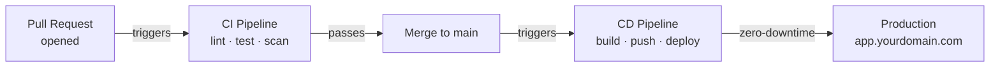
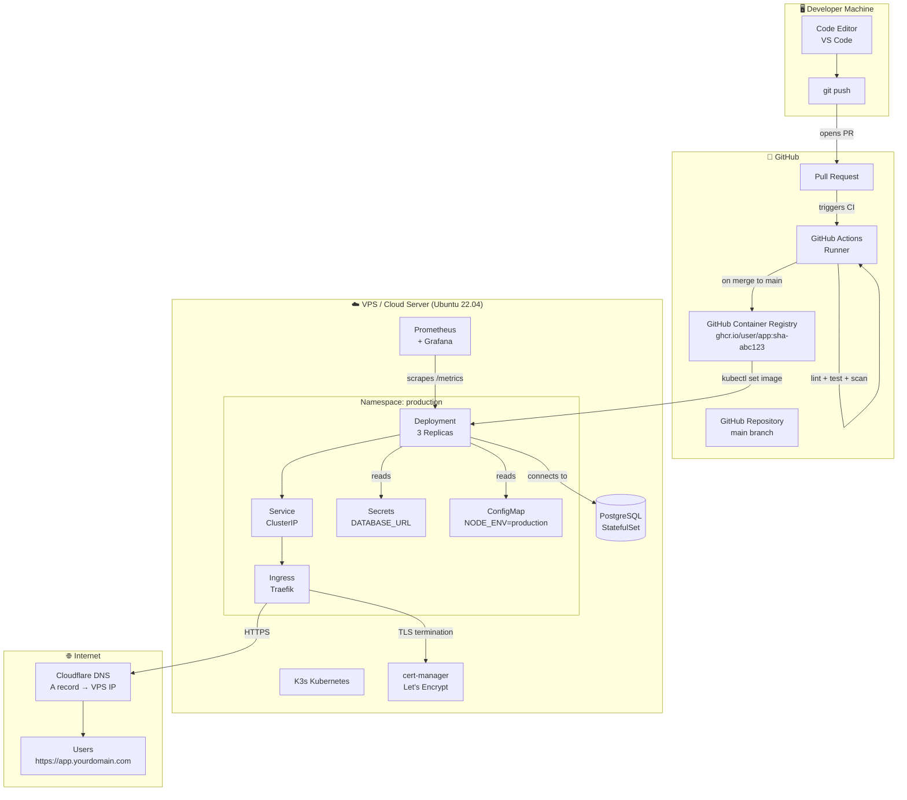
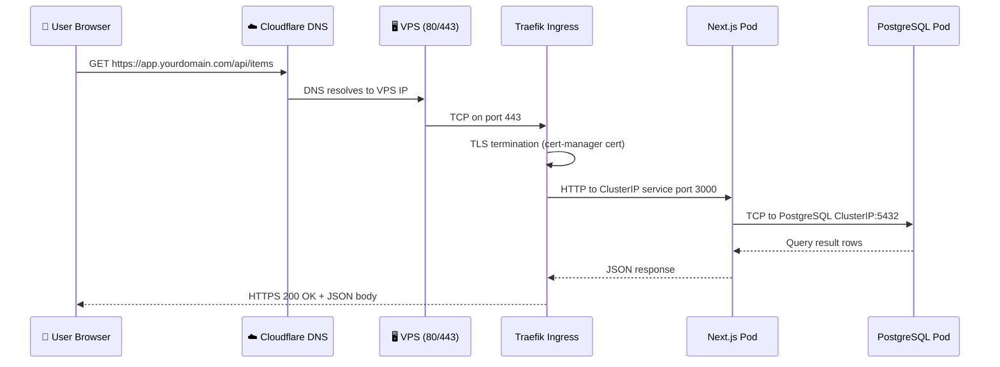
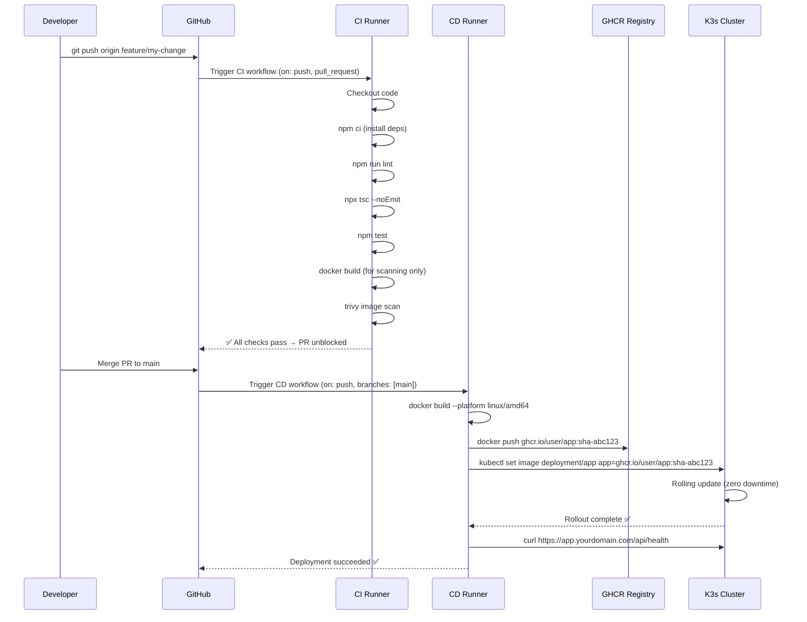
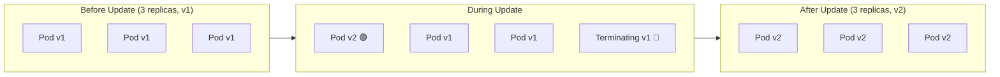

# Welcome to the Capstone CI/CD Project

This is the course that makes everything real. The previous eight courses taught you individual tools in isolation — Linux commands, Git workflows, GitHub Actions syntax, Docker images, Kubernetes objects. This course is where all those tools click together into a **living, automated production system**.

By the end of this capstone, you will have built and deployed:

- A **real Next.js web application** backed by PostgreSQL
- A **hardened Docker image** built with multi-stage builds
- A **CI pipeline** that automatically runs linting, type checking, unit tests, and container security scanning on every pull request
- A **CD pipeline** that publishes a new container image and deploys it to a live Kubernetes cluster on every merge to `main`
- **Automatic HTTPS** with a real domain and a free Let's Encrypt certificate
- **Production observability** with Prometheus metrics and Grafana dashboards

Every push to `main` becomes a production deployment — hands-free.

---

## What "CI/CD" Actually Means in Practice

Before diving into architecture, let's ground the terminology in what you'll actually experience:

**Continuous Integration (CI)** means your code is automatically verified the moment you push it. A bot checks your work:
- Does it follow code style rules? (`eslint`)
- Does it have TypeScript errors? (`tsc --noEmit`)
- Do all unit tests pass? (`vitest`)
- Does the Docker image have known CVEs? (`trivy`)

If any check fails, GitHub blocks the pull request from being merged. This keeps `main` always in a deployable state.

**Continuous Delivery / Deployment (CD)** means that once a pull request is merged to `main`, a new version of your application automatically travels all the way to production. No one manually runs `docker build`, no one manually SSHs into the server, no one manually restarts the app. The pipeline does it all.



---

## The Full System Architecture

Here is the complete end-to-end architecture you will build, step by step:



---

## Technology Stack — Every Tool Explained

Understanding *why* each tool was chosen is as important as knowing *how* to use it.

| Layer | Tool | Version | Why This Tool |
|-------|------|---------|--------------|
| **Application** | Next.js | 14 (App Router) | Server-side rendering, API routes, and TypeScript built-in. Powers thousands of production sites. |
| **Database** | PostgreSQL | 16 | Industry-standard relational database. ACID-compliant, battle-tested at any scale. |
| **Container runtime** | Docker | 24+ | Universal container format. Build once, run anywhere. |
| **Container image build** | Docker multi-stage | — | Produces minimal images (200 MB vs 1.2 GB). No build tools in the final image. |
| **Container registry** | GitHub GHCR | — | Free for public repos, integrated with GitHub Actions secrets, no extra credentials needed. |
| **CI/CD automation** | GitHub Actions | — | Native to GitHub, generous free tier (2,000 min/month), huge marketplace. |
| **Security scanning** | Trivy | latest | CNCF-sponsored CVE scanner. Scans OS packages + language dependencies in seconds. |
| **Kubernetes distribution** | K3s | v1.29+ | Full Kubernetes API, but 40% smaller binary. Ships with Traefik, local-path storage, and CoreDNS. |
| **Ingress controller** | Traefik | 2.x | Pre-installed in K3s. Handles HTTP→HTTPS redirect and TLS termination automatically. |
| **Certificate management** | cert-manager | v1.14+ | Automates Let's Encrypt certificate issuance and renewal. Never manually manage SSL again. |
| **Monitoring** | Prometheus | 2.x | Pull-based metrics collection. De facto standard in the Kubernetes ecosystem. |
| **Dashboards** | Grafana | 10.x | Beautiful dashboards backed by Prometheus. Includes alerting. |

---

## Infrastructure Requirements

Before you start Lesson 2, prepare these resources. This section tells you exactly what you need and why.

### 1. GitHub Account (Free)
You need a GitHub account to host the repository, run GitHub Actions, and push images to GHCR. Create one at [github.com](https://github.com) if you don't have one.

### 2. A VPS / Cloud Server

Your Kubernetes cluster will run on a Virtual Private Server (VPS). You don't need a dedicated server — a small cloud VM is fine.

**Minimum Specifications:**
| Resource | Minimum | Recommended |
|----------|---------|-------------|
| CPU | 2 vCPUs | 4 vCPUs |
| RAM | 4 GB | 8 GB |
| Disk | 40 GB SSD | 80 GB SSD |
| OS | Ubuntu 22.04 LTS | Ubuntu 22.04 LTS |
| Location | Any | Close to your users |

**Recommended VPS Providers:**

| Provider | 4 GB Plan Cost | Notes |
|----------|---------------|-------|
| Hetzner Cloud | ~$6/month | Best price/performance. European data center. |
| DigitalOcean | $24/month | Great documentation, beginner-friendly. |
| Linode (Akamai) | $24/month | Solid performance, good SLA. |
| AWS EC2 (t3.medium) | ~$30/month | Enterprise-grade, but more complex setup. |

<Callout type="tip" title="Use Hetzner for This Course">
Hetzner's CX22 (4 vCPU, 4 GB RAM) is ~$6/month and is more than enough for this capstone. You can get a free trial credit. After the course, you can delete the server to stop all charges.
</Callout>

### 3. A Domain Name (Optional for Local, Required for HTTPS)

A real domain is needed for Let's Encrypt to issue a TLS certificate. You can buy a `.dev` or `.xyz` domain for under $5/year at Namecheap, Google Domains, or Cloudflare.

If you don't have a domain, you can use a free subdomain service like `nip.io` or `sslip.io` for testing:
```
# nip.io maps an IP to a hostname automatically
# 1.2.3.4.nip.io → 1.2.3.4
```

---

## Networking Architecture Deep Dive

Understanding how a request flows from a user's browser to your database is essential for debugging production issues.



Key networking concepts at play:
- **Traefik** is the single entry point. It binds to ports 80 and 443 on the host node and handles TLS termination.
- **ClusterIP Services** give each workload a stable internal IP address. Pods can come and go, but the Service IP never changes.
- **DNS inside the cluster** is handled by CoreDNS. Your app connects to PostgreSQL using `postgres-service.production.svc.cluster.local`.

---

## GitOps Flow: What Happens on Every `git push`

Let's walk through the full automation sequence, step by step:



---

## Deployment Strategy: Rolling Updates Explained

Kubernetes uses **rolling updates** to deploy new versions of your application without any downtime:



Configuration in your Deployment manifest:
```yaml
strategy:
  type: RollingUpdate
  rollingUpdate:
    maxSurge: 1        # Create 1 extra pod during update
    maxUnavailable: 0  # Never take a pod offline before replacement is ready
```

With `maxUnavailable: 0`, your app always has at least 3 healthy replicas serving traffic during the update.

---

## Cost Estimate for This Project

| Resource | Provider | Monthly Cost |
|----------|----------|-------------|
| VPS (4 GB RAM) | Hetzner CX22 | ~$6 |
| Domain name | Namecheap | ~$0.50/month ($5/year) |
| TLS certificate | Let's Encrypt (via cert-manager) | Free |
| Container registry | GitHub GHCR | Free (public) |
| CI/CD runners | GitHub Actions (2,000 min/month) | Free |
| DNS management | Cloudflare | Free |
| **Total** | | **~$6.50/month** |

---

## The Ten Lessons at a Glance

| Lesson | Title | What You Build | Duration |
|--------|-------|---------------|----------|
| **1** | Project Blueprint | Architecture overview, infrastructure setup | 30 min |
| **2** | Sample App Setup | Next.js 14 + PostgreSQL + health check API | 35 min |
| **3** | Optimized Dockerfile | 3-stage build, non-root user, standalone output | 35 min |
| **4** | GitHub Actions CI | Parallel lint/test jobs + Trivy security scan | 40 min |
| **5** | Registry Publish | GHCR push, immutable SHA tags, metadata-action | 30 min |
| **6** | Provisioning K3s | VPS hardening, K3s install, kubeconfig remote setup | 40 min |
| **7** | Kubernetes Manifests | Deployment, Service, Ingress, ConfigMap, Secret | 45 min |
| **8** | CD Automation | SSH deploy job, smoke test, auto-rollback | 45 min |
| **9** | Domain & SSL | DNS A record, Cloudflare, cert-manager ClusterIssuer | 30 min |
| **10** | Monitoring | Prometheus, Grafana dashboards, Slack alerts | 30 min |

---

## Prerequisites Checklist

Complete these before starting Lesson 2:

**Accounts:**
- [ ] GitHub account created
- [ ] VPS provisioned with Ubuntu 22.04 LTS (SSH access working)
- [ ] Domain name purchased and pointing to your registrar

**Local Tools:**
- [ ] `git` — version 2.40+
- [ ] `docker` — version 24+ (Docker Desktop is fine)
- [ ] `node` — version 20 LTS
- [ ] `kubectl` — installed and in `$PATH`
- [ ] An SSH key pair (`~/.ssh/id_ed25519`) generated

**Knowledge Prerequisites:**
- [ ] Comfortable with Linux CLI (Lesson 1–10 of the Linux course)
- [ ] Understand Git branching and pull requests
- [ ] Have written at least one GitHub Actions workflow
- [ ] Know what a Dockerfile is and how to build images
- [ ] Have deployed at least one workload to a K3s cluster

---

## Summary

You now understand the full picture: a developer pushes code, GitHub Actions runs automated checks, the Docker image is built and pushed to GHCR, and Kubernetes performs a zero-downtime rolling update — all without any manual steps.

In the next lesson, you will create the Next.js + PostgreSQL application that will be deployed through this pipeline.
