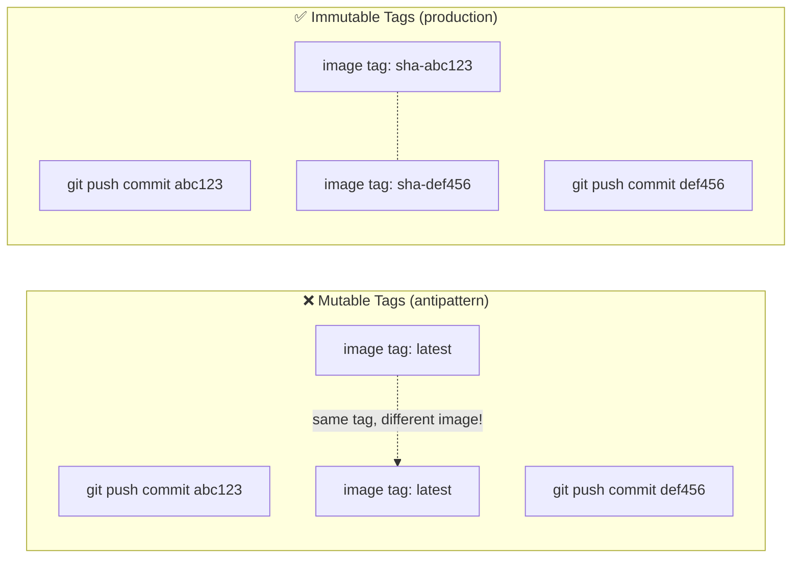
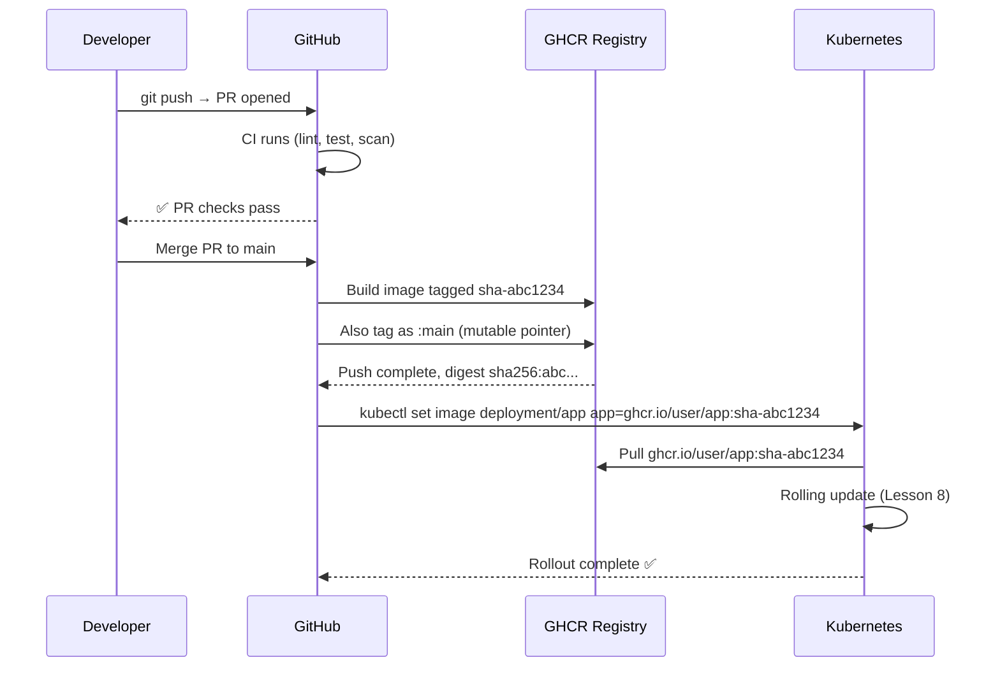

# GitHub Container Registry (GHCR)

GHCR is GitHub's built-in container registry — available at `ghcr.io`. It's free for public repositories and integrates directly with GitHub Actions. You don't need a separate Docker Hub account, and authentication is handled by the `GITHUB_TOKEN` that GitHub automatically injects into every workflow run.

In this lesson you'll build the CD image-publishing step: building the Docker image with an immutable Git SHA tag and pushing it to GHCR.

---

## Why Immutable Tags Matter

Using tags like `latest` or `v1` is a production antipattern. They're mutable — `docker pull app:latest` today and tomorrow may give you completely different images with no way to know what changed.

The correct approach: **use the Git commit SHA as the image tag**. The SHA is:
- **Immutable** — it never changes
- **Traceable** — you can find the exact commit in your repository
- **Unique** — no two builds produce the same SHA



GHCR image naming convention:
```
ghcr.io/GITHUB_USERNAME/REPO_NAME:TAG
ghcr.io/johndoe/capstone-app:sha-abc1234
```

---

## Step 1: Enable GHCR in Your Repository

GHCR is enabled by default for all GitHub accounts. However, you must give the workflow permission to push images:

1. Go to **GitHub → Settings → Developer Settings → Personal Access Tokens** (optional — `GITHUB_TOKEN` is usually enough)
2. In your repository: **Settings → Actions → General → Workflow permissions**
3. Select: **Read and write permissions**

<Callout type="tip" title="Use GITHUB_TOKEN — No PAT Needed">
The `GITHUB_TOKEN` automatically injected by GitHub Actions has permission to push to GHCR for the repository that owns the workflow. You don't need to create a Personal Access Token unless you're pushing to a different organization's registry.
</Callout>

---

## Step 2: Make Your Image Public (Optional)

By default, GHCR images are private. To allow your K3s cluster to pull images without registry credentials:

1. Push the image at least once (it will be created as private)
2. Go to **GitHub → Packages → capstone-app → Package settings**
3. Scroll to **Danger Zone → Change visibility** → Select **Public**

Alternatively, use `imagePullSecrets` in Kubernetes (covered in Lesson 7) to pull private images. For this course, making it public is simpler.

---

## Step 3: The CD Build & Push Workflow

Create `.github/workflows/cd.yml`:

```yaml
# .github/workflows/cd.yml
# Triggered only on pushes to main (after CI passes and PR is merged).
# Builds the Docker image, tags it with the Git SHA, and pushes to GHCR.

name: CD — Build & Push to GHCR

on:
  push:
    branches: [main]
    # Only trigger when application code changes, not infra-only changes
    paths-ignore:
      - "k8s/**"         # Kubernetes manifests don't need a new image
      - "docs/**"
      - "**.md"

# Only one deployment runs at a time (serialize deployments)
concurrency:
  group: production-deploy
  cancel-in-progress: false  # Don't cancel in-progress deploys

jobs:
  build-and-push:
    name: 🐳 Build & Push Image
    runs-on: ubuntu-22.04
    timeout-minutes: 30

    # Required permissions for GHCR push and attestation
    permissions:
      contents: read
      packages: write
      attestations: write
      id-token: write

    outputs:
      # Pass the full image reference (with digest) to subsequent jobs
      image: ${{ steps.meta.outputs.tags }}
      digest: ${{ steps.push.outputs.digest }}
      version: ${{ steps.meta.outputs.version }}

    steps:
      - name: Checkout repository
        uses: actions/checkout@v4

      # ── Set up Docker Buildx (multi-platform + advanced cache features) ──
      - name: Set up Docker Buildx
        uses: docker/setup-buildx-action@v3

      # ── Log in to GitHub Container Registry ──
      - name: Log in to GHCR
        uses: docker/login-action@v3
        with:
          registry: ghcr.io
          username: ${{ github.actor }}          # GitHub username that triggered the run
          password: ${{ secrets.GITHUB_TOKEN }}   # Automatically available in all workflows

      # ── Generate image tags and labels ──
      # docker/metadata-action generates sensible tags based on Git context
      - name: Extract Docker metadata
        id: meta
        uses: docker/metadata-action@v5
        with:
          images: ghcr.io/${{ github.repository }}
          tags: |
            # SHA tag: sha-abc1234 (immutable, 7 chars of Git SHA)
            type=sha,prefix=sha-,format=short
            # Branch tag: main (mutable, shows latest on branch)
            type=ref,event=branch
            # PR tag: pr-42 (for per-PR preview images)
            type=ref,event=pr
          labels: |
            org.opencontainers.image.title=Capstone App
            org.opencontainers.image.description=Production Next.js app with PostgreSQL
            org.opencontainers.image.vendor=${{ github.repository_owner }}

      # ── Build and push the Docker image ──
      - name: Build and push Docker image
        id: push
        uses: docker/build-push-action@v5
        with:
          context: .
          push: true
          platforms: linux/amd64  # Match your VPS architecture (most VPS = amd64)
          tags: ${{ steps.meta.outputs.tags }}
          labels: ${{ steps.meta.outputs.labels }}
          # Layer cache from GitHub Actions cache
          cache-from: type=gha
          cache-to: type=gha,mode=max
          # Pass Git SHA as build arg for /api/health version field
          build-args: |
            APP_VERSION=${{ github.sha }}

      # ── Generate SBOM and provenance attestation ──
      # This adds a cryptographic signature to the image — proves it was built
      # by this exact GitHub Actions workflow (supply chain security)
      - name: Attest build provenance
        uses: actions/attest-build-provenance@v1
        with:
          subject-name: ghcr.io/${{ github.repository }}
          subject-digest: ${{ steps.push.outputs.digest }}
          push-to-registry: true

      # ── Print a summary for easy debugging ──
      - name: Print pushed image reference
        run: |
          echo "### 🐳 Image pushed to GHCR" >> $GITHUB_STEP_SUMMARY
          echo "" >> $GITHUB_STEP_SUMMARY
          echo "**Image:** \`ghcr.io/${{ github.repository }}:sha-$(echo ${{ github.sha }} | cut -c1-7)\`" >> $GITHUB_STEP_SUMMARY
          echo "**Digest:** \`${{ steps.push.outputs.digest }}\`" >> $GITHUB_STEP_SUMMARY
          echo "**Commit:** \`${{ github.sha }}\`" >> $GITHUB_STEP_SUMMARY
```

---

## Understanding `docker/metadata-action` Tags

The metadata action generates multiple tags for the same image:

| Tag | Example | Purpose |
|-----|---------|---------|
| `sha-abc1234` | `ghcr.io/user/app:sha-abc1234` | Immutable. Used in K8s deployments. |
| `main` | `ghcr.io/user/app:main` | Mutable. Always points to latest on `main`. |
| `pr-42` | `ghcr.io/user/app:pr-42` | For pull request preview environments. |

In your Kubernetes Deployment (Lesson 7), you'll use the SHA tag. This means:
- **Kubernetes knows exactly which image to run** even after newer images are pushed
- **Rolling back** is as simple as `kubectl set image` with an older SHA

---

## Understanding Build Provenance (Supply Chain Security)

The `attest-build-provenance` step generates a cryptographic proof that your image was built by GitHub Actions from your specific commit:

```bash
# Verify an image's provenance locally
gh attestation verify oci://ghcr.io/yourusername/capstone-app:sha-abc1234 \
  --owner yourusername

# Output:
# Loaded digest sha256:abc...
# Loaded 1 attestation from GitHub API
# ✓ Verification succeeded!
```

This is part of [SLSA](https://slsa.dev/) (Supply-chain Levels for Software Artifacts) — a framework for preventing supply chain attacks. If someone compromises your CI runner and pushes a malicious image, the attestation check will fail.

---

## Inspecting Your Pushed Image

After the workflow runs:

```bash
# List available tags for your image
docker manifest inspect ghcr.io/YOUR_USERNAME/capstone-app:main

# Pull and run the exact image that's in production
docker pull ghcr.io/YOUR_USERNAME/capstone-app:sha-abc1234
docker run -p 3000:3000 \
  -e DATABASE_URL="postgres://..." \
  ghcr.io/YOUR_USERNAME/capstone-app:sha-abc1234

# Inspect image labels (OCI metadata)
docker inspect ghcr.io/YOUR_USERNAME/capstone-app:sha-abc1234 | \
  jq '.[0].Config.Labels'
# {
#   "org.opencontainers.image.revision": "abc1234...",
#   "org.opencontainers.image.source": "https://github.com/user/capstone-app",
#   "org.opencontainers.image.created": "2024-01-15T10:30:00.000Z"
# }
```

---

## Multi-Platform Builds (ARM Support)

If your VPS runs on ARM (e.g., AWS Graviton, Ampere, Apple Silicon VM), add `linux/arm64` to the platforms:

```yaml
# In build-and-push step:
platforms: linux/amd64,linux/arm64

# QEMU is needed for cross-compilation
- name: Set up QEMU (for ARM builds)
  uses: docker/setup-qemu-action@v3
  before: docker/setup-buildx-action@v3
```

<Callout type="warning" title="ARM Builds Are Slow">
Cross-compiling for ARM on an amd64 runner (via QEMU emulation) can take 10-20 minutes vs 2-4 minutes for amd64-only. If you're not deploying to ARM, stick with `linux/amd64`.
</Callout>

---

## The Full GitOps Tag Lifecycle



---

## GHCR Storage and Billing

| Repository Type | Storage | Bandwidth |
|----------------|---------|-----------|
| Public | Unlimited | Unlimited |
| Private (free plan) | 500 MB | 1 GB/month |
| Private (paid plans) | Varies | Varies |

For this capstone (public repository), storage and bandwidth are unlimited. Even for private repositories, a 180 MB image fits comfortably in the free tier.

**Image Retention Policy** — to avoid accumulating hundreds of old images:

```yaml
# Add this step to your CD workflow to delete images older than 7 days
- name: Delete old container versions
  uses: actions/delete-package-versions@v5
  with:
    package-name: "capstone-app"
    package-type: "container"
    min-versions-to-keep: 5        # Always keep the 5 most recent
    delete-only-untagged-versions: false
    ignore-versions: "^sha-"       # Keep all SHA-tagged versions
```

---

## Verify the Push Succeeded

After your CD workflow runs, verify the image is accessible:

```bash
# From your local machine (must be logged in to GHCR)
docker login ghcr.io -u YOUR_GITHUB_USERNAME -p YOUR_GITHUB_PAT

# Pull the image
docker pull ghcr.io/YOUR_USERNAME/capstone-app:main

# Verify it runs
docker run --rm ghcr.io/YOUR_USERNAME/capstone-app:main node --version
# v20.x.x
```

Or check the GitHub UI: **Repository → Packages → capstone-app** — you'll see the image with all its tags, size, and push history.

---

## Summary

You now have a CD workflow that:
- Triggers **only on merges to `main`** (CI already ran on the PR, no need to repeat)
- Tags images with an **immutable Git SHA** (`sha-abc1234`) for traceability and safe rollbacks
- Uses **GitHub Actions cache** to speed up repeated Docker layer builds
- Generates **build provenance attestations** for supply chain security (SLSA compliance)
- Produces a **GitHub Actions summary** with the exact image reference for debugging
- Uses `docker/metadata-action` to generate consistent, structured image labels

In the next lesson, you will provision the production K3s server on a VPS and prepare it to receive deployments.
