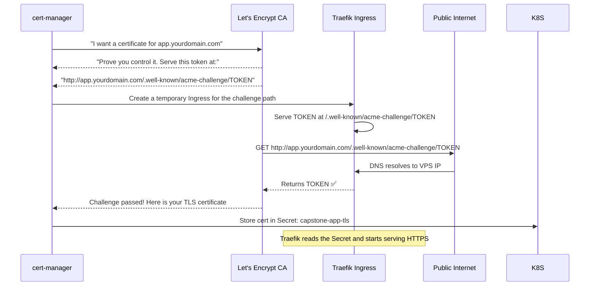

# From IP Address to a Real HTTPS Domain

At this point your application is running in Kubernetes and accessible via the VPS IP address — but only over HTTP. In production, you need:
- A **human-readable domain** (`app.yourdomain.com` instead of `1.2.3.4`)
- **HTTPS** with a valid TLS certificate (browsers show padlock 🔒)
- **Automatic HTTP → HTTPS redirect** (no accidental insecure access)
- **Automatic certificate renewal** (Let's Encrypt certs expire every 90 days)

All of this is handled by the combination of Cloudflare DNS + cert-manager + Traefik that you configured in Lessons 6 and 7.

---

## How Let's Encrypt + cert-manager Works

Let's Encrypt is a free, automated Certificate Authority. It issues TLS certificates to anyone who can prove they control a domain.

The proof process is called the **ACME challenge**. cert-manager uses the **HTTP-01 challenge type**:



**cert-manager handles all of this automatically** — including renewal before the 90-day expiry. You set it up once and never think about it again.

---

## Step 1: Purchase a Domain

Buy a domain from any registrar. Recommended:
- **Cloudflare Registrar** — at-cost pricing (~$9/year for `.com`), no markup
- **Namecheap** — competitive pricing, easy DNS management
- **Google Domains** (now Squarespace Domains)

For this guide, assume your domain is `yourdomain.com` and you want your app at `app.yourdomain.com`.

<Callout type="tip" title="Use a Subdomain for the App">
Deploying to `app.yourdomain.com` (not root `yourdomain.com`) lets you host other things on the same domain later (blog, docs, API). It's also easier to configure TLS for a subdomain than for an apex domain (for technical DNS reasons).
</Callout>

---

## Step 2: Move DNS to Cloudflare

Even if you bought the domain elsewhere, using Cloudflare for DNS gives you:
- The fastest global DNS network (sub-millisecond propagation)
- DDoS protection
- Free SSL edge certificates
- Analytics on your traffic

1. Create a free account at [cloudflare.com](https://cloudflare.com)
2. Add your domain → Cloudflare will scan your existing DNS records
3. At your registrar: change the nameservers to Cloudflare's nameservers:
   ```
   ava.ns.cloudflare.com
   brad.ns.cloudflare.com
   ```
4. Wait 5-30 minutes for nameserver propagation

---

## Step 3: Create the DNS A Record

In Cloudflare Dashboard → DNS → Add record:

| Type | Name | Content | Proxy status | TTL |
|------|------|---------|-------------|-----|
| A | `app` | `YOUR_VPS_IP` | DNS only (grey cloud) | Auto |

<Callout type="warning" title="Use DNS Only, Not Proxied, During Setup">
Cloudflare's orange cloud (Proxied) mode hides your real IP and adds Cloudflare's CDN. However, it breaks Let's Encrypt HTTP-01 challenges during certificate issuance because Cloudflare intercepts the ACME challenge request.

Set to **DNS only** (grey cloud) for initial setup. After the certificate is issued and working, you can switch to Proxied if desired.
</Callout>

```bash
# Verify DNS propagation (from your local machine)
dig app.yourdomain.com +short
# Should return your VPS IP: 1.2.3.4

# Or use an online checker
# https://dnschecker.org/#A/app.yourdomain.com
```

---

## Step 4: Verify Traefik Is Accepting Traffic

Before applying the TLS Ingress, verify that Traefik is routing HTTP traffic correctly:

```bash
# From your VPS or any machine with curl:
curl -v http://app.yourdomain.com/api/health
# Should return HTTP 200 (or 301 redirect to HTTPS if redirect middleware is active)

# Check Traefik logs for incoming requests
kubectl -n traefik logs -l app.kubernetes.io/name=traefik --tail=20
```

---

## Step 5: Apply the TLS Ingress

Update your `k8s/ingress.yaml` with your real domain (replace `app.yourdomain.com`):

```yaml
# k8s/ingress.yaml (with real domain)
apiVersion: networking.k8s.io/v1
kind: Ingress
metadata:
  name: capstone-app-ingress
  namespace: production
  annotations:
    kubernetes.io/ingress.class: "traefik"
    # Start with STAGING to avoid hitting rate limits
    cert-manager.io/cluster-issuer: "letsencrypt-staging"
spec:
  tls:
    - hosts:
        - app.yourdomain.com     # ← Your real domain
      secretName: capstone-app-tls
  rules:
    - host: app.yourdomain.com   # ← Your real domain
      http:
        paths:
          - path: /
            pathType: Prefix
            backend:
              service:
                name: capstone-app-service
                port:
                  number: 80
```

```bash
kubectl apply -f k8s/ingress.yaml
```

---

## Step 6: Watch the Certificate Issuance

cert-manager automatically detects the new Ingress annotation and starts the ACME challenge:

```bash
# Watch the Certificate resource (created automatically by cert-manager)
kubectl -n production get certificate -w
# NAME               READY   SECRET              AGE
# capstone-app-tls   False   capstone-app-tls    5s
# capstone-app-tls   True    capstone-app-tls    45s   ← Certificate issued!

# Check the CertificateRequest for more detail
kubectl -n production describe certificaterequest

# Check the Order (ACME challenge status)
kubectl -n production get order
kubectl -n production describe order

# Check Challenge (the actual ACME challenge being solved)
kubectl -n production get challenge
kubectl -n production describe challenge
```

**Expected timeline:**
- 0-5s: cert-manager creates an `Order` resource
- 5-15s: cert-manager creates a temporary Ingress for the challenge path
- 15-30s: Let's Encrypt HTTP GETs the challenge URL
- 30-60s: Let's Encrypt validates, issues certificate, cert-manager stores it in Secret

If it takes more than 3 minutes, check the troubleshooting section below.

---

## Step 7: Test Staging Certificate

The staging certificate is issued by "Let's Encrypt (STAGING)" — it's a fake CA that browsers don't trust. That's expected. Verify the cert is issued:

```bash
# Check if the cert was issued (should now be True)
kubectl -n production get certificate capstone-app-tls
# NAME               READY   SECRET              AGE
# capstone-app-tls   True    capstone-app-tls    2m

# Test HTTPS (with -k to ignore the untrusted staging cert)
curl -k https://app.yourdomain.com/api/health
# {"status":"ok","db":{"status":"connected"}}

# Check cert details
echo | openssl s_client -connect app.yourdomain.com:443 -servername app.yourdomain.com 2>/dev/null | \
  openssl x509 -noout -subject -issuer -dates
# subject=CN=app.yourdomain.com
# issuer=CN=(STAGING) Let's Encrypt ECDSA R11  ← This is expected for staging
# notBefore=...
# notAfter=... (90 days from now)
```

---

## Step 8: Switch to Production Certificate

Once the staging certificate works, switch to the production ClusterIssuer:

```bash
# Delete the staging certificate (cert-manager will re-issue with prod)
kubectl -n production delete certificate capstone-app-tls

# Update the Ingress annotation
kubectl -n production annotate ingress capstone-app-ingress \
  cert-manager.io/cluster-issuer=letsencrypt-prod \
  --overwrite

# Watch the new production certificate being issued
kubectl -n production get certificate -w
```

After 30-60 seconds, the production certificate is issued. Now verify:

```bash
# Test WITHOUT -k (real certificate, trusted by browsers)
curl https://app.yourdomain.com/api/health
# {"status":"ok","db":{"status":"connected"}}

# Verify certificate details (should show Let's Encrypt, not STAGING)
echo | openssl s_client -connect app.yourdomain.com:443 -servername app.yourdomain.com 2>/dev/null | \
  openssl x509 -noout -subject -issuer -dates
# subject=CN=app.yourdomain.com
# issuer=CN=E5, O=Let's Encrypt, C=US   ← Real Let's Encrypt!
# notAfter=[90 days from now]

# Check the grade at SSL Labs (A+ expected)
# https://www.ssllabs.com/ssltest/analyze.html?d=app.yourdomain.com
```

---

## Step 9: Configure HTTP → HTTPS Redirect

All HTTP traffic should automatically redirect to HTTPS. This is configured in Traefik as a middleware:

```yaml
# k8s/https-redirect.yaml
apiVersion: traefik.io/v1alpha1
kind: Middleware
metadata:
  name: redirect-https
  namespace: production
spec:
  redirectScheme:
    scheme: https
    permanent: true   # 301 Moved Permanently
```

```yaml
# Update k8s/ingress.yaml to add both HTTP and HTTPS rules
apiVersion: networking.k8s.io/v1
kind: Ingress
metadata:
  name: capstone-app-ingress
  namespace: production
  annotations:
    kubernetes.io/ingress.class: "traefik"
    cert-manager.io/cluster-issuer: "letsencrypt-prod"
    # Apply the redirect middleware to HTTP routes
    traefik.ingress.kubernetes.io/router.middlewares: "production-redirect-https@kubernetescrd"
```

```bash
kubectl apply -f k8s/https-redirect.yaml
kubectl apply -f k8s/ingress.yaml

# Test the redirect
curl -I http://app.yourdomain.com/api/health
# HTTP/1.1 301 Moved Permanently
# Location: https://app.yourdomain.com/api/health
```

---

## Step 10: Enable Cloudflare Proxy (Optional)

Now that HTTPS is working, you can enable Cloudflare's proxy mode for additional benefits:

**Benefits of Cloudflare Proxy (Orange Cloud):**
- Hides your VPS's real IP address from the public internet
- Global CDN for static assets (CSS, JS, images)
- DDoS protection
- Analytics dashboard
- Free edge SSL (even if your origin cert expired)

In Cloudflare DNS settings, click the grey cloud icon next to your A record to turn it orange (Proxied).

<Callout type="warning" title="Cloudflare + cert-manager Compatibility">
When Cloudflare Proxy is enabled, your `curl` to the health endpoint now goes through Cloudflare's edge, not directly to your VPS. The ACME HTTP-01 challenge still works because cert-manager renews certificates from inside the cluster, and Cloudflare passes `.well-known/acme-challenge/` requests through to your origin.

If you run into issues with certificate renewal, add this Cloudflare rule: **SSL/TLS → Edge Certificates → Always Use HTTPS: ON** and **SSL mode: Full (strict)**.
</Callout>

---

## Certificate Auto-Renewal

cert-manager automatically renews certificates **30 days before expiry**. You don't need to do anything. Verify the renewal mechanism:

```bash
# Check when the current certificate expires
kubectl -n production get certificate capstone-app-tls -o jsonpath='{.status.notAfter}'
# 2024-04-15T10:30:00Z  (90 days from issuance)

# cert-manager will automatically start renewal at 60 days after issuance (30 days before expiry)
# Check the certificate's "renewal window" config
kubectl -n production describe certificate capstone-app-tls | grep -A5 "Renewal"
```

Set up a monitoring alert for certificate expiry as a safety net (covered in Lesson 10):
```bash
# Or check manually
echo | openssl s_client -connect app.yourdomain.com:443 2>/dev/null | \
  openssl x509 -noout -dates
```

---

## Troubleshooting TLS Issues

### Certificate stuck in "False" state

```bash
# Check the Order status
kubectl -n production describe order

# Common reasons:
# 1. DNS not propagated yet (wait 5-30 minutes)
# 2. Port 80 blocked by firewall (cert-manager needs HTTP-01 access)
# 3. Traefik not configured as ingress class

# Check if port 80 is accessible from the internet
curl -I http://app.yourdomain.com
# If this fails, check your VPS firewall rules (port 80 must be open to 0.0.0.0/0)
```

### "Rate limit exceeded" from Let's Encrypt

```bash
# Check rate limit status
kubectl -n production describe certificate capstone-app-tls | grep -i "rate"

# Wait 1 hour (for per-certificate limit) or 1 week (for domain limit)
# Use the staging issuer in the meantime to test your setup
```

### Certificate issued but HTTPS still shows "Not Secure"

```bash
# Verify the TLS Secret exists with the correct keys
kubectl -n production get secret capstone-app-tls -o jsonpath='{.data}' | jq 'keys'
# Should show: ["tls.crt", "tls.key"]

# Restart Traefik to reload the certificate
kubectl -n traefik rollout restart deployment/traefik

# Check Traefik logs for TLS errors
kubectl -n traefik logs -l app.kubernetes.io/name=traefik | grep -i "tls\|cert\|error"
```

---

## Security Headers (Bonus)

Add security headers via a Traefik middleware for better browser security:

```yaml
# k8s/security-headers.yaml
apiVersion: traefik.io/v1alpha1
kind: Middleware
metadata:
  name: security-headers
  namespace: production
spec:
  headers:
    # Prevent clickjacking
    frameDeny: true
    # Prevent MIME-type sniffing
    contentTypeNosniff: true
    # Enable HSTS (force HTTPS for 1 year)
    stsSeconds: 31536000
    stsIncludeSubdomains: true
    stsPreload: true
    # Control Referer header
    referrerPolicy: "strict-origin-when-cross-origin"
    # Content Security Policy (customize for your app)
    customResponseHeaders:
      X-Frame-Options: "SAMEORIGIN"
      Permissions-Policy: "camera=(), microphone=(), geolocation=()"
```

```bash
kubectl apply -f k8s/security-headers.yaml

# Update Ingress to use both middlewares
kubectl -n production annotate ingress capstone-app-ingress \
  traefik.ingress.kubernetes.io/router.middlewares="production-redirect-https@kubernetescrd,production-security-headers@kubernetescrd" \
  --overwrite

# Test headers
curl -I https://app.yourdomain.com/api/health | grep -i "strict\|x-frame\|x-content"
# strict-transport-security: max-age=31536000; includeSubDomains; preload
# x-frame-options: SAMEORIGIN
# x-content-type-options: nosniff
```

---

## Summary

Your application is now accessible at `https://app.yourdomain.com` with:
- **A valid Let's Encrypt TLS certificate** automatically issued by cert-manager
- **HTTP → HTTPS redirect** via Traefik middleware
- **Automatic 90-day renewal** — zero manual intervention required
- **Cloudflare DNS** with optional proxy mode for DDoS protection

In the next lesson, you'll set up Prometheus and Grafana to monitor your application's health, visualize key metrics, and configure alerts for when things go wrong.
