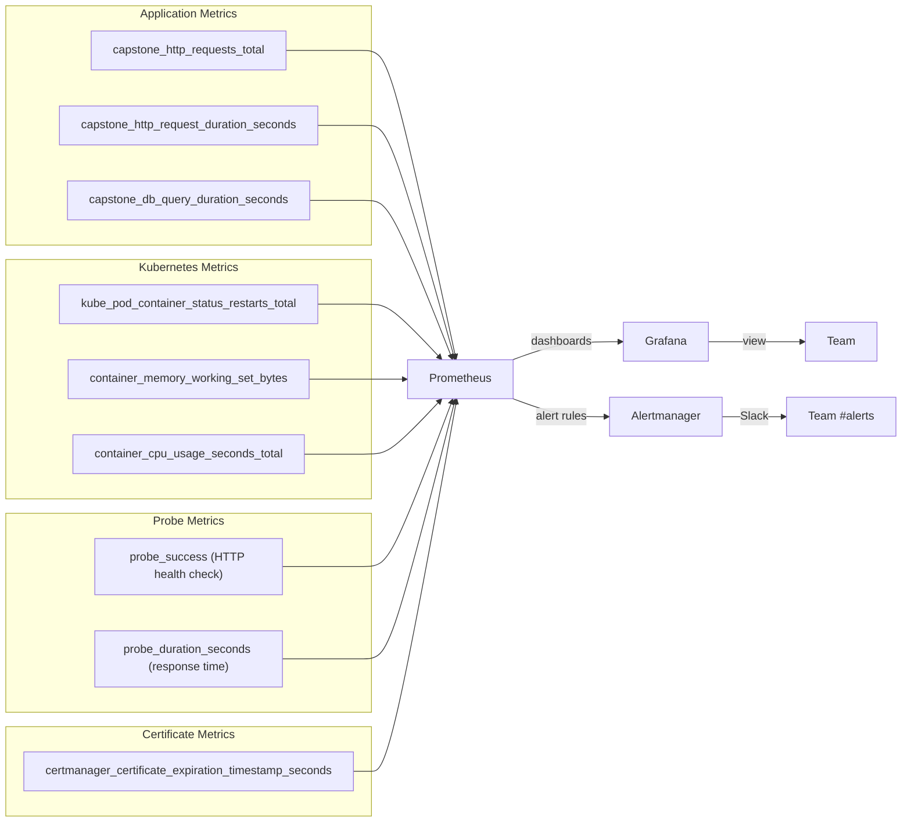

# Production Observability: You Can't Fix What You Can't See

Deploying is only half the job. Production systems fail in unexpected ways — a slow database query, a memory leak, a pod OOMKilled at 3 AM. Without observability, you're flying blind.

This lesson sets up the industry-standard observability stack:
- **Prometheus** — collects and stores time-series metrics from your application and cluster
- **Grafana** — visualizes Prometheus metrics in interactive dashboards
- **Alertmanager** — sends Slack/email notifications when metrics breach thresholds

When complete, you'll have:
- Real-time CPU, memory, and request rate dashboards
- Automatic alerts if the health endpoint fails for > 2 minutes
- Certificate expiry warnings 14 days before expiry
- Pod crash detection and notification

---

## The Observability Stack Architecture

```mermaid
flowchart TD
    subgraph cluster["K3s Cluster"]
        subgraph app["Namespace: production"]
            APP[capstone-app pods\n/metrics endpoint]
            HEALTH[/api/health]
        end

        subgraph monitoring["Namespace: monitoring"]
            PROM[Prometheus\nScrapes metrics every 15s]
            AM[Alertmanager\nRoutes alerts to Slack]
            GRAFANA[Grafana\nDashboards & panels]
            BM[Blackbox Exporter\nProbes /api/health HTTP endpoint]
            CM_EX[cert-manager Exporter\nTLS cert expiry metrics]
        end
    end

    APP -->|/metrics| PROM
    BM -->|HTTP probe| HEALTH
    CM_EX -->|cert expiry| PROM
    PROM -->|scrapes| BM
    PROM -->|scrapes| CM_EX
    PROM -->|alert rules| AM
    AM -->|webhook| SLACK[Slack Channel\n#alerts]
    GRAFANA -->|PromQL queries| PROM

    USER[Team Member] -->|Grafana dashboard| GRAFANA
    USER -->|Slack| SLACK
```

---

## Step 1: Install kube-prometheus-stack via Helm

The `kube-prometheus-stack` chart bundles Prometheus, Alertmanager, Grafana, and a collection of Kubernetes-specific recording rules and dashboards — all configured to work together out of the box.

```bash
# Add the Helm repo
helm repo add prometheus-community https://prometheus-community.github.io/helm-charts
helm repo update

# Create the monitoring namespace
kubectl create namespace monitoring

# Install the stack (this takes 3-5 minutes)
helm install kube-prometheus-stack prometheus-community/kube-prometheus-stack \
  -n monitoring \
  --set grafana.adminPassword="changeme-in-production" \
  --set prometheus.prometheusSpec.retention="30d" \
  --set prometheus.prometheusSpec.retentionSize="10GB" \
  --set alertmanager.enabled=true \
  --version 56.21.4  # Pin version for reproducibility

# Watch the pods come up (Grafana, Prometheus, Alertmanager)
kubectl -n monitoring get pods -w
```

Expected pods when ready:
```
NAME                                                   READY   STATUS
alertmanager-kube-prometheus-stack-alertmanager-0      2/2     Running
kube-prometheus-stack-grafana-xxx                      3/3     Running
kube-prometheus-stack-kube-state-metrics-xxx           1/1     Running
kube-prometheus-stack-operator-xxx                     1/1     Running
kube-prometheus-stack-prometheus-node-exporter-xxx     1/1     Running
prometheus-kube-prometheus-stack-prometheus-0          2/2     Running
```

---

## Step 2: Add a `/metrics` Endpoint to Your Application

Prometheus uses a pull model — it periodically fetches metrics from a `/metrics` HTTP endpoint. Add the `prom-client` library to your Next.js app:

```bash
npm install prom-client
```

```typescript
// app/api/metrics/route.ts
import { NextResponse } from "next/server";
import { collectDefaultMetrics, Registry, Counter, Histogram, Gauge } from "prom-client";

// Create a custom registry (separate from the global one for isolation)
const register = new Registry();

// Collect default Node.js metrics (event loop lag, GC stats, memory usage)
collectDefaultMetrics({ register, prefix: "capstone_" });

// Custom application metrics
export const httpRequestsTotal = new Counter({
  name: "capstone_http_requests_total",
  help: "Total number of HTTP requests",
  labelNames: ["method", "route", "status_code"],
  registers: [register],
});

export const httpRequestDuration = new Histogram({
  name: "capstone_http_request_duration_seconds",
  help: "HTTP request duration in seconds",
  labelNames: ["method", "route"],
  buckets: [0.005, 0.01, 0.025, 0.05, 0.1, 0.25, 0.5, 1, 2.5, 5],
  registers: [register],
});

export const dbConnectionsActive = new Gauge({
  name: "capstone_db_connections_active",
  help: "Number of active database connections",
  registers: [register],
});

export const dbQueryDuration = new Histogram({
  name: "capstone_db_query_duration_seconds",
  help: "Database query duration in seconds",
  labelNames: ["operation"],
  buckets: [0.001, 0.005, 0.01, 0.025, 0.05, 0.1, 0.5, 1],
  registers: [register],
});

// GET /api/metrics — Prometheus scrape endpoint
export async function GET() {
  try {
    const metrics = await register.metrics();
    return new Response(metrics, {
      status: 200,
      headers: {
        "Content-Type": register.contentType,
        // Don't cache metrics
        "Cache-Control": "no-store",
      },
    });
  } catch (error) {
    console.error("[metrics] Failed to collect metrics:", error);
    return NextResponse.json({ error: "metrics collection failed" }, { status: 500 });
  }
}
```

<Callout type="warning" title="Secure the /api/metrics Endpoint">
The `/api/metrics` endpoint exposes internal system information. In production, restrict access to it so only Prometheus can scrape it. You can do this with a NetworkPolicy or by checking a shared secret header:

```typescript
// Check for a scrape token header
const token = req.headers.get("x-prometheus-token");
if (token !== process.env.METRICS_TOKEN) {
  return new Response("Unauthorized", { status: 401 });
}
```
</Callout>

---

## Step 3: Create a ServiceMonitor

A `ServiceMonitor` tells Prometheus which services to scrape and how:

```yaml
# k8s/servicemonitor.yaml
apiVersion: monitoring.coreos.com/v1
kind: ServiceMonitor
metadata:
  name: capstone-app-monitor
  namespace: production
  labels:
    # This label is required by the kube-prometheus-stack Prometheus instance
    release: kube-prometheus-stack
spec:
  selector:
    matchLabels:
      app: capstone-app   # Match the Service with this label
  endpoints:
    - port: http           # The port name in the Service (must match)
      path: /api/metrics   # The metrics endpoint path
      interval: 15s        # Scrape every 15 seconds
      scrapeTimeout: 10s
      scheme: http
```

```bash
kubectl apply -f k8s/servicemonitor.yaml

# Verify Prometheus picked it up (takes 30-60 seconds)
# Access the Prometheus UI via port-forward:
kubectl -n monitoring port-forward svc/kube-prometheus-stack-prometheus 9090:9090

# In browser: http://localhost:9090/targets
# Look for: production/capstone-app-monitor (State: UP)
```

---

## Step 4: Install and Configure Blackbox Exporter

The Blackbox Exporter probes HTTP/HTTPS endpoints and exposes the results as Prometheus metrics. This lets you monitor external availability — not just internal metrics.

```bash
# Install Blackbox Exporter
helm install blackbox-exporter prometheus-community/prometheus-blackbox-exporter \
  -n monitoring \
  --set config.modules.http_2xx.prober=http \
  --set config.modules.http_2xx.http.valid_http_versions='["HTTP/1.1", "HTTP/2.0"]' \
  --set config.modules.http_2xx.http.valid_status_codes='[]'
```

```yaml
# k8s/blackbox-probe.yaml — Probe the health endpoint from outside the cluster
apiVersion: monitoring.coreos.com/v1
kind: Probe
metadata:
  name: capstone-app-health-probe
  namespace: production
  labels:
    release: kube-prometheus-stack
spec:
  jobName: "capstone-app-health"
  prober:
    url: blackbox-exporter-prometheus-blackbox-exporter.monitoring.svc.cluster.local:9115
  module: http_2xx
  targets:
    staticConfig:
      static:
        - https://app.yourdomain.com/api/health
      labels:
        app: capstone-app
        environment: production
```

```bash
kubectl apply -f k8s/blackbox-probe.yaml
```

---

## Step 5: Create Prometheus Alert Rules

```yaml
# k8s/alertrules.yaml
apiVersion: monitoring.coreos.com/v1
kind: PrometheusRule
metadata:
  name: capstone-app-alerts
  namespace: production
  labels:
    release: kube-prometheus-stack
spec:
  groups:
    - name: capstone-app.rules
      rules:

        # Alert if the /api/health probe fails for more than 2 minutes
        - alert: CapstoneAppDown
          expr: |
            probe_success{job="capstone-app-health"} == 0
          for: 2m
          labels:
            severity: critical
            team: backend
          annotations:
            summary: "Capstone App is down"
            description: |
              The health check at https://app.yourdomain.com/api/health
              has been failing for more than 2 minutes.
              Pod status: {{ $labels.pod }}

        # Alert if HTTP request error rate exceeds 5% over 5 minutes
        - alert: HighErrorRate
          expr: |
            (
              rate(capstone_http_requests_total{status_code=~"5.."}[5m])
              /
              rate(capstone_http_requests_total[5m])
            ) > 0.05
          for: 5m
          labels:
            severity: warning
          annotations:
            summary: "High HTTP error rate"
            description: "More than 5% of requests are returning 5xx errors."

        # Alert if p99 request latency exceeds 2 seconds
        - alert: HighLatency
          expr: |
            histogram_quantile(0.99,
              rate(capstone_http_request_duration_seconds_bucket[5m])
            ) > 2
          for: 5m
          labels:
            severity: warning
          annotations:
            summary: "High request latency"
            description: "99th percentile latency is above 2 seconds."

        # Alert if any pod is crash-looping
        - alert: PodCrashLooping
          expr: |
            rate(kube_pod_container_status_restarts_total{
              namespace="production",
              container="app"
            }[5m]) * 60 > 1
          for: 5m
          labels:
            severity: critical
          annotations:
            summary: "Pod is crash-looping"
            description: "Pod {{ $labels.pod }} is restarting more than 1 time per minute."

        # Alert if memory usage exceeds 80% of the limit
        - alert: HighMemoryUsage
          expr: |
            (
              container_memory_working_set_bytes{
                namespace="production",
                container="app"
              }
              /
              kube_pod_container_resource_limits{
                namespace="production",
                container="app",
                resource="memory"
              }
            ) > 0.80
          for: 5m
          labels:
            severity: warning
          annotations:
            summary: "High memory usage"
            description: "Memory usage is above 80% of the limit. Risk of OOMKill."

        # Alert if TLS certificate expires in less than 14 days
        - alert: CertificateExpiringSoon
          expr: |
            certmanager_certificate_expiration_timestamp_seconds{
              namespace="production",
              name="capstone-app-tls"
            } - time() < 14 * 24 * 3600
          labels:
            severity: warning
          annotations:
            summary: "TLS certificate expiring soon"
            description: "The TLS certificate expires in less than 14 days. Check cert-manager."
```

```bash
kubectl apply -f k8s/alertrules.yaml

# Verify the rules are loaded by Prometheus
# In the Prometheus UI (localhost:9090): Status → Rules
# Look for the "capstone-app.rules" group with state: "active"
```

---

## Step 6: Configure Alertmanager → Slack

```yaml
# alertmanager-config-secret.yaml
# Store as a Kubernetes Secret (contains Slack webhook URL)
apiVersion: v1
kind: Secret
metadata:
  name: alertmanager-slack-config
  namespace: monitoring
type: Opaque
stringData:
  alertmanager.yaml: |
    global:
      resolve_timeout: 5m
      slack_api_url: "https://hooks.slack.com/services/YOUR/SLACK/WEBHOOK"

    templates:
      - "/etc/alertmanager/config/*.tmpl"

    route:
      group_by: ["alertname", "namespace"]
      group_wait: 30s
      group_interval: 5m
      repeat_interval: 4h
      receiver: slack-notifications

      routes:
        # Critical alerts: notify immediately
        - matchers:
            - severity = critical
          receiver: slack-critical
          continue: false

        # Warning alerts: group and notify less frequently
        - matchers:
            - severity = warning
          receiver: slack-warnings

    receivers:
      - name: slack-notifications
        slack_configs:
          - channel: "#alerts"
            title: "{{ .GroupLabels.alertname }}"
            text: "{{ range .Alerts }}{{ .Annotations.description }}\n{{ end }}"

      - name: slack-critical
        slack_configs:
          - channel: "#alerts-critical"
            send_resolved: true
            title: "🚨 CRITICAL: {{ .GroupLabels.alertname }}"
            text: |
              *Description:* {{ .CommonAnnotations.description }}
              *Severity:* {{ .CommonLabels.severity }}

      - name: slack-warnings
        slack_configs:
          - channel: "#alerts"
            send_resolved: true
            title: "⚠️ Warning: {{ .GroupLabels.alertname }}"
            text: "{{ .CommonAnnotations.description }}"
```

```bash
kubectl apply -f alertmanager-config-secret.yaml

# Update Alertmanager to use the config secret
helm upgrade kube-prometheus-stack prometheus-community/kube-prometheus-stack \
  -n monitoring \
  --set alertmanager.alertmanagerSpec.configSecret=alertmanager-slack-config
```

---

## Step 7: Access Grafana and Import Dashboards

```bash
# Port-forward Grafana (run in background)
kubectl -n monitoring port-forward svc/kube-prometheus-stack-grafana 3001:80 &

# Open http://localhost:3001
# Username: admin
# Password: changeme-in-production (what you set during helm install)
```

### Import Pre-Built Dashboards

In Grafana: **Dashboards → Import**

| Dashboard ID | Name | What it shows |
|-------------|------|--------------|
| 15760 | Kubernetes / Views / Global | Cluster-wide overview |
| 14584 | Kubernetes Cluster | Node CPU, memory, network |
| 6417 | Kubernetes Pods | Per-pod CPU and memory |
| 7587 | Blackbox Exporter (HTTP) | Endpoint uptime, response time |
| 14430 | cert-manager | Certificate expiry tracking |

### Create a Custom App Dashboard

In Grafana: **Dashboards → New Dashboard → Add Panel**

**Panel 1: Request Rate**
```promql
# Requests per second (by status code)
sum(rate(capstone_http_requests_total[5m])) by (status_code)
```

**Panel 2: Error Rate %**
```promql
# Percentage of 5xx responses
(
  sum(rate(capstone_http_requests_total{status_code=~"5.."}[5m]))
  /
  sum(rate(capstone_http_requests_total[5m]))
) * 100
```

**Panel 3: P50/P95/P99 Latency**
```promql
# 50th percentile
histogram_quantile(0.50, rate(capstone_http_request_duration_seconds_bucket[5m]))

# 95th percentile
histogram_quantile(0.95, rate(capstone_http_request_duration_seconds_bucket[5m]))

# 99th percentile
histogram_quantile(0.99, rate(capstone_http_request_duration_seconds_bucket[5m]))
```

**Panel 4: Pod Memory Usage**
```promql
# Memory working set per pod
container_memory_working_set_bytes{
  namespace="production",
  container="app"
}
```

**Panel 5: Health Check Success Rate**
```promql
# Blackbox Exporter probe success (1 = up, 0 = down)
probe_success{job="capstone-app-health"}
```

---

## Step 8: Test Your Alerting

```bash
# Manually trigger the CapstoneAppDown alert by temporarily breaking the app
# (scale down all replicas)
kubectl -n production scale deployment/capstone-app --replicas=0

# Wait 2-3 minutes and check:
# 1. Prometheus Alerts page (localhost:9090/alerts) → CapstoneAppDown firing
# 2. Grafana alert list → CapstoneAppDown
# 3. Slack #alerts channel → Alert notification

# Restore the deployment
kubectl -n production scale deployment/capstone-app --replicas=3
# Wait for pods to be Ready, then check that the alert resolves
```

---

## The Complete Observability Picture



---

## You've Built a Production-Grade CI/CD System 🎉

Congratulations. Let's review what you've built from scratch:

### What You Deployed

| Component | Technology | Purpose |
|-----------|-----------|---------|
| Web app | Next.js 14 + PostgreSQL | The actual product |
| Container image | Docker (3-stage) + GHCR | Portable, secure packaging |
| CI pipeline | GitHub Actions | Quality gate: lint, test, scan |
| CD pipeline | GitHub Actions | Automatic zero-downtime deployment |
| Orchestration | K3s Kubernetes | Self-healing, scalable runtime |
| Ingress | Traefik | HTTP/HTTPS routing |
| TLS | cert-manager + Let's Encrypt | Automatic certificate management |
| Monitoring | Prometheus + Grafana | Metrics and dashboards |
| Alerting | Alertmanager + Slack | Incident notification |

### What Happens Automatically Now

Every time you `git push` to a feature branch:
1. **ESLint** checks code style
2. **TypeScript** verifies type safety
3. **Vitest** runs unit tests
4. **Trivy** scans the Docker image for CVEs

Every time you merge a PR to `main`:
1. **Docker image** is built with a Git SHA tag
2. Image is **pushed to GHCR**
3. **Kubernetes Secret** is synced from GitHub Secrets
4. **Rolling update** deploys the new image (zero downtime)
5. **Smoke test** verifies the deployment succeeded
6. **Automatic rollback** if the smoke test fails

Every 15 seconds:
- **Prometheus** scrapes metrics from your app, cluster, and health probes

When something goes wrong:
- **Alertmanager** fires a Slack notification within 2 minutes

---

## What to Do Next

Now that you have a complete pipeline, here are real-world improvements to explore:

### Short-term (1-2 weeks)
- **Add a staging environment** — deploy PRs to a staging namespace before production
- **Add integration tests** — test against a real PostgreSQL in CI
- **Configure log aggregation** — use Loki (from the Grafana stack) to store and query logs
- **Add database backups** — cron job to pg_dump and upload to S3

### Medium-term (1-3 months)
- **Horizontal Pod Autoscaler** — automatically scale replicas based on CPU/memory
- **PodDisruptionBudget** — guarantee minimum availability during node maintenance
- **Network Policies** — restrict pod-to-pod communication to only what's needed
- **External Secrets Operator** — sync secrets from AWS Secrets Manager / Vault

### Long-term (3+ months)
- **GitOps with ArgoCD** — replace `kubectl set image` with declarative GitOps
- **Multi-cluster** — deploy to dev, staging, and production clusters independently
- **Service mesh (Istio/Linkerd)** — mutual TLS, traffic management, canary deployments
- **Multi-region deployment** — serve users from the closest geographic region

---

## Summary

You've completed the capstone course. You built a production-quality observability system:
- **Prometheus** scraping application metrics, Kubernetes metrics, HTTP probes, and cert-manager
- **Grafana** with pre-built dashboards + a custom app dashboard
- **Alertmanager** routing critical alerts to Slack within 2 minutes of detection
- **Alert rules** for app downtime, high error rates, high latency, pod crashes, memory pressure, and certificate expiry

More importantly, you now have a fully automated pipeline that takes code from `git push` to running in production — safely, repeatably, and with full observability. That is what DevOps means in practice.

**You've gone from zero to hero. Ship confidently. 🚀**
