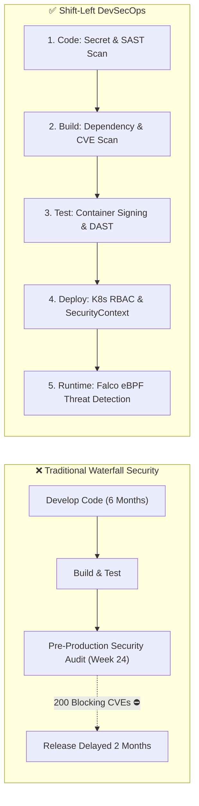
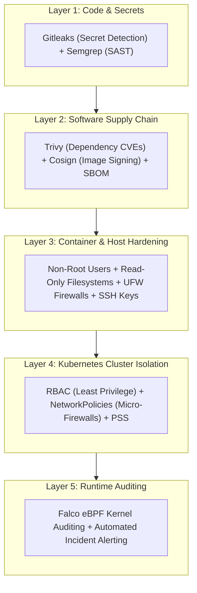

# Shift-Left Security & The DevSecOps Mindset

In traditional software delivery, security was an isolated gate at the very end of the release cycle. Weeks before a major release, a separate security team would run penetration tests and file 200 blocking tickets — forcing engineers to delay releases and rewrite architecture.

**DevSecOps (Development + Security + Operations)** integrates automated security testing into every single phase of the CI/CD software delivery pipeline.

---

## Why "Shift-Left"? The Cost of Remediation

Fixing vulnerabilities becomes exponentially more expensive and difficult the later they are detected in the lifecycle:

```mermaid
gantt
    title Relative Cost to Fix a Security Vulnerability
    dateFormat X
    axisFormat $ %s

    section Coding (IDE / Pre-commit)
    $80 :active, 0, 80
    section CI/CD Pipeline
    $450 : 0, 450
    section Staging QA Testing
    $1800 : 0, 1800
    section Production Breach Post-Mortem
    $7600+ :crit, 0, 7600
```

1. **Coding Phase (~$80)**: Caught instantly by an IDE linter or pre-commit hook before pushing to Git.
2. **CI Pipeline (~$450)**: Caught during a Pull Request automated scan; developer fixes it in 15 minutes.
3. **Production Breach (~$7,600 - $4.4M+)**: Involves data leaks, emergency hotfixes, regulatory GDPR/HIPAA fines, and reputational damage.

---

## The 5 Layers of Defense-in-Depth

Never rely on a single firewall or perimeter defense. Modern cloud security enforces **Defense-in-Depth** across 5 distinct layers:

---

## Threat Modeling with the STRIDE Framework

Before writing code or infrastructure, engineers use Microsoft's **STRIDE** framework to identify potential attack vectors:

| Threat | Description | Real-World Example | DevSecOps Countermeasure |
| :--- | :--- | :--- | :--- |
| **S**poofing | Impersonating someone else | Attacker pushes malicious container image | Sigstore Cosign digital image signing |
| **T**ampering | Modifying data in transit/rest | Editing database records directly | TLS encryption + immutable audit logs |
| **R**epudiation | Denying an action took place | User claims they didn't delete the DB | Centralized append-only audit logging |
| **I**nformation Disclosure | Exposing private data | Plain-text database password in Git | HashiCorp Vault / Sealed Secrets |
| **D**enial of Service | Exhausting system resources | Flooding API with 100k requests/sec | Rate limiting + K8s resource requests/limits |
| **E**levation of Privilege | Gaining unauthorized admin access | Exploiting container breakout to root | Running containers as unprivileged non-root |
