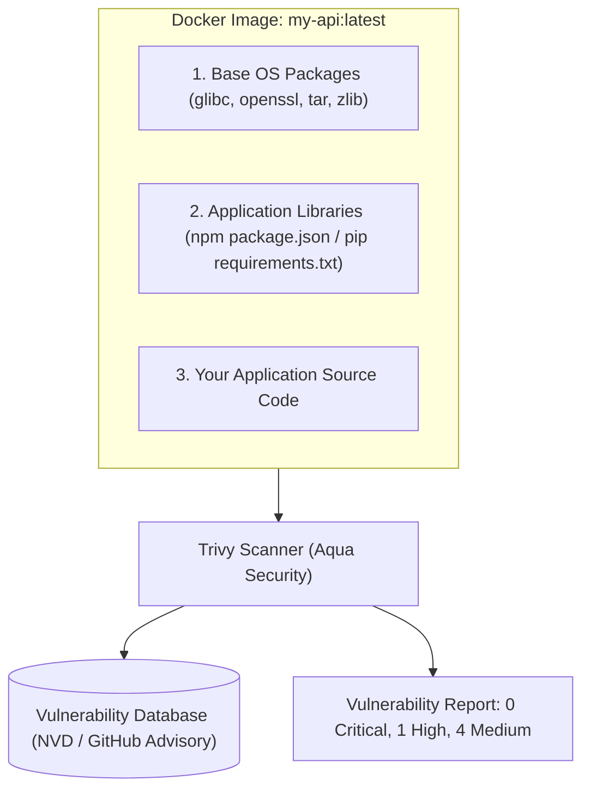

# Container & Filesystem CVE Scanning with Trivy

When you write `FROM node:20` in a Dockerfile, you are not just pulling Node.js — you are pulling a complete Linux distribution (Debian/Ubuntu) with over 400 OS packages (OpenSSL, curl, systemd, libc).

If any of those underlying packages contain a **Common Vulnerability and Exposure (CVE)**, your entire production cluster is exposed to remote code execution.



---

## Understanding CVSS Severity Levels

Vulnerabilities are graded using the **Common Vulnerability Scoring System (CVSS)**:

| Severity | CVSS Score | Production Policy | Action Required |
| :--- | :--- | :--- | :--- |
| **CRITICAL** | 9.0 - 10.0 | ⛔ **Immediate Block** | CI build fails; must fix before deploy (Remote Code Execution) |
| **HIGH** | 7.0 - 8.9 | ⚠️ **Block or 48h SLA** | Patch or upgrade base image within 48 hours |
| **MEDIUM** | 4.0 - 6.9 | ℹ️ **Log & Triage** | Address in next sprint maintenance |
| **LOW** | 0.1 - 3.9 | ℹ️ **Informational** | Low risk; address during regular dependency updates |

---

## Hands-On: Scanning Containers with Trivy

Install Trivy:
```bash
# macOS
brew install trivy

# Linux
sudo apt-get install wget apt-transport-https gnupg lsb-release
wget -qO - https://aquasecurity.github.io/trivy-repo/deb/public.key | sudo apt-key add -
echo "deb https://aquasecurity.github.io/trivy-repo/deb $(lsb_release -sc) main" | sudo tee -a /etc/apt/sources.list.d/trivy.list
sudo apt-get update && sudo apt-get install trivy
```

### 1. Scan a Docker Image
```bash
$ trivy image --severity HIGH,CRITICAL node:18-bullseye

node:18-bullseye (debian 11.7)
==============================
Total: 34 (HIGH: 28, CRITICAL: 6)

┌────────────────┬────────────────┬──────────┬───────────────────┬───────────────┐
│ Library        │ Vulnerability  │ Severity │ Installed Version │ Fixed Version │
├────────────────┼────────────────┼──────────┼───────────────────┼───────────────┤
│ openssl        │ CVE-2023-0286  │ CRITICAL │ 1.1.1n-0+deb11u4  │ 1.1.1n-0+deb11u5│
│ libssl1.1      │ CVE-2023-0464  │ HIGH     │ 1.1.1n-0+deb11u4  │ 1.1.1n-0+deb11u5│
└────────────────┴────────────────┴──────────┴───────────────────┴───────────────┘
```

### 2. Compare against a Hardened Minimal Base (`alpine` or `distroless`)
```bash
$ trivy image --severity HIGH,CRITICAL node:20-alpine

node:20-alpine (alpine 3.19.1)
==============================
Total: 0 (HIGH: 0, CRITICAL: 0)  ← 100% Clean!
```

> [!TIP]
> Switching from a standard Debian image (`node:20`) to an Alpine image (`node:20-alpine`) or Google Distroless image (`gcr.io/distroless/nodejs20-debian12`) eliminates over 95% of all CVEs by removing unnecessary shell utilities, compilers, and package managers!

---

## 3. Generating a Software Bill of Materials (SBOM)

Many enterprise contracts and compliance standards (such as US Executive Order 14028) require providing an **SBOM** — a formal list of every ingredient in your software artifact.

```bash
# Generate CycloneDX JSON SBOM
trivy image --format cyclonedx --output sbom.json my-app:v1.0.0
```

---

## 4. Production CI/CD Gate in GitHub Actions

```yaml
- name: Build Docker Image
  run: docker build -t my-app:${{ github.sha }} .

- name: Run Trivy Vulnerability Scanner
  uses: aquasecurity/trivy-action@master
  with:
    image-ref: 'my-app:${{ github.sha }}'
    format: 'table'
    exit-code: '1' # Break the build if CRITICAL vulnerabilities exist!
    ignore-unfixed: true
    severity: 'CRITICAL,HIGH'
```
