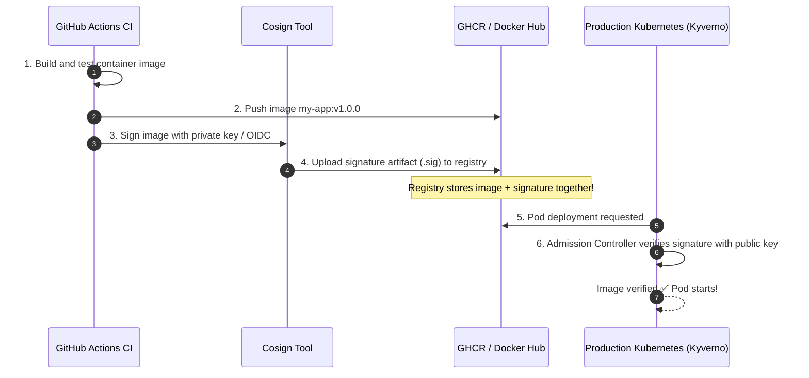

# Supply Chain Security: Signing Images with Cosign

How do you know the container image running in your production Kubernetes cluster was genuinely built by your trusted GitHub Actions pipeline — and not by an attacker who compromised a developer's Docker Hub password or poisoned your registry?

**Sigstore Cosign** provides cryptographic signing, verification, and provenance for container images and OCI artifacts.



---

## Generating Keypairs and Signing Locally

Install Cosign:
```bash
brew install cosign
```

### 1. Generate a Cryptographic Keypair
```bash
$ cosign generate-key-pair

Enter password for private key: **********
Private key written to cosign.key
Public key written to cosign.pub
```

### 2. Sign a Container Image in the Registry
```bash
# Signs the image digest and pushes the signature to the registry
cosign sign --key cosign.key ghcr.io/my-org/production-api:v1.0.0
```

### 3. Verify the Image Signature
```bash
$ cosign verify --key cosign.pub ghcr.io/my-org/production-api:v1.0.0

Verification for ghcr.io/my-org/production-api:v1.0.0 --
The following checks were performed each with a list of signatures:
- The cosign claims were validated
- The signatures were verified against the specified public key

[{"critical":{"identity":{"docker-reference":"ghcr.io/my-org/production-api"},"image":{"docker-manifest-digest":"sha256:8a1b..."}}}]
```

If anyone tampers with even a single byte of the image layers, verification immediately **fails with an exit code of 1**.

---

## Enforcing Signed Images in Kubernetes with Kyverno

You can configure Kubernetes to reject any pod whose image does not have a valid signature:

```yaml
apiVersion: kyverno.io/v1
kind: ClusterPolicy
metadata:
  name: check-image-signature
spec:
  validationFailureAction: Enforce # Block unsigned pods!
  rules:
    - name: verify-signature
      match:
        any:
          - resources:
              kinds:
                - Pod
      verifyImages:
        - imageReferences:
            - "ghcr.io/my-org/*"
          attestors:
            - entries:
                - keys:
                    publicKeys: |
                      -----BEGIN PUBLIC KEY-----
                      MFkwEwYHKoZIzj0CAQYIKoZIzj0DAQcDQgAE...
                      -----END PUBLIC KEY-----
```
