# Secret Management with HashiCorp Vault & Sealed Secrets

In standard Kubernetes, a `Secret` object is **not encrypted** — it is merely encoded in Base64 (`echo "password" | base64`). Anyone who reads your Git repository or has access to `kubectl` can instantly decode it:

```bash
$ echo "U3VwZXJTZWNyZXRQYXNzd29yZDEyMw==" | base64 -d
SuperSecretPassword123
```

Never commit standard Kubernetes Secrets or `.env` files to Git. In this lesson, you will master production secret management using **Bitnami Sealed Secrets** and **HashiCorp Vault**.

---

## Approach 1: Bitnami Sealed Secrets (Ideal for GitOps)

Sealed Secrets uses **Asymmetric Cryptography** (Public/Private Key Encryption):
1. **Public Key (Local Developer)**: Can only *encrypt* secrets into a `SealedSecret` manifest that is 100% safe to commit to public Git.
2. **Private Key (Cluster Only)**: Lives exclusively inside the Kubernetes cluster controller and decrypts the sealed secret into a native Kubernetes Secret in memory.

```mermaid
flowchart LR
    Dev["Developer with raw password"] -->|kubeseal with Public Key| SS["SealedSecret.yaml (Encrypted Ciphertext)"]
    SS -->|Safe to commit| Git["Public GitHub Repository"]
    Git -->|ArgoCD sync| K8s["Kubernetes Cluster"]
    K8s --> Controller["Sealed Secrets Controller
(Has Private Key)"]
    Controller -->|Decrypts| Secret["Native K8s Secret (In-Memory)"]
    Secret --> Pod["Application Pod"]
```



### Hands-On: Creating a SealedSecret
```bash
# 1. Create a temporary local secret (Do NOT commit this to Git)
kubectl create secret generic db-credentials   --from-literal=password='SuperSecureDBPassword2026!'   --dry-run=client -o yaml > secret.yaml

# 2. Seal the secret using the cluster's public encryption key
kubeseal --format=yaml < secret.yaml > sealed-secret.yaml

# 3. Delete the plain-text secret file!
rm secret.yaml
```

Now, inspect `sealed-secret.yaml`:
```yaml
apiVersion: bitnamia.com/v1alpha1
kind: SealedSecret
metadata:
  name: db-credentials
  namespace: production
spec:
  encryptedData:
    password: AgBy19aX0zLk...[COMPLETELY ENCRYPTED CIPHERTEXT]...8qPw==
```

This file is **100% safe to commit to your public Git repository**.

---

## Approach 2: HashiCorp Vault (Enterprise Dynamic Secrets)

**HashiCorp Vault** is the industry standard for centralized secret management, offering **Dynamic Secrets** (generating unique database credentials on the fly that expire automatically in 1 hour).

```mermaid
flowchart LR
    App["Application Pod"] -->|1. Authenticate with K8s ServiceAccount| Vault["HashiCorp Vault Server"]
    Vault -->|2. Verify Token with K8s API| K8s["Kubernetes Control Plane"]
    Vault -->|3. Dynamically generate short-lived DB user| DB[("PostgreSQL Database")]
    Vault -->>App: 4. Returns credentials (TTL: 1 Hour)
```

### Benefits of Vault Dynamic Secrets:
1. **No Static Passwords**: Passwords do not exist until an application requests one.
2. **Automated Revocation**: When the pod dies, Vault automatically drops the user from the database.
3. **Audit Trail**: Every secret access is logged with the requesting pod's identity.
