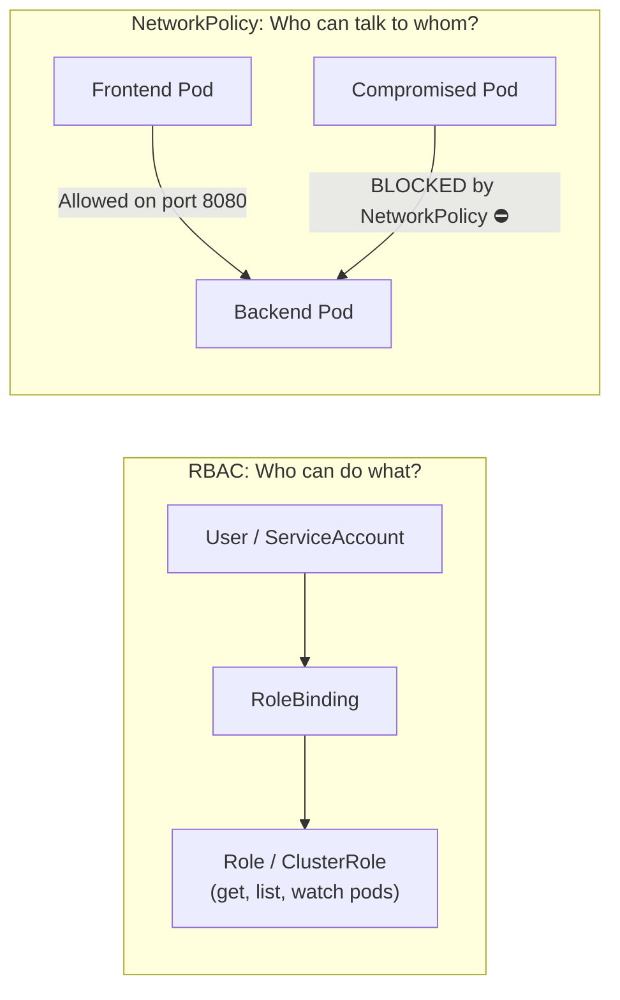

# Kubernetes Security: RBAC & NetworkPolicies

In a default Kubernetes installation, **security is wide open**:
1. Any developer or pod can access the Kubernetes API with broad privileges.
2. Every pod can communicate over the network with every other pod across all namespaces.

In this lesson, you will lock down cluster access with **Role-Based Access Control (RBAC)** and build micro-firewalls with **NetworkPolicies**.



---

## 1. Role-Based Access Control (RBAC)

RBAC controls access to the Kubernetes API using 4 core resources:

| Resource | Scope | Purpose |
| :--- | :--- | :--- |
| **Role** | Single Namespace | Defines permissions within one namespace (e.g. `staging`) |
| **ClusterRole** | Entire Cluster | Defines permissions across all namespaces (e.g. read nodes, PVs) |
| **RoleBinding** | Single Namespace | Grants a Role to a user, group, or ServiceAccount in a namespace |
| **ClusterRoleBinding** | Entire Cluster | Grants a ClusterRole across the entire cluster |

### Example: Read-Only Developer Role (`developer-role.yaml`):
```yaml
apiVersion: rbac.authorization.k8s.io/v1
kind: Role
metadata:
  namespace: production
  name: pod-reader
rules:
  - apiGroups: [""] # Core API group
    resources: ["pods", "pods/log"]
    verbs: ["get", "list", "watch"] # Cannot delete, create, or update!
```

### Bind Role to User Alice:
```yaml
apiVersion: rbac.authorization.k8s.io/v1
kind: RoleBinding
metadata:
  name: read-pods-alice
  namespace: production
subjects:
  - kind: User
    name: alice@company.com
    apiGroup: rbac.authorization.k8s.io
roleRef:
  kind: Role
  name: pod-reader
  apiGroup: rbac.authorization.k8s.io
```

### Test Permissions from CLI:
```bash
# Check if Alice can delete pods:
$ kubectl auth can-i delete pods --namespace production --as alice@company.com
no

# Check if Alice can read pod logs:
$ kubectl auth can-i get pods/log --namespace production --as alice@company.com
yes
```

---

## 2. Kubernetes NetworkPolicies (Micro-Segmentation)

By default, if an attacker compromises a frontend pod, they can scan internal IPs and access payment databases and internal Redis caches directly.

**NetworkPolicies** enforce firewall rules between pods.

### Step 1: Default Deny All Inbound Traffic in Namespace
```yaml
apiVersion: networking.k8s.io/v1
kind: NetworkPolicy
metadata:
  name: default-deny-all
  namespace: production
spec:
  podSelector: {} # Selects all pods in namespace
  policyTypes:
    - Ingress
```

### Step 2: Allow Only Backend API to Connect to Database on Port 5432
```yaml
apiVersion: networking.k8s.io/v1
kind: NetworkPolicy
metadata:
  name: allow-backend-to-postgres
  namespace: production
spec:
  podSelector:
    matchLabels:
      app: postgres-database # Target DB Pod
  policyTypes:
    - Ingress
  ingress:
    - from:
        - podSelector:
            matchLabels:
              app: backend-api # ONLY backend-api pods permitted!
      ports:
        - protocol: TCP
          port: 5432
```
