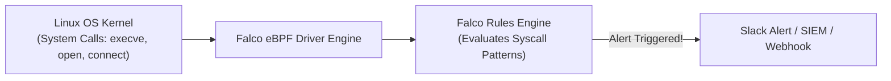

# Runtime Threat Detection with Falco

Static code scans and container image vulnerability checks only protect you **before** deployment. But what happens if an attacker exploits a zero-day vulnerability (like Log4Shell) at 2:00 AM on a live production server?

**Sysdig Falco** is the CNCF graduated standard for cloud-native runtime threat detection. It sits inside the Linux kernel using **eBPF (Extended Berkeley Packet Filter)** and analyzes every system call in real time.



---

## What Does Falco Detect?

Falco detects malicious behavior that static scans miss completely:
1. **Interactive Shell Spawned**: Someone ran `kubectl exec` or spawned a `/bin/bash` shell inside a production container.
2. **Binary Modification**: A process attempted to write to `/bin`, `/sbin`, or `/usr/bin`.
3. **Privilege Escalation**: A process modified `/etc/shadow`, `/etc/sudoers`, or Kubernetes service account tokens.
4. **Cryptomining**: Outbound connections to known Monero / Bitcoin mining pools.
5. **Sensitive File Reads**: Unauthorized reads of private SSH keys (`id_rsa`) or PKI certificates.

---

## Anatomy of a Falco Rule

Falco rules are defined in YAML using a clean declarative syntax:

```yaml
# /etc/falco/falco_rules.local.yaml

# Rule 1: Detect shell spawned inside production container
- rule: Terminal Shell Spawned in Production Container
  desc: Detect when bash/sh/zsh is launched inside a container
  condition: >
    container.id != host and
    evt.type = execve and
    evt.dir = < and
    proc.name in (bash, sh, zsh, ksh)
  output: >
    CRITICAL: Shell spawned in container
    (user=%user.name container_id=%container.id
    container_name=%container.name image=%container.image.repository
    cmdline=%proc.cmdline)
  priority: CRITICAL
  tags: [container, execution, pci-dss]

# Rule 2: Detect unauthorized read of sensitive credentials
- rule: Read Sensitive File in Container
  desc: Detect access to /etc/shadow or AWS credentials
  condition: >
    container.id != host and
    evt.type in (open, openat) and
    fd.name startswith "/root/.aws"
  output: >
    WARNING: AWS credentials accessed inside container
    (user=%user.name proc=%proc.name file=%fd.name)
  priority: WARNING
```

---

## Installing Falco on Kubernetes

Deploy Falco as a `DaemonSet` across all worker nodes with Helm:

```bash
# 1. Add Falco Helm repo
helm repo add falcosecurity https://falcosecurity.github.io/charts
helm repo update

# 2. Install Falco with modern eBPF driver
helm install falco falcosecurity/falco   --namespace falco   --create-namespace   --set driver.kind=ebpf   --set falcosidekick.enabled=true   --set falcosidekick.config.slack.webhookurl="https://hooks.slack.com/services/T00/B00/XXXX"
```

---

## Testing Your Detection Rule Live

Spawn a test container and run a shell:
```bash
kubectl run test-pod --image=alpine -- rm -rf /bin/ls
```

Within 200 milliseconds, Falco sends an alert to your Slack `#security-alerts` channel:
```text
🚨 [CRITICAL] Terminal Shell Spawned in Production Container
User: root
Pod: test-pod
Namespace: default
Image: alpine:latest
Command: rm -rf /bin/ls
Timestamp: 2026-08-19 02:30:15 UTC
```
