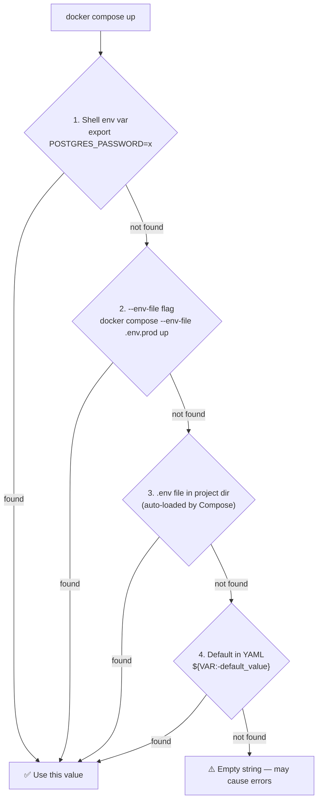

# Why This Matters

Your application needs configuration to run: database passwords, API keys, feature flags, service URLs. Managing this configuration correctly is one of the most critical (and most frequently botched) parts of any production deployment.

The three golden rules:
1. **Never hardcode secrets** in source code or Docker images
2. **Never commit secrets** to Git (`.env` with real passwords, `docker-compose.prod.yml` with credentials)
3. **Use different values** per environment — the same `DATABASE_URL` for dev and prod is a disaster waiting to happen

---

## How Compose Resolves Variables: The Lookup Chain

When Compose encounters `${VARIABLE_NAME}` in a YAML file, it resolves the value from these sources **in priority order**:



```bash
# Shell env has highest priority — overrides everything
POSTGRES_PASSWORD=prod_secret docker compose up -d

# Use a specific env file
docker compose --env-file .env.production up -d

# Compose auto-loads .env from the project directory (lowest priority of explicit files)
```

---

## Variable Syntax in `docker-compose.yml`

```yaml
services:
  api:
    environment:
      # Basic substitution — error if not set and no default
      DATABASE_URL: "${DATABASE_URL}"

      # Default value if variable is unset or empty
      NODE_ENV: "${NODE_ENV:-development}"

      # Default value only if variable is unset (not if it's empty "")
      LOG_LEVEL: "${LOG_LEVEL-info}"

      # Raise an error if variable is unset
      POSTGRES_PASSWORD: "${POSTGRES_PASSWORD:?POSTGRES_PASSWORD must be set}"

      # Compose supports string interpolation
      REDIS_URL: "redis://:${REDIS_PASSWORD}@cache:${REDIS_PORT:-6379}"
```

---

## The `.env` File Strategy: Three Files

The cleanest pattern for managing config across environments:

```bash
# .env — committed to Git (non-sensitive defaults)
# ─────────────────────────────────────────────────
NODE_ENV=development
APP_PORT=3000
LOG_LEVEL=info
POSTGRES_USER=appuser
POSTGRES_DB=myapp
POSTGRES_PORT=5432
REDIS_PORT=6379
```

```bash
# .env.local — on developer machines (NEVER commit — gitignored)
# ─────────────────────────────────────────────────────────────────
# Override defaults with your local values
POSTGRES_PASSWORD=mydevpassword123
REDIS_PASSWORD=mydevredis
```

```bash
# .env.production — on the server only (NEVER commit — gitignored or vault-managed)
# ──────────────────────────────────────────────────────────────────────────────────
NODE_ENV=production
LOG_LEVEL=warn
POSTGRES_USER=appuser
POSTGRES_DB=myapp
POSTGRES_PASSWORD=Str0ng!ProductionP4ssw0rd
REDIS_PASSWORD=Str0ng!RedisP4ssw0rd
IMAGE_TAG=v1.5.2
```

```bash
# .gitignore
.env.local
.env.*.local
.env.production
.env.staging
*.pem
*.key
```

```bash
# Running with the right env file per environment
# Development (uses .env + .env.local override)
docker compose --env-file .env --env-file .env.local up -d

# Production
docker compose --env-file .env.production -f docker-compose.yml -f docker-compose.prod.yml up -d
```

---

## Injecting Variables vs Using `env_file`

```yaml
services:
  api:
    # Option A: env_file — load all vars from file into container
    env_file:
      - .env              # Loaded as container environment variables
      - .env.local        # Override with local values

    # Option B: environment — explicit mapping from compose vars to container vars
    environment:
      NODE_ENV: "${NODE_ENV}"
      DATABASE_URL: "postgres://${POSTGRES_USER}:${POSTGRES_PASSWORD}@db:5432/${POSTGRES_DB}"
      # ^ Compose interpolation happens HERE (in compose context)
      #   The container sees the resolved string, not the variable references
```

**Key difference**: `env_file` loads the file as-is into the container environment. `environment:` with `${}` is resolved by Compose before the container starts. Use `environment:` when you need to compose values from multiple variables (like building a connection string).

---

## Verifying Variables Are Set Correctly

```bash
# Print the resolved compose config (shows all interpolated values)
docker compose config | grep -A 20 "api:"
# Use this to verify DATABASE_URL is correctly assembled before running

# Check what env vars are actually inside a running container
docker compose exec api env | sort

# Check a specific variable
docker compose exec api printenv DATABASE_URL
# postgres://appuser:mydevpassword123@db:5432/myapp

# Check if a variable is missing (returns 1 if DATABASE_URL is empty)
docker compose exec api test -n "$DATABASE_URL" && echo "SET" || echo "NOT SET"
```

---

## Per-Environment Configuration Pattern

Different environments need different values for many settings:

```yaml
# base docker-compose.yml
services:
  api:
    environment:
      DATABASE_URL: "postgres://${POSTGRES_USER}:${POSTGRES_PASSWORD}@db:5432/${POSTGRES_DB}"
      REDIS_URL: "redis://:${REDIS_PASSWORD}@cache:6379"
      NODE_ENV: "${NODE_ENV:-development}"
      LOG_LEVEL: "${LOG_LEVEL:-info}"
```

```yaml
# docker-compose.dev.yml additions
services:
  api:
    environment:
      NODE_ENV: development
      LOG_LEVEL: debug
      NEXT_PUBLIC_API_URL: http://localhost:3000  # Browser-side var
      DEBUG: "api:*"                              # Debug namespace
```

```yaml
# docker-compose.prod.yml additions
services:
  api:
    image: "ghcr.io/yourorg/myapp:${IMAGE_TAG}"   # Pull pre-built image
    environment:
      NODE_ENV: production
      LOG_LEVEL: warn
      NEXT_PUBLIC_API_URL: "https://api.yourdomain.com"
```

```bash
# Usage
# Development
docker compose -f docker-compose.yml -f docker-compose.dev.yml \
  --env-file .env --env-file .env.local up -d

# Production
IMAGE_TAG=v1.5.2 docker compose -f docker-compose.yml -f docker-compose.prod.yml \
  --env-file .env.production up -d
```

---

## Secret Management: Four Approaches by Risk Level

### Level 1: `.env.production` on Server (Minimum Viable)

```bash
# On the server — set secure permissions
chmod 600 /home/deploy/.env.production
chown deploy:deploy /home/deploy/.env.production

# Run Compose with it
docker compose --env-file /home/deploy/.env.production up -d
```

**Good for**: small teams, single server
**Risk**: file on disk; visible to anyone with server access

### Level 2: Docker Secrets (Built-in, File-based)

Docker Secrets mount secrets as files in `/run/secrets/` — not exposed as env vars:

```yaml
# docker-compose.yml with Docker Secrets
services:
  api:
    secrets:
      - db_password
      - redis_password
      - jwt_secret
    environment:
      # App reads the secret from the file, not from env var
      # e.g., in Node.js: fs.readFileSync('/run/secrets/db_password', 'utf8').trim()
      DB_PASSWORD_FILE: /run/secrets/db_password

  db:
    image: postgres:16-alpine
    secrets:
      - db_password
    environment:
      POSTGRES_USER: appuser
      POSTGRES_DB: myapp
      # Official postgres image supports _FILE convention:
      POSTGRES_PASSWORD_FILE: /run/secrets/db_password

secrets:
  db_password:
    file: ./secrets/db_password.txt    # Plain text file (chmod 400)
  redis_password:
    file: ./secrets/redis_password.txt
  jwt_secret:
    file: ./secrets/jwt_secret.txt
```

```bash
# Create secret files (run once, don't commit)
mkdir -p secrets
openssl rand -base64 32 > secrets/db_password.txt
openssl rand -base64 32 > secrets/redis_password.txt
openssl rand -base64 48 > secrets/jwt_secret.txt
chmod 400 secrets/*.txt
echo "secrets/" >> .gitignore
```

### Level 3: CI/CD Secrets Injection (Recommended for Teams)

Store secrets in GitHub Actions Secrets, never in files:

```yaml
# .github/workflows/deploy.yml
name: Deploy
on:
  push:
    branches: [main]

jobs:
  deploy:
    runs-on: ubuntu-latest
    steps:
      - name: Deploy to server
        uses: appleboy/ssh-action@master
        with:
          host: ${{ secrets.SERVER_HOST }}
          username: ${{ secrets.SERVER_USER }}
          key: ${{ secrets.SSH_PRIVATE_KEY }}
          script: |
            # Write env file from CI secrets (never touches Git)
            cat > /home/deploy/.env.production << 'EOF'
            NODE_ENV=production
            POSTGRES_USER=appuser
            POSTGRES_PASSWORD=${{ secrets.POSTGRES_PASSWORD }}
            POSTGRES_DB=myapp
            REDIS_PASSWORD=${{ secrets.REDIS_PASSWORD }}
            IMAGE_TAG=${{ github.sha }}
            EOF
            chmod 600 /home/deploy/.env.production
            
            # Deploy
            cd /home/deploy/myapp
            docker compose --env-file /home/deploy/.env.production \
              -f docker-compose.yml -f docker-compose.prod.yml pull
            docker compose --env-file /home/deploy/.env.production \
              -f docker-compose.yml -f docker-compose.prod.yml up -d
```

### Level 4: External Secrets Manager (Enterprise)

For teams with compliance requirements, pull secrets from AWS Secrets Manager, Vault, or GCP Secret Manager at deploy time:

```bash
# Example: AWS Secrets Manager
aws secretsmanager get-secret-value \
  --secret-id myapp/production/db \
  --query SecretString \
  --output text | python3 -c "
import sys, json
secrets = json.load(sys.stdin)
for k, v in secrets.items():
    print(f'{k}={v}')
" > .env.production

docker compose --env-file .env.production up -d
rm -f .env.production  # Clean up immediately
```

---

## Runtime Configuration: Build Args vs Env Vars

Understand the difference between **build-time** and **runtime** variables:

```dockerfile
# Dockerfile
ARG NODE_VERSION=20           # Build-time argument — baked into the image layer
ARG BUILD_ENV=production      # Not available at container runtime

ENV NODE_ENV=production        # Runtime environment variable — available to the app
```

```yaml
# docker-compose.yml
services:
  api:
    build:
      context: .
      args:
        NODE_VERSION: "20"     # Passed as --build-arg to docker build
        BUILD_ENV: production  # Available during image build only
    environment:
      NODE_ENV: production     # Available when container runs
      DATABASE_URL: "..."      # Available when container runs
```

**Rule**: Use `build.args` for things that affect the build (Node version, build target, optimization flags). Use `environment` for things the running app needs (database URLs, API keys, feature flags).

---

## Feature Flags via Environment Variables

```yaml
# docker-compose.yml
services:
  api:
    environment:
      # Feature flags as env vars (easy to toggle per environment)
      FEATURE_NEW_CHECKOUT: "${FEATURE_NEW_CHECKOUT:-false}"
      FEATURE_ANALYTICS: "${FEATURE_ANALYTICS:-false}"
      FEATURE_RATE_LIMITING: "${FEATURE_RATE_LIMITING:-true}"
      MAX_UPLOAD_SIZE_MB: "${MAX_UPLOAD_SIZE_MB:-10}"
```

```bash
# Enable feature in dev only
echo "FEATURE_NEW_CHECKOUT=true" >> .env.local

# Enable in production only — update .env.production
FEATURE_NEW_CHECKOUT=true docker compose --env-file .env.production up -d
```

---

## Security Checklist

Before going to production, verify:

- [ ] `.env` committed to Git contains **no passwords or API keys** — only non-sensitive defaults
- [ ] `.env.local` and `.env.production` are in `.gitignore`
- [ ] `docker compose config` shows correct values without exposing secrets in logs
- [ ] Database not exposed on a public port (`5432:5432` on a public IP)
- [ ] Secrets have appropriate file permissions (`chmod 600`)
- [ ] Different passwords for dev and production environments
- [ ] CI/CD secrets stored in platform secret store (GitHub Secrets, GitLab CI Variables), not in the repo

---

## Summary

Environment variable management in Docker Compose follows a clear hierarchy:
- **Shell env vars** → `--env-file` flag → auto-loaded `.env` → YAML defaults
- Commit `.env` with safe defaults; keep `.env.local` and `.env.production` gitignored
- **Build args** (`build.args`) affect image construction; **env vars** (`environment`) are available at runtime
- For production, use one of four secret strategies: `.env.production` on server, Docker Secrets (file-based), CI/CD secret injection, or external secrets manager
- Always run `docker compose config` to verify interpolated values before deploying

In the next lesson, you will master service dependency ordering and health checks — ensuring your containers start in the correct sequence and don't try to connect before dependencies are ready.
