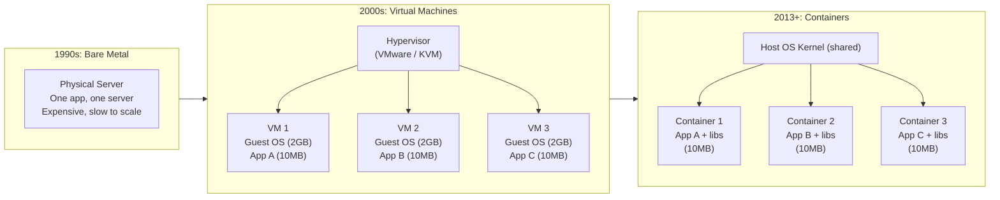

# The Evolution of Infrastructure

Before learning Docker, you must understand *why* it exists and the problem it solves. The history of application hosting tells a clear story of each generation solving the failures of the previous one.



---

## Era 1: The Bare Metal Era (1990s)

Deploying an application meant buying a physical server — installing Linux, configuring networking, installing runtime dependencies (Java, Node, Python), and copying your code.

**The fundamental problem**: Two applications on the same server often conflict. App A needs Python 2, App B needs Python 3. App A needs OpenSSL 1.0, App B needs OpenSSL 3. Solving this meant running **one app per physical server** — an incredibly wasteful use of hardware that typically sat at 5–15% CPU utilisation.

---

## Era 2: Virtual Machines (2000s)

Hypervisors (VMware, VirtualBox, KVM, Hyper-V) solved the "one app per server" waste problem by splitting one physical machine into multiple isolated Virtual Machines.

**How it works**: The hypervisor emulates hardware. Each VM sees what it believes is a real physical machine — with virtual CPU, virtual RAM, virtual disk. Each VM runs its **own full Guest OS** on top.

```
Physical Server: 32 CPU cores, 128 GB RAM
├── VM 1: 4 cores, 16 GB RAM
│   └── Guest OS: Ubuntu 20.04 (2.5 GB)
│       └── App A: 50 MB Node.js API
├── VM 2: 4 cores, 16 GB RAM
│   └── Guest OS: Ubuntu 20.04 (2.5 GB)
│       └── App B: 80 MB Python service
└── VM 3: 4 cores, 16 GB RAM
    └── Guest OS: CentOS 7 (1.8 GB)
        └── App C: 100 MB Java service
```

**What VMs solved**: Multi-tenancy on one physical machine, strong isolation between workloads, different OSes side-by-side.

**What VMs did NOT solve**:
- **Startup time**: A VM takes 30–120 seconds to boot (it's loading a full OS)
- **Memory waste**: A 10 MB Node.js app carrying a 2.5 GB Ubuntu installation is absurd
- **Density**: You can fit ~10 VMs on a server before running out of RAM just from Guest OS overhead
- **Portability**: Moving a VM between hypervisors is painful; moving between cloud providers is nearly impossible

---

## Era 3: Containers (2013–Present)

Docker (launched 2013) popularized a fundamentally different approach: instead of virtualizing the **hardware**, containers virtualize the **Operating System**.

**The key insight**: All containers on a host share the same underlying Linux kernel. They don't need their own OS — just their own isolated slice of the existing one.

Linux provides two kernel features that make this possible:

- **Namespaces**: Isolate what a process can *see* — its own PID namespace (so it can't see other processes), network namespace (its own network stack), mount namespace (its own filesystem view), user namespace (its own UIDs)
- **cgroups** (Control Groups): Limit what a process can *use* — CPU time, memory, I/O bandwidth

```
Physical Server: 32 CPU cores, 128 GB RAM
├── Container 1: App A (50 MB Node.js binary + Alpine base = 60 MB total)
├── Container 2: App B (80 MB Python + deps = 120 MB total)
├── Container 3: App C (100 MB Java JAR + JRE = 200 MB total)
└── Host OS Kernel: shared by all containers (not duplicated)

Total memory for 3 apps: ~380 MB  ← vs 7.5 GB for 3 VMs
```

---

## Side-by-Side Comparison

| | Bare Metal | Virtual Machine | Container |
|--|-----------|----------------|-----------|
| **Isolation** | None | Full hardware emulation | OS-level namespaces |
| **Startup time** | Minutes (manual) | 30–120 seconds | < 1 second |
| **Image size** | N/A | 1–10 GB | 5–500 MB |
| **Memory overhead** | None | 1–2 GB per Guest OS | Near zero |
| **Density** | 1 app/server | 5–20 VMs/server | 50–500 containers/server |
| **Portability** | None | Limited (hypervisor-specific) | Runs identically anywhere |
| **Startup speed** | Weeks (hardware procurement) | Minutes | Milliseconds |

---

## The "Works On My Machine" Problem — Solved

This is Docker's most famous value proposition. Before containers, this conversation happened constantly:

```
Developer:  "I tested it locally, it works!"
Ops:        "It's crashing in production."
Developer:  "But it works on my machine!"
Ops:        "Your machine has Node 18 and libssl 3.0.
             Production server has Node 16 and libssl 1.0.
             Of course it doesn't work."
```

A Docker container includes **not just your code**, but the exact runtime (Node 18.x), the exact libraries (libssl 3.0), the exact configuration files — everything the app needs to run. The container is the "machine". If it works in a container on your laptop, it works in the same container on the CI server, on the staging server, and on the production server. The environment travels with the code.

---

## What Containers Are NOT

Containers are **not** stronger security than VMs. Because containers share the host kernel, a kernel vulnerability could allow a container escape (breaking out of the container to the host). VMs have a much thicker isolation boundary (the hypervisor).

For workloads with extreme security requirements (handling payment data, running untrusted code), VMs are still appropriate — or a combination: VMs running Docker (the default on AWS ECS, GKE, AKS).

---

## Summary

- **Bare Metal**: one app per physical server — expensive and wasteful
- **Virtual Machines**: strong isolation + hardware emulation — heavy (GB-sized Guest OS per VM, minute-long boots)
- **Containers**: OS-level isolation via Linux namespaces + cgroups — lightweight (MB-sized, millisecond boots), portable, dense
- The container **image** bundles the app + its exact dependencies — eliminating "works on my machine" permanently
- Containers share the host kernel — faster and smaller but thinner isolation boundary than VMs

In the next lesson, you will learn how Docker is architectured internally — the client, daemon, registry, and the difference between images and containers.
