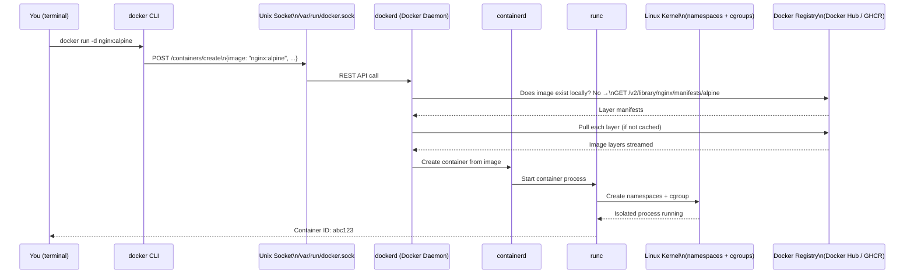
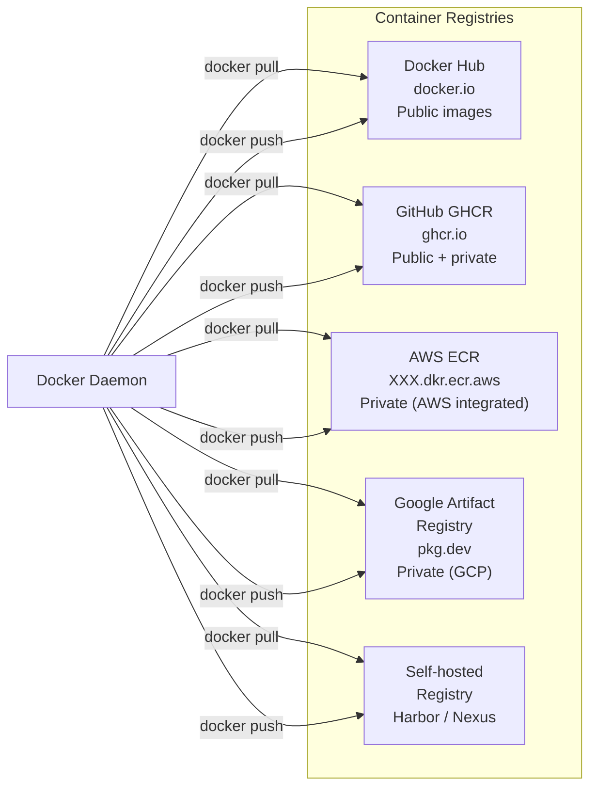
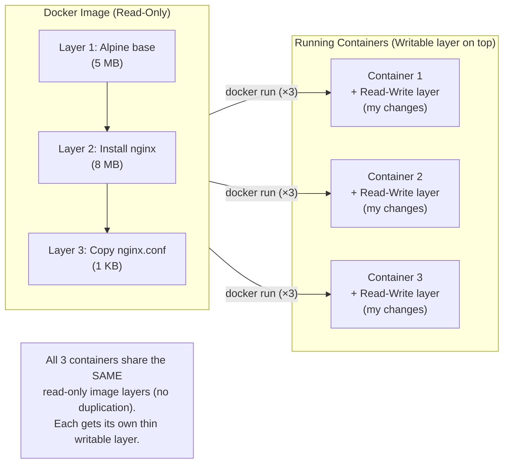

# Under the Hood of Docker

When you type `docker run nginx`, what is actually happening across the system? Docker is not a single monolithic binary — it's a distributed client-server architecture composed of several cooperating components.



---

## Component 1: The Docker CLI (`docker`)

The `docker` binary is a pure client — it does **no actual container work**. Its only job is:
1. Accept your commands (`docker run`, `docker build`, `docker ps`)
2. Translate them into REST API calls
3. Send those calls to the Docker Daemon via a Unix socket

```bash
# The CLI talks to the daemon at this socket by default:
# /var/run/docker.sock   (Linux / Docker Desktop on Mac)

# You can even call the Docker API directly with curl
curl --unix-socket /var/run/docker.sock \
  http://localhost/version | python3 -m json.tool
# {
#   "Version": "27.0.3",
#   "Os": "linux",
#   "Arch": "amd64",
#   "KernelVersion": "6.8.0-40-generic",
#   ...
# }

# Or connect to a remote Docker daemon (over TCP)
DOCKER_HOST=tcp://192.168.1.100:2376 docker ps
```

---

## Component 2: The Docker Daemon (`dockerd`)

The daemon is the heavy-lifting background process. It:
- Listens on the Unix socket (or TCP) for API requests
- Manages the lifecycle of images, containers, networks, and volumes
- Delegates actual container creation to `containerd`
- Handles image layer downloading, verification, and caching

```bash
# Check if the daemon is running
sudo systemctl status docker

# View daemon logs
journalctl -u docker.service -f

# Configure the daemon (edit and restart)
cat /etc/docker/daemon.json
{
  "log-driver": "json-file",
  "log-opts": { "max-size": "10m", "max-file": "3" },
  "default-ulimits": { "nofile": { "Hard": 65536, "Name": "nofile", "Soft": 65536 } },
  "live-restore": true,    # Keep containers running when daemon restarts
  "userland-proxy": false  # Better performance for port forwarding
}
```

**On Mac and Windows**: Docker Desktop runs a lightweight Linux VM (using HyperKit/WSL2), and the Docker Daemon runs inside that VM. Your `docker` CLI on the Mac talks to the daemon inside the Linux VM.

---

## Component 3: containerd and runc

Under the hood, `dockerd` delegates the actual container creation to two additional components:

- **containerd**: An industry-standard container runtime supervisor. It manages the full container lifecycle (create, start, stop, delete), handles image storage, and manages container snapshots. It's also used directly by Kubernetes.
- **runc**: The lowest-level component. `runc` is a CLI tool that actually calls the Linux kernel's `clone()` syscall to create namespaces and sets up cgroups. Every container you run is ultimately one `runc` process.

```bash
# See containerd running
ps aux | grep containerd
# root   1234   dockerd
# root   1235   containerd         ← spawned by dockerd
# root   1236   containerd-shim    ← one per container
# root   1237   nginx              ← your container's process (inside namespace)
```

---

## Component 4: Docker Registry

A registry is a server that stores and distributes Docker images. The default is **Docker Hub** (`docker.io`).



### Image Naming Convention

```
registry.example.com / namespace / repository : tag @ digest
─────────────────── ─────────── ────────────── ─── ──────────────────────
Optional (default    User or org Image name    Tag  SHA256 (immutable ref)
= docker.io)

# Examples:
nginx                                   # = docker.io/library/nginx:latest
nginx:1.25-alpine                       # = docker.io/library/nginx:1.25-alpine
johndoe/my-api:v2.0.1                   # = docker.io/johndoe/my-api:v2.0.1
ghcr.io/yourorg/backend:abc1234         # GitHub GHCR
123456789.dkr.ecr.us-east-1.amazonaws.com/my-app:v1.0.0  # AWS ECR
nginx@sha256:a3b4c5d6...                # Immutable — pinned to exact digest
```

---

## Images vs Containers: The Critical Distinction

This is the most important conceptual distinction in Docker:



| | Image | Container |
|--|-------|-----------|
| **State** | Static, immutable | Running, mutable |
| **Analogy** | Recipe / Blueprint | The baked cake |
| **Disk** | Shared read-only layers | +Thin writable layer |
| **Lives on** | Disk (not running) | CPU + Memory |
| **Create from** | `docker build` or `docker pull` | `docker run` |
| **Delete** | `docker rmi` | `docker rm` |
| **Multiple instances** | One image → 100 containers | Each is independent |

```bash
# Images on disk
docker images
# REPOSITORY   TAG       IMAGE ID       CREATED        SIZE
# nginx        alpine    abc123def456   2 weeks ago    41.6MB
# postgres     16        789xyz...      1 month ago    432MB

# Running containers (instances of those images)
docker ps
# CONTAINER ID   IMAGE          COMMAND              STATUS
# a1b2c3         nginx:alpine   "/docker-entrypoint" Up 5 minutes
# d4e5f6         nginx:alpine   "/docker-entrypoint" Up 3 minutes
# Both are running from the SAME nginx:alpine image

# Every container adds a writable layer on top of the read-only image layers
# When the container is deleted, the writable layer is lost
# If you need data to survive container deletion → use a Volume
```

---

## The Image Layer Cache

Images are stored as layers on disk. Docker caches every layer by its SHA256 digest. If two different images share a common layer (e.g., both start with `FROM node:20-alpine`), that layer is stored **once** and shared:

```bash
# Pull two images that share the node:20-alpine base
docker pull my-api:v1     # Downloads: alpine base, node, your app
docker pull my-api:v2     # Downloads: ONLY your changed app layer
                          # Alpine base + node are already cached!
```

This is why updating your app's image to v2 is fast — only the changed layers are downloaded, not the entire image.

---

## Summary

Docker's architecture has four main components:
- **Docker CLI** (`docker`): Pure client — translates commands to REST API calls, sends to the daemon
- **Docker Daemon** (`dockerd`): The server — manages images, containers, networks, volumes; delegates to containerd
- **containerd + runc**: The actual container engine — creates Linux namespaces + cgroups for isolation
- **Registry**: Image storage and distribution — Docker Hub is the public default; GHCR, ECR, GAR for private/org images

The **Image** is the static, read-only blueprint (layers on disk). A **Container** is a running instance of an image with its own thin writable layer on top. You can run 100 containers from one image — they all share the image's read-only layers.

In the next lesson, you will run your first container and master the essential Docker CLI commands.
