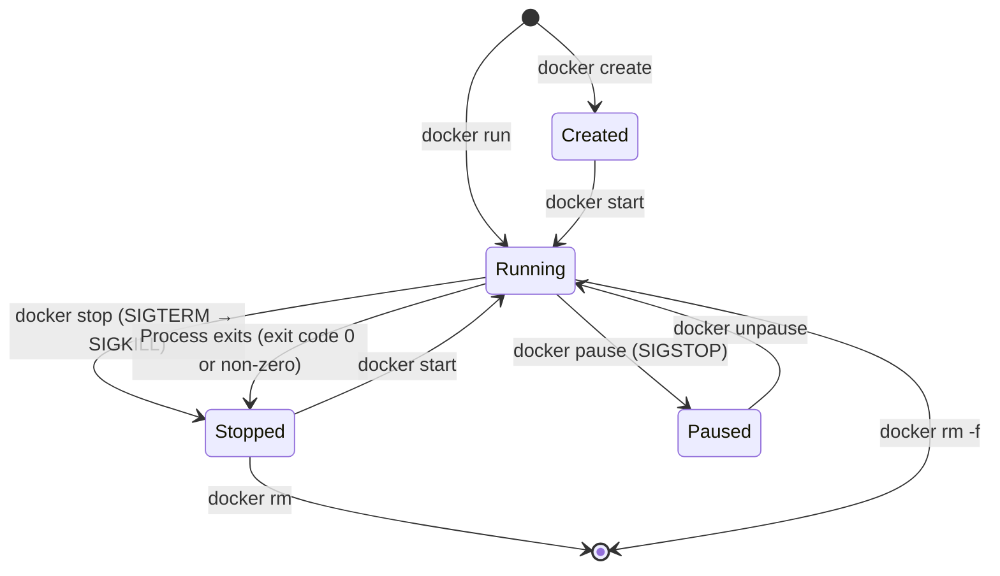

# The `docker run` Command: Full Reference

`docker run` is the most important Docker command. Every flag controls a specific aspect of the container's isolation, resources, and networking. Let's dissect it completely.

## Anatomy of a docker run Command

```bash
docker run \
  -d \                                    # Detached (background)
  -p 8080:80 \                            # Port mapping host:container
  --name my-nginx \                       # Friendly name
  --restart unless-stopped \             # Auto-restart policy
  -e NGINX_PORT=80 \                      # Environment variable
  -v /host/path:/container/path \        # Volume or bind mount
  --network my-network \                 # Connect to network
  --memory 256m \                        # Memory limit
  --cpus 0.5 \                           # CPU limit (half a core)
  nginx:alpine                           # Image (repo:tag)
```

---

## Your First Container: NGINX Web Server

```bash
# The simplest possible run — starts NGINX in the foreground
docker run nginx:alpine

# Ctrl+C to stop it

# Run in the background with a port exposed
docker run -d -p 8080:80 --name my-nginx nginx:alpine
# Returns: a3b4c5d6e7f8...  (container ID)

# Test it
curl http://localhost:8080
# <!DOCTYPE html> ... Welcome to nginx! ...
```

### Dissecting the Flags

| Flag | Long form | Meaning |
|------|-----------|---------|
| `-d` | `--detach` | Run in background; print container ID |
| `-p 8080:80` | `--publish` | Map host port 8080 → container port 80 |
| `--name my-nginx` | | Assign a friendly name |
| `-e KEY=VAL` | `--env` | Set an environment variable |
| `-v` | `--volume` | Mount a volume or bind mount |
| `--rm` | | Automatically remove container when it exits |
| `-it` | | Interactive + TTY (for shells) |
| `--restart` | | Restart policy: `no`, `on-failure`, `always`, `unless-stopped` |

---

## Essential Container Management Commands

```bash
# === Listing containers ===
docker ps                   # Running containers only
docker ps -a                # All containers (including stopped)
docker ps -q                # Only container IDs (useful for scripting)
docker ps --format "table {{.Names}}\t{{.Status}}\t{{.Ports}}"

# === Starting and stopping ===
docker stop my-nginx        # Send SIGTERM (graceful shutdown, then SIGKILL after 10s)
docker start my-nginx       # Restart a stopped container (preserves its config)
docker restart my-nginx     # stop + start
docker kill my-nginx        # Send SIGKILL immediately (no grace period)
docker pause my-nginx       # Freeze process (SIGSTOP — suspends execution)
docker unpause my-nginx     # Resume

# === Cleanup ===
docker rm my-nginx          # Remove stopped container
docker rm -f my-nginx       # Force-remove running container
docker rm $(docker ps -aq)  # Remove ALL containers
docker container prune      # Remove all stopped containers (with confirmation)
```

---

## Reading Container Logs

```bash
# View all logs since container started
docker logs my-nginx

# Follow logs in real-time (like tail -f)
docker logs -f my-nginx

# Last 50 lines only
docker logs --tail=50 my-nginx

# With timestamps
docker logs --timestamps my-nginx

# Since a specific time
docker logs --since 2026-08-18T10:00:00 my-nginx
docker logs --since 5m my-nginx      # Last 5 minutes

# Both follow AND timestamps AND tail
docker logs -f --timestamps --tail=100 my-nginx
```

---

## Executing Commands Inside a Running Container

```bash
# Get an interactive shell inside a running container
docker exec -it my-nginx /bin/sh

# (Inside the container now)
ls /etc/nginx/
cat /etc/nginx/nginx.conf
nginx -t               # Test nginx config
exit

# Run a one-off command without staying in the container
docker exec my-nginx nginx -t
# nginx: configuration file /etc/nginx/nginx.conf test is successful

# Run as a specific user
docker exec -it --user root my-nginx /bin/sh

# With environment variables
docker exec -it -e DEBUG=true my-nginx /bin/sh
```

---

## Inspecting Containers

```bash
# Full JSON metadata about a container
docker inspect my-nginx

# Extract specific fields with Go templates
docker inspect --format '{{.State.Status}}' my-nginx
# running

docker inspect --format '{{.NetworkSettings.IPAddress}}' my-nginx
# 172.17.0.2

docker inspect --format '{{.HostConfig.PortBindings}}' my-nginx
# map[80/tcp:[{0.0.0.0 8080}]]

# Resource usage (live, like top for containers)
docker stats                 # All running containers
docker stats my-nginx        # Just one container
docker stats --no-stream     # One-time snapshot

# Running processes inside a container
docker top my-nginx
# UID   PID   PPID  CMD
# root  1234  1     nginx: master process
# nginx 1235  1234  nginx: worker process
```

---

## Interactive Containers

Some use cases require running containers interactively — no daemon, no port forward, just a shell:

```bash
# Temporary Alpine shell (deleted when you exit)
docker run --rm -it alpine:latest /bin/sh
# (inside alpine) apk add curl && curl https://example.com
# (inside alpine) exit
# Container automatically removed

# One-off Python script
docker run --rm python:3.12-alpine python3 -c "print('Hello from Docker!')"
# Hello from Docker!

# Explore a database CLI
docker run --rm -it postgres:16-alpine psql --version
# psql (PostgreSQL) 16.3

# Run a specific version of Node.js (no need to install it locally)
docker run --rm -it node:18-alpine node --version
# v18.20.3
```

This pattern is incredibly useful for:
- Testing code in a specific runtime version without installing it
- Running CLI tools without polluting your machine
- Debugging environment differences

---

## Resource Constraints

Always set resource limits in production to prevent a single container from consuming all CPU or RAM on the host:

```bash
# Memory limits
docker run -d \
  --memory 512m \          # Hard limit: killed if exceeded (OOMKilled)
  --memory-swap 512m \     # Equal to memory = no swap (recommended)
  --memory-reservation 256m \   # Soft limit (not enforced, just reserved)
  nginx:alpine

# CPU limits
docker run -d \
  --cpus 0.5 \             # Max 50% of one CPU core
  --cpu-shares 512 \       # Relative weight (default 1024 — lower = lower priority)
  nginx:alpine

# Check resource usage
docker stats --no-stream
# NAME        CPU %   MEM USAGE / LIMIT   MEM %
# my-nginx    0.0%    3.5MiB / 512MiB     0.68%
```

---

## Container Lifecycle Diagram



---

## Copy Files Between Host and Container

```bash
# Copy from host to container
docker cp ./nginx.conf my-nginx:/etc/nginx/nginx.conf

# Copy from container to host
docker cp my-nginx:/var/log/nginx/access.log ./access.log

# Copy an entire directory
docker cp my-nginx:/etc/nginx/ ./nginx-config/
```

---

## Practical Reference: The Most-Used Commands

```bash
# Start + verify
docker run -d -p 8080:80 --name app nginx:alpine
docker ps
curl http://localhost:8080

# Debug a failing container
docker logs app                       # Check startup errors
docker inspect app | grep -i health   # Check health status
docker exec -it app /bin/sh          # Get inside to investigate

# Clean up everything
docker stop app && docker rm app
# Or forcefully:
docker rm -f app

# Nuclear option: remove all containers + images + networks + volumes
docker system prune -a --volumes      # ⚠️ Irreversible
```

---

## Summary

`docker run` is the foundation of everything in Docker:
- `-d` runs in background; `-it` for interactive terminal; `--rm` auto-cleans up after exit
- `-p host:container` maps ports; `-e KEY=VAL` sets env vars; `-v` mounts volumes
- `docker logs -f` tails container output; `docker exec -it ... /bin/sh` gets you a shell inside
- `docker inspect` reveals full container metadata; `docker stats` shows live resource usage
- `docker stop` sends SIGTERM (graceful); `docker kill` sends SIGKILL (immediate)
- Always set `--memory` and `--cpus` limits for production workloads

In the next lesson, you will write your own `Dockerfile` to package a custom application into a Docker image.
