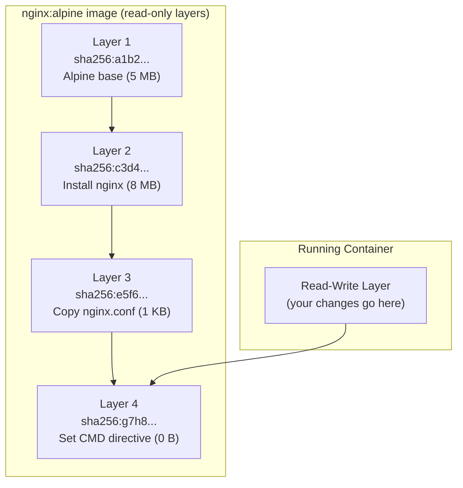

# Why Build Speed Matters

Every second of CI/CD build time multiplies across your team. If 5 developers each push 10 commits per day and your Docker build takes 5 minutes, that's **250 minutes of developer waiting time per day** — plus CI compute costs.

Understanding Docker's layer cache can reduce builds from 5 minutes to 15 seconds.

---

## How Layers Work: The Mental Model

Every instruction in a Dockerfile creates a **layer** — an immutable, content-addressed filesystem snapshot stored by its SHA256 hash.



When you build an image, Docker checks each instruction against its cache:
1. Is this instruction **identical** to the previous build?
2. Is the **content** being copied **identical** (for `COPY` instructions)?
3. If yes to both → **cache hit** (reuse the layer, skip re-execution)
4. If no → **cache miss** (re-execute) AND **invalidate all subsequent layers**

**The golden rule**: A cache miss at layer N forces all layers N+1, N+2, N+3... to also re-execute, even if they haven't changed.

---

## The Classic Mistake: Copy Before Install

```dockerfile
# ❌ WRONG ORDER — destroys cache on every code change
FROM node:20-alpine
WORKDIR /app
COPY . .             # Copies ALL files (src, package.json, README, etc.)
RUN npm install      # Re-runs every time ANY file changes!
CMD ["node", "server.js"]
```

**Problem**: Every time you change a single line in `server.js`, the `COPY . .` layer detects a change. This invalidates the `RUN npm install` layer below it. Docker re-downloads and re-installs all `node_modules` — even though `package.json` hasn't changed.

On a project with 500 npm dependencies, `npm install` can take 3–5 minutes. Doing it on every commit is expensive.

---

## The Fix: Layer Ordering Principle

Order your instructions from **"least likely to change"** → **"most likely to change"**:

```dockerfile
# ✅ CORRECT ORDER — cache-optimized
FROM node:20-alpine
WORKDIR /app

# Step 1: Copy ONLY the package files (rarely change)
COPY package.json package-lock.json ./

# Step 2: Install dependencies (cached unless package.json changes)
RUN npm ci

# Step 3: Copy source code (changes frequently — runs last)
COPY . .

CMD ["node", "server.js"]
```

Now when you change `server.js`:
- Layer 1 (`FROM`): cache hit ✅
- Layer 2 (`WORKDIR`): cache hit ✅
- Layer 3 (`COPY package.json`): cache hit ✅ (package.json didn't change)
- Layer 4 (`RUN npm ci`): cache hit ✅ (skipped entirely!)
- Layer 5 (`COPY . .`): cache miss ❌ (only this layer reruns — takes 0.1s)

**Result**: Build time drops from 5 minutes → 3 seconds.

---

## Language-Specific Cache Optimization Patterns

### Python (pip)

```dockerfile
FROM python:3.12-alpine
WORKDIR /app

# Dependency files first
COPY requirements.txt ./
RUN pip install --no-cache-dir -r requirements.txt

# App code last
COPY . .
CMD ["python", "app.py"]
```

### Go (go modules)

```dockerfile
FROM golang:1.22-alpine AS builder
WORKDIR /app

# Module files first — go mod download is cached independently
COPY go.mod go.sum ./
RUN go mod download

# Source code last
COPY . .
RUN go build -o server ./cmd/server
```

### Java (Maven)

```dockerfile
FROM maven:3.9-eclipse-temurin-21 AS builder
WORKDIR /app

# POM file first — dependency download is cached
COPY pom.xml ./
RUN mvn dependency:go-offline -B    # Download all deps to local cache

# Source code last
COPY src/ ./src/
RUN mvn package -DskipTests
```

---

## Build Cache on CI/CD: The Challenge

The per-build cache that speeds up local development is **lost between CI runs** — each GitHub Actions job starts with a fresh runner.

Without cache, every CI build re-downloads all dependencies. With cache strategies, you restore the cached layers before building.

### Strategy 1: GitHub Actions Cache (BuildKit)

```yaml
# .github/workflows/build.yml
- name: Set up Docker Buildx
  uses: docker/setup-buildx-action@v3

- name: Build and push with cache
  uses: docker/build-push-action@v5
  with:
    context: .
    push: true
    tags: ghcr.io/yourorg/app:${{ github.sha }}
    # Export cache to GitHub Actions cache store
    cache-from: type=gha
    cache-to: type=gha,mode=max
```

**mode=max** caches every intermediate layer, not just the final image. This maximises cache reuse across branches.

### Strategy 2: Registry Cache (cache layers in the container registry)

```yaml
- name: Build with registry cache
  uses: docker/build-push-action@v5
  with:
    context: .
    push: true
    tags: ghcr.io/yourorg/app:latest
    cache-from: type=registry,ref=ghcr.io/yourorg/app:buildcache
    cache-to: type=registry,ref=ghcr.io/yourorg/app:buildcache,mode=max
```

The cache layers are stored as a special manifest in your registry — works across different CI runners and machines.

### Strategy 3: Local Registry Cache (self-hosted runners)

```bash
# Pre-warm the local Docker layer cache with the previous image
docker pull ghcr.io/yourorg/app:latest || true  # Don't fail if first build
docker build \
  --cache-from=ghcr.io/yourorg/app:latest \
  -t ghcr.io/yourorg/app:$GIT_SHA \
  -t ghcr.io/yourorg/app:latest \
  .
docker push ghcr.io/yourorg/app:$GIT_SHA
docker push ghcr.io/yourorg/app:latest
```

---

## Reducing Layer Count and Image Size

### Combine RUN Commands

```dockerfile
# Bad: 4 layers, cache cannot be cleaned within the same layer
RUN apt-get update
RUN apt-get install -y curl wget git
RUN apt-get clean
RUN rm -rf /var/lib/apt/lists/*

# Good: 1 layer, package cache cleaned in the same step
RUN apt-get update \
    && apt-get install -y --no-install-recommends \
       curl \
       wget \
       git \
    && apt-get clean \
    && rm -rf /var/lib/apt/lists/*
```

### Use `--no-cache` Flags for Package Managers

```dockerfile
# Alpine: --no-cache skips writing the index cache to disk
RUN apk add --no-cache curl wget

# npm: --no-cache prevents npm's own layer of caching inside the image
RUN npm ci --no-audit --no-fund

# pip: --no-cache-dir skips pip's download cache
RUN pip install --no-cache-dir -r requirements.txt
```

### Clean Up in the Same RUN Layer

```dockerfile
# Installs build tools, compiles, then removes build tools — all in ONE layer
RUN apk add --no-cache --virtual .build-deps \
      python3 make g++ \
    && npm ci \
    && apk del .build-deps    # Remove build tools from the final layer
```

The `--virtual` flag groups the packages under a virtual name, making bulk removal easy. The total image does NOT contain the build tools because the install and delete happen in the same layer.

---

## Analysing Image Size and Layers

```bash
# Check image size
docker images my-api
# REPOSITORY   TAG     SIZE
# my-api       v1.0    230MB   ← before optimization
# my-api       v2.0    89MB    ← after optimization

# Inspect layers with docker history
docker history my-api:v1.0
# IMAGE          CREATED BY                                      SIZE
# abc123         CMD ["node" "server.js"]                        0B
# def456         COPY . . #buildkit                              45.2MB
# ghi789         RUN npm ci                                      180MB   ← npm bloat
# jkl012         COPY package*.json ./                           12KB
# mno345         WORKDIR /app                                    0B
# pqr678         FROM node:20-alpine                             7.6MB

# Use dive for a visual layer-by-layer inspector
# brew install dive  (or: docker run --rm -it wagoodman/dive my-api:v1.0)
dive my-api:v1.0
```

**dive** shows you exactly what files each layer adds or removes — invaluable for finding what's bloating your image.

---

## BuildKit: Docker's Modern Build Engine

BuildKit is the default build engine since Docker 23. It provides:
- **Parallel stage execution** in multi-stage builds
- **Better cache management**
- **Secret mounts** (pass secrets at build time without leaking into layers)
- **SSH agent forwarding** (for private git repos)

```bash
# Verify BuildKit is active (should be default)
docker buildx version
# github.com/docker/buildx v0.14.0

# Pass secrets at build time without baking them into layers
docker build \
  --secret id=npmtoken,env=NPM_TOKEN \
  -t my-api .

# In Dockerfile, access the secret without it appearing in any layer:
# RUN --mount=type=secret,id=npmtoken \
#     NPM_TOKEN=$(cat /run/secrets/npmtoken) npm install

# SSH agent forwarding for private git repositories
docker build --ssh default -t my-api .
# RUN --mount=type=ssh git clone git@github.com:yourorg/private-repo.git
```

---

## Summary

Layer caching is one of the highest-impact optimizations available:
- **Order instructions** from least-to-most frequently changing — `COPY package.json` before `COPY . .`
- A cache miss at any layer invalidates **all subsequent layers** — even unchanged ones
- **Combine related RUN commands** into a single instruction; clean up (package caches, temp files) in the same `RUN`
- In CI/CD, use `type=gha` or `type=registry` cache backends to persist layer cache between runs
- **`dive`** is the best tool for inspecting what's inside each image layer
- **BuildKit** (`--mount=type=secret`) allows secure secret injection at build time without layer leakage

In the next lesson, you will learn multi-stage builds — separating compile-time environments from runtime environments to produce minimal production images.
