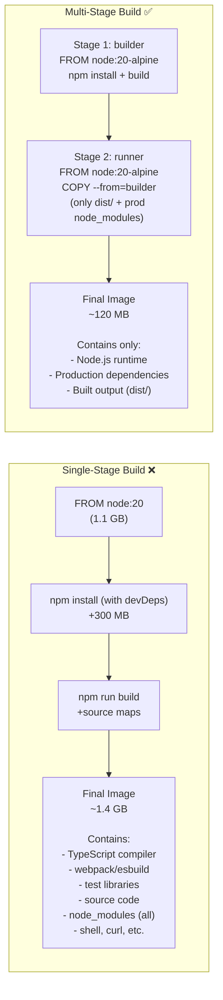

# The Problem: Build Tools Don't Belong in Production

When you compile an application, you need heavy build tools: compilers, SDKs, test frameworks, type checkers, linters, source maps. In a naive Dockerfile, all of these end up in the final image — even though the running application needs none of them.



**The impact**:
- **Smaller image** → faster pulls, faster pod startup in Kubernetes
- **Smaller attack surface** → no compiler, no shell tools, no source code for attackers to exploit
- **Less data in transit** → lower bandwidth costs in CI/CD

---

## The Core Concept: `COPY --from`

Multi-stage builds use multiple `FROM` statements. Each `FROM` starts a fresh stage with its own filesystem. The magic is `COPY --from=<stage>` which lets you pull specific files from a previous stage while discarding everything else.

```dockerfile
# Stage 1: heavy build environment
FROM node:20-alpine AS builder     # ← "AS" gives this stage a name
WORKDIR /app
COPY package*.json ./
RUN npm ci                          # installs ALL deps (dev + prod)
COPY . .
RUN npm run build                   # outputs to /app/dist

# Stage 2: minimal runtime (completely fresh filesystem)
FROM node:20-alpine AS runner       # ← new base, nothing from stage 1 yet
WORKDIR /app
COPY package*.json ./
RUN npm ci --only=production        # only prod deps
COPY --from=builder /app/dist ./dist  # ← only pull the compiled output!

CMD ["node", "dist/server.js"]
# The compiler, devDependencies, source files, and test code
# are NOT in this final image — they stayed in the builder stage
```

---

## Pattern 1: Node.js / Next.js

```dockerfile
# ── Deps: install all dependencies ─────────────────────────────────────
FROM node:20-alpine AS deps
RUN apk add --no-cache libc6-compat
WORKDIR /app
COPY package.json package-lock.json ./
RUN npm ci

# ── Builder: compile the application ───────────────────────────────────
FROM node:20-alpine AS builder
WORKDIR /app
COPY --from=deps /app/node_modules ./node_modules
COPY . .

# Build-time env (doesn't persist to runtime)
ARG NEXT_PUBLIC_API_URL
ENV NEXT_PUBLIC_API_URL=${NEXT_PUBLIC_API_URL}
ENV NEXT_TELEMETRY_DISABLED=1

RUN npx prisma generate && npm run build

# ── Runner: minimal production image ────────────────────────────────────
FROM node:20-alpine AS runner
WORKDIR /app

ENV NODE_ENV=production
ENV NEXT_TELEMETRY_DISABLED=1
ENV PORT=3000

# Non-root user
RUN addgroup -S nodejs && adduser -S nextjs -G nodejs

# Next.js standalone output mode: includes only needed files
COPY --from=builder --chown=nextjs:nodejs /app/.next/standalone ./
COPY --from=builder --chown=nextjs:nodejs /app/.next/static ./.next/static
COPY --from=builder --chown=nextjs:nodejs /app/public ./public

USER nextjs
EXPOSE 3000

HEALTHCHECK --interval=30s --timeout=10s --start-period=30s --retries=3 \
  CMD wget -qO- http://localhost:3000/api/health || exit 1

CMD ["node", "server.js"]
```

Enable Next.js standalone in `next.config.js`:
```js
module.exports = { output: "standalone" }
```

This tells Next.js to bundle only the exact files needed at runtime — dropping unused modules, locale files, etc. Combined with multi-stage builds, final image size goes from ~1.4 GB → ~120 MB.

---

## Pattern 2: Go Binary (Scratch Image)

Go compiles to a single, statically linked binary — the ideal case for multi-stage builds. The final image can be entirely scratch (empty):

```dockerfile
# ── Build stage ─────────────────────────────────────────────────────────
FROM golang:1.22-alpine AS builder

# Install necessary tools
RUN apk add --no-cache git ca-certificates tzdata

WORKDIR /app

# Download dependencies (cached separately for speed)
COPY go.mod go.sum ./
RUN go mod download && go mod verify

# Copy source and build
COPY . .
RUN CGO_ENABLED=0 GOOS=linux GOARCH=amd64 go build \
    -ldflags="-w -s -X main.version=$(git describe --tags --always)" \
    -o /bin/server \
    ./cmd/server

# ── Final stage: scratch (empty image) ─────────────────────────────────
FROM scratch

# Copy only what we need from builder
COPY --from=builder /etc/ssl/certs/ca-certificates.crt /etc/ssl/certs/
COPY --from=builder /usr/share/zoneinfo /usr/share/zoneinfo
COPY --from=builder /bin/server /bin/server

# Use a non-root numeric UID (no users file in scratch)
USER 65532:65532

EXPOSE 8080
ENTRYPOINT ["/bin/server"]
```

**Result**: `FROM scratch` image is literally 0 bytes + only your binary. Typical size: **5–15 MB** vs 800 MB for `golang:1.22`.

---

## Pattern 3: Python (Wheels + Virtualenv)

```dockerfile
# ── Build stage: install with full pip ──────────────────────────────────
FROM python:3.12-slim AS builder

WORKDIR /app

# Install build tools for compiling native extensions
RUN apt-get update \
    && apt-get install -y --no-install-recommends gcc libpq-dev \
    && rm -rf /var/lib/apt/lists/*

# Create a virtualenv (self-contained, easy to copy)
RUN python -m venv /opt/venv
ENV PATH="/opt/venv/bin:$PATH"

COPY requirements.txt ./
RUN pip install --no-cache-dir -r requirements.txt

# ── Final stage: minimal runtime ────────────────────────────────────────
FROM python:3.12-slim AS runner

# Only copy the virtualenv (no pip, no build tools)
COPY --from=builder /opt/venv /opt/venv
ENV PATH="/opt/venv/bin:$PATH"

WORKDIR /app
COPY . .

RUN useradd -m -u 1001 appuser
USER appuser

EXPOSE 8000
CMD ["python", "-m", "uvicorn", "main:app", "--host", "0.0.0.0", "--port", "8000"]
```

---

## Pattern 4: React / Vue / Angular (Static Files + Nginx)

```dockerfile
# ── Build stage ─────────────────────────────────────────────────────────
FROM node:20-alpine AS builder
WORKDIR /app
COPY package*.json ./
RUN npm ci
COPY . .
ARG VITE_API_URL
ENV VITE_API_URL=${VITE_API_URL}
RUN npm run build    # Outputs to /app/dist

# ── Final stage: Nginx serving static files ─────────────────────────────
FROM nginx:alpine AS runner

# Remove default nginx config
RUN rm /etc/nginx/conf.d/default.conf

# Copy custom nginx config
COPY nginx.conf /etc/nginx/conf.d/

# Copy built static files
COPY --from=builder /app/dist /usr/share/nginx/html

EXPOSE 80

# Nginx runs as nobody in official alpine image (already non-root)
HEALTHCHECK --interval=30s --timeout=5s \
  CMD wget -qO- http://localhost/health || exit 1

CMD ["nginx", "-g", "daemon off;"]
```

**Result**: Node.js + 500 MB of `node_modules` never enters the final image. The runtime is `nginx:alpine` (~41 MB) + your static HTML/CSS/JS files.

---

## Targeting Specific Stages

```bash
# Build only the 'builder' stage (useful for debugging build issues)
docker build --target builder -t my-api:builder .

# Build only the 'deps' stage (check dependency installation)
docker build --target deps -t my-api:deps .

# Normal: builds the last/default stage
docker build -t my-api:latest .
```

---

## Size Comparison Table

| Language | Single-Stage | Multi-Stage (Alpine) | Multi-Stage (Distroless/Scratch) |
|---------|-------------|---------------------|--------------------------------|
| **Node.js** | ~1.4 GB | ~120 MB | ~90 MB (distroless) |
| **Go** | ~800 MB | ~15 MB | **5 MB** (scratch) |
| **Python** | ~1.2 GB | ~160 MB | ~100 MB (distroless) |
| **Java (Spring)** | ~700 MB | ~200 MB | ~150 MB (distroless JRE) |
| **React SPA** | — | ~50 MB (nginx:alpine + dist) | — |

---

## Summary

Multi-stage builds are essential for production container images:
- Use multiple `FROM` statements — each starts a clean slate
- The `AS <name>` syntax labels stages for `COPY --from=<name>`
- `COPY --from=builder /app/dist ./dist` pulls only compiled output — leaving behind all build tools
- **Node.js**: separate `deps` → `builder` → `runner` stages; use Next.js `output: "standalone"` for minimal artifacts
- **Go**: compile with CGO_ENABLED=0, deploy with `FROM scratch` — final image is just the binary
- **Python**: build a virtualenv in builder, copy only `/opt/venv` to the runtime image
- **React/Vue**: build with Node.js, serve with `nginx:alpine` — only static files ship

In the next lesson, you will learn how Docker manages persistent data with Volumes and Bind Mounts.
