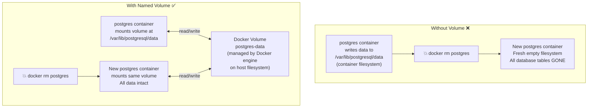

# Why Containers Need Persistent Storage

A container's filesystem is ephemeral — it lives only as long as the container lives. When a container is deleted, every file written to its internal filesystem is gone permanently. For stateless applications (APIs, web servers), this is fine. For anything that stores data (databases, file uploads, logs), it's catastrophic.



Docker provides two mechanisms for persistent storage: **Named Volumes** and **Bind Mounts**.

---

## Type 1: Named Volumes (Production)

Named volumes are managed by the Docker engine. Docker decides where to store the data on the host filesystem (typically `/var/lib/docker/volumes/`). You refer to them by name — the physical path is irrelevant.

### Creating and Using Named Volumes

```bash
# Create a named volume
docker volume create postgres-data

# List all volumes
docker volume ls
# DRIVER    VOLUME NAME
# local     postgres-data

# Inspect a volume (see where Docker stores it on disk)
docker volume inspect postgres-data
# [
#   {
#     "Name": "postgres-data",
#     "Driver": "local",
#     "Mountpoint": "/var/lib/docker/volumes/postgres-data/_data",
#     "CreatedAt": "2026-08-18T10:00:00Z"
#   }
# ]

# Run PostgreSQL with a named volume
docker run -d \
  --name my-postgres \
  --restart unless-stopped \
  -e POSTGRES_USER=appuser \
  -e POSTGRES_PASSWORD=secret \
  -e POSTGRES_DB=myapp \
  -v postgres-data:/var/lib/postgresql/data \
  postgres:16-alpine

# The volume mounts at /var/lib/postgresql/data inside the container
# All database files go there → persist across container restarts and deletion

# Remove the container — volume stays
docker rm -f my-postgres
docker volume ls   # postgres-data still listed!

# New container, same data:
docker run -d --name my-postgres -v postgres-data:/var/lib/postgresql/data postgres:16-alpine
docker exec my-postgres psql -U appuser -d myapp -c "\dt"
# All your tables are still there ✅
```

### Named Volume Best Practices

```bash
# === Backup a named volume ===
docker run --rm \
  -v postgres-data:/source:ro \
  -v $(pwd):/backup \
  busybox \
  tar czf /backup/postgres-data-$(date +%Y%m%d).tar.gz -C /source .

# === Restore a volume from backup ===
docker run --rm \
  -v postgres-data:/target \
  -v $(pwd):/backup:ro \
  busybox \
  tar xzf /backup/postgres-data-20260818.tar.gz -C /target

# === Copy from volume to host ===
docker run --rm \
  -v postgres-data:/data:ro \
  -v $(pwd)/output:/output \
  busybox \
  cp -r /data/. /output/

# === Remove unused volumes (free disk space) ===
docker volume prune         # Removes volumes not mounted by any container
docker volume rm volume-name  # Remove specific volume (must not be in use)
```

---

## Type 2: Bind Mounts (Development)

A bind mount maps a **specific directory on your host machine** into the container. Unlike named volumes, you control exactly where the data lives.

```bash
# Map current directory's /src folder into the container
docker run -d \
  -p 3000:3000 \
  -v $(pwd)/src:/app/src \      # Bind mount: host_path:container_path
  my-node-app

# Any file you edit in ./src on your laptop is instantly visible
# inside the container at /app/src — enabling hot reload!
```

### Single File Bind Mount

```bash
# Mount a single config file (not a whole directory)
docker run -d \
  --name my-nginx \
  -p 8080:80 \
  -v $(pwd)/nginx/nginx.conf:/etc/nginx/nginx.conf:ro \  # :ro = read-only
  nginx:alpine
```

### Development Workflow with Bind Mounts

```bash
# Full dev setup: source code bind-mounted for hot reload
docker run -d \
  --name api-dev \
  -p 3000:3000 \
  -e NODE_ENV=development \
  -v $(pwd):/app \            # Bind entire project
  -v /app/node_modules \      # EXCEPTION: don't bind node_modules from host
  my-node-api:dev \
  npm run dev
```

The `/app/node_modules` trick: by listing `/app/node_modules` as an anonymous volume without a host path, Docker creates an isolated volume for it — preventing your host's `node_modules` from overwriting the container's `node_modules` (which may have been built for a different OS).

---

## Named Volumes vs Bind Mounts: When to Use Each

| | Named Volumes | Bind Mounts |
|--|--------------|-------------|
| **Data location** | Docker manages (opaque) | Explicit host path |
| **Portability** | Works on any Docker host | Path must exist on host |
| **Performance** | Optimal (native filesystem) | Slower on Mac/Windows (overlay) |
| **Use for** | Databases, persistent app data | Development hot-reload, config injection |
| **Environment** | Production | Development only |
| **Backup** | `docker run --rm -v volume:/source busybox tar` | Regular filesystem copy |
| **Permissions** | Managed by Docker | Must match container UID |

<Callout type="warning" title="Never Use Bind Mounts for Databases in Production">
Bind mounts tie your database to a specific path on a specific server. If you move servers, the path changes. If you scale to multiple nodes, each has different data. Always use named volumes for database storage — Docker manages them independently of host paths.
</Callout>

---

## Volume Permissions and Ownership

A common issue: the container process can't write to the mounted volume because the UIDs don't match.

```bash
# Check the UID the container runs as
docker run --rm my-app id
# uid=1001(appuser) gid=1001(appgroup)

# The volume directory on the host might be owned by root:
ls -la /var/lib/docker/volumes/mydata/_data/
# drwxr-xr-x root root ...  ← container's appuser (1001) can't write!

# Fix 1: Set ownership in Dockerfile
RUN mkdir -p /app/data && chown -R appuser:appgroup /app/data
VOLUME /app/data

# Fix 2: Use --user flag at runtime
docker run --user $(id -u):$(id -g) my-app

# Fix 3: Set correct permissions at mount time using an init container
docker run --rm -v mydata:/data busybox chown -R 1001:1001 /data
```

---

## tmpfs Mounts (RAM-Backed, Non-Persistent)

Sometimes you need temporary scratch space that doesn't touch disk at all — for performance or for secrets that must not persist to disk:

```bash
# Mount RAM as a temporary filesystem (not persisted, lost on container stop)
docker run -d \
  --tmpfs /tmp:rw,size=100m,uid=1001 \   # 100MB RAM-backed /tmp
  --tmpfs /run:rw,noexec,size=10m \      # Small /run dir
  my-api

# Use case 1: readOnlyRootFilesystem security hardening
docker run -d \
  --read-only \                    # Root filesystem is read-only
  --tmpfs /tmp \                   # But /tmp is writable (RAM)
  --tmpfs /run \                   # And /run is writable (RAM)
  my-api

# Use case 2: High-speed scratch space for data processing
docker run -d \
  --tmpfs /data/scratch:rw,size=2g \  # 2 GB RAM disk for processing
  my-data-pipeline
```

---

## Volume Drivers for Advanced Storage

```bash
# Default driver: local (host filesystem)
docker volume create --driver local mydata

# NFS driver (shared volume across multiple servers)
docker volume create \
  --driver local \
  --opt type=nfs \
  --opt o=addr=192.168.1.100,rw,nfsvers=4 \
  --opt device=:/exports/mydata \
  shared-uploads

# AWS EFS (Elastic File System) — for ECS/EC2 clusters
# Install the efs driver: docker plugin install amazon/amazon-ecs-volume-plugin
docker volume create \
  --driver amazon/amazon-ecs-volume-plugin \
  --opt type=efs \
  --opt efsId=fs-12345678 \
  efs-data
```

---

## docker volume Commands: Full Reference

```bash
# Create
docker volume create my-volume

# List
docker volume ls
docker volume ls -q              # IDs only

# Inspect
docker volume inspect my-volume

# Remove
docker volume rm my-volume       # Fails if volume is in use
docker volume rm -f my-volume    # Force remove

# Prune (removes all volumes not used by any container)
docker volume prune
docker volume prune --filter "label!=keep"  # Keep labeled volumes

# Export volume contents (backup)
docker run --rm -v my-volume:/source -v $(pwd):/dest \
  busybox tar czf /dest/backup.tar.gz -C /source .

# Import volume contents (restore)
docker run --rm -v my-volume:/dest -v $(pwd):/source \
  busybox tar xzf /source/backup.tar.gz -C /dest
```

---

## Summary

Docker storage comes in three forms:
- **Named volumes** — Docker-managed persistent storage, identified by name. Use for all production data (databases, uploads, logs). Survive container deletion; easy to backup and restore.
- **Bind mounts** — explicit host path mapped into container. Use only in development for hot-reload workflows. Not portable; avoid for databases.
- **tmpfs mounts** — RAM-backed, non-persistent scratch space. Use for secrets, temp files, or performance-sensitive scratch data that must not touch disk.

The key rule: **anything that must survive a container restart or deletion must be in a named volume or bind mount**. Container filesystems are ephemeral by design.

In the next lesson, you will learn how Docker networking works — enabling containers to communicate securely without exposing themselves to the public internet.
