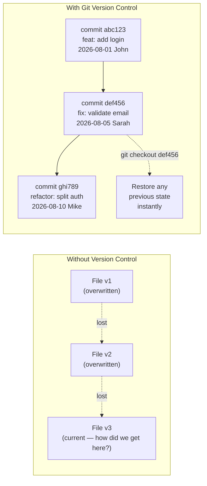
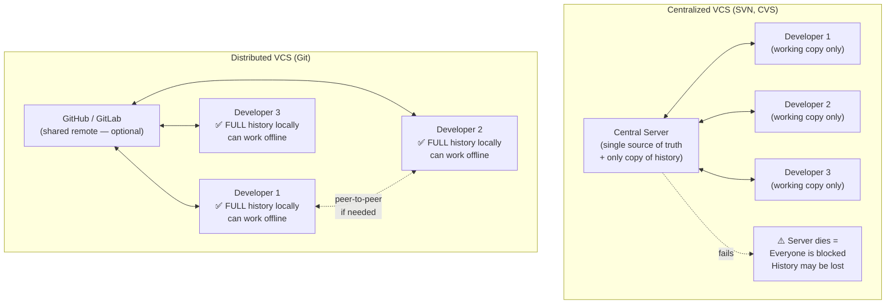

# Every Codebase Needs a Time Machine

Without version control, software development is a series of irreversible decisions. You change a file, something breaks, and you can't get back to what was working. You need to share code with a colleague, so you email a zip file — and immediately you both start diverging. Two weeks later, neither of you knows which version is "correct."

Version control systems solve this by giving every project an unlimited undo history, a complete audit trail, and a structured way for multiple people to work on the same codebase simultaneously.

---

## The Pre-Git Nightmare

Before version control became standard, teams used variations of this workflow:

```
📁 MyProject/
├── app_v1.zip                                   ← first version
├── app_v2_mike_edits.zip                        ← mike's version
├── app_v2_sarah_edits.zip                       ← sarah's version  
├── app_v2_final_mike_sarah_merged.zip           ← someone manually merged
├── app_FINAL.zip                                ← "final" version
├── app_FINAL_2.zip                              ← actually final
└── app_FINAL_real_FINAL_do_not_delete.zip       ← production? nobody knows
```

**Real problems this caused**:
- **Lost work**: Sarah overwrote Mike's changes because she started from an old zip
- **No audit trail**: who changed the payment calculation on March 3rd? Nobody knows
- **No rollback**: the bug was introduced somewhere between v1 and FINAL — but you can't diff zip files
- **Fear of change**: nobody wanted to refactor anything because "what if it breaks and we can't get back?"

---

## What Version Control Actually Gives You



**Every commit gives you**:
1. **A permanent snapshot** of every file at that moment
2. **Attribution**: who made the change (name + email)
3. **Context**: why the change was made (commit message)
4. **Timestamp**: when it happened
5. **Reversibility**: `git revert` or `git checkout` to go back to any point

---

## Centralized vs Distributed Version Control

Git is a **Distributed** VCS — fundamentally different from older centralized systems like SVN:



| Aspect | Centralized (SVN) | Distributed (Git) |
|--------|-----------------|-------------------|
| **Offline commits** | ❌ Requires server connection | ✅ Full local history |
| **Speed** | Slow (every command = network round-trip) | ⚡ Fast (local disk operations) |
| **Single point of failure** | ⚠️ Server down = team blocked | 🛡️ Every clone is a full backup |
| **Branching** | Slow, expensive (copies files) | Near-instant (just a pointer) |
| **History** | Only on server | On every developer's machine |

---

## Git vs GitHub: The Most Common Confusion

```
Git  ≠  GitHub

Git:    A free, open-source command-line tool installed on YOUR computer
        that tracks file history using commits, branches, and diffs.
        Created by Linus Torvalds in 2005 to manage the Linux kernel.
        You use it with: git init, git commit, git branch

GitHub: A cloud platform BUILT ON TOP of Git.
        It adds: a web UI, pull requests, code review, GitHub Actions CI/CD,
        issue tracking, wikis, and team access control.
        Alternatives: GitLab, Bitbucket, Azure DevOps, Gitea
```

You can use Git without GitHub (local-only repos). You cannot use GitHub without Git.

---

## The Three Guarantees Git Provides

**1. Integrity — Every commit has a SHA-256 fingerprint**

```bash
git log --oneline
# abc1234 feat: add payment processing
# def5678 fix: handle expired sessions
# ghi9012 docs: update API reference

# Each "abc1234" is the first 7 chars of a SHA-256 hash
# The hash covers the content, the parent commit, the author, and the timestamp
# Change ANY bit of that data → completely different hash
# → Git detects any tampering or corruption automatically
```

**2. Completeness — Every clone has the full history**

```bash
git clone https://github.com/torvalds/linux.git
# Every one of the 1,200,000+ Linux kernel commits is now on your machine
# You can browse any version of Linux from 2005 to today — offline
```

**3. Reversibility — Any state can be restored**

```bash
# Undo the last commit but keep the changes
git reset HEAD~1

# Completely revert to a specific commit (creates a new "undo" commit)
git revert abc1234

# Restore a specific file from 3 commits ago
git checkout HEAD~3 -- src/payments/processor.ts

# Reset your entire working tree to a specific commit
git checkout abc1234
```

---

## Why This Matters for DevOps

Version control is the foundation of every DevOps practice:

- **CI/CD pipelines trigger on git push** — the pipeline runs because something was committed
- **Infrastructure as Code** (Terraform, Kubernetes manifests) is stored in Git — your infrastructure has a history, PR reviews, and rollback capability
- **GitOps** uses Git as the source of truth for the entire system state — the cluster reconciles itself to what's in the repo
- **Incident response**: "What changed in the last hour?" — `git log --since 1h` gives you the answer immediately
- **Code review** (Pull Requests) is the primary quality gate before code enters the main branch

```bash
# DevOps daily reality: answer production questions with git
git log --since="2 hours ago" --oneline --author="john"
# Shows exactly what John pushed in the last 2 hours — did it break production?

git diff HEAD~5 HEAD -- config/nginx.conf
# What changed in the nginx config in the last 5 commits?
```

---

## Summary

- Version control gives software development **permanent snapshots** (commits), **full attribution** (who changed what), **context** (why), and **reversibility** (go back to any state)
- **Git is distributed**: every developer has a complete local copy of the entire history — fast, offline-capable, resilient
- **Git ≠ GitHub**: Git is the local tool; GitHub is the cloud platform built on top of it
- Every commit has a **SHA-256 fingerprint** — tamper-proof integrity built in
- Version control is the foundation of CI/CD, GitOps, Infrastructure as Code, and every other DevOps practice

In the next lesson, you will install Git on your machine and configure your identity — the first step before tracking any code.
