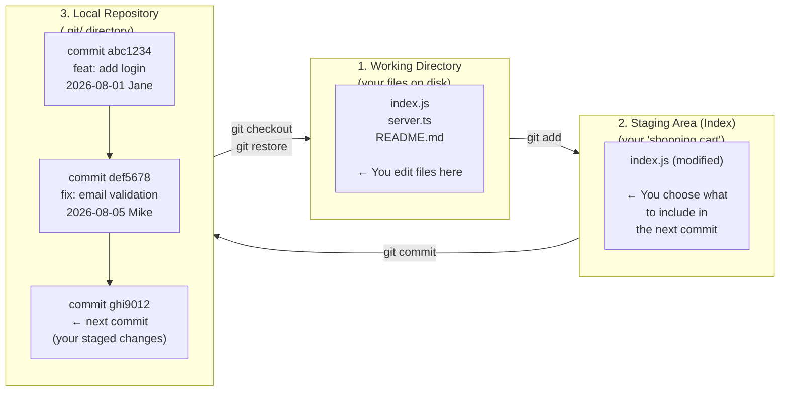

# The Three Areas of Git: The Core Mental Model

Everything in Git revolves around three areas. Until this mental model clicks, Git feels like magic. Once it clicks, every command makes complete sense.



- **Working Directory**: the actual files you see and edit in your IDE. Changes here are "dirty" (unstaged).
- **Staging Area** (also called the Index): a preparation zone. You selectively add changes here before committing. This lets you commit only some of your edits while leaving others out.
- **Local Repository**: the permanent history of commits stored in `.git/`. Once committed, a snapshot is immutable.

---

## Step 1: Initialize a Repository

```bash
mkdir my-devops-project && cd my-devops-project

git init
# Initialized empty Git repository in /Users/jane/my-devops-project/.git/

ls -la
# drwxr-xr-x  .git/   ← all of git's data is stored here
# (everything else is empty — your working directory)
```

**What `.git/` contains**:
```
.git/
├── HEAD          ← which branch you're on
├── config        ← local repository config
├── objects/      ← all commit data (stored by SHA hash)
├── refs/
│   ├── heads/    ← branch pointers (main, feature/login, etc.)
│   └── tags/     ← release tags
└── index         ← the staging area (binary format)
```

<Callout type="warning" title="Never Delete or Edit .git Manually">
`.git/` IS the repository. Deleting it turns your folder back into a plain, unversioned directory. Never manually edit files inside `.git/` unless you know exactly what you're doing.
</Callout>

---

## Step 2: Check Status Constantly

`git status` is your most important command — run it constantly:

```bash
# Create some files
echo '{"name":"my-app","version":"1.0.0"}' > package.json
echo "console.log('hello devops');" > index.js
mkdir src && echo "export const greet = (name) => \`Hello \${name}\`" > src/greet.ts

git status
```

```text
On branch main

No commits yet

Untracked files:
  (use "git add <file>..." to include in what will be committed)
        index.js
        package.json
        src/

nothing added to commit but untracked files present
```

**Status symbols**:
```
?? filename.txt     → Untracked (Git doesn't know about this file)
A  filename.txt     → Added to staging (new file)
M  filename.txt     → Modified (tracked file with changes)
D  filename.txt     → Deleted
MM filename.txt     → Modified in both staging AND working directory
```

```bash
# Compact status view (more useful once you have many files)
git status -sb
# ?? index.js
# ?? package.json
# ?? src/
```

---

## Step 3: Stage Changes

`git add` moves changes from Working Directory → Staging Area:

```bash
# Add a single file
git add package.json

# Add multiple specific files
git add index.js src/greet.ts

# Add everything (use carefully — set up .gitignore first!)
git add .

# Add all .ts files recursively
git add "*.ts"

# Interactively choose which chunks of a file to stage (powerful!)
git add -p index.js
# Shows each changed chunk and asks: Stage this hunk? [y,n,q,a,d,?]
```

```bash
# After staging package.json
git status
# Changes to be committed:
#   (use "git restore --staged <file>..." to unstage)
#         new file:   package.json
#
# Untracked files:
#         index.js
#         src/
```

### Unstaging (Undo git add)

```bash
# Unstage a specific file (keeps your edits in working directory)
git restore --staged package.json

# Unstage everything
git restore --staged .
```

---

## Step 4: Commit a Snapshot

```bash
# Stage everything and commit
git add .
git commit -m "feat: initial project setup"
```

```text
[main (root-commit) 4a8b1c2] feat: initial project setup
 3 files changed, 3 insertions(+)
 create mode 100644 index.js
 create mode 100644 package.json
 create mode 100644 src/greet.ts
```

### Commit Message Best Practices

```bash
# ❌ Useless messages — tell future-you nothing
git commit -m "update"
git commit -m "fix"
git commit -m "stuff"
git commit -m "wip"

# ✅ Conventional Commits format (industry standard)
# type(scope): short summary in present tense (< 72 chars)
git commit -m "feat(auth): add JWT token refresh endpoint"
git commit -m "fix(payments): handle null response from Stripe API"
git commit -m "ci: add Trivy container scanning to pipeline"
git commit -m "docs: update deployment guide for k8s"
git commit -m "refactor(db): extract connection pool to singleton"
```

### Multi-line Commit Messages

```bash
# For significant changes, write a full description
git commit
# Opens your configured editor — write a full message:
```

```text
feat(api): add rate limiting middleware

Adds per-IP rate limiting to the API to prevent abuse:
- 100 requests/minute for unauthenticated users
- 1000 requests/minute for authenticated users

Uses the token bucket algorithm (redis-backed) for accuracy.
Resolves: #234
```

---

## Step 5: Inspect History

```bash
# Full verbose log
git log

# Compact one-liner (most useful for daily work)
git log --oneline
# 9f7e3a1 fix: handle empty cart state
# 4c2b8d5 feat: add product search with filters
# 1a9f4c2 feat: initial project setup

# Visual branch/merge graph (the alias we set up in lesson 2)
git log --oneline --graph --decorate --all
# * 9f7e3a1 (HEAD -> main, origin/main) fix: handle empty cart state
# * 4c2b8d5 feat: add product search with filters
# * 1a9f4c2 feat: initial project setup

# Show the last N commits
git log -5 --oneline

# Show commits from a specific author
git log --author="Jane" --oneline

# Show commits from last 2 weeks
git log --since="2 weeks ago" --oneline

# Show commits touching a specific file
git log --oneline -- src/payments/processor.ts

# Show the full diff of a specific commit
git show 4c2b8d5
```

---

## Step 6: Diff — See Exactly What Changed

```bash
# Changes in working directory (not yet staged)
git diff

# Changes that ARE staged (ready to commit)
git diff --staged

# Diff between two commits
git diff HEAD~3 HEAD

# Diff between two branches
git diff main feature/checkout

# Diff a specific file
git diff src/greet.ts

# Statistics (how many lines added/removed per file)
git diff --stat HEAD~5
# src/auth/login.ts  | 45 ++++++++++---
# src/auth/logout.ts | 12 ----
# 2 files changed, 45 insertions(+), 16 deletions(-)
```

---

## Undoing Changes

Git gives you several levels of undo:

```bash
# === Working Directory (before git add) ===

# Discard ALL unstaged changes (irreversible — use carefully!)
git restore .

# Discard changes to a specific file
git restore src/greet.ts

# === Staging Area (after git add, before git commit) ===

# Unstage (move back to working directory — keeps your changes)
git restore --staged src/greet.ts

# === Repository (after git commit) ===

# Undo last commit but keep changes staged
git reset HEAD~1 --soft

# Undo last commit, unstage changes but keep edits in working dir
git reset HEAD~1 --mixed    # ← default

# Undo last commit AND discard the changes (destructive!)
git reset HEAD~1 --hard

# Create a new "undo" commit (safe for shared branches)
git revert abc1234          # Creates a commit that reverses abc1234's changes

# Restore a specific file to how it was at a specific commit
git checkout abc1234 -- src/greet.ts
```

<Callout type="warning" title="Never git reset --hard on Pushed Commits">
`git reset --hard` rewrites history. If you've already pushed the commit to GitHub and others have pulled it, resetting will cause problems for everyone. Use `git revert` instead — it creates a new "undo" commit without rewriting history.
</Callout>

---

## The `.gitignore` File

Create this before your first commit — it prevents accidentally committing secrets, dependencies, and build artifacts:

```bash
# Create .gitignore (must be at the repository root)
cat > .gitignore << 'EOF'
# Dependencies
node_modules/
vendor/

# Build outputs
dist/
build/
.next/
*.pyc
__pycache__/

# Secrets and environment (CRITICAL!)
.env
.env.local
.env.production
*.pem
*.key
id_rsa
id_ed25519

# IDE / OS files
.DS_Store
.vscode/
.idea/
Thumbs.db
EOF

git add .gitignore
git commit -m "chore: add comprehensive .gitignore"
```

**What happens if you accidentally committed a secret?**

```bash
# Immediately remove it from history (run before anyone pulls!)
git filter-repo --path .env --invert-paths   # Rewrite all history

# Then force push (required after history rewrite)
git push origin --force --all

# AND rotate the compromised secret immediately
# (GitHub may have already scanned and found it)
```

---

## Summary: Core Workflow Cheat Sheet

```bash
# Start a project
git init && git add . && git commit -m "feat: initial commit"

# Daily workflow
git status                  # Check current state
git diff                    # See what changed (unstaged)
git add specific-file.ts    # Stage specific changes
git diff --staged           # Review what will be committed
git commit -m "feat: ..."   # Commit with a clear message
git log --oneline           # Verify the commit was recorded

# Fix mistakes
git restore file.ts         # Discard unstaged changes
git restore --staged file.ts # Unstage a file
git reset HEAD~1 --mixed    # Undo last commit (keep changes)
git revert <SHA>            # Safely undo a pushed commit
```

In the next lesson, you will learn branching — creating parallel timelines so you can work on features without affecting the main codebase.
