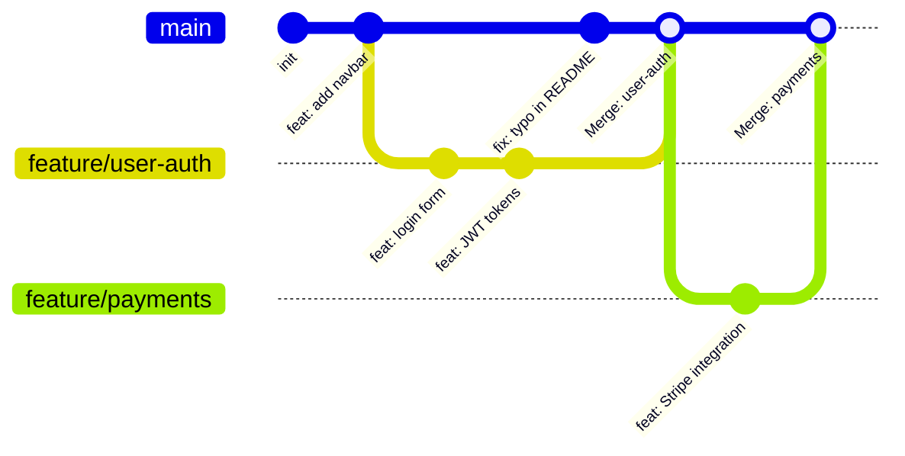

# Branches: Parallel Timelines

A Git branch is a lightweight, movable pointer to a commit. Creating a branch doesn't copy any files — it just creates a new pointer. This is why branching in Git is nearly instant, unlike older VCS systems where branching literally copied files.



Each branch is an independent line of development. `main` keeps shipping features while `feature/user-auth` is being built — they don't interfere with each other.

---

## Creating and Switching Branches

```bash
# === Modern commands (Git 2.23+) ===

# Create and switch to a new branch (most common operation)
git switch -c feature/payment-gateway

# Switch to an existing branch
git switch main
git switch feature/payment-gateway

# === Legacy commands (still work everywhere) ===
git checkout -b feature/payment-gateway   # same as switch -c
git checkout main                          # same as switch

# === See all branches ===
git branch                  # Local branches
git branch -r               # Remote branches
git branch -a               # All (local + remote)
git branch -v               # Branches with last commit info

# Output:
#   feature/payment-gateway  4c2b8d5 feat: add Stripe webhook handler
# * main                     9f7e3a1 fix: handle empty cart state
# ← The asterisk (*) shows your current branch

# Delete a branch (only after merging)
git branch -d feature/payment-gateway      # Safe delete (fails if unmerged)
git branch -D feature/payment-gateway      # Force delete (even if unmerged)
```

---

## HEAD: Where You Are Right Now

`HEAD` is a special pointer that always points to your current position — usually the tip of your current branch:

```bash
git log --oneline
# 9f7e3a1 (HEAD -> main) fix: handle empty cart state   ← you are here
# 4c2b8d5 feat: add product search
# 1a9f4c2 feat: initial setup

# When you switch branch, HEAD moves
git switch feature/login
git log --oneline
# abc1234 (HEAD -> feature/login) feat: add login form   ← HEAD moved
# 4c2b8d5 feat: add product search
# 1a9f4c2 feat: initial setup

cat .git/HEAD
# ref: refs/heads/feature/login   ← HEAD stores the branch reference
```

---

## Merging: Combining Branch Work

### Fast-Forward Merge

If `main` hasn't changed since you branched off, Git can simply move the `main` pointer forward — no merge commit needed:

```bash
git switch main
git merge feature/login

# Output:
# Updating 4c2b8d5..abc1234
# Fast-forward
#  src/auth/login.ts | 45 ++++++++++++++++
#  1 file changed, 45 insertions(+)
```

```
Before:              After fast-forward:
main → A → B         main/feature/login → A → B → C → D
          ↓
          feature/login → C → D
```

### True Merge (Creates a Merge Commit)

When both branches have new commits, Git creates a "merge commit" that has two parents:

```bash
git switch main
git merge feature/payments

# If no conflicts:
# Merge made by the 'ort' strategy.
# Merge commit is automatically created
```

```
Before:              After true merge:
main → A → B → E     main → A → B → E → M (merge commit)
          ↓                   ↓         ↗
          feature → C → D     C → D ──╯
```

### Forcing a Merge Commit (No Fast-Forward)

```bash
# Even if fast-forward is possible, create a merge commit to preserve branch history
git merge --no-ff feature/login
# This is useful in Git Flow where you want to see which branches were merged
```

---

## Merge Conflicts: What They Are and How to Resolve Them

A conflict happens when two branches modified the **same lines** of the same file. Git can't decide which version to keep — it asks you:

```bash
git merge feature/new-header

# Auto-merging src/components/Header.tsx
# CONFLICT (content): Merge conflict in src/components/Header.tsx
# Automatic merge failed; fix conflicts and then commit the result.
```

**The conflict markers in the file**:

```
<<<<<<< HEAD                          ← everything from HERE to the divider is YOUR current branch (main)
const Header = () => (
  <nav className="bg-blue-600">
||||||| base                          ← (only with zdiff3) the common ancestor
const Header = () => (
  <nav className="bg-gray-800">
=======                               ← everything from the divider to HERE is the INCOMING branch
const Header = () => (
  <nav className="bg-indigo-900">
>>>>>>> feature/new-header            ← which branch the changes came from
```

**Resolving a conflict**:

```bash
# Option 1: Edit the file manually (remove conflict markers, keep what you want)
# Edit src/components/Header.tsx to the final desired state

# Option 2: Use VS Code's built-in merge editor (click "Resolve in Merge Editor")

# Option 3: Use git's merge tool
git mergetool   # Opens your configured diff tool

# After resolving ALL conflicts in the file:
git add src/components/Header.tsx

# Continue the merge
git commit -m "merge: integrate new-header with main"

# Or, abort and start over
git merge --abort
```

---

## Rebasing: A Cleaner Alternative to Merging

Rebase rewrites your branch's commits to appear as if they were made *after* the latest commits on main — creating a linear history:

```bash
# You're on feature/login, main has moved ahead
git switch feature/login
git rebase main

# Git:
# 1. Finds the common ancestor (where feature/login branched from)
# 2. Saves your feature commits as patches
# 3. Resets feature/login to the tip of main
# 4. Re-applies your patches one by one on top of main
```

```
Before rebase:               After rebase:
main:    A → B → C           main:    A → B → C
feature: A → D → E           feature: A → B → C → D' → E'
                                                  ↑ rebased (new SHAs)
```

**Merge vs Rebase**:

| | Merge | Rebase |
|--|-------|--------|
| **History** | Non-linear (explicit merge commits) | Linear (cleaner git log) |
| **Safety** | Safe for shared branches | ❌ Never rebase public branches |
| **Traceability** | Clear when branches diverged | Harder to see original branch history |
| **Use for** | Long-lived feature branches, release merges | Personal feature branches before PR |

<Callout type="warning" title="The Golden Rule of Rebasing">
**Never rebase commits that have been pushed to a shared branch.** Rebase rewrites commit SHAs. If others have based work on those commits, their history will diverge — causing painful conflicts for everyone. Only rebase commits that exist only on your local machine.
</Callout>

---

## Interactive Rebase: Rewriting Local History

Before opening a PR, clean up your messy local commits into logical, professional-looking snapshots:

```bash
# Interactively rebase the last 5 commits
git rebase -i HEAD~5

# Opens your editor with:
# pick abc1234 feat: add login form (rough draft)
# pick def5678 fix typo
# pick ghi9012 wip
# pick jkl0123 wip 2
# pick mno4567 cleanup and finalize login

# Change "pick" to:
# r (reword) = keep commit but change message
# s (squash) = combine this commit with previous one
# f (fixup)  = like squash but discard this commit's message
# d (drop)   = delete this commit entirely

# Result after squash + reword:
# pick abc1234 feat(auth): add complete login form with JWT handling
# f def5678 fix typo         ← combined into abc1234
# f ghi9012 wip              ← combined into abc1234
# f jkl0123 wip 2            ← combined into abc1234
# f mno4567 cleanup          ← combined into abc1234
```

This turns 5 messy commits into 1 clean, professional commit — perfect for code review.

---

## Cherry-Pick: Copy Specific Commits

```bash
# Apply a specific commit from another branch to current branch
git cherry-pick abc1234

# Example use case: a critical bug fix was committed to a feature branch
# but we need it on main immediately
git switch main
git cherry-pick abc1234   # Apply just that one fix commit to main

# Cherry-pick a range
git cherry-pick abc1234..ghi5678   # All commits from abc to ghi
```

---

## Stash: Save Work Without Committing

```bash
# Stash (save) current dirty working directory state
git stash

# Stash with a description
git stash push -m "half-done payment form"

# List all stashes
git stash list
# stash@{0}: On feature/payments: half-done payment form
# stash@{1}: WIP on main: 9f7e3a1 fix: empty cart

# Apply (restore) most recent stash (keeps it in stash list)
git stash apply

# Apply and remove from stash list
git stash pop

# Apply a specific stash
git stash apply stash@{1}

# Delete a stash
git stash drop stash@{0}

# Delete all stashes
git stash clear
```

---

## Summary

| Operation | Command |
|-----------|---------|
| Create + switch branch | `git switch -c feature/name` |
| Switch branch | `git switch main` |
| List branches | `git branch -a` |
| Fast-forward merge | `git merge feature/name` (when main hasn't moved) |
| True merge | `git merge feature/name` (when both have new commits) |
| Abort merge | `git merge --abort` |
| Rebase on main | `git rebase main` |
| Interactive rebase | `git rebase -i HEAD~5` |
| Cherry-pick a commit | `git cherry-pick abc1234` |
| Stash dirty work | `git stash` → fix bug → `git stash pop` |

In the next lesson, you will connect your local repository to GitHub, learning push, pull, and fetch.
