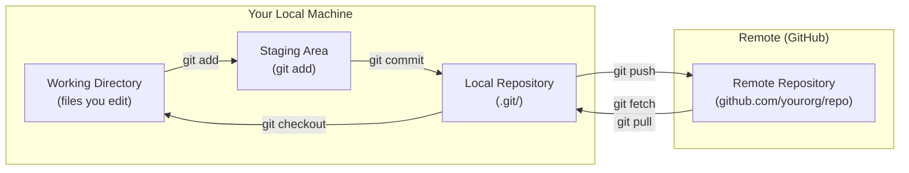

# Local vs Remote Repositories

Until now, your Git repository has existed only on your machine — a local repository. A **remote** is a copy of that repository hosted on a server (GitHub, GitLab, etc.) that your team can share.



---

## Setting Up a Remote

### Option A: Start from GitHub (most common)

```bash
# 1. Create a new repo on GitHub (click + → New repository)
# 2. Clone it to your machine (empty to start)
git clone git@github.com:yourorg/my-repo.git
cd my-repo

# Git automatically sets up "origin" pointing to GitHub
git remote -v
# origin  git@github.com:yourorg/my-repo.git (fetch)
# origin  git@github.com:yourorg/my-repo.git (push)
```

### Option B: Connect Existing Local Repo to GitHub

```bash
# You have a local repo, now want to push to GitHub
# 1. Create empty repo on GitHub (no README, no .gitignore)
# 2. Add the remote connection
git remote add origin git@github.com:yourorg/my-repo.git

# Verify
git remote -v

# Push for the first time
git push -u origin main
# -u = --set-upstream (links local main to remote origin/main)
# After this, you can just type "git push" instead of "git push origin main"
```

---

## Managing Remotes

```bash
# List remotes
git remote -v
# origin   git@github.com:yourorg/my-repo.git (fetch)
# origin   git@github.com:yourorg/my-repo.git (push)

# Add a second remote (e.g., a fork or different server)
git remote add upstream git@github.com:originalorg/their-repo.git

# Rename a remote
git remote rename origin github

# Change a remote's URL (e.g., after repo rename or switching HTTPS → SSH)
git remote set-url origin git@github.com:yourorg/new-repo-name.git

# Remove a remote
git remote remove upstream

# Inspect a remote (shows remote branches)
git remote show origin
```

---

## `git push`: Send Local Commits to Remote

```bash
# Push current branch to origin (after -u is set)
git push

# Explicit push (works without -u)
git push origin main
git push origin feature/login

# Push a new branch and set tracking (-u = --set-upstream)
git push -u origin feature/new-ui

# Push ALL local branches
git push --all origin

# Push tags (not included in regular push)
git push origin v1.5.2           # Push specific tag
git push origin --tags           # Push all tags

# Force push (rewrites remote history — use with extreme caution)
git push --force                    # ❌ Dangerous
git push --force-with-lease         # ✅ Safer: fails if remote has new commits you haven't pulled
```

<Callout type="warning" title="Always Use --force-with-lease Instead of --force">
`git push --force` will overwrite the remote with your local history, even if someone else pushed while you were working. `--force-with-lease` checks first: if the remote has changed, it refuses, protecting your teammates' work. Set up the alias from lesson 2: `git config --global alias.pushf "push --force-with-lease"`.
</Callout>

---

## `git fetch`: Download Without Merging

`git fetch` downloads new commits from the remote but does **not** change your local branches. You can inspect what changed before integrating:

```bash
# Download all new remote changes
git fetch origin

# Fetch a specific branch
git fetch origin main

# See what was fetched (new commits on remote)
git log HEAD..origin/main --oneline
# def5678 fix: correct order total calculation  ← this is on remote but not local yet
# abc1234 feat: add bulk discount support

# Compare your local branch to the remote
git diff main origin/main

# After inspection, merge the remote changes
git merge origin/main    # Or: git rebase origin/main
```

`git fetch` is always safe — it never modifies your working directory or local branches.

---

## `git pull`: Fetch + Merge in One Step

`git pull` combines fetch + merge (or fetch + rebase if configured):

```bash
# Fetch and merge (creates a merge commit if histories diverged)
git pull

# Fetch and rebase (keeps history linear — recommended with pull.rebase=true)
git pull --rebase
git pull --rebase origin main

# Pull a specific branch
git pull origin feature/updates

# If you set pull.rebase = true in config (lesson 2), --rebase is automatic
```

**`git pull --rebase` vs `git pull`**:

```
git pull (merge):
main: A → B → C → M (merge commit)  ← history shows the merge explicitly
                 ↗
remote: D → E ─╯

git pull --rebase:
main: A → B → D → E → C   ← your local commit (C) is replayed after remote commits
                           Clean, linear history
```

---

## Tracking Branches

When you `git push -u origin main`, Git creates a **tracking relationship**: your local `main` tracks `origin/main`. This enables:

```bash
# See tracking relationships
git branch -vv
# * main         9f7e3a1 [origin/main] fix: handle empty cart
#   feature/auth abc1234 [origin/feature/auth: ahead 2] feat: add login

# What "ahead 2" means: you have 2 local commits not yet pushed
# What "behind 3" means: remote has 3 commits you haven't pulled

# See ahead/behind status
git status
# On branch main
# Your branch is ahead of 'origin/main' by 2 commits.
#   (use "git push" to publish your local commits)
```

---

## Working With Forks

In open-source contribution, you fork the original repo, make changes in your fork, and submit a PR. You need to keep your fork updated:

```bash
# Clone YOUR fork
git clone git@github.com:yourname/original-project.git

# Add the ORIGINAL project as "upstream"
git remote add upstream git@github.com:originalorg/original-project.git

git remote -v
# origin    git@github.com:yourname/original-project.git
# upstream  git@github.com:originalorg/original-project.git

# Keep your fork up to date with upstream
git fetch upstream
git switch main
git rebase upstream/main    # Apply upstream changes under your work
git push origin main        # Update your fork on GitHub

# Work on a feature
git switch -c fix/typo-in-readme
# ... make changes ...
git push origin fix/typo-in-readme
# Open a PR from yourname/fix/typo-in-readme → originalorg/main on GitHub
```

---

## Common Remote Scenarios

### Scenario 1: Teammate Pushed, Your Push Is Rejected

```bash
git push origin main
# ! [rejected] main -> main (non-fast-forward)
# hint: Updates were rejected because the remote contains work you do not have locally.

# Solution: pull first, then push
git pull --rebase origin main
git push origin main
```

### Scenario 2: Pull With Conflicts

```bash
git pull --rebase origin main
# CONFLICT (content): Merge conflict in src/api.ts
# error: could not apply abc1234... feat: add rate limiting
# hint: Resolve all conflicts manually, mark them as resolved with git add

# Fix conflicts in src/api.ts, then:
git add src/api.ts
git rebase --continue

# Or abort the rebase
git rebase --abort
```

### Scenario 3: Delete a Remote Branch

```bash
# After merging a PR, delete the remote feature branch
git push origin --delete feature/user-auth

# Also delete the local tracking branch
git branch -d feature/user-auth
```

### Scenario 4: Pull a Remote Branch You Don't Have Locally

```bash
# Remote has feature/payments but you don't have it locally
git fetch origin
git switch feature/payments
# Git automatically creates a local tracking branch based on origin/feature/payments
```

---

## Summary

| Operation | Command |
|-----------|---------|
| Clone a repo | `git clone git@github.com:org/repo.git` |
| Add remote | `git remote add origin <url>` |
| List remotes | `git remote -v` |
| Push + set tracking | `git push -u origin main` |
| Push subsequent times | `git push` |
| Safe force push | `git push --force-with-lease` |
| Download without merging | `git fetch origin` |
| Download + merge | `git pull --rebase` |
| Delete remote branch | `git push origin --delete branch-name` |
| Check ahead/behind status | `git branch -vv` |

In the next lesson, you will learn the full Pull Request workflow — the code review process that gates every change going into `main`.
