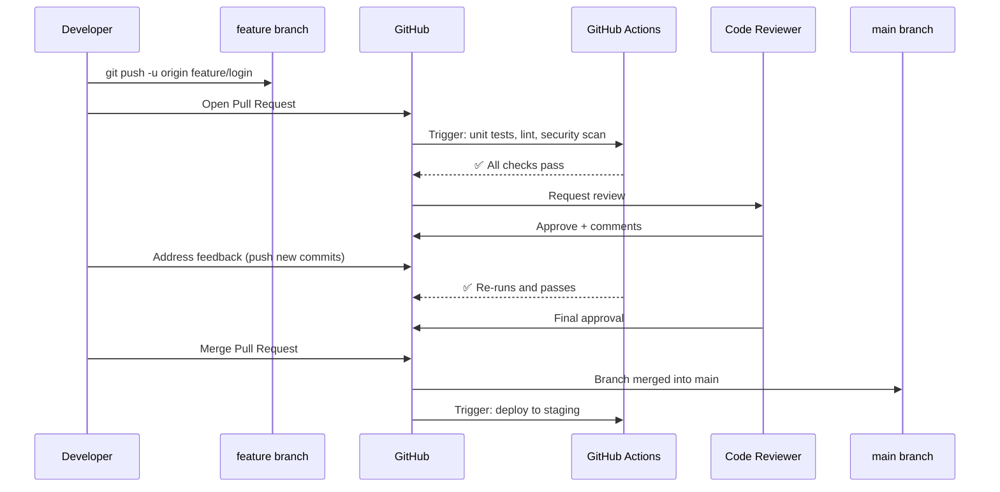

# Pull Requests: The Quality Gate

A Pull Request (PR) is a proposal to merge code from one branch into another. It's the central collaboration mechanism of modern software development — every change must pass through a PR, getting reviewed, automatically tested, and approved before touching `main`.



---

## Opening a Pull Request

```bash
# 1. Create and switch to your feature branch
git switch -c feature/user-auth

# 2. Make your changes and commit
git add .
git commit -m "feat(auth): add JWT login with refresh token support"
git commit -m "test(auth): add unit tests for token validation"

# 3. Push the branch to GitHub
git push -u origin feature/user-auth

# 4. GitHub shows a banner: "feature/user-auth had recent pushes. Compare & pull request."
# Click it, or create via GitHub CLI:
gh pr create \
  --title "feat(auth): add JWT authentication" \
  --body "## Summary
  
  Adds JWT-based authentication with:
  - Login endpoint returning access + refresh tokens
  - Token refresh endpoint
  - Middleware for protected routes
  
  ## Testing
  - Unit tests: src/auth/*.test.ts
  - Manual: see testing instructions in PR description
  
  ## Checklist
  - [x] Unit tests pass locally
  - [x] No new security vulnerabilities
  - [x] Tested manually in dev environment
  
  Closes #234" \
  --reviewer "@alice,@bob" \
  --label "feature,auth"
```

---

## Writing an Excellent PR Description

A good PR description drastically reduces review time:

```markdown
## What This PR Does
Brief explanation of the change and why it's needed.

## Technical Approach
How you implemented it. Key design decisions.
Why you chose this approach over alternatives.

## Screenshots / Demo
(For UI changes — include before/after screenshots)

## Testing Done
- [ ] Unit tests: `npm run test:unit` passes
- [ ] Integration tests pass
- [ ] Tested in development environment
- [ ] Edge cases considered: empty input, invalid token, expired session

## Breaking Changes
None / describe any breaking changes here

## Related Issues
Closes #234
Related to #189

## Checklist
- [ ] Code follows our style guide
- [ ] Self-reviewed my own diff
- [ ] Tests added for new functionality
- [ ] Documentation updated if needed
```

---

## Code Review: Being a Good Reviewer

Code review is a skill. It's not just checking for bugs — it's knowledge transfer, mentorship, and collective ownership:

### What to Look For

```
✅ Correctness     Does the code do what the PR description says?
✅ Tests           Are edge cases covered? Are tests meaningful?
✅ Security        SQL injection? Hardcoded secrets? SSRF vulnerabilities?
✅ Performance     N+1 queries? Missing indices? Large data in memory?
✅ Readability     Will someone understand this in 6 months?
✅ Architecture    Does this fit the existing patterns in the codebase?
✅ Edge cases      What happens with empty input, null values, network failures?
```

### Leaving Effective Comments

```
❌ Bad comment: "This is wrong."

✅ Good comments:
   - Nitpick (optional): "nit: could simplify to Array.from(map.values())"
   - Question: "Question: why are we using setTimeout here instead of a Promise?"
   - Blocking concern: "🚨 This will fail if the user's session token is expired
     before the request completes. We need to handle the 401 response."
   - Suggestion with code:
     ```typescript
     // Suggestion: this could be simplified using optional chaining
     // const email = user?.profile?.contact?.email;
     // instead of:
     // const email = user && user.profile && user.profile.contact && user.profile.contact.email;
     ```
```

Use GitHub's comment tone settings — prefix non-blocking feedback with "nit:" or "optional:" so the author knows which issues must be addressed before merge.

---

## Responding to Review Feedback

```bash
# 1. Reviewer requests changes
# 2. Make the changes in your branch (additional commits OR amend existing)

# Option A: Add a new commit (simpler, shows change history)
git add .
git commit -m "fix: address code review feedback - handle null token"
git push origin feature/user-auth

# Option B: Amend your last commit (cleaner history if fixing a mistake)
git add .
git commit --amend --no-edit   # Add changes to last commit, keep message
git push --force-with-lease origin feature/user-auth

# Option C: Interactive rebase to clean up before merge
git rebase -i HEAD~3   # Squash/fixup review-feedback commits
git push --force-with-lease origin feature/user-auth
```

---

## Branch Protection Rules

Branch protection rules on GitHub prevent accidental or unauthorized changes to `main`:

### Setting Up Protection (GitHub → Settings → Branches → Add Rule)

```yaml
# Recommended protection rules for the "main" branch:
Branch name pattern: main

✅ Require a pull request before merging
   - Required approvals: 2 (or 1 for small teams)
   - Dismiss stale reviews when new commits are pushed
   - Require review from Code Owners

✅ Require status checks to pass before merging
   - unit-tests          (must be green)
   - integration-tests   (must be green)
   - security-scan       (must be green)
   - lint                (must be green)

✅ Require conversation resolution before merging
   (All PR comments must be resolved)

✅ Require signed commits
   (GPG-signed commits only)

✅ Do not allow bypassing the above settings
   (Admins also cannot bypass — prevents emergency "just push it")

✅ Restrict who can push to matching branches
   → Only selected teams/individuals can push directly
```

### CODEOWNERS File

Automatically assign reviewers based on which files changed:

```
# .github/CODEOWNERS
# Syntax: <file-pattern> <@user-or-team>

# Global owners — required reviewers for any file
*                   @yourorg/backend-team

# Auth code requires security team review
src/auth/           @yourorg/security-team @alice

# Payment processing requires finance + security
src/payments/       @yourorg/security-team @yourorg/finance-team

# Kubernetes configs require DevOps team
k8s/                @yourorg/devops-team

# CI/CD pipeline changes require DevOps
.github/workflows/  @yourorg/devops-team
```

---

## Merge Strategies

When merging a PR on GitHub, choose the right strategy:

| Strategy | What it does | Best for |
|---------|-------------|---------|
| **Merge commit** | Creates a merge commit, preserves all commits | Feature branches, audit trail important |
| **Squash and merge** | Combines all PR commits into one commit on main | Clean main history, many messy commits in PR |
| **Rebase and merge** | Replays PR commits linearly on main | Clean linear history, already clean PR commits |

```bash
# Merge via CLI
gh pr merge 123 --squash --delete-branch
gh pr merge 123 --rebase --delete-branch
gh pr merge 123 --merge --delete-branch
```

**Recommended**: Use "Squash and merge" for most teams — the PR conversation preserves the full commit history, but `main` gets one clean commit per feature.

---

## Useful GitHub CLI (gh) Commands

```bash
# Install
brew install gh

# Authenticate
gh auth login

# Create PR
gh pr create --title "..." --body "..."

# List open PRs
gh pr list

# Check out someone else's PR locally (for testing)
gh pr checkout 123

# View PR status
gh pr status

# Review a PR
gh pr review 123 --approve
gh pr review 123 --request-changes --body "Please fix the null handling"

# Merge a PR
gh pr merge 123 --squash --delete-branch

# View all open issues
gh issue list

# Create an issue from a failing test
gh issue create \
  --title "Flaky test: auth token refresh" \
  --label "bug,flaky-test" \
  --body "Test fails intermittently in CI. Run ID: $GITHUB_RUN_ID"
```

---

## Summary

- **Pull Requests** are the mandatory quality gate — every change to `main` goes through a PR with automated CI checks and human review
- A good PR has a clear title, detailed description, testing checklist, and links to related issues
- **Code review** catches bugs, ensures security, and transfers knowledge — prefix optional feedback with "nit:" to avoid confusion
- Respond to feedback with new commits or `--amend + force-push`; use interactive rebase to clean up before merge
- **Branch protection rules** enforce: minimum approvals, status checks, signed commits, conversation resolution
- **CODEOWNERS** automatically assigns reviewers based on file path — ensures domain experts review relevant changes
- Use **Squash and merge** for most PRs — one clean commit per feature on `main`

In the next lesson, you will learn Git best practices: `.gitignore`, Conventional Commits, and the `git stash` workflow.
