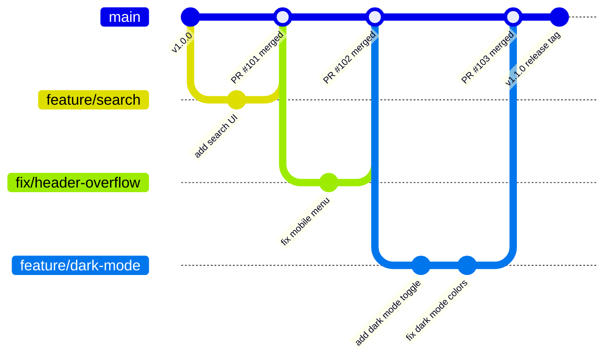
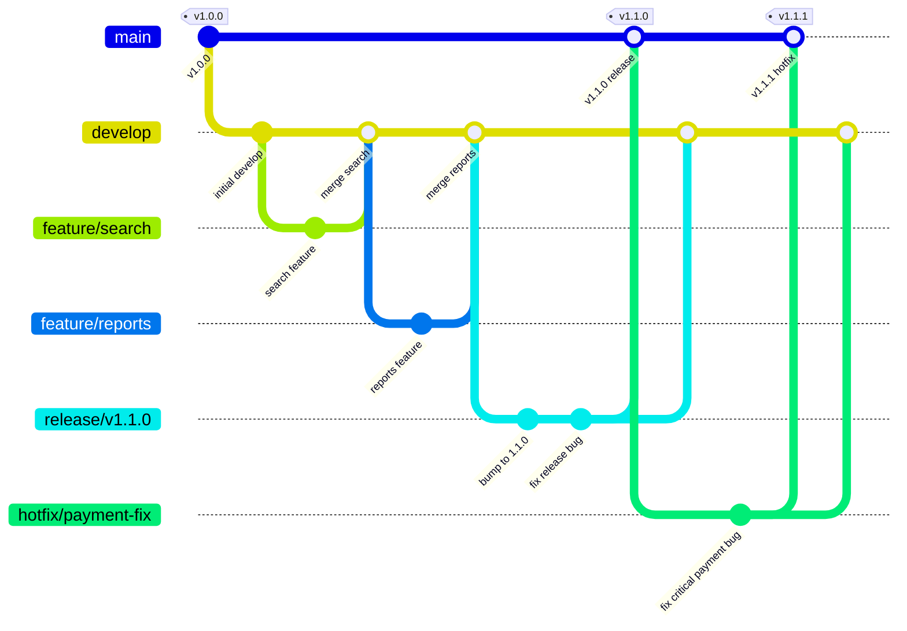
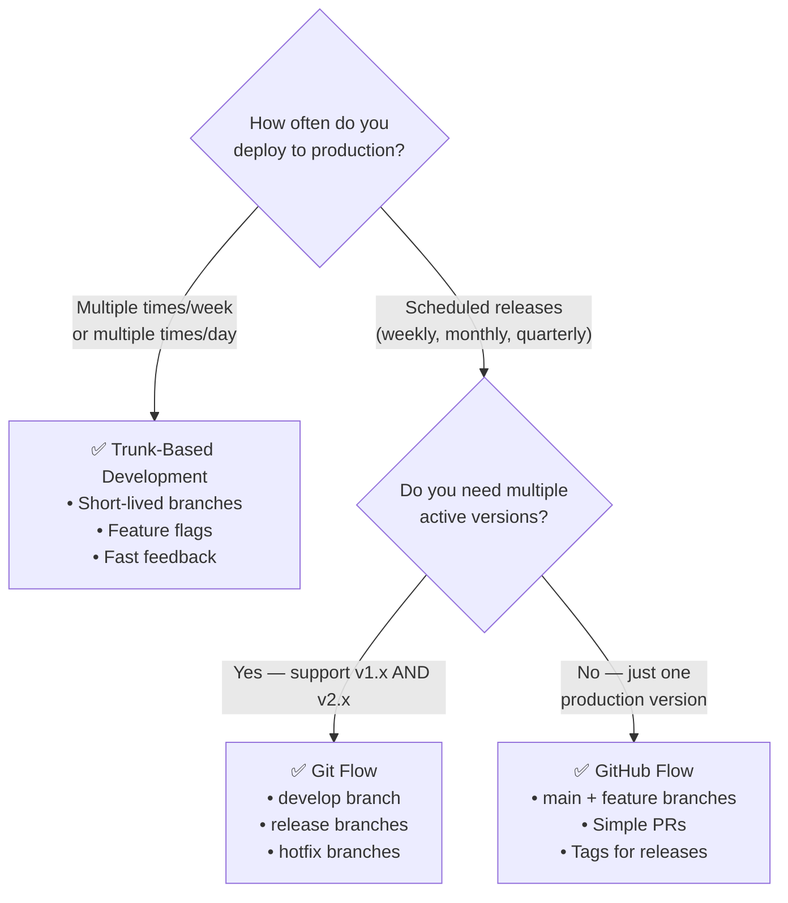

# Choosing a Branching Strategy

A branching strategy is your team's agreement on how code moves from a developer's laptop to production. The two dominant strategies are **Trunk-Based Development** (for fast CI/CD teams) and **Git Flow** (for scheduled release cycles). Choosing the wrong one for your context creates friction that slows down every delivery.

---

## Strategy 1: Trunk-Based Development (Modern CI/CD Standard)

Trunk-Based Development (TBD) is the branching strategy used by Google, Netflix, Airbnb, and most companies doing multiple deploys per day. Its core principle: everyone integrates into `main` (the "trunk") frequently — at least once per day.



### Key Principles

1. **Short-lived branches**: feature branches last hours to 2 days maximum — never weeks
2. **Merge frequently**: merge into `main` at least once per day per developer
3. **`main` is always deployable**: every commit on `main` must pass all tests and could be deployed right now
4. **Feature flags for unfinished features**: if a feature takes 2 weeks, it's deployed behind a flag from day 1

```bash
# TBD daily workflow
git switch main
git pull --rebase

git switch -c feature/add-search-filters   # Short-lived branch
# ... work for a few hours ...
git add .
git commit -m "feat(search): add price range filter"
git push -u origin feature/add-search-filters

# Open PR → get 1 review → merge → done
# Branch lifetime: < 4 hours
```

### Feature Flags for Long Features

```typescript
// Feature in progress — deployed but hidden behind a flag
export function CheckoutPage() {
  const { isEnabled } = useFeatureFlag('new-checkout-v2');
  
  if (isEnabled) {
    return <NewCheckoutV2 />;   // Only 5% of users see this
  }
  return <OldCheckout />;       // Everyone else sees this
}
```

```bash
# Feature flag management (using Unleash or LaunchDarkly)
# 1. Day 1: deploy feature/new-checkout behind flag at 0% rollout
# 2. Day 7: 5% rollout to internal employees
# 3. Day 14: 20% rollout — monitor metrics
# 4. Day 21: 100% rollout → remove flag in next PR
```

### When to Use TBD

- ✅ Your team deploys to production multiple times per week
- ✅ You have strong automated test coverage (unit + integration)
- ✅ Teams of 5–500 developers
- ✅ SaaS products, web applications, microservices

---

## Strategy 2: Git Flow (Release-Based Workflow)

Git Flow (introduced by Vincent Driessen, 2010) uses multiple long-lived branches to support a scheduled release model. It's designed for software that ships in discrete versions: mobile apps, desktop software, APIs with versioned contracts, embedded firmware.



### Git Flow Branch Structure

| Branch | Purpose | Merged from | Merged to |
|--------|---------|------------|-----------|
| **`main`** | Production state | `release/*`, `hotfix/*` | — |
| **`develop`** | Integration branch for next release | `feature/*` | `release/*` |
| **`feature/*`** | New capabilities | `develop` | `develop` |
| **`release/*`** | Stabilization before release | `develop` | `main` + `develop` |
| **`hotfix/*`** | Emergency production fix | `main` | `main` + `develop` |

### Git Flow Commands

```bash
# Option A: Use git-flow CLI extension
brew install git-flow-avh
git flow init   # Prompts for branch names (accept defaults)

# Feature workflow
git flow feature start user-notifications
# ... develop the feature ...
git flow feature finish user-notifications   # Merges to develop, deletes branch

# Release workflow
git flow release start v1.2.0
# ... final QA, bump version number ...
git flow release finish v1.2.0   # Merges to main AND develop, creates tag

# Hotfix workflow
git flow hotfix start payment-null-check
# ... fix the critical bug ...
git flow hotfix finish payment-null-check   # Merges to main AND develop, creates tag

# Option B: Manual git commands
git switch develop
git switch -c feature/user-notifications
# ... develop ...
git switch develop && git merge --no-ff feature/user-notifications
git branch -d feature/user-notifications
```

### When to Use Git Flow

- ✅ Mobile apps (scheduled App Store releases)
- ✅ Library/SDK with strict semantic versioning
- ✅ Enterprise software with long QA cycles
- ✅ Embedded firmware or hardware-dependent software
- ❌ SaaS web apps doing frequent deployments (TBD is better)

---

## Strategy 3: GitHub Flow (Simplified)

A middle ground between TBD and Git Flow — one `main` branch, feature branches, PRs. No `develop` branch, no release branches. Simple and effective for most teams:

```bash
# The entire workflow:
git switch -c feature/my-feature
# ... code ...
git push -u origin feature/my-feature
# Open PR, get reviewed, merge
# Done. main = production at all times.
```

---

## Release Tagging and Semantic Versioning

Git tags mark specific commits as release points. Tags trigger CI/CD deployments in most pipelines:

```bash
# Create an annotated tag (preferred — includes tagger info and description)
git tag -a v1.2.0 -m "Release v1.2.0

New features:
- User notification preferences
- Dark mode support

Bug fixes:
- Fixed cart total calculation
- Resolved mobile menu overflow"

# Create a lightweight tag (just a pointer, no metadata)
git tag v1.2.0   # Only if you really want lightweight

# List all tags
git tag
git tag -l "v1.*"   # Filter tags matching pattern

# Show tag details
git show v1.2.0

# Push tags to GitHub (not included in regular push)
git push origin v1.2.0          # Push specific tag
git push origin --tags          # Push all local tags

# Delete a tag (be careful — CI may have already built it)
git tag -d v1.2.0               # Delete locally
git push origin --delete v1.2.0 # Delete from remote
```

### Semantic Versioning (SemVer)

```
MAJOR.MINOR.PATCH   →   v1.2.3

MAJOR (1): Breaking changes — API incompatible with previous version
           git commit -m "feat!: require API key for all endpoints"

MINOR (2): New features — backward compatible
           git commit -m "feat(api): add bulk export endpoint"

PATCH (3): Bug fixes — backward compatible
           git commit -m "fix(auth): handle expired refresh tokens"

Pre-release identifiers:
v1.2.0-alpha.1    ← first alpha (internal testing)
v1.2.0-beta.2     ← second beta (external testing)
v1.2.0-rc.1       ← release candidate (final testing)
v1.2.0             ← stable release
```

### Automated Semantic Versioning with Conventional Commits

```bash
# semantic-release automatically determines version bump from commit messages
npm install --save-dev semantic-release \
  @semantic-release/git \
  @semantic-release/github \
  @semantic-release/changelog

# .releaserc.json
cat > .releaserc.json << 'EOF'
{
  "branches": ["main"],
  "plugins": [
    "@semantic-release/commit-analyzer",
    "@semantic-release/release-notes-generator",
    "@semantic-release/changelog",
    "@semantic-release/npm",
    "@semantic-release/git",
    "@semantic-release/github"
  ]
}
EOF

# In GitHub Actions:
# - on: push to main
# - runs: npx semantic-release
# Automatically: analyses commits → bumps version → creates tag → generates changelog → creates GitHub Release
```

---

## Choosing the Right Workflow: Decision Guide



---

## Summary: The Complete Picture

| | Trunk-Based | GitHub Flow | Git Flow |
|--|------------|------------|----------|
| **Main branch** | `main` (always deployable) | `main` (always deployable) | `main` + `develop` |
| **Branch lifetime** | Hours to 2 days | Days to 1 week | Weeks to months |
| **Release mechanism** | Continuous deployment | Tag + deploy | `release/*` branch + tag |
| **Emergency fix** | Hotfix PR to main | Hotfix branch | `hotfix/*` → main + develop |
| **Best for** | CI/CD SaaS teams | Small–medium web teams | Versioned software |
| **Complexity** | Low | Low | High |

**The modern default**: Start with GitHub Flow. If you're deploying multiple times per week and have good test coverage, move to Trunk-Based Development. Only use Git Flow if your release process genuinely requires multiple long-lived branches.

This completes the Git & GitHub Fundamentals course. You now have the complete foundation — from version control concepts through real-world team workflows — to contribute to any professional engineering organization.
