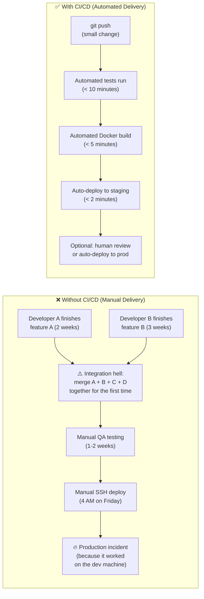
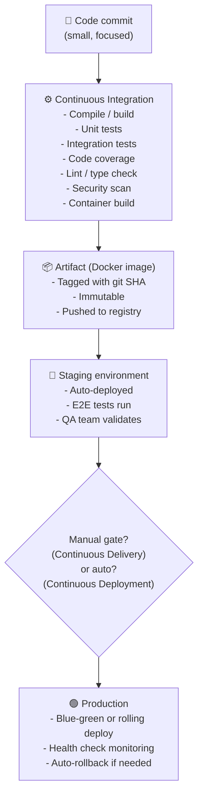

# The Problem: Manual Software Delivery

Before CI/CD, shipping software was a high-stakes, infrequent event. Teams would accumulate weeks or months of changes, then frantically try to merge everything together for a "big bang" release.



---

## CI vs CD: The Definitions

### Continuous Integration (CI)

Every time any developer pushes code, an automated system:
1. **Pulls** the latest code from the repository
2. **Installs** all dependencies in a clean environment
3. **Runs** all tests (unit, integration, linting, type checking)
4. **Reports** pass or fail within minutes

**The core benefit**: bugs are caught within minutes of being introduced, while the context is fresh in the developer's mind — not weeks later during a painful integration effort.

### Continuous Delivery (CD)

Every passing build is automatically **packaged** (built into a Docker image and pushed to a registry) and **deployed to staging**. Deployment to production requires a human click or approval.

### Continuous Deployment

Takes CD one step further: **every passing build is automatically deployed to production** with no human intervention. Requires near-perfect test coverage and excellent monitoring with automated rollback.

---

## The Before vs After

| Scenario | Manual (No CI/CD) | Automated CI/CD |
|---------|-------------------|-----------------|
| **Testing** | "I tested it on my laptop and it worked" | Automated tests on every commit, clean Linux runner |
| **Bug discovery** | Discovered by angry users in production | Caught in CI before merging to `main` |
| **Deployment** | Manual SSH at 4 AM Friday | Automated, zero-downtime, any time |
| **Release frequency** | Once per quarter (high-stress event) | Multiple times per day (routine, calm) |
| **Rollback** | Manual, takes hours | Automated, takes seconds |
| **Time to fix a bug** | PR → wait for next release (weeks) | PR → deployed in minutes |

---

## Why CI/CD Changes Everything for Teams

**The psychological shift**: When deployments are manual and rare, every deployment is risky. Developers batch up large changes to minimize deployment count. Large changes are harder to test. Harder to test → more bugs. More bugs → more risk. More risk → less frequent deployments. It's a negative cycle.

CI/CD breaks this cycle. When deployment is automatic, cheap, and reversible:
- Developers make **small, frequent changes** (easier to review, easier to debug)
- Smaller changes have **fewer bugs** (less surface area)
- Fewer bugs → **more confidence** → more deployments
- More deployments → faster iteration → faster product growth

---

## The CI/CD Value Chain



---

## Real-World CI/CD Numbers

| Company | Deployment Frequency | CI/CD Tool |
|---------|-------------------|-----------|
| Amazon | ~23,000 deployments/day | Internal tool |
| Netflix | Hundreds/day | Spinnaker |
| Google | Millions of builds/day | Internal (Bazel + Borg) |
| Airbnb | Dozens/day | GitHub Actions |
| Your team (target) | 5–20/day | GitHub Actions |

You don't need to be Amazon. Even shipping 5 times per day instead of once per month is a transformational improvement in team velocity and product quality.

---

## The Pipeline as Code

In modern CI/CD, the pipeline itself is code — version-controlled, reviewed, and tested like the application:

```yaml
# .github/workflows/ci.yml — The CI pipeline IS a file in your repository
name: CI Pipeline
on: [push, pull_request]

jobs:
  test:
    runs-on: ubuntu-latest
    steps:
      - uses: actions/checkout@v4
      - run: npm ci
      - run: npm test
```

Benefits of Pipeline-as-Code:
- **Version control**: every pipeline change is a commit with an author and a reason
- **Code review**: pipeline changes go through PRs like any other code
- **Reproducibility**: anyone can clone the repo and understand exactly how it's built
- **Branching**: different branches can have different pipelines (e.g., `main` deploys to prod, feature branches only test)

---

## Summary

- **CI** (Continuous Integration) = automatically test every commit in a clean environment
- **CD** (Continuous Delivery) = auto-package + auto-deploy to staging; manual gate to production
- **CD** (Continuous Deployment) = fully automatic to production — every passing build ships
- CI/CD breaks the "big bang release" anti-pattern: small, frequent, automated deliveries are safer, faster, and less stressful
- The pipeline is a YAML file in your repository — version-controlled, reviewed, and reproducible
- Elite DevOps teams measure success with DORA metrics: Deployment Frequency, Lead Time, MTTR, Change Failure Rate

In the next lesson, you will learn GitHub Actions — the specific CI/CD tool built directly into GitHub — and understand how it maps concepts like workflows, jobs, steps, and runners to the CI/CD value chain.
