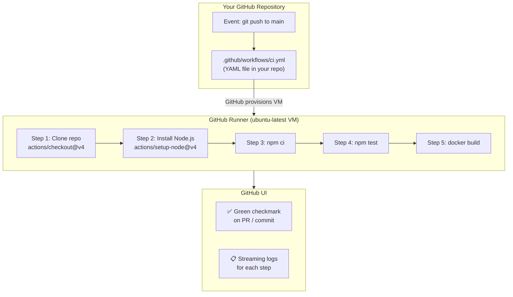

# GitHub Actions: CI/CD Built Into GitHub

GitHub Actions is GitHub's native automation platform. Instead of configuring external CI services (Jenkins, CircleCI, Travis CI), you define automation directly in your repository as YAML files. GitHub spins up virtual machines (runners), runs your jobs, and reports results — all within the GitHub interface.



---

## The 6 Core Concepts

### 1. Event (Trigger)

The specific activity that starts the pipeline:
```yaml
on:
  push:              # Someone pushes a commit
    branches: [main]
  pull_request:      # Someone opens/updates a PR
    branches: [main]
  schedule:          # Cron-based (e.g., nightly security scan)
    - cron: '0 2 * * *'
  workflow_dispatch: # Manual button click in GitHub UI
```

### 2. Workflow

The automation definition — a YAML file in `.github/workflows/`. GitHub detects any `.yml` or `.yaml` file in that directory:

```
.github/
└── workflows/
    ├── ci.yml              ← CI pipeline (test on every PR)
    ├── deploy.yml          ← Deploy on push to main
    ├── security.yml        ← Nightly vulnerability scan
    └── release.yml         ← Triggered by git tags
```

### 3. Runner

The virtual machine where your steps execute. GitHub provides managed runners:

| Runner | OS | Specs | Cost |
|--------|-----|-------|------|
| `ubuntu-latest` | Ubuntu 22.04 | 2 cores, 7 GB RAM | Free tier: 2000 min/month |
| `windows-latest` | Windows Server 2022 | 2 cores, 7 GB RAM | 1 min = 2 Ubuntu-equivalent |
| `macos-latest` | macOS Sonoma | 3 cores, 14 GB RAM | 1 min = 10 Ubuntu-equivalent |
| Self-hosted | Your machine | Whatever you have | Your infrastructure cost |

The runner is provisioned fresh for every workflow run — nothing persists between runs (except what you explicitly cache or upload as artifacts).

### 4. Job

A set of steps that run on the same runner. Multiple jobs run in **parallel by default**:

```yaml
jobs:
  test:      # Runs in parallel with 'lint'
    runs-on: ubuntu-latest
    steps: [...]
    
  lint:      # Runs in parallel with 'test'
    runs-on: ubuntu-latest
    steps: [...]

  build:
    needs: [test, lint]   # Runs AFTER both test and lint pass
    runs-on: ubuntu-latest
    steps: [...]
```

### 5. Step

An individual task within a job — either a shell command or a reusable Action:

```yaml
steps:
  # Type 1: uses (reusable Action from Marketplace or repo)
  - name: Check out code
    uses: actions/checkout@v4

  # Type 2: run (shell command)
  - name: Run tests
    run: npm test

  # Type 3: run with multi-line script
  - name: Build and verify
    run: |
      npm run build
      ls -la dist/
      echo "Build size: $(du -sh dist/)"
```

### 6. Action

A reusable, packaged automation unit published to the GitHub Marketplace. Instead of writing scripts to check out code, install Node.js, or authenticate to AWS, you use pre-built Actions:

```yaml
- uses: actions/checkout@v4          # Clone the repo
- uses: actions/setup-node@v4        # Install Node.js
- uses: actions/cache@v4             # Cache directories between runs
- uses: docker/login-action@v3       # Log in to a container registry
- uses: docker/build-push-action@v5  # Build and push Docker images
- uses: aws-actions/configure-aws-credentials@v4  # Configure AWS CLI
```

---

## Where Workflow Files Live (Critical)

```bash
# Must be exactly this path (case sensitive, leading dot)
.github/workflows/ci.yml

# Create the directory
mkdir -p .github/workflows
```

<Callout type="warning" title="Exact Path Required">
The directory must be named exactly `.github/workflows/` with a leading dot. Any `.yml` or `.yaml` file inside this directory is automatically detected by GitHub. If you name it `.Github/` or `.github/workflow/` (no 's'), it won't be found.
</Callout>

---

## Your First Workflow: Dissected Line by Line

```yaml
# .github/workflows/hello-devops.yml

# === METADATA ===
name: Hello DevOps World   # Shown in GitHub Actions tab
                           # Can be any descriptive string

# === TRIGGERS ===
on:
  push:
    branches: [main]       # Only trigger on pushes to main

# === JOBS ===
jobs:
  # Job ID (used to reference this job in "needs:" clauses)
  hello-world:
    
    # Which GitHub-hosted runner to use
    runs-on: ubuntu-latest
    
    # Prevent infinite/runaway jobs from burning your free minutes
    timeout-minutes: 5
    
    # === STEPS (run sequentially, top to bottom) ===
    steps:
      # Step 1: Clone your repository onto the runner
      # Without this, your code is NOT on the runner!
      - name: Checkout repository
        uses: actions/checkout@v4
        # @v4 is the version — ALWAYS pin to a version, never use @latest
        # This prevents unexpected breaking changes from action updates
      
      # Step 2: Run a shell command
      - name: Greet the world
        run: echo "Hello from GitHub Actions!"
      
      # Step 3: Inspect the runner environment
      - name: Show runner info
        run: |
          echo "OS: $(uname -a)"
          echo "Node: $(node --version)"
          echo "Python: $(python3 --version)"
          echo "Docker: $(docker --version)"
          echo "Files in workspace: $(ls -la)"
      
      # Step 4: Access GitHub context (metadata about this run)
      - name: Show run metadata
        run: |
          echo "Repository: ${{ github.repository }}"
          echo "Branch: ${{ github.ref_name }}"
          echo "Commit SHA: ${{ github.sha }}"
          echo "Actor (who triggered): ${{ github.actor }}"
          echo "Run number: ${{ github.run_number }}"
```

### Push This Workflow and Watch It Run

```bash
mkdir -p .github/workflows
# Save the YAML above to .github/workflows/hello-devops.yml
git add .github/workflows/hello-devops.yml
git commit -m "ci: add first GitHub Actions workflow"
git push origin main

# Navigate to: github.com/yourorg/repo → Actions tab
# You'll see the workflow running with live streaming logs
```

---

## Free Tier and Billing

GitHub Actions is **free** for public repositories. For private repositories:

| Plan | Free minutes/month | Storage |
|------|------------------|---------|
| **Free** | 2,000 min | 500 MB |
| **Pro** | 3,000 min | 1 GB |
| **Team** | 3,000 min | 2 GB |
| **Enterprise** | 50,000 min | 50 GB |

**Minute multipliers** (why to use ubuntu-latest by default):
- `ubuntu-latest`: 1 minute = 1 included minute
- `windows-latest`: 1 minute = 2 included minutes
- `macos-latest`: 1 minute = 10 included minutes

**To see your usage**: GitHub → Settings → Billing → Actions

---

## The GitHub Actions Marketplace

Over 20,000 pre-built actions available at [github.com/marketplace?type=actions](https://github.com/marketplace?type=actions):

```yaml
# Essential actions for DevOps workflows:
uses: actions/checkout@v4              # Clone repo
uses: actions/setup-node@v4            # Install Node.js
uses: actions/setup-python@v5         # Install Python
uses: actions/setup-java@v4            # Install Java
uses: actions/cache@v4                 # Cache dependencies
uses: actions/upload-artifact@v4       # Upload build outputs
uses: actions/download-artifact@v4     # Download artifacts between jobs

uses: docker/setup-buildx-action@v3    # Enable BuildKit
uses: docker/login-action@v3           # Log in to registry
uses: docker/build-push-action@v5      # Build + push images
uses: docker/metadata-action@v5        # Generate image tags

uses: aws-actions/configure-aws-credentials@v4  # AWS auth
uses: google-github-actions/auth@v2             # GCP auth
uses: azure/login@v2                            # Azure auth

uses: appleboy/ssh-action@v1            # SSH to remote server
uses: slackapi/slack-github-action@v1   # Post to Slack

uses: aquasecurity/trivy-action@master  # Vulnerability scan
uses: github/codeql-action/analyze@v3  # SAST analysis
uses: codecov/codecov-action@v4         # Upload coverage report
```

<Callout type="important" title="Always Pin Actions to a Version">
Use `actions/checkout@v4`, not `actions/checkout@main` or `actions/checkout@latest`. Unpinned actions can introduce breaking changes without warning. Prefer full SHA for critical actions: `actions/checkout@11bd71901bbe5b1630ceea73d27597364c9af683` (completely immutable).
</Callout>

---

## Summary

- **GitHub Actions** is GitHub's native CI/CD — defined as YAML files in `.github/workflows/`
- **6 core concepts**: Event (trigger) → Workflow (YAML file) → Runner (VM) → Job (steps on one runner) → Step (command or Action) → Action (reusable unit from Marketplace)
- `ubuntu-latest` is the recommended runner — cheapest, most compatible with Linux tooling
- Jobs run **in parallel** by default; use `needs:` to sequence them
- **Pin action versions** (`@v4` minimum; SHA for security-critical) — never use `@latest`
- Free tier: 2,000 minutes/month for private repos; unlimited for public repos

In the next lesson, you will master the complete GitHub Actions YAML syntax — every keyword, every option, and the patterns used in production pipelines.
