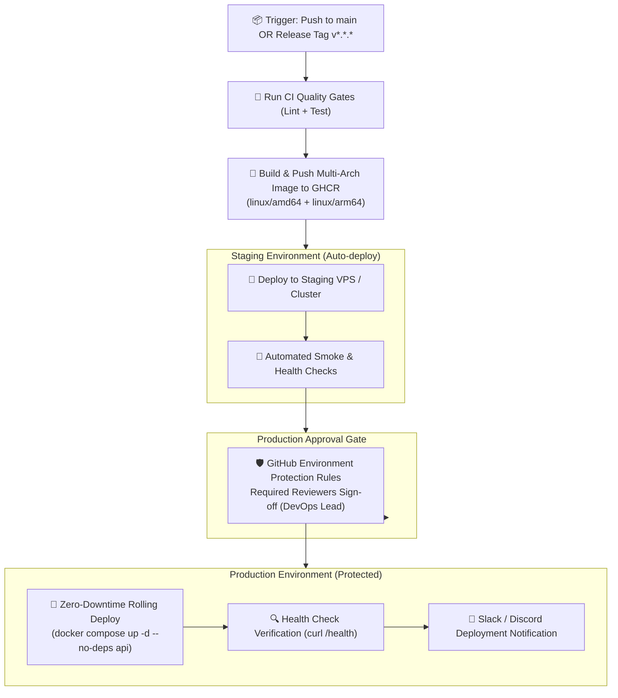

# Delivering Code to Production Safely

Continuous Deployment (CD) is the automated process that takes verified code artifacts from your CI pipeline and safely deploys them to target hosting environments. In this capstone lesson of GitHub Actions, you will master multi-environment deployments, container publishing to GHCR with multi-architecture support, zero-downtime SSH VPS rollouts with healthchecks, and environment protection governance.



---

## 1. Publishing Multi-Architecture Docker Images to GHCR

Modern cloud infrastructure runs on both x86_64 (`linux/amd64` for Intel/AMD servers) and ARM64 (`linux/arm64` for AWS Graviton, Apple Silicon, Raspberry Pi). GitHub Actions allows building and pushing multi-platform images directly to GitHub Container Registry (GHCR) using Docker Buildx and QEMU:

```yaml
name: Publish Container to GHCR

on:
  push:
    branches: [ main ]
    tags: [ 'v*.*.*' ]

permissions:
  contents: read
  packages: write     # Required to publish to ghcr.io

jobs:
  docker-publish:
    runs-on: ubuntu-latest
    steps:
      - uses: actions/checkout@v4

      # 1. Set up QEMU for multi-architecture CPU emulation
      - name: Set up QEMU
        uses: docker/setup-qemu-action@v3

      # 2. Set up Docker Buildx for advanced caching & builder features
      - name: Set up Docker Buildx
        uses: docker/setup-buildx-action@v3

      # 3. Authenticate to GitHub Container Registry
      - name: Log in to GHCR
        uses: docker/login-action@v3
        with:
          registry: ghcr.io
          username: ${{ github.actor }}
          password: ${{ secrets.GITHUB_TOKEN }}

      # 4. Extract Docker metadata (tags, labels, semver)
      - name: Extract metadata
        id: meta
        uses: docker/metadata-action@v5
        with:
          images: ghcr.io/${{ github.repository }}
          tags: |
            type=raw,value=latest,enable={{is_default_branch}}
            type=sha,format=short,prefix=sha-
            type=semver,pattern={{version}}
            type=semver,pattern={{major}}.{{minor}}

      # 5. Build and push multi-arch image
      - name: Build and push image
        uses: docker/build-push-action@v5
        with:
          context: .
          platforms: linux/amd64,linux/arm64
          push: true
          tags: ${{ steps.meta.outputs.tags }}
          labels: ${{ steps.meta.outputs.labels }}
          cache-from: type=gha
          cache-to: type=gha,mode=max
```

---

## 2. Zero-Downtime Server Deployment via SSH & Docker Compose

For applications running on virtual private servers (AWS EC2, DigitalOcean, Hetzner, Linode), automate deployment over encrypted SSH using `appleboy/ssh-action`. 

The key pattern is **zero-downtime container replacement**: pull the new image *while* the old container is still serving traffic, recreate only the stateless API container, run a healthcheck, and automatically roll back if the check fails:

```yaml
deploy-production:
  name: 🚀 Production Rollout
  runs-on: ubuntu-latest
  environment:
    name: production
    url: https://api.mycompany.com

  steps:
    - name: SSH Remote Deployment & Health Verification
      uses: appleboy/ssh-action@v1.0.3
      with:
        host: ${{ secrets.PROD_SERVER_HOST }}
        username: ${{ secrets.PROD_SERVER_USER }}
        key: ${{ secrets.PROD_SSH_PRIVATE_KEY }}
        port: 22
        envs: GITHUB_SHA
        script: |
          set -e
          cd /opt/my-app

          echo "📦 Pulling latest image digest for SHA: $GITHUB_SHA..."
          IMAGE_TAG=sha-${GITHUB_SHA:0:7}
          docker pull ghcr.io/my-org/my-app:$IMAGE_TAG

          echo "🔄 Performing zero-downtime rolling service restart..."
          # Update ONLY the API service without disrupting DB or Redis containers
          IMAGE_TAG=$IMAGE_TAG docker compose -f docker-compose.yml -f docker-compose.prod.yml up -d --no-deps api

          echo "🔍 Verifying application health endpoint..."
          sleep 5
          for i in {1..10}; do
            if curl -f -s http://127.0.0.1:3000/api/health | grep '"status":"ok"'; then
              echo "✅ Health check passed! Deployment is healthy."
              exit 0
            fi
            echo "⏳ Waiting for health check to pass ($i/10)..."
            sleep 3
          done

          echo "❌ Health check timed out! Initiating automatic rollback..."
          # Roll back to previous stable image if health check fails
          docker compose -f docker-compose.yml -f docker-compose.prod.yml rollback api || true
          exit 1
```

---

## 3. GitHub Environment Protection Rules & Governance

In enterprise teams, deploying straight to production without approval is prohibited. GitHub **Environments** provide built-in governance:

```
GitHub Repository → Settings → Environments → New environment: 'production'
```

### Environment Security Controls:
1. **Required Reviewers**: Specify up to 6 individuals or teams (e.g. `@my-org/devops-leads`) who must manually approve the deployment via the GitHub UI or mobile app before the job executes.
2. **Wait Timer**: Enforce a mandatory delay (e.g. 15 minutes) between staging deployment and production deployment to allow background soak tests to run.
3. **Deployment Branches**: Restrict production releases strictly to the `main` branch or release tags (`v*.*.*`).
4. **Environment-Specific Secrets**: `PROD_DATABASE_URL` is completely isolated from PR builds and can only be accessed when running in the `production` environment context!

---

## 4. ChatOps Notifications: Slack & Discord Alerts

Keep engineering teams informed with automated Slack or Discord notifications that include commit author, branch, SHA, and direct links to the deployment run:

```yaml
    - name: 📢 Notify Slack of Deployment Status
      if: always()
      uses: slackapi/slack-github-action@v1.26.0
      with:
        payload: |
          {
            "text": "${{ job.status == 'success' && '🚀 *Production Deployment Succeeded*' || '🚨 *Production Deployment FAILED*' }}",
            "blocks": [
              {
                "type": "section",
                "text": {
                  "type": "mrkdwn",
                  "text": "*Status:* ${{ job.status == 'success' && '✅ Succeeded' || '❌ Failed' }}\n*Repository:* ${{ github.repository }}\n*Commit:* <https://github.com/${{ github.repository }}/commit/${{ github.sha }}|${{ github.sha }}>\n*Triggered by:* @${{ github.actor }}\n*Environment:* Production"
                }
              }
            ]
          }
      env:
        SLACK_WEBHOOK_URL: ${{ secrets.SLACK_DEPLOYMENT_WEBHOOK }}
```

---

## 5. Complete End-to-End CI/CD Pipeline

Here is how all 8 lessons connect into a single master deployment pipeline:

```yaml
name: Master CI/CD Pipeline

on:
  push:
    branches: [ main ]
    tags: [ 'v*.*.*' ]

concurrency:
  group: deployment-${{ github.ref }}
  cancel-in-progress: false   # Never cancel in-flight production deploys!

jobs:
  # 1. CI Quality Checks
  ci-test:
    name: 🧪 Run Quality Gates
    runs-on: ubuntu-latest
    steps:
      - uses: actions/checkout@v4
      - uses: actions/setup-node@v4
        with: { node-version: 20, cache: 'npm' }
      - run: npm ci
      - run: npm run lint
      - run: npm test

  # 2. Package Container
  publish-container:
    name: 🐳 Build & Publish OCI Image
    needs: ci-test
    runs-on: ubuntu-latest
    permissions:
      contents: read
      packages: write
    steps:
      - uses: actions/checkout@v4
      - uses: docker/setup-buildx-action@v3
      - uses: docker/login-action@v3
        with:
          registry: ghcr.io
          username: ${{ github.actor }}
          password: ${{ secrets.GITHUB_TOKEN }}
      - uses: docker/build-push-action@v5
        with:
          context: .
          push: true
          tags: ghcr.io/${{ github.repository }}:sha-${{ github.sha }}
          cache-from: type=gha
          cache-to: type=gha,mode=max

  # 3. Deploy to Staging
  deploy-staging:
    name: 🟡 Deploy Staging
    needs: publish-container
    runs-on: ubuntu-latest
    environment:
      name: staging
      url: https://staging.mycompany.com
    steps:
      - name: Deploy to Staging Cluster
        run: echo "Deployed to staging successfully!"

  # 4. Deploy to Production (Protected by Required Reviewers)
  deploy-production:
    name: 🟢 Deploy Production
    needs: deploy-staging
    runs-on: ubuntu-latest
    environment:
      name: production
      url: https://mycompany.com
    steps:
      - name: Deploy to Production
        run: echo "Deployed to production with zero downtime!"
```

---

## Course 2 Complete! 🎉

You have officially mastered the complete **GitHub Actions Automation** curriculum:
- **Lesson 1:** CI/CD core philosophy and the automated delivery value chain.
- **Lesson 2:** GitHub Actions architecture (Events, Workflows, Jobs, Steps, Runners, Marketplace).
- **Lesson 3:** Complete YAML workflow syntax, expressions, contexts, and matrix builds.
- **Lesson 4:** Event triggers (`push`, `pull_request`, `schedule`, `workflow_dispatch`, `workflow_call`).
- **Lesson 5:** Multi-job parallelism, live PostgreSQL & Redis service containers, artifact archiving, and caching.
- **Lesson 6:** Environment variables, encrypted secrets hierarchy, least-privilege `GITHUB_TOKEN`, and keyless cloud OIDC.
- **Lesson 7:** Production CI pipeline engineering with BuildKit layer caching and fail-fast static gates.
- **Lesson 8:** Continuous Deployment, multi-arch image publishing to GHCR, zero-downtime rolling SSH updates, and environment protection rules.

---

## Next Up: Containerization & Cloud-Native Infrastructure

Now that your CI/CD automation foundation is locked in, you are ready to master modern containerization:
- **Course 4: Docker Fundamentals** — Deep Linux namespaces, cgroups, writing ultra-small multi-stage images, layer caching, and rootless container security.
- **Course 5: Docker Compose** — Orchestrating complex multi-tier microservice networks and persistent volume storage.
- **Course 6 & 7: Kubernetes & K3s** — Pods, Deployments, Services, Ingress Controllers, StatefulSets, and GitOps deployments!
