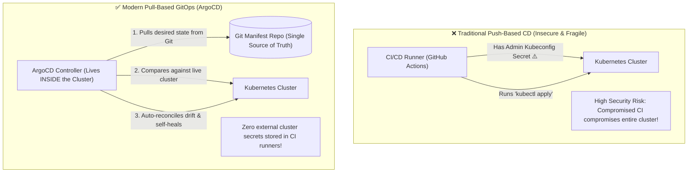
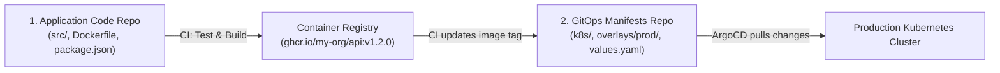

# GitOps Core Principles & Declarative Continuous Delivery

For over a decade, Continuous Delivery (CD) was **Push-Based**: a CI server (like Jenkins or GitHub Actions) would run `kubectl apply` or SSH into production servers using a privileged administrative credential stored in CI secrets.

**GitOps** inverts this paradigm into a **Pull-Based**, declarative model where **Git is the Single Source of Truth** for your entire infrastructure and application state.

---

## The 4 OpenGitOps Principles

The CNCF OpenGitOps standard defines 4 mandatory principles:

1. **Declarative**: The entire desired state of the system is described declaratively (e.g. Kubernetes manifests, Helm charts, Kustomize overlays).
2. **Versioned and Immutable**: The desired state is stored in version control (Git) with full commit history, audit trails, and cryptographic commit signatures.
3. **Pulled Automatically**: Software agents (like ArgoCD) running inside the cluster continuously pull the desired state from Git.
4. **Continuously Reconciled**: The agent detects any deviation (drift) between desired Git state and live cluster state, and automatically reconciles the cluster back to match Git.

---

## Push vs. Pull CD: Detailed Architectural Comparison

| Dimension | Push-Based CD (GitHub Actions `kubectl`) | Pull-Based GitOps (ArgoCD) |
| :--- | :--- | :--- |
| **Cluster Credentials** | Stored externally in CI runner secrets | Kept strictly inside the cluster (zero external exposure) |
| **Drift Detection** | None (manual `kubectl` edits go unnoticed) | Continuous real-time detection (alerts or auto-reverts) |
| **Rollback Strategy** | Run previous CI pipeline build | `git revert <commit-hash>` (takes 5 seconds) |
| **Audit Log** | Scattered across CI pipeline run logs | Clean, immutable Git commit log |
| **Disaster Recovery** | Manual, slow reconstruction | Point ArgoCD to the Git repo on a new cluster |

---

## The Two-Repository Architecture

In production, application source code and deployment manifests are separated into **two distinct Git repositories**:

### Why Separate Repositories?
1. **Prevents CI Infinite Loops**: Changing a deployment manifest doesn't trigger a full 20-minute application code build/test cycle.
2. **Strict RBAC Access**: Developers have write access to the App Repo, but only Senior DevOps engineers / automated CI bots have write access to the GitOps Manifests Repo.
3. **Clean Audit History**: The Manifest repo commit log shows exact release history (e.g. `Deploy v1.2.0 to production`).
