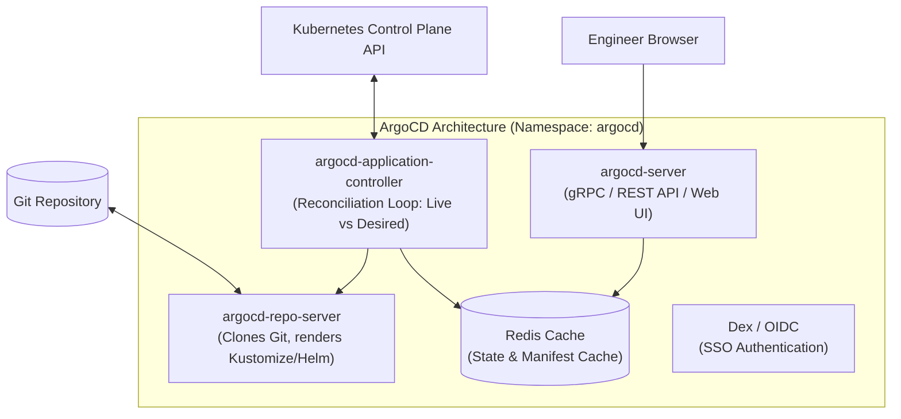

# ArgoCD Architecture & Installation

ArgoCD is a declarative, GitOps continuous delivery tool for Kubernetes, implemented as a native Kubernetes controller.



---

## The 4 Core Architectural Components

1. **`argocd-server`**: Exposes the Web UI and gRPC/REST API. Handles authentication (SSO/Dex), RBAC enforcement, and project access.
2. **`argocd-repo-server`**: Clones Git repositories, parses raw YAML, and renders templates using Kustomize or Helm into plain Kubernetes manifests.
3. **`argocd-application-controller`**: The continuous reconciliation engine. It queries the live Kubernetes API, compares it against the rendered Git state, and executes sync policies.
4. **`Redis`**: In-memory cache for rendered manifests and live cluster state to prevent hammering Git providers and the Kubernetes API.

---

## Step-by-Step Production Installation

### 1. Install ArgoCD in Kubernetes
```bash
# Create dedicated namespace
kubectl create namespace argocd

# Apply official ArgoCD installation manifests
kubectl apply -n argocd -f https://raw.githubusercontent.com/argoproj/argo-cd/stable/manifests/install.yaml
```

### 2. Verify Running Pods
```bash
$ kubectl get pods -n argocd

NAME                                                READY   STATUS    RESTARTS
argocd-application-controller-0                     1/1     Running   0
argocd-dex-server-6789b78494-abcde                  1/1     Running   0
argocd-redis-74b8896d79-fghij                       1/1     Running   0
argocd-repo-server-5f899b846-klmno                  1/1     Running   0
argocd-server-7bc99446d4-pqrst                      1/1     Running   0
```

### 3. Extract the Initial Admin Password
ArgoCD generates a random secret for the initial `admin` user on boot:

```bash
kubectl -n argocd get secret argocd-initial-admin-secret -o jsonpath="{.data.password}" | base64 -d
```

### 4. Access the Web UI via Port-Forwarding
```bash
kubectl port-forward svc/argocd-server -n argocd 8080:443
```
Open your browser to `https://localhost:8080`, log in with username `admin` and your decoded password.

---

## Working with the ArgoCD CLI

Install the ArgoCD CLI:
```bash
# macOS
brew install argocd

# Linux
curl -sSL -o argocd-linux-amd64 https://github.com/argoproj/argo-cd/releases/latest/download/argocd-linux-amd64
sudo install -m 555 argocd-linux-amd64 /usr/local/bin/argocd
rm argocd-linux-amd64
```

Login from the terminal:
```bash
argocd login localhost:8080 --username admin --insecure
```

---

## Connecting a Private Git Repository

To sync private GitHub or GitLab repositories, add an SSH Deploy Key or GitHub App credentials:

```bash
argocd repo add git@github.com:my-org/k8s-manifests.git   --ssh-private-key-path ~/.ssh/id_rsa_argocd
```
