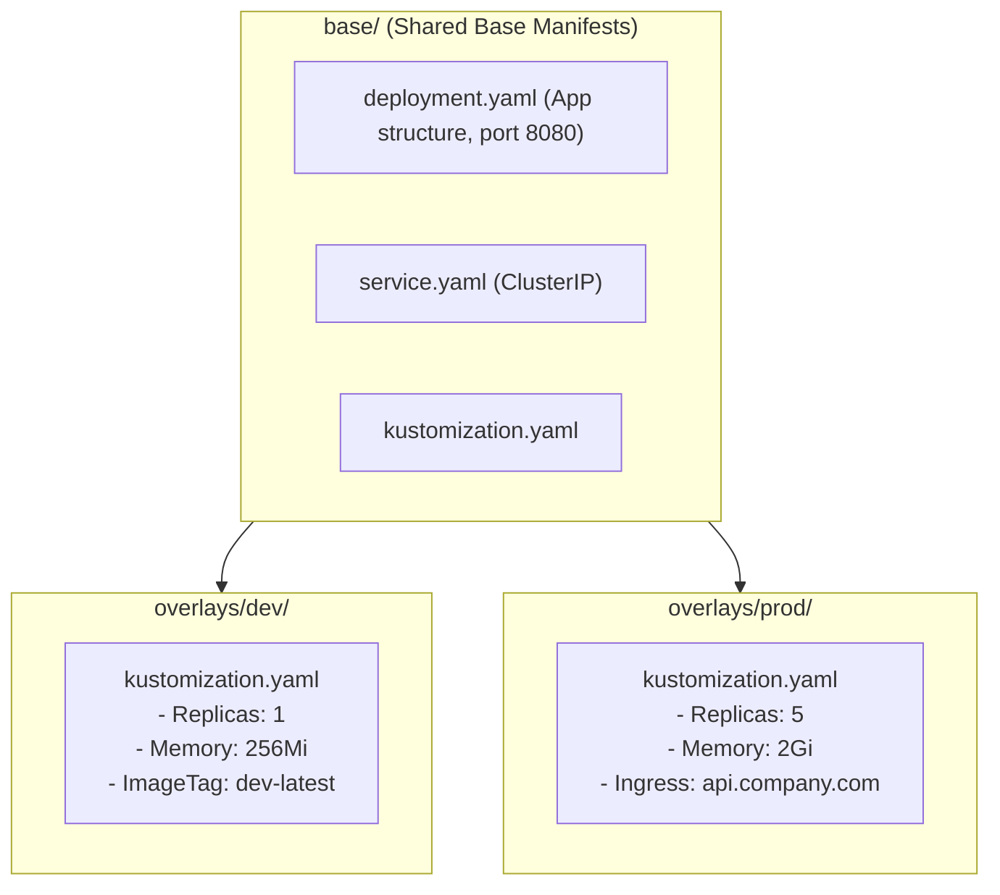

# Managing Multi-Environment Manifests with Kustomize & Helm

Copy-pasting 500 lines of Kubernetes YAML across `dev/`, `staging/`, and `prod/` directories causes massive configuration drift.

In this lesson, you will master template-free configuration overrides with **Kustomize** and parameterized package management with **Helm** inside ArgoCD.



---

## 1. Kustomize in ArgoCD: Base & Overlays Pattern

Kustomize is built into `kubectl` and ArgoCD natively. It uses a **Base** (common configuration) and **Overlays** (environment-specific patches).

### The Directory Structure:
```
k8s-manifests/
├── base/
│   ├── deployment.yaml
│   ├── service.yaml
│   └── kustomization.yaml
│
└── overlays/
    ├── dev/
    │   ├── kustomization.yaml
    │   └── replica_count.yaml
    └── prod/
        ├── kustomization.yaml
        ├── ingress.yaml
        └── hpa.yaml
```

### `base/kustomization.yaml`:
```yaml
apiVersion: kustomize.config.k8s.io/v1beta1
kind: Kustomization

resources:
  - deployment.yaml
  - service.yaml
```

### `overlays/prod/kustomization.yaml`:
```yaml
apiVersion: kustomize.config.k8s.io/v1beta1
kind: Kustomization

# Inherit everything from base
resources:
  - ../../base
  - ingress.yaml
  - hpa.yaml

# Prefix all resources with 'prod-'
namePrefix: prod-

# Add production labels to all resources
commonLabels:
  environment: production
  tier: backend

# Update container image tag dynamically
images:
  - name: ghcr.io/my-org/api
    newTag: v1.4.2

# Patch specific fields (e.g. replicas = 5)
replicas:
  - name: web-api
    count: 5
```

---

## 2. Managing Helm Charts with ArgoCD

ArgoCD can pull standard public or private Helm charts directly without requiring you to run `helm install` on your computer.

```yaml
apiVersion: argoproj.io/v1alpha1
kind: Application
metadata:
  name: redis-cluster
  namespace: argocd
spec:
  project: default
  source:
    chart: redis
    repoURL: 'https://charts.bitnami.com/bitnami'
    targetRevision: 18.1.5
    helm:
      releaseName: prod-redis
      values: |
        architecture: replication
        auth:
          enabled: true
        master:
          persistence:
            size: 20Gi
        replica:
          replicaCount: 3
  destination:
    server: 'https://kubernetes.default.svc'
    namespace: database
```
