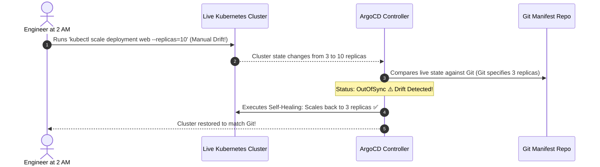
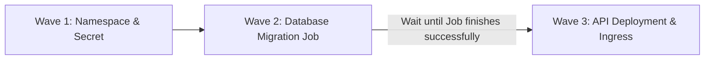

# Sync Policies: Auto-Sync, Pruning & Self-Healing

The defining superpower of GitOps is **Continuous Reconciliation**. If someone makes an unauthorized manual change to the live cluster, ArgoCD automatically detects the drift and restores the cluster to match Git.



---

## 1. The Core Sync Options Explained

Inside the `Application.spec.syncPolicy`:

```yaml
syncPolicy:
  automated:
    prune: true     # Automatically deletes K8s resources removed from Git
    selfHeal: true  # Overwrites manual cluster modifications
```

### What is Pruning (`prune: true`)?
If you delete `redis-service.yaml` from your Git repository and push to `main`:
- With `prune: false`: ArgoCD leaves the old Redis service running in Kubernetes as an orphan.
- With `prune: true`: ArgoCD detects the file was deleted from Git and automatically runs `kubectl delete service redis`.

### What is Self-Healing (`selfHeal: true`)?
If an engineer uses `kubectl edit` or `kubectl delete` to modify a running pod or service directly:
- With `selfHeal: false`: ArgoCD marks the application as `OutOfSync` (yellow warning in UI), but takes no action.
- With `selfHeal: true`: ArgoCD immediately overrides the change and resets the cluster back to the exact YAML defined in Git within seconds!

---

## 2. Sync Waves: Controlling Deployment Order

What if your application requires a database schema migration to complete **before** the new API pods start?

ArgoCD **Sync Waves** control the exact order of resource creation using annotations:



```yaml
# 1. Database Schema Migration Job
apiVersion: batch/v1
kind: Job
metadata:
  name: db-migration-v2
  annotations:
    argocd.argoproj.io/sync-wave: "1" # Runs first!
spec:
  template:
    spec:
      containers:
        - name: migrate
          image: my-app:v2.0.0
          command: ["npm", "run", "db:migrate"]
      restartPolicy: Never
---
# 2. Main Web API Deployment
apiVersion: apps/v1
kind: Deployment
metadata:
  name: web-api
  annotations:
    argocd.argoproj.io/sync-wave: "2" # Runs ONLY after Wave 1 succeeds!
spec:
  replicas: 3
  # ...
```

---

## 3. Sync Windows: Protecting Production During Business Hours

You can configure **Sync Windows** to block automated deployments during high-traffic business hours or maintenance blackouts:

```yaml
apiVersion: argoproj.io/v1alpha1
kind: AppProject
metadata:
  name: production-project
  namespace: argocd
spec:
  syncWindows:
    # Deny automated syncs between 9 AM and 5 PM on weekdays
    - kind: deny
      schedule: '0 9 * * 1-5'
      duration: 8h
      applications:
        - 'production-*'
      manualSync: true # Allow emergency manual overrides by senior engineers
```
