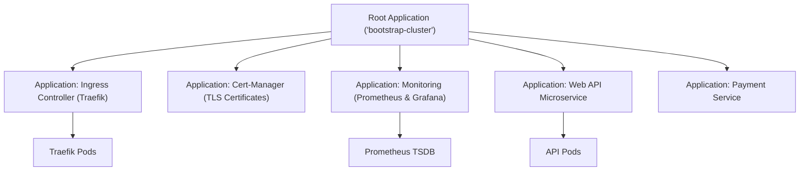

# The App-of-Apps Pattern & Multi-Cluster Deployments

In a real production environment, you don't just have one application. You have 30 microservices, an Ingress controller (Traefik/NGINX), Cert-Manager, Prometheus, Grafana, and Vault.

Managing 40 separate applications manually in ArgoCD is unscalable.

The solution is the **App-of-Apps Pattern** and the modern **`ApplicationSet` CRD**.



---

## 1. Building the App-of-Apps Pattern

In the App-of-Apps pattern, you create a **Root Application** whose sole job is to watch a directory containing other `Application` manifests:

### Step 1: Root Bootstrap Manifest (`root-bootstrap.yaml`)
```yaml
apiVersion: argoproj.io/v1alpha1
kind: Application
metadata:
  name: root-bootstrap-app
  namespace: argocd
  finalizers:
    - resources-finalizer.argocd.argoproj.io
spec:
  project: default
  source:
    repoURL: 'https://github.com/my-org/k8s-gitops.git'
    targetRevision: main
    path: 'bootstrap' # Directory containing all child Application YAMLs!
  destination:
    server: 'https://kubernetes.default.svc'
    namespace: argocd
  syncPolicy:
    automated:
      prune: true
      selfHeal: true
```

### Step 2: Child Applications in `bootstrap/` Directory:
```
bootstrap/
├── 01-ingress-traefik.yaml
├── 02-cert-manager.yaml
├── 03-monitoring-stack.yaml
└── 04-production-api.yaml
```

To bootstrap an entire brand-new Kubernetes cluster from zero to fully operational, you only run **one single command**:
```bash
kubectl apply -f root-bootstrap.yaml
```
ArgoCD reads the root application, discovers all child applications, and provisions the entire cluster architecture automatically!

---

## 2. The Modern `ApplicationSet` CRD

For multi-cluster, multi-environment setups, the CNCF **`ApplicationSet`** controller uses **Generators** to automatically generate hundreds of `Application` CRDs from a single template.

### Multi-Cluster Matrix Generator:
Automatically deploy your application across 3 different Kubernetes clusters (US-East, EU-Central, AP-Southeast):

```yaml
apiVersion: argoproj.io/v1alpha1
kind: ApplicationSet
metadata:
  name: global-web-app
  namespace: argocd
spec:
  generators:
    - list:
        elements:
          - cluster: production-us-east
            url: https://10.0.1.50:6443
          - cluster: production-eu-central
            url: https://10.0.2.50:6443
          - cluster: production-ap-southeast
            url: https://10.0.3.50:6443
  template:
    metadata:
      name: '{{cluster}}-web-api'
    spec:
      project: default
      source:
        repoURL: 'https://github.com/my-org/k8s-manifests.git'
        targetRevision: main
        path: 'overlays/{{cluster}}'
      destination:
        server: '{{url}}'
        namespace: production
      syncPolicy:
        automated:
          prune: true
          selfHeal: true
```
