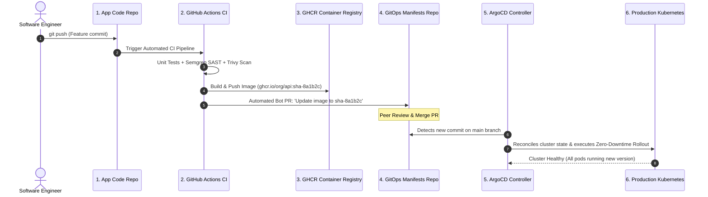
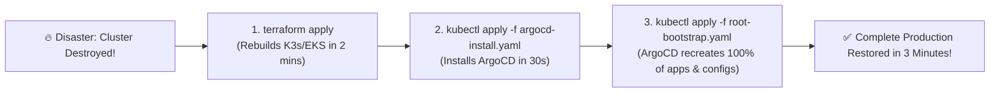

# Production GitOps Architecture & Disaster Recovery

Bringing all the pieces together: In this final lesson, you will architect a complete enterprise-grade GitOps delivery pipeline and execute a live **Cluster Disaster Recovery** drill.



---

## The Automated GitOps CI Pipeline Step

Here is the GitHub Actions step that automatically updates the image tag in your GitOps Manifests repository when a new Docker image is built:

```yaml
# Inside .github/workflows/ci.yml in your Application Code Repo:

- name: Update Image Tag in GitOps Repository
  uses: peter-evans/create-pull-request@v6
  with:
    token: ${{ secrets.GITOPS_REPO_PAT }}
    repository: my-org/k8s-manifests
    branch: update-api-${{ github.sha }}
    title: "chore(release): update web-api image to ${{ github.sha }}"
    body: |
      Automated GitOps release triggered by commit: ${{ github.sha }}
      Author: @${{ github.actor }}
    commit-message: "deploy(api): update image to ${{ github.sha }}"
```

---

## Disaster Recovery Drill: Rebuilding a Dead Cluster in Under 3 Minutes

Imagine your cloud provider experiences a catastrophic failure and your primary Kubernetes cluster is completely deleted.

In a traditional ClickOps environment, rebuilding the infrastructure would take days of manual debugging. **With GitOps and Infrastructure as Code, recovery takes 3 simple commands**:



### Execution Steps:
1. **Rebuild Infrastructure with Terraform**:
   ```bash
   cd terraform/environments/prod
   terraform apply -auto-approve
   ```
2. **Install ArgoCD**:
   ```bash
   kubectl create namespace argocd
   kubectl apply -n argocd -f https://raw.githubusercontent.com/argoproj/argo-cd/stable/manifests/install.yaml
   ```
3. **Apply the Root Bootstrap Application**:
   ```bash
   kubectl apply -f root-bootstrap.yaml
   ```

ArgoCD connects to your Git repository, renders all Kustomize overlays, restores secrets from Sealed Secrets, mounts Ingress routes, and resumes traffic with **zero human guesswork**.
