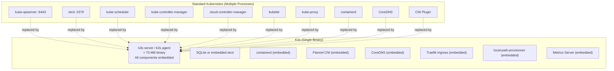
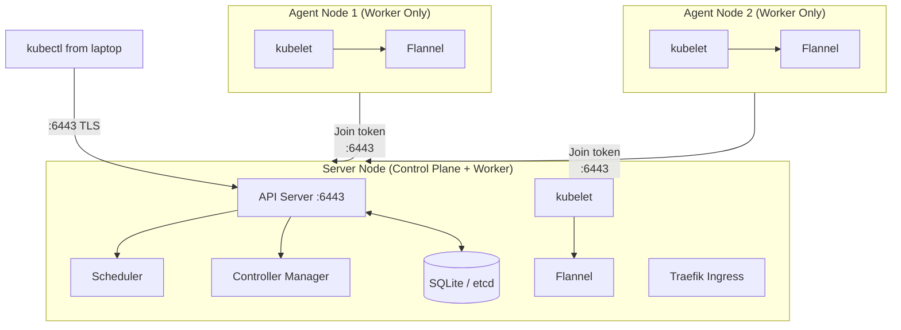

# The Problem with Standard Kubernetes

Full Kubernetes (often called "upstream" or "vanilla" Kubernetes) was designed for large, cloud-native organizations running hundreds of microservices across dozens of nodes. Its architecture reflects that scale:

- **etcd** — a distributed key-value store that requires 3 or 5 nodes for high availability
- **kube-apiserver** — the REST API gateway to the entire cluster
- **kube-scheduler** — decides which node each pod runs on
- **kube-controller-manager** — runs 30+ reconciliation loops (deployments, services, endpoints...)
- **cloud-controller-manager** — integrates with AWS/GCP/Azure load balancers and volumes
- **kubelet** — the per-node agent that actually runs containers
- **kube-proxy** — manages iptables rules for Service networking
- **Container runtime** — containerd or CRI-O

All of these are separate processes, separately configured, separately monitored. A production-grade Kubernetes cluster at a company like Airbnb requires a dedicated platform engineering team just to keep it healthy.

For individual developers, small startups, edge deployments, or production workloads on a single VPS — this overhead is prohibitive.

**K3s solves this by packaging the entire cluster into a single binary.**

---

## What Exactly Is K3s?

K3s is a **fully CNCF-certified Kubernetes distribution** created by Rancher Labs (acquired by SUSE in 2020). The "3" in K3s is a joke: "half of K8s" — 8 letters minus 5 = 3. Despite the humor, K3s passes the full Kubernetes conformance test suite.



---

## What K3s Removes from Standard Kubernetes

| Standard K8s Component | K3s Approach | Why |
|------------------------|-------------|-----|
| **etcd** | SQLite (single node) or embedded etcd (HA) | SQLite needs zero ops. Embedded etcd is used for HA multi-node. |
| **Cloud provider integrations** | Removed (optional via Helm) | No AWS/GCP-specific code bloating the binary |
| **Alpha/deprecated API groups** | Removed | Reduces binary size and attack surface |
| **Docker (dockershim)** | containerd only | Docker was removed from K8s in 1.24 anyway |
| **In-tree volume plugins** | Removed (use CSI drivers) | Cloud-specific volume drivers are not needed for VPS/bare-metal |

The result: a `k3s` binary that is **~70 MB** vs the hundreds of MB for the individual upstream components combined.

---

## What K3s Adds Out of the Box

This is what makes K3s genuinely better than bare Kubernetes for small deployments — it ships *batteries included*:

| Built-in Component | Version | What It Does |
|-------------------|---------|--------------|
| **Traefik** | v2.x | Ingress Controller — routes HTTP/HTTPS traffic to services |
| **CoreDNS** | 1.x | Cluster DNS — resolves `service.namespace.svc.cluster.local` |
| **Flannel** | latest | CNI — provides Pod-to-Pod networking across nodes |
| **local-path-provisioner** | latest | PVC storage — automatically creates hostPath volumes for PVCs |
| **Metrics Server** | latest | Enables `kubectl top pods` and HPA scaling |
| **Helm Controller** | latest | Deploy Helm charts via Kubernetes CRDs |

None of these come with standard Kubernetes. Each requires separate installation and configuration.

---

## K3s Architecture: Server vs Agent



**Single-node setup** (most common): Run `k3s server`. The same node acts as both the control plane and a worker. Perfect for a single VPS.

**Multi-node setup**: Run `k3s server` on one node, `k3s agent` on worker nodes. Workers register with the server using a join token.

---

## K3s vs Other Lightweight Kubernetes Options

| Tool | Use Case | Production-Ready? | Runs on Real Server? |
|------|----------|------------------|---------------------|
| **minikube** | Local learning, desktop dev | ❌ No | ❌ No (VM-based) |
| **kind** (K8s in Docker) | CI/CD testing environments | ❌ No (ephemeral) | ❌ No |
| **k3d** | K3s in Docker, local dev | ❌ No (ephemeral) | ❌ No |
| **MicroK8s** | Ubuntu-specific snap package | ⚠️ Limited | ✅ Yes |
| **K3s** | VPS, edge, bare-metal, Raspberry Pi | ✅ **Yes** | ✅ **Yes** |
| **RKE2** | Air-gapped, FIPS-compliant enterprise | ✅ Yes | ✅ Yes |

K3s is the only option in this list that is:
- Genuinely production-ready (used by Netflix, AWS, and thousands of companies)
- Runs on any Linux machine from a Raspberry Pi to a 64-core server
- Passes the full CNCF Kubernetes conformance test suite

---

## Real-World K3s Use Cases

### 1. Single-VPS Production Deployment
A startup running their entire application (API, database, ingress, monitoring) on a €10/month Hetzner VPS. K3s handles all the orchestration, rolling updates, and self-healing.

### 2. Edge Computing / IoT
K3s is the Kubernetes distribution of choice for edge deployments. Chick-fil-A runs K3s in each of their restaurants on commodity hardware for real-time ordering and inventory management.

### 3. Development Environments
Teams use K3s to spin up ephemeral environments for feature branches. Each PR gets its own K3s cluster via Terraform, used for integration testing, then destroyed on merge.

### 4. Raspberry Pi Home Lab
K3s runs on ARM64, making it perfect for a Raspberry Pi cluster. A quad-Pi cluster with K3s gives you a real multi-node Kubernetes environment at home for ~$200.

### 5. CI/CD Runners
GitHub Actions, GitLab CI, and Jenkins can run inside K3s. The cluster autoscales by spinning up new pods as build jobs queue up.

---

## K3s Resource Requirements

| Configuration | RAM | CPU | Disk |
|---------------|-----|-----|------|
| Minimal (server only, no workloads) | 512 MB | 1 core | 4 GB |
| Single-node production | 2 GB | 2 cores | 20 GB |
| Small team production | 4 GB | 2-4 cores | 40 GB |
| Medium production | 8 GB | 4-8 cores | 80 GB |

Compare this to EKS (Amazon's managed Kubernetes): the control plane alone costs ~$72/month before you pay for any EC2 worker nodes.

---

## K3s and Kubernetes API Compatibility

Every Kubernetes resource you've learned works identically in K3s:

```bash
# These work exactly the same in K3s as in EKS, GKE, or AKS:
kubectl apply -f deployment.yaml
kubectl apply -f service.yaml
kubectl apply -f ingress.yaml
kubectl get pods -n production
kubectl logs -f pod-name
kubectl exec -it pod-name -- /bin/sh
kubectl rollout status deployment/myapp
kubectl rollout undo deployment/myapp
```

You can take a Helm chart designed for AWS EKS and deploy it to K3s without modification. The only differences are:
- **StorageClass**: K3s uses `local-path` instead of AWS EBS or GCP PD
- **LoadBalancer Services**: K3s uses the host node's IP instead of a cloud load balancer
- **Ingress**: K3s uses Traefik instead of ALB or NGINX (both support the same Ingress spec)

---

## The K3s Ecosystem

K3s is not a dead-end learning tool — it's surrounded by a production-grade ecosystem:

| Tool | Purpose |
|------|---------|
| **Rancher** | Multi-cluster management UI — manage dozens of K3s clusters from one dashboard |
| **Fleet** | GitOps at scale — deploy apps across thousands of K3s clusters |
| **Longhorn** | Distributed block storage for K3s — replaces `local-path` with HA storage |
| **k3sup** | CLI tool for remotely installing K3s over SSH |
| **k3d** | Run K3s inside Docker containers for local development |
| **Terraform K3s provider** | Provision K3s clusters via Infrastructure as Code |

---

## CNCF Certification: What It Means

K3s passes the [CNCF Kubernetes Conformance Test Suite](https://github.com/cncf/k8s-conformance). This means:

- All standard Kubernetes API objects work as documented
- Your skills and manifests are fully portable between K3s and any other certified distribution
- Employers and certifications (CKA, CKAD, CKS) recognize K3s as valid Kubernetes experience

The CNCF certification is not a marketing claim — it requires passing 1,200+ automated conformance tests against the cluster.

---

## Summary

K3s is a fully certified, single-binary Kubernetes distribution that:
- Packages the **entire Kubernetes cluster** (control plane + worker) into a **single < 70 MB binary**
- Ships **batteries included**: Traefik, Flannel, CoreDNS, local-path-provisioner, Metrics Server
- Is **production-ready** and used in real-world deployments from startups to enterprises
- Runs on **any Linux machine**: VPS, bare metal, Raspberry Pi, edge devices
- Provides **100% API compatibility** with upstream Kubernetes — every manifest, every kubectl command, every Helm chart works identically
- Costs as little as **€6/month** (Hetzner CX22) for a production cluster vs $72+/month for managed Kubernetes

In the next lesson, you will install K3s on a Linux server in under 60 seconds and configure remote `kubectl` access from your laptop.
