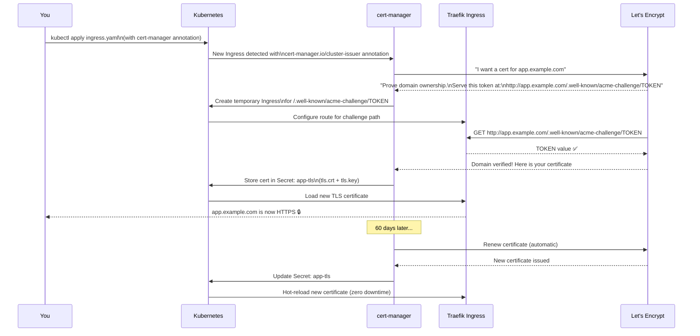

# Free, Automatic, Zero-Maintenance TLS

Before cert-manager existed, managing TLS certificates was painful:
1. Manually request a certificate from a CA (often costs money)
2. Download the `.crt` and `.key` files
3. Upload them to your server
4. Configure your web server to use them
5. Set a calendar reminder to renew 30 days before expiry
6. Repeat every 90 days, forever

**cert-manager eliminates every one of these steps.** It watches your Kubernetes cluster for `Ingress` and `Certificate` resources, automatically requests certificates from Let's Encrypt, stores them as Kubernetes Secrets, and renews them automatically before expiry. You configure it once and never think about TLS again.

---

## How cert-manager Works: The Complete Flow



---

## Step 1: Install cert-manager

cert-manager is installed via a Helm chart (recommended) or a static manifest:

### Option A: Helm (Recommended)

```bash
# Add the Jetstack Helm repo
helm repo add jetstack https://charts.jetstack.io
helm repo update

# Install cert-manager with CRDs
# CRDs (CustomResourceDefinitions) define Certificate, ClusterIssuer, etc.
helm install cert-manager jetstack/cert-manager \
  --namespace cert-manager \
  --create-namespace \
  --version v1.14.5 \
  --set installCRDs=true \
  --set prometheus.enabled=false   # Enable later in the monitoring lesson

# Verify all pods are Running (takes ~60 seconds)
kubectl -n cert-manager get pods
# NAME                                      READY   STATUS    RESTARTS
# cert-manager-xxx                          1/1     Running   0          ← Main controller
# cert-manager-cainjector-xxx               1/1     Running   0          ← Webhook CA injection
# cert-manager-webhook-xxx                  1/1     Running   0          ← Validates resources
```

### Option B: Static Manifest

```bash
kubectl apply -f https://github.com/cert-manager/cert-manager/releases/download/v1.14.5/cert-manager.yaml

# Wait for webhook to be ready (important — applying CRDs too early fails)
kubectl -n cert-manager rollout status deployment/cert-manager-webhook
```

### Verify the Installation

```bash
# Check the CRDs were created
kubectl get crd | grep cert-manager
# certificaterequests.cert-manager.io
# certificates.cert-manager.io
# challenges.acme.cert-manager.io
# clusterissuers.cert-manager.io
# issuers.cert-manager.io
# orders.acme.cert-manager.io

# Install the cmctl CLI for local testing
curl -L -o cmctl https://github.com/cert-manager/cert-manager/releases/latest/download/cmctl-linux-amd64
chmod +x cmctl && sudo mv cmctl /usr/local/bin/

# Run the built-in check
cmctl check api
# The cert-manager API is ready
```

---

## Step 2: Create ClusterIssuers

A `ClusterIssuer` defines *how* cert-manager obtains certificates. It's cluster-scoped — available to all namespaces.

### Staging ClusterIssuer (Use First!)

```yaml
# cluster-issuer-staging.yaml
apiVersion: cert-manager.io/v1
kind: ClusterIssuer
metadata:
  name: letsencrypt-staging
spec:
  acme:
    # Let's Encrypt STAGING environment
    # Rate limits: 1500 certificates/domain/week (much higher than prod)
    # Certs are signed by a FAKE CA (not trusted by browsers — for testing only)
    server: https://acme-staging-v02.api.letsencrypt.org/directory
    email: you@example.com   # ← Replace with your email (Let's Encrypt sends expiry warnings here)
    privateKeySecretRef:
      name: letsencrypt-staging-account-key   # cert-manager stores the ACME account key here
    solvers:
      - http01:
          ingress:
            ingressClassName: traefik
```

### Production ClusterIssuer

```yaml
# cluster-issuer-prod.yaml
apiVersion: cert-manager.io/v1
kind: ClusterIssuer
metadata:
  name: letsencrypt-prod
spec:
  acme:
    # Let's Encrypt PRODUCTION environment
    # Rate limits: 50 certificates/registered domain/week
    # Certs are signed by a REAL CA (trusted by all browsers)
    server: https://acme-v02.api.letsencrypt.org/directory
    email: you@example.com   # ← Replace with your email
    privateKeySecretRef:
      name: letsencrypt-prod-account-key
    solvers:
      - http01:
          ingress:
            ingressClassName: traefik
```

```bash
kubectl apply -f cluster-issuer-staging.yaml
kubectl apply -f cluster-issuer-prod.yaml

# Verify both issuers are Ready (takes a few seconds to register with Let's Encrypt)
kubectl get clusterissuer
# NAME                   READY   AGE
# letsencrypt-staging    True    15s
# letsencrypt-prod       True    15s

# If not Ready, check the details
kubectl describe clusterissuer letsencrypt-staging
```

<Callout type="warning" title="Always Test with Staging First">
Let's Encrypt production rate limits are strict: **50 certificates per registered domain per week**. If you're debugging a configuration issue and keep requesting new certs, you'll hit the limit and be locked out for 7 days.

The staging environment has a limit of 1,500 certificates per week — generous enough for debugging. Staging certs are signed by `(STAGING) Let's Encrypt` and show "Not Secure" in browsers, but everything else works identically. Test with staging, then switch to prod when it works.
</Callout>

---

## Step 3: Request a Certificate via Ingress Annotation

The simplest way to get a cert: add one annotation to your `Ingress`:

```yaml
# ingress.yaml
apiVersion: networking.k8s.io/v1
kind: Ingress
metadata:
  name: myapp-ingress
  namespace: myapp
  annotations:
    # This annotation triggers cert-manager to request a certificate
    cert-manager.io/cluster-issuer: "letsencrypt-staging"   # ← Start with staging!
spec:
  ingressClassName: traefik
  tls:
    - hosts:
        - app.yourdomain.com
      secretName: app-tls   # cert-manager creates this Secret automatically
  rules:
    - host: app.yourdomain.com
      http:
        paths:
          - path: /
            pathType: Prefix
            backend:
              service:
                name: myapp-service
                port:
                  number: 80
```

```bash
kubectl apply -f ingress.yaml

# Watch the certificate being issued (1-2 minutes)
kubectl -n myapp get certificate -w
# NAME      READY   SECRET    AGE
# app-tls   False   app-tls   5s
# app-tls   True    app-tls   45s   ← Certificate issued!
```

---

## Step 4: Inspect the Certificate

```bash
# High-level certificate status
kubectl -n myapp get certificate app-tls
# NAME      READY   SECRET    AGE
# app-tls   True    app-tls   2m

# Detailed view (includes expiry date, issuer, renewal time)
kubectl -n myapp describe certificate app-tls
# Status:
#   Conditions:
#     Type:               Ready
#     Status:             True
#     Message:            Certificate is up to date and has not expired
#   Not After:            2024-04-15 10:30:00 +0000 UTC   ← Expiry
#   Not Before:           2024-01-15 10:30:00 +0000 UTC   ← Issued
#   Renewal Time:         2024-03-16 10:30:00 +0000 UTC   ← Auto-renewed before this

# View the raw certificate from the Secret
kubectl -n myapp get secret app-tls -o jsonpath='{.data.tls\.crt}' | \
  base64 -d | openssl x509 -noout -text | grep -A3 "Issuer\|Subject\|Validity"
# Issuer: CN=(STAGING) Let's Encrypt ECDSA R11   ← Staging issuer
# Subject: CN=app.yourdomain.com
# Validity:
#   Not Before: Jan 15 10:30:00 2024 GMT
#   Not After : Apr 15 10:30:00 2024 GMT
```

---

## Step 5: Test the Staging Certificate

The staging certificate is NOT trusted by browsers (shows "Not Secure"). Use `-k` (insecure) flag with curl:

```bash
# Test HTTPS with staging cert (bypass certificate trust check)
curl -k https://app.yourdomain.com/api/health
# {"status":"ok","db":{"status":"connected"}}   ← App is working over HTTPS!

# The HTTPS connection is established and encrypted (just with an untrusted CA)
# This proves your TLS setup is correct before switching to production
```

---

## Step 6: Switch to the Production Certificate

```bash
# 1. Delete the staging certificate Secret (cert-manager will re-issue)
kubectl -n myapp delete secret app-tls

# 2. Update the Ingress annotation to use the production issuer
kubectl -n myapp annotate ingress myapp-ingress \
  cert-manager.io/cluster-issuer=letsencrypt-prod \
  --overwrite

# 3. Watch the production certificate being issued
kubectl -n myapp get certificate -w
# NAME      READY   SECRET    AGE
# app-tls   False   app-tls   5s
# app-tls   True    app-tls   45s

# 4. Test WITHOUT -k (real certificate, browser-trusted)
curl https://app.yourdomain.com/api/health
# {"status":"ok","db":{"status":"connected"}}   ← 🔒 Real HTTPS!

# 5. Verify the issuer is Let's Encrypt production (not staging)
echo | openssl s_client -connect app.yourdomain.com:443 -servername app.yourdomain.com 2>/dev/null | \
  openssl x509 -noout -issuer
# issuer=C=US, O=Let's Encrypt, CN=E5   ← Production issuer ✅
```

---

## Alternative: Standalone Certificate Resource

Instead of relying on Ingress annotations, you can create `Certificate` resources directly:

```yaml
# certificate.yaml
apiVersion: cert-manager.io/v1
kind: Certificate
metadata:
  name: app-cert
  namespace: myapp
spec:
  secretName: app-tls   # Stores the issued cert here

  # Certificate validity period (Let's Encrypt ignores this — always 90 days)
  duration: 2160h        # 90 days

  # Renew 30 days before expiry
  renewBefore: 720h      # 30 days

  subject:
    organizations:
      - MyApp Inc.

  # DNS names covered by this cert
  dnsNames:
    - app.yourdomain.com
    - api.yourdomain.com    # Can cover multiple domains in one cert

  issuerRef:
    name: letsencrypt-prod
    kind: ClusterIssuer
```

Advantages of the standalone `Certificate` resource:
- Works even without an `Ingress` (useful for services behind TCP routes)
- Allows multi-domain certificates (SAN certs)
- Can request wildcard certificates (requires DNS-01 challenge)

---

## Wildcard Certificates with DNS-01 Challenge

For `*.yourdomain.com` (covering all subdomains), you need the **DNS-01** challenge instead of HTTP-01. This requires your DNS provider to have an API:

```yaml
# cluster-issuer-cloudflare.yaml
apiVersion: cert-manager.io/v1
kind: ClusterIssuer
metadata:
  name: letsencrypt-cloudflare
spec:
  acme:
    server: https://acme-v02.api.letsencrypt.org/directory
    email: you@example.com
    privateKeySecretRef:
      name: letsencrypt-cloudflare-key
    solvers:
      - dns01:
          cloudflare:
            email: your-cloudflare-email@example.com
            apiTokenSecretRef:
              name: cloudflare-api-token
              key: api-token
        selector:
          dnsNames:
            - "*.yourdomain.com"    # Only use this solver for wildcard certs
```

```bash
# Create the Cloudflare API token secret
kubectl create secret generic cloudflare-api-token \
  --from-literal=api-token=YOUR_CLOUDFLARE_API_TOKEN \
  -n cert-manager

# Then request a wildcard cert
kubectl apply -f - <<EOF
apiVersion: cert-manager.io/v1
kind: Certificate
metadata:
  name: wildcard-cert
  namespace: myapp
spec:
  secretName: wildcard-tls
  dnsNames:
    - "*.yourdomain.com"
    - "yourdomain.com"   # Also cover the apex domain
  issuerRef:
    name: letsencrypt-cloudflare
    kind: ClusterIssuer
EOF
```

---

## Monitoring Certificate Expiry

Set up proactive monitoring so you're alerted if auto-renewal fails:

```bash
# Check all certificates and their expiry dates
kubectl get certificates -A
# NAMESPACE   NAME        READY   SECRET          AGE
# myapp       app-tls     True    app-tls         30d
# monitoring  grafana-tls True    grafana-tls     30d

# Get detailed expiry info for all certs
kubectl get certificates -A -o json | jq -r \
  '.items[] | "\(.metadata.namespace)/\(.metadata.name): expires \(.status.notAfter)"'
# myapp/app-tls: expires 2024-04-15T10:30:00Z
# monitoring/grafana-tls: expires 2024-04-15T10:32:00Z

# Check the actual cert expiry from the Secret
kubectl -n myapp get secret app-tls -o jsonpath='{.data.tls\.crt}' | \
  base64 -d | openssl x509 -noout -enddate
# notAfter=Apr 15 10:30:00 2024 GMT
```

A Prometheus alert for certificate expiry < 14 days (from the CI/CD project lesson):
```yaml
- alert: CertExpiringSoon
  expr: certmanager_certificate_expiration_timestamp_seconds - time() < 14 * 24 * 3600
  for: 1h
  annotations:
    summary: "TLS cert {{ $labels.name }} expires in < 14 days"
```

---

## Troubleshooting Certificate Issuance

### Certificate stuck at READY=False

```bash
# 1. Check the Certificate resource for status messages
kubectl -n myapp describe certificate app-tls
# Look for: "Failed to create Order: ..." or "Waiting for http-01 challenge..."

# 2. Check the Order (ACME protocol order)
kubectl -n myapp get order
kubectl -n myapp describe order app-tls-xxxx

# 3. Check the Challenge (the HTTP-01 challenge pod and Ingress)
kubectl -n myapp get challenge
kubectl -n myapp describe challenge app-tls-xxxx

# 4. Verify port 80 is accessible from the internet
# (Let's Encrypt hits port 80 for HTTP-01 challenge — firewall must allow it)
curl -I http://app.yourdomain.com/.well-known/acme-challenge/test123
# Should return 404 (challenge not found, but port 80 is open)
# If connection refused: firewall is blocking port 80
```

### "Rate limit exceeded"

```bash
kubectl -n myapp describe certificate app-tls | grep -i "rate"
# "too many certificates already issued for: yourdomain.com"

# Check current rate limit status
# https://crt.sh/?q=yourdomain.com (shows all issued certs)

# Solution: wait 1 hour (per-cert limit) or 1 week (per-domain limit)
# Use staging in the meantime to continue testing
```

### "ACME account not registered"

```bash
kubectl -n cert-manager describe clusterissuer letsencrypt-prod
# Look for: "Status: False" and "reason: pending"
# Usually means: the ClusterIssuer just needs 30-60 seconds to register

# Force re-reconciliation
kubectl -n cert-manager delete secret letsencrypt-prod-account-key
# cert-manager will re-create it and re-register
```

---

## cert-manager in Production: Best Practices

| Practice | Why |
|----------|-----|
| **Always test with staging first** | Avoid hitting the 50 cert/week production rate limit |
| **Use `renewBefore: 720h` (30 days)** | Built-in buffer if the ACME server is temporarily unavailable |
| **Monitor with Prometheus alerts** | Don't rely solely on Let's Encrypt expiry emails |
| **Use DNS-01 for wildcard certs** | HTTP-01 can't issue `*.example.com` certificates |
| **Pin cert-manager version** | `helm upgrade` with version pinning prevents breaking changes |
| **Back up `cert-manager` Secrets** | The ACME account key (`letsencrypt-prod-account-key`) is critical |

---

## Summary

cert-manager gives you fully automated TLS certificate management:
- **Installs** as a Kubernetes controller via Helm in the `cert-manager` namespace
- **ClusterIssuers** define the ACME endpoint (staging vs production) and challenge solver (HTTP-01 via Traefik)
- **One annotation** on your `Ingress` (`cert-manager.io/cluster-issuer`) triggers automatic certificate issuance
- Certificates are stored as **Kubernetes Secrets** and **automatically renewed** 30 days before expiry
- Always **test with staging** first to avoid production rate limits
- Use **DNS-01 challenge** with a Cloudflare API token for wildcard `*.yourdomain.com` certificates

In the next lesson, you will scale your K3s cluster by adding worker nodes and configuring workload distribution across multiple servers.
