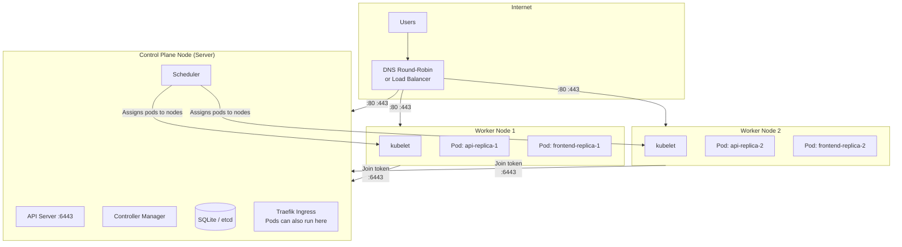

# Why Add Worker Nodes?

A single-node K3s cluster is great for learning and small production workloads. But as your application grows, you hit real limits:

| Problem | Single Node | Multi-Node Cluster |
|---------|------------|-------------------|
| **RAM exhaustion** | App OOMKilled when memory full | Pods spread across nodes |
| **CPU throttling** | All workloads compete on one core | Workloads distributed |
| **Maintenance downtime** | Entire cluster goes down for updates | Drain one node, update, restore |
| **Single point of failure** | Node failure = everything down | Pods reschedule to other nodes |
| **Scaling limits** | One VPS has a hard limit | Add more nodes as you grow |

This lesson covers adding worker nodes to an existing K3s server, configuring workload distribution, and handling node maintenance without downtime.

---

## K3s Multi-Node Architecture



In K3s, by default:
- **Server node**: Runs the control plane AND can run worker pods
- **Agent nodes**: Run worker pods only (no control plane components)
- The **scheduler** automatically distributes pods across all Ready nodes

---

## Step 1: Get the Join Token from the Server

```bash
# SSH into your existing K3s server node
ssh root@SERVER_IP

# Read the node token (keep this secret — it authenticates agents to join)
sudo cat /var/lib/rancher/k3s/server/node-token
# K10abc123def456...::server:xyz789...

# Note your server's internal or public IP
SERVER_IP="your.server.ip.here"
NODE_TOKEN="$(sudo cat /var/lib/rancher/k3s/server/node-token)"
```

---

## Step 2: Prepare the Worker Node

On the **new VPS** that will be a worker:

```bash
# Update and install required tools
sudo apt-get update && sudo apt-get upgrade -y
sudo apt-get install -y curl wget jq

# Open required ports for worker nodes
sudo ufw allow 22/tcp          # SSH
sudo ufw allow 8472/udp        # Flannel VXLAN (pod networking)
sudo ufw allow 10250/tcp       # kubelet API (kubectl exec/logs)
sudo ufw allow 2376/tcp        # Docker TLS (if using Docker)
sudo ufw enable

# Note: Worker nodes do NOT need port 6443 open — only the server does
```

Also, on the **server node**, ensure the worker can reach it:
```bash
# On the server: verify agent can reach the API server
# (port 6443 must be open to the worker node IP)
sudo ufw allow from WORKER_NODE_IP to any port 6443
sudo ufw allow from WORKER_NODE_IP to any port 8472    # Flannel
sudo ufw allow from WORKER_NODE_IP to any port 10250   # kubelet
```

---

## Step 3: Install K3s as an Agent (Worker Node)

On the **worker node**:

```bash
# Install K3s as an agent (worker only — no control plane)
curl -sfL https://get.k3s.io | \
  K3S_URL=https://SERVER_IP:6443 \
  K3S_TOKEN=YOUR_NODE_TOKEN \
  sh -

# What this does:
# 1. Downloads the k3s binary
# 2. Creates /etc/systemd/system/k3s-agent.service
# 3. Starts the agent (connects to the server, registers as a worker)
```

On the **server**, verify the new node joined:

```bash
kubectl get nodes
# NAME         STATUS   ROLES                  AGE    VERSION
# server       Ready    control-plane,master   5d     v1.29.4+k3s1
# worker-1     Ready    <none>                 2m     v1.29.4+k3s1   ← New node!

# Get more detail about node resources
kubectl get nodes -o wide
# NAME       STATUS   ROLES          AGE   VERSION    INTERNAL-IP    OS-IMAGE           KERNEL-VERSION
# server     Ready    control-plane  5d    v1.29.4    10.0.0.1       Ubuntu 22.04 LTS   5.15.0
# worker-1   Ready    <none>         2m    v1.29.4    10.0.0.2       Ubuntu 22.04 LTS   5.15.0
```

---

## Step 4: Label and Taint Nodes

Labels allow the scheduler to target specific nodes. Taints prevent pods from running on nodes unless they explicitly tolerate the taint.

```bash
# Add labels to nodes for workload targeting
kubectl label node worker-1 role=worker environment=production
kubectl label node worker-2 role=worker environment=production gpu=true  # If GPU node
kubectl label node server role=control-plane

# View node labels
kubectl get nodes --show-labels

# Taint the server node to prevent non-system pods from scheduling on it
# (Keep the control plane node lean — only Traefik and system pods)
kubectl taint node server node-role.kubernetes.io/control-plane:NoSchedule
# This means: don't schedule new pods here unless they have the matching toleration
```

---

## Step 5: Spread Workloads Across Nodes

### Pod Anti-Affinity: Ensure Replicas on Different Nodes

This prevents two replicas of the same app from landing on the same node (which would defeat the purpose of having replicas):

```yaml
# deployment.yaml — with anti-affinity
spec:
  replicas: 3
  template:
    spec:
      affinity:
        podAntiAffinity:
          # REQUIRED: Never schedule two api pods on the same node
          requiredDuringSchedulingIgnoredDuringExecution:
            - labelSelector:
                matchLabels:
                  app: api   # This pod's own label
              topologyKey: kubernetes.io/hostname   # "Same node" = same hostname
```

With this configuration, if you have 3 replicas and 3 nodes, each node gets exactly 1 pod. If a node fails, the pod on that node is rescheduled to one of the remaining nodes.

### Topology Spread Constraints: Even Distribution

A more flexible alternative to anti-affinity:

```yaml
spec:
  replicas: 6
  template:
    spec:
      topologySpreadConstraints:
        - maxSkew: 1                          # Max difference in pod count between nodes
          topologyKey: kubernetes.io/hostname
          whenUnsatisfiable: DoNotSchedule   # Strict: reject the pod if constraint can't be met
          labelSelector:
            matchLabels:
              app: api
```

With 6 replicas and 3 nodes: each node gets exactly 2 pods. With `maxSkew: 1`, the distribution can be at most 1 off (e.g., 2/2/2 or 3/2/1 but not 4/1/1).

### Node Selector: Pin Workloads to Specific Nodes

```yaml
spec:
  template:
    spec:
      # Only schedule on nodes with this label
      nodeSelector:
        role: worker   # The label we set in Step 4
```

### Node Affinity: More Flexible Than nodeSelector

```yaml
spec:
  template:
    spec:
      affinity:
        nodeAffinity:
          # REQUIRED: Must run on a worker node
          requiredDuringSchedulingIgnoredDuringExecution:
            nodeSelectorTerms:
              - matchExpressions:
                  - key: role
                    operator: In
                    values: ["worker"]
          # PREFERRED: Try to run on nodes in az-west (soft preference)
          preferredDuringSchedulingIgnoredDuringExecution:
            - weight: 100
              preference:
                matchExpressions:
                  - key: topology.kubernetes.io/zone
                    operator: In
                    values: ["az-west"]
```

---

## Step 6: Node Maintenance — Drain and Cordon

When you need to update a node, you don't want to abruptly kill its pods. The proper procedure is to **cordon** (mark unschedulable) and **drain** (evict pods gracefully):

```bash
# === Maintenance Window: Update worker-1 ===

# Step 1: Cordon the node (mark as unschedulable)
# New pods won't be scheduled here, existing pods keep running
kubectl cordon worker-1
# node/worker-1 cordoned

# Step 2: Drain the node (evict all pods gracefully)
# - Pods with a PodDisruptionBudget respect the disruption budget
# - Pods migrate to other nodes
# - DaemonSet pods are skipped (they run on every node intentionally)
kubectl drain worker-1 \
  --ignore-daemonsets \        # Skip DaemonSet pods (kube-proxy, Flannel, etc.)
  --delete-emptydir-data \     # Delete pods using emptyDir volumes (they're temporary anyway)
  --grace-period=60 \          # Give pods 60s to gracefully terminate
  --timeout=300s               # Fail if drain takes more than 5 minutes

# Step 3: Perform maintenance (OS updates, K3s upgrade, etc.)
ssh root@WORKER_1_IP
sudo apt-get update && sudo apt-get upgrade -y
# Or upgrade K3s:
curl -sfL https://get.k3s.io | INSTALL_K3S_VERSION=v1.30.0+k3s1 sh -

# Step 4: Uncordon the node (mark as schedulable again)
kubectl uncordon worker-1
# node/worker-1 uncordoned

# Pods will gradually reschedule back (or stay on other nodes until they're restarted)
kubectl get pods -o wide -A | grep worker-1
```

---

## PodDisruptionBudget: Protect Against Involuntary Disruptions

A `PodDisruptionBudget` (PDB) tells Kubernetes how many pods of a Deployment can be unavailable at once during voluntary disruptions (drain, eviction):

```yaml
# pdb.yaml
apiVersion: policy/v1
kind: PodDisruptionBudget
metadata:
  name: api-pdb
  namespace: myapp
spec:
  # Option A: Min available (at least 2 pods must be running at all times)
  minAvailable: 2

  # Option B: Max unavailable (at most 1 pod can be down at once)
  # maxUnavailable: 1

  selector:
    matchLabels:
      app: api
```

```bash
kubectl apply -f pdb.yaml

# Verify the PDB
kubectl -n myapp get pdb
# NAME      MIN AVAILABLE   MAX UNAVAILABLE   ALLOWED DISRUPTIONS   AGE
# api-pdb   2               N/A               1                     5s

# "ALLOWED DISRUPTIONS: 1" means 1 pod can be evicted right now
# (3 running - 2 min available = 1 allowed disruption)
```

When you `kubectl drain` a node, Kubernetes will:
1. Try to evict all pods on the node
2. For each pod, check if there's a PDB
3. If evicting would violate the PDB, **wait** until other pods are Running elsewhere
4. Only then evict the pod

This ensures **zero downtime during node maintenance** even with strict PDBs.

---

## Horizontal Pod Autoscaler (HPA)

The HPA automatically scales the number of replicas based on CPU or memory usage:

```yaml
# hpa.yaml
apiVersion: autoscaling/v2
kind: HorizontalPodAutoscaler
metadata:
  name: api-hpa
  namespace: myapp
spec:
  scaleTargetRef:
    apiVersion: apps/v1
    kind: Deployment
    name: api

  minReplicas: 2       # Always run at least 2 replicas
  maxReplicas: 10      # Never exceed 10 replicas

  metrics:
    # Scale up when average CPU usage exceeds 70%
    - type: Resource
      resource:
        name: cpu
        target:
          type: Utilization
          averageUtilization: 70

    # Scale up when average memory usage exceeds 80%
    - type: Resource
      resource:
        name: memory
        target:
          type: Utilization
          averageUtilization: 80

  behavior:
    scaleUp:
      stabilizationWindowSeconds: 60    # Wait 60s before scaling up again
      policies:
        - type: Pods
          value: 2                      # Add at most 2 pods per scale event
          periodSeconds: 60
    scaleDown:
      stabilizationWindowSeconds: 300   # Wait 5 minutes before scaling down
      policies:
        - type: Pods
          value: 1                      # Remove at most 1 pod per scale event
          periodSeconds: 60
```

```bash
kubectl apply -f hpa.yaml

# Watch the HPA in action
kubectl -n myapp get hpa -w
# NAME      REFERENCE          TARGETS          MINPODS   MAXPODS   REPLICAS
# api-hpa   Deployment/api     35%/70%,40%/80%  2         10        2
# (during high load)
# api-hpa   Deployment/api     85%/70%,40%/80%  2         10        4   ← Scaled up!

# Simulate load to see autoscaling
kubectl -n myapp run load-test --image=busybox --restart=Never -- \
  /bin/sh -c "while true; do wget -q -O- http://api.myapp.svc.cluster.local/api/items; done"
```

---

## Adding a High-Availability Control Plane

For mission-critical workloads, run 3 server nodes with embedded etcd for control plane HA:

```bash
# Initialize the FIRST server node with embedded etcd
curl -sfL https://get.k3s.io | sh -s - --cluster-init

# Get the first server's token
TOKEN=$(sudo cat /var/lib/rancher/k3s/server/node-token)

# Join SECOND server node to the cluster
curl -sfL https://get.k3s.io | sh -s - \
  --server https://FIRST_SERVER_IP:6443 \
  --token $TOKEN

# Join THIRD server node (for etcd quorum — need 3 for HA)
curl -sfL https://get.k3s.io | sh -s - \
  --server https://FIRST_SERVER_IP:6443 \
  --token $TOKEN

# Verify all three control plane nodes
kubectl get nodes
# NAME       STATUS   ROLES                       AGE   VERSION
# server-1   Ready    control-plane,etcd,master   10m   v1.29.4+k3s1
# server-2   Ready    control-plane,etcd,master   5m    v1.29.4+k3s1
# server-3   Ready    control-plane,etcd,master   2m    v1.29.4+k3s1
```

With 3 server nodes: the etcd cluster can tolerate 1 node failure (needs 2/3 nodes for quorum). Place a load balancer (HAProxy or cloud LB) in front of the 3 API servers for true HA kubectl access.

---

## Summary

You've scaled your K3s cluster with multiple nodes:
- **Agent nodes** join by running the installer with `K3S_URL` and `K3S_TOKEN` — connecting to the server in under 60 seconds
- **Labels and taints** control which workloads run on which nodes
- **Pod anti-affinity** and **topology spread constraints** distribute replicas across nodes for high availability
- **Drain + cordon** enables zero-downtime node maintenance — pods gracefully migrate to other nodes
- **PodDisruptionBudgets** protect against involuntary disruptions during maintenance
- **HPA** automatically scales replica counts based on CPU/memory metrics
- **3-server HA** with embedded etcd eliminates the control plane as a single point of failure

In the next lesson, you will implement automated backup strategies for your K3s cluster data and persistent volumes.
