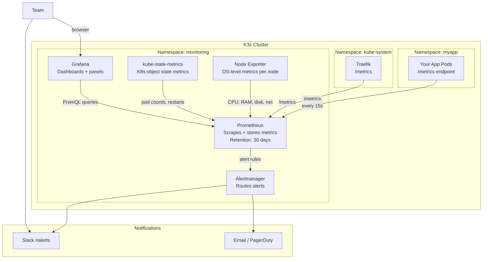

# Production Observability for K3s

Running a K3s cluster without monitoring is like driving with your eyes closed. You find out about problems only when users complain — after the damage is done.

A production monitoring stack gives you:
- **Metrics** — CPU, memory, disk, network, pod health — collected every 15 seconds
- **Dashboards** — visual, interactive, real-time and historical
- **Alerts** — proactive notifications sent to Slack/email before users notice

This lesson deploys the complete `kube-prometheus-stack`, which bundles Prometheus, Grafana, Alertmanager, Node Exporter (per-node OS metrics), and kube-state-metrics (Kubernetes object metrics) — all pre-configured to work together.

---

## The Monitoring Architecture



---

## Step 1: Install Helm

```bash
# Install Helm (if not already installed from earlier lessons)
curl https://raw.githubusercontent.com/helm/helm/main/scripts/get-helm-3 | bash

helm version
# version.BuildInfo{Version:"v3.14.x", ...}
```

---

## Step 2: Install kube-prometheus-stack

```bash
# Add the Prometheus Community Helm repository
helm repo add prometheus-community https://prometheus-community.github.io/helm-charts
helm repo update

# Create a values file for customization
cat > /tmp/monitoring-values.yaml << 'EOF'
# Grafana configuration
grafana:
  adminPassword: "changeme-use-a-secret-in-prod"  # Change this!
  
  # Persistence: save dashboards across Grafana restarts
  persistence:
    enabled: true
    size: 5Gi
    storageClassName: local-path

  # Configure Grafana's data source (Prometheus) automatically
  sidecar:
    dashboards:
      enabled: true    # Auto-load dashboards from ConfigMaps

# Prometheus configuration
prometheus:
  prometheusSpec:
    # Keep 30 days of metrics
    retention: 30d
    
    # Maximum disk usage for metrics storage
    retentionSize: "15GB"
    
    # Persistence: keep metrics across Prometheus restarts
    storageSpec:
      volumeClaimTemplate:
        spec:
          storageClassName: local-path
          resources:
            requests:
              storage: 20Gi

    # Scrape all ServiceMonitors and PodMonitors in all namespaces
    serviceMonitorSelectorNilUsesHelmValues: false
    podMonitorSelectorNilUsesHelmValues: false

# Alertmanager configuration (we'll update with Slack webhook later)
alertmanager:
  alertmanagerSpec:
    retention: 120h   # Keep alert history for 5 days

# Node Exporter: runs on every node, collects OS-level metrics
nodeExporter:
  enabled: true

# kube-state-metrics: collects K8s object state metrics
kubeStateMetrics:
  enabled: true

# K3s-specific: CoreDNS uses a different port than standard K8s
coreDns:
  enabled: true
  service:
    port: 9153
    targetPort: 9153
EOF

# Install the stack (takes 2-4 minutes)
helm install monitoring prometheus-community/kube-prometheus-stack \
  --namespace monitoring \
  --create-namespace \
  --values /tmp/monitoring-values.yaml \
  --version 56.21.4   # Pin version for reproducibility

# Watch pods come up
kubectl -n monitoring get pods -w
```

Expected pods when everything is Running:
```
NAME                                                   READY   STATUS
alertmanager-monitoring-kube-prometheus-alertmanager-0  2/2    Running
monitoring-grafana-xxx                                  3/3    Running
monitoring-kube-prometheus-operator-xxx                 1/1    Running
monitoring-kube-state-metrics-xxx                       1/1    Running
monitoring-prometheus-node-exporter-xxx                 1/1    Running   ← One per node
prometheus-monitoring-kube-prometheus-prometheus-0      2/2    Running
```

---

## Step 3: Access Grafana

### Option A: Port-Forward (Quick Check)

```bash
kubectl -n monitoring port-forward svc/monitoring-grafana 3000:80

# Open http://localhost:3000
# Username: admin
# Password: changeme-use-a-secret-in-prod  (what you set in values)
```

### Option B: Expose via Ingress (Production)

```yaml
# grafana-ingress.yaml
apiVersion: networking.k8s.io/v1
kind: Ingress
metadata:
  name: grafana-ingress
  namespace: monitoring
  annotations:
    cert-manager.io/cluster-issuer: "letsencrypt-prod"
    # Protect Grafana with basic auth as an extra layer
    traefik.ingress.kubernetes.io/router.middlewares: monitoring-basic-auth@kubernetescrd
spec:
  ingressClassName: traefik
  tls:
    - hosts:
        - grafana.yourdomain.com
      secretName: grafana-tls
  rules:
    - host: grafana.yourdomain.com
      http:
        paths:
          - path: /
            pathType: Prefix
            backend:
              service:
                name: monitoring-grafana
                port:
                  number: 80
```

```bash
kubectl apply -f grafana-ingress.yaml
# Then open https://grafana.yourdomain.com
```

---

## Step 4: Explore Pre-Built Dashboards

kube-prometheus-stack ships with 30+ pre-built dashboards. In Grafana:

**Dashboards → Browse → Kubernetes**

| Dashboard | What You See |
|-----------|-------------|
| **Kubernetes / Compute Resources / Cluster** | Overall CPU and memory across all nodes |
| **Kubernetes / Compute Resources / Namespace (Pods)** | Per-pod resource usage in a namespace |
| **Kubernetes / Compute Resources / Node (Pods)** | Pod distribution and resource usage per node |
| **Kubernetes / Networking / Cluster** | Network bytes in/out per pod |
| **Node Exporter / Full** | Detailed OS metrics: disk I/O, network, CPU per-core |
| **Kubernetes / Persistent Volumes** | PVC usage and availability |

Import additional community dashboards via **Dashboards → Import → Enter Dashboard ID**:

| ID | Dashboard | Description |
|----|-----------|-------------|
| 14430 | cert-manager | TLS certificate expiry tracking |
| 7587 | Blackbox Exporter | HTTP endpoint uptime and latency |
| 13659 | Traefik 2 | Requests/s, error rates, latency |
| 17375 | Node Exporter Full | Comprehensive node metrics |

---

## Step 5: Configure Alertmanager → Slack

```yaml
# alertmanager-config.yaml
apiVersion: v1
kind: Secret
metadata:
  name: alertmanager-monitoring-kube-prometheus-alertmanager
  namespace: monitoring
type: Opaque
stringData:
  alertmanager.yaml: |
    global:
      resolve_timeout: 5m

    # Slack webhook URL — create at: api.slack.com/apps → Incoming Webhooks
      slack_api_url: "https://hooks.slack.com/services/YOUR/SLACK/WEBHOOK"

    route:
      # Group related alerts together to avoid notification storms
      group_by: ["alertname", "namespace", "job"]
      group_wait: 30s           # Wait 30s before sending the first notification
      group_interval: 5m        # Wait 5m before sending updates to an existing group
      repeat_interval: 4h       # Re-notify after 4h if still firing
      receiver: slack-default

      routes:
        # Critical: send immediately, repeat every 1 hour
        - matchers:
            - severity = "critical"
          receiver: slack-critical
          repeat_interval: 1h

        # Watchdog (always-firing heartbeat alert — use for "silence is broken" monitoring)
        - matchers:
            - alertname = "Watchdog"
          receiver: null    # Suppress Watchdog notifications

    receivers:
      - name: "null"

      - name: slack-default
        slack_configs:
          - channel: "#k3s-alerts"
            send_resolved: true
            title: '{{ if eq .Status "firing" }}🔥{{ else }}✅{{ end }} {{ .GroupLabels.alertname }}'
            text: |
              *Status:* {{ .Status | toUpper }}
              *Namespace:* {{ .GroupLabels.namespace }}
              {{ range .Alerts }}
              *Description:* {{ .Annotations.description }}
              {{ end }}

      - name: slack-critical
        slack_configs:
          - channel: "#k3s-critical"
            send_resolved: true
            title: '🚨 CRITICAL: {{ .GroupLabels.alertname }}'
            text: |
              *Status:* {{ .Status | toUpper }}
              {{ range .Alerts }}
              *Description:* {{ .Annotations.description }}
              *Runbook:* {{ .Annotations.runbook_url }}
              {{ end }}
```

```bash
kubectl apply -f alertmanager-config.yaml

# Reload Alertmanager config
kubectl -n monitoring rollout restart statefulset/alertmanager-monitoring-kube-prometheus-alertmanager
```

---

## Step 6: Create Custom Alert Rules

```yaml
# k3s-custom-alerts.yaml
apiVersion: monitoring.coreos.com/v1
kind: PrometheusRule
metadata:
  name: k3s-custom-alerts
  namespace: monitoring
  labels:
    release: monitoring   # Must match the Helm release name
spec:
  groups:
    - name: k3s-cluster.rules
      rules:

        # Node memory usage > 85%
        - alert: NodeMemoryHigh
          expr: |
            (
              node_memory_MemTotal_bytes - node_memory_MemAvailable_bytes
            ) / node_memory_MemTotal_bytes * 100 > 85
          for: 5m
          labels:
            severity: warning
          annotations:
            summary: "Node {{ $labels.instance }} memory usage > 85%"
            description: "Memory: {{ $value | printf \"%.1f\" }}% used on {{ $labels.instance }}"

        # Node disk usage > 80%
        - alert: NodeDiskHigh
          expr: |
            (
              node_filesystem_size_bytes{mountpoint="/", fstype!="tmpfs"}
              - node_filesystem_free_bytes{mountpoint="/", fstype!="tmpfs"}
            ) / node_filesystem_size_bytes{mountpoint="/", fstype!="tmpfs"} * 100 > 80
          for: 10m
          labels:
            severity: warning
          annotations:
            summary: "Node {{ $labels.instance }} disk usage > 80%"
            description: "Disk: {{ $value | printf \"%.1f\" }}% used. Free up space soon."

        # Node disk usage > 95% (critical)
        - alert: NodeDiskCritical
          expr: |
            (
              node_filesystem_size_bytes{mountpoint="/", fstype!="tmpfs"}
              - node_filesystem_free_bytes{mountpoint="/", fstype!="tmpfs"}
            ) / node_filesystem_size_bytes{mountpoint="/", fstype!="tmpfs"} * 100 > 95
          for: 5m
          labels:
            severity: critical
          annotations:
            summary: "Node {{ $labels.instance }} disk is almost full!"
            description: "Disk: {{ $value | printf \"%.1f\" }}% used. IMMEDIATE action required."

        # Pod crash-looping
        - alert: PodCrashLooping
          expr: |
            rate(kube_pod_container_status_restarts_total[15m]) * 60 > 1
          for: 5m
          labels:
            severity: critical
          annotations:
            summary: "Pod {{ $labels.namespace }}/{{ $labels.pod }} is crash-looping"
            description: "Container {{ $labels.container }} is restarting > 1x/min for 5 minutes."

        # Pod not ready for > 5 minutes
        - alert: PodNotReady
          expr: |
            kube_pod_status_ready{condition="true"} == 0
          for: 5m
          labels:
            severity: warning
          annotations:
            summary: "Pod {{ $labels.namespace }}/{{ $labels.pod }} is not ready"
            description: "Pod has been in a non-ready state for more than 5 minutes."

        # PVC usage > 80%
        - alert: PVCUsageHigh
          expr: |
            (
              kubelet_volume_stats_used_bytes
              / kubelet_volume_stats_capacity_bytes
            ) * 100 > 80
          for: 10m
          labels:
            severity: warning
          annotations:
            summary: "PVC {{ $labels.namespace }}/{{ $labels.persistentvolumeclaim }} > 80% full"
            description: "PVC is {{ $value | printf \"%.1f\" }}% full. Consider expanding."

        # cert-manager certificate expiring within 14 days
        - alert: CertificateExpiringSoon
          expr: |
            certmanager_certificate_expiration_timestamp_seconds - time() < 14 * 24 * 3600
          for: 1h
          labels:
            severity: warning
          annotations:
            summary: "Certificate {{ $labels.namespace }}/{{ $labels.name }} expires in < 14 days"
            description: "Check cert-manager logs for renewal issues."

        # Traefik 5xx error rate > 5%
        - alert: TraefikHighErrorRate
          expr: |
            (
              rate(traefik_service_requests_total{code=~"5.."}[5m])
              / rate(traefik_service_requests_total[5m])
            ) > 0.05
          for: 5m
          labels:
            severity: warning
          annotations:
            summary: "High 5xx error rate from Traefik"
            description: "{{ $value | printf \"%.1f\" }}% of requests are returning 5xx errors."
```

```bash
kubectl apply -f k3s-custom-alerts.yaml

# Verify rules are loaded by Prometheus
# In Prometheus UI (port-forward to 9090): Status → Rules
kubectl -n monitoring port-forward svc/monitoring-kube-prometheus-prometheus 9090:9090
# Open http://localhost:9090/rules → look for k3s-cluster.rules
```

---

## Step 7: Build a Custom Grafana Dashboard

In Grafana: **Dashboards → New → New Dashboard → Add visualization**

### Panel 1: Node CPU Usage

```promql
# CPU usage per node (percentage)
100 - (avg by (instance) (rate(node_cpu_seconds_total{mode="idle"}[5m])) * 100)
```

### Panel 2: Node Memory Usage

```promql
# Memory usage per node (GB)
(node_memory_MemTotal_bytes - node_memory_MemAvailable_bytes) / 1024 / 1024 / 1024
```

### Panel 3: Pod Restart Count (Last 24h)

```promql
# Pods that restarted in the last 24 hours
sum by (namespace, pod) (
  increase(kube_pod_container_status_restarts_total[24h])
) > 0
```

### Panel 4: Disk Usage per PVC

```promql
# PVC usage percentage
kubelet_volume_stats_used_bytes / kubelet_volume_stats_capacity_bytes * 100
```

### Panel 5: Traefik Request Rate

```promql
# Requests per second through Traefik (by entrypoint)
sum by (entrypoint) (rate(traefik_entrypoint_requests_total[5m]))
```

### Panel 6: Traefik Error Rate

```promql
# Percentage of 5xx responses
sum(rate(traefik_service_requests_total{code=~"5.."}[5m]))
/ sum(rate(traefik_service_requests_total[5m])) * 100
```

---

## Step 8: Verify Alerting is Working

Test your alert pipeline end-to-end:

```bash
# Create a fake alert to verify Slack delivery
kubectl -n monitoring port-forward svc/monitoring-kube-prometheus-alertmanager 9093:9093

# In another terminal: send a test alert to Alertmanager
curl -X POST http://localhost:9093/api/v2/alerts \
  -H "Content-Type: application/json" \
  -d '[{
    "labels": {
      "alertname": "TestAlert",
      "severity": "warning",
      "namespace": "monitoring"
    },
    "annotations": {
      "summary": "This is a test alert",
      "description": "If you see this in Slack, alerting is working correctly."
    },
    "startsAt": "2024-01-15T10:00:00Z"
  }]'

# Check your Slack channel for the test alert
# Then resolve it:
curl -X POST http://localhost:9093/api/v2/alerts \
  -H "Content-Type: application/json" \
  -d '[{
    "labels": { "alertname": "TestAlert", "severity": "warning" },
    "endsAt": "2024-01-15T10:00:01Z"
  }]'
```

---

## Monitoring Checklist

Before considering your monitoring production-ready:

- [ ] Prometheus scraping all targets (Status → Targets — all GREEN in Prometheus UI)
- [ ] Grafana dashboards showing real data (not "No Data")
- [ ] Alertmanager connected to Slack (test alert received)
- [ ] Custom alert rules applied (`k3s-custom-alerts.yaml`)
- [ ] Node Exporter running on every node
- [ ] kube-state-metrics running
- [ ] Prometheus data persisted to a PVC (not ephemeral)
- [ ] Grafana dashboards saved (not just in browser memory)
- [ ] Disk space monitored (Prometheus storage is large — 15–20 GB)

---

## Upgrading the Monitoring Stack

```bash
helm repo update
helm upgrade monitoring prometheus-community/kube-prometheus-stack \
  --namespace monitoring \
  --values /tmp/monitoring-values.yaml \
  --reuse-values   # Keep existing values, only override what's in the values file

# Check the upgrade status
kubectl -n monitoring rollout status deployment/monitoring-grafana
kubectl -n monitoring rollout status deployment/monitoring-kube-prometheus-operator
```

---

## Summary

Your K3s cluster now has full production observability:

| Component | Purpose | Access |
|-----------|---------|--------|
| **Prometheus** | Scrapes + stores metrics every 15s | Port-forward :9090 |
| **Grafana** | Interactive dashboards | https://grafana.yourdomain.com |
| **Alertmanager** | Routes alerts to Slack/email | Port-forward :9093 |
| **Node Exporter** | OS-level metrics (CPU, RAM, disk) | Auto-scraped |
| **kube-state-metrics** | Kubernetes object state | Auto-scraped |

You have:
- **30+ pre-built dashboards** for immediate cluster visibility
- **7 custom alert rules** covering memory, disk, pod crashes, PVC usage, cert expiry, and error rates
- **Slack integration** with critical and warning alert channels
- **PromQL queries** for building custom application dashboards

**Congratulations — you have completed the K3s course!** You can now install, configure, harden, and operate a production-grade K3s cluster. You're fully prepared for the Capstone CI/CD Project course.
