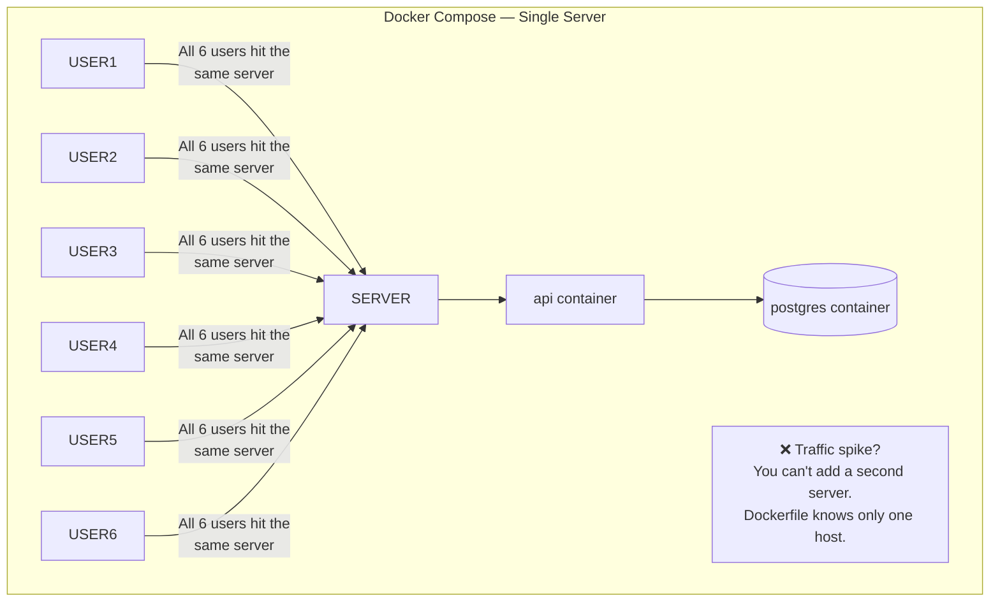
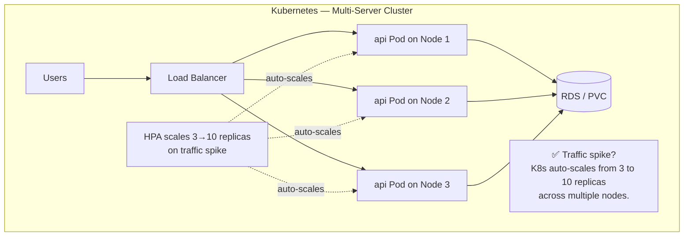
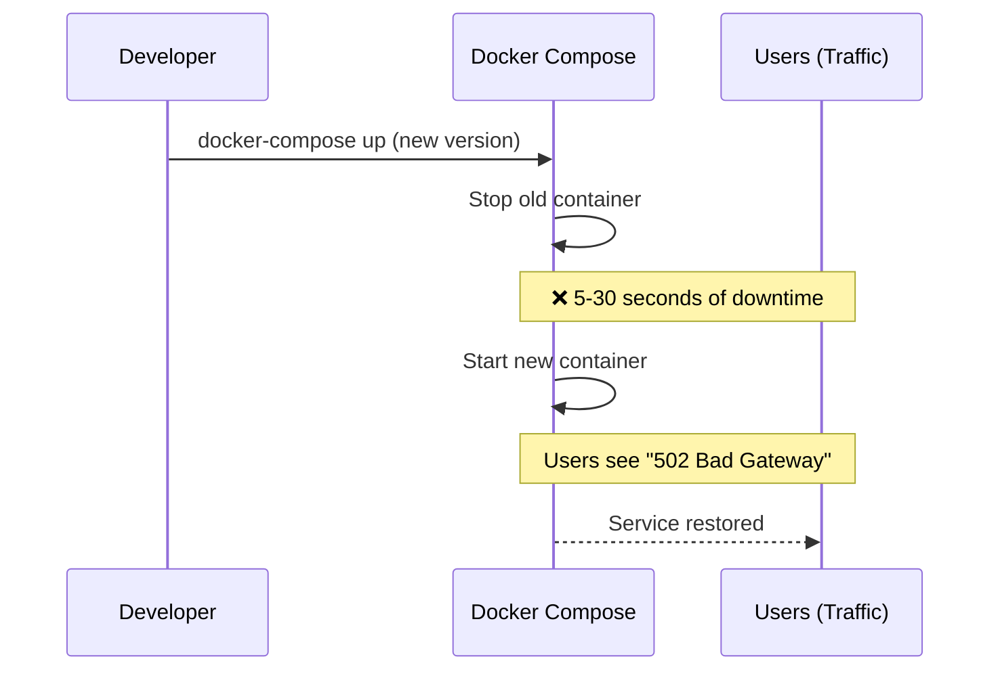
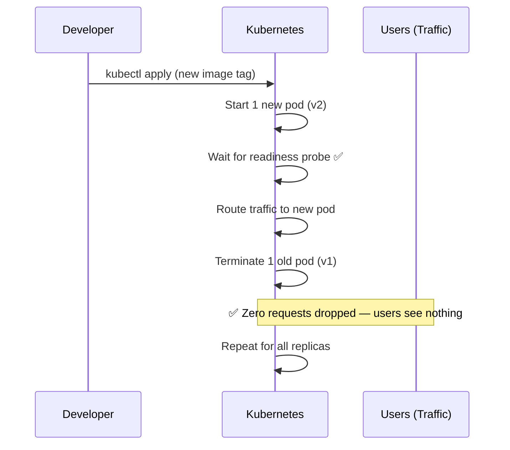
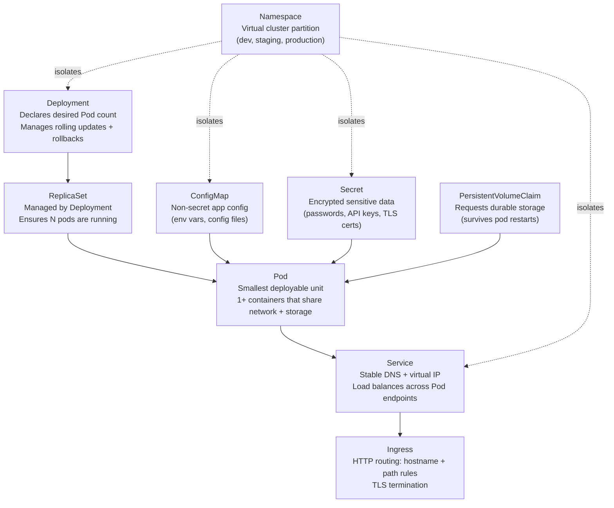

# The Problem Docker Compose Can't Solve

Docker and Docker Compose are excellent tools. They package your application into a portable, reproducible container and let you run multi-service stacks with a single `docker-compose up`. For local development and even small single-server production workloads, they're often the right choice.

But as a product grows, real problems emerge that Docker Compose is architecturally incapable of solving:

---

## The Scaling Problem





---

## The Self-Healing Problem

With Docker Compose, if a container crashes:
1. The process exits with a non-zero code
2. Docker may restart it (if `restart: always`) — but only on the **same machine**
3. If the machine itself dies, **everything is gone**

With Kubernetes:
1. The pod controller detects a pod death within seconds
2. It automatically schedules a replacement pod on a **healthy node**
3. If an entire node dies, all its workloads are rescheduled to remaining nodes
4. This happens with **zero manual intervention**, at any time of day

---

## The Zero-Downtime Deployment Problem





---

## The Five Core Problems Kubernetes Solves

| Problem | Docker Compose | Kubernetes |
|---------|---------------|------------|
| **Scale across multiple servers** | ❌ Single host only | ✅ Distribute pods across unlimited nodes |
| **Self-heal from crashes** | ⚠️ Restarts locally, can't survive node failure | ✅ Reschedules pods to healthy nodes automatically |
| **Zero-downtime deployments** | ❌ Brief downtime on every update | ✅ Rolling updates replace pods one at a time |
| **Service discovery between apps** | ⚠️ Only within same Docker network | ✅ Built-in DNS: `service-name.namespace.svc.cluster.local` |
| **Traffic load balancing** | ❌ No built-in balancing | ✅ Every Service load-balances across all healthy pod endpoints |

---

## What Exactly Is Kubernetes?

Kubernetes (K8s) is an open-source **container orchestration platform** — a distributed system that:

1. **Schedules** containers onto servers based on available resources
2. **Monitors** every running container and restarts failed ones
3. **Updates** running applications without interrupting users
4. **Scales** workloads automatically based on CPU/memory usage
5. **Routes** network traffic to healthy containers
6. **Stores** secrets, configuration, and manages persistent storage

> Think of Kubernetes as the **operating system for your data center**. Just as an OS manages processes on a single machine (scheduling CPU time, managing memory, handling I/O), Kubernetes manages containers across a fleet of machines.

---

## The Kubernetes "Desired State" Model

The most important mental model for Kubernetes is **declarative infrastructure**:

```yaml
# You declare WHAT you want — not HOW to achieve it
apiVersion: apps/v1
kind: Deployment
metadata:
  name: web-api
spec:
  replicas: 3         # "I want 3 copies of my app running"
  # ... container spec
```

You apply this to Kubernetes. From that moment on, Kubernetes **continuously reconciles** the actual state of the cluster toward your desired state:

```
Loop every few seconds:
  1. Observe: Count running pods → 2 (one crashed)
  2. Compare: Desired = 3, Actual = 2 → drift detected
  3. Act: Create 1 new pod → actual = 3 ✅
```

This is why Kubernetes is called **self-healing** — it never stops trying to match your declared intent. You don't need to monitor for failures and react. Kubernetes does it for you.

---

## Kubernetes Core Concepts: A Preview

You'll learn all of these deeply in the upcoming lessons:



---

## Kubernetes vs Docker Compose: The Complete Comparison

| Feature | Docker Compose | Kubernetes |
|---------|---------------|------------|
| **Multi-server** | ❌ Single host | ✅ Unlimited nodes |
| **Self-healing** | ⚠️ `restart: always` (same host only) | ✅ Cross-node pod rescheduling |
| **Rolling deployments** | ❌ Brief downtime | ✅ Zero downtime |
| **Auto-scaling** | ❌ Manual | ✅ HPA by CPU/memory/custom metrics |
| **Load balancing** | ❌ No built-in | ✅ Every Service load-balances |
| **Service discovery** | ⚠️ Same network only | ✅ Built-in DNS cluster-wide |
| **Secrets management** | ⚠️ `.env` files | ✅ Encrypted Secrets resource |
| **Storage management** | ⚠️ Volume mounts | ✅ PV/PVC with dynamic provisioning |
| **TLS management** | ❌ Manual | ✅ cert-manager + Let's Encrypt |
| **Health monitoring** | ❌ No | ✅ Liveness + readiness probes |
| **RBAC / Access control** | ❌ No | ✅ Fine-grained role-based access |
| **Learning curve** | ✅ Low | ❌ Steep |
| **Best for** | Dev + single-server prod | Multi-server production |

---

## Where Does Kubernetes Run?

| Environment | Options | Best For |
|------------|---------|---------|
| **Local development** | minikube, kind, k3d, Docker Desktop | Learning and testing |
| **Managed cloud** | AWS EKS, Google GKE, Azure AKS | Production (someone else manages the control plane) |
| **Self-hosted lightweight** | K3s (next course!) | VPS production, edge, home lab |
| **Self-hosted full** | kubeadm, RKE2 | On-premise data centers |

### Cloud Managed Kubernetes Pricing (Rough Estimate)

| Provider | Control Plane Cost | Min Worker Cost | Notes |
|----------|------------------|-----------------|-------|
| **AWS EKS** | ~$72/month | ~$30/month (t3.small) | Expensive for small teams |
| **Google GKE** | Free (Autopilot) | ~$45/month | Free control plane is a big deal |
| **Azure AKS** | Free | ~$30/month | Free control plane |
| **K3s on Hetzner** | Included | ~€6/month | Your own VM, full control |

For this course, you can follow along using:
- `kind` (Kubernetes in Docker) — free, runs on your laptop
- `minikube` — free, runs on your laptop
- Any managed cloud cluster (EKS/GKE/AKS free tiers work)

---

## Is Kubernetes Right For You?

Kubernetes is powerful, but it comes with real operational overhead. Consider these honest tradeoffs:

**You probably need Kubernetes if:**
- You have multiple services that need to scale independently
- Downtime costs you money or customers
- You have a team of 3+ engineers and multiple environments (staging, prod)
- You need to run 10+ services

**You probably DON'T need Kubernetes yet if:**
- You're a solo developer with a simple app
- Your traffic is under 1,000 users
- You can absorb a few minutes of downtime during deployments
- You're still figuring out product-market fit

Docker Compose → K3s (single VPS Kubernetes) is often the right evolution path before jumping to full managed Kubernetes.

---

## Summary

Kubernetes is the industry-standard container orchestration platform that solves the fundamental limitations of single-server deployments:

- **Self-healing**: crashed pods are automatically replaced, even when entire nodes fail
- **Zero-downtime rolling updates**: new pods are verified healthy before old ones are removed
- **Horizontal auto-scaling**: HPA adds/removes pods based on real traffic load
- **Multi-server scheduling**: workloads are distributed optimally across the cluster
- **Declarative model**: you describe *what* you want, Kubernetes continuously reconciles *how* to achieve it

In the next lesson, you will dissect the Kubernetes architecture — understanding every component in the Control Plane and Worker Nodes, and how they work together to power this orchestration engine.
