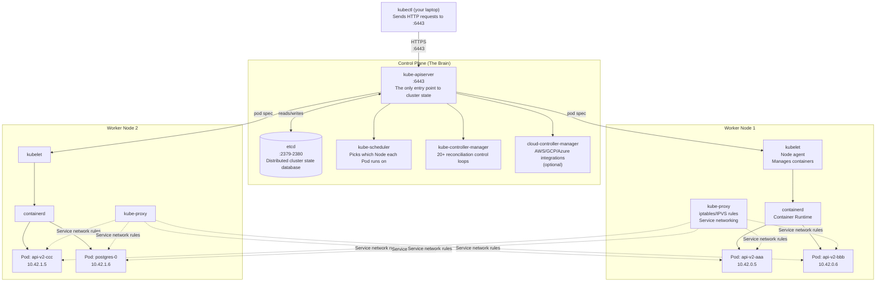
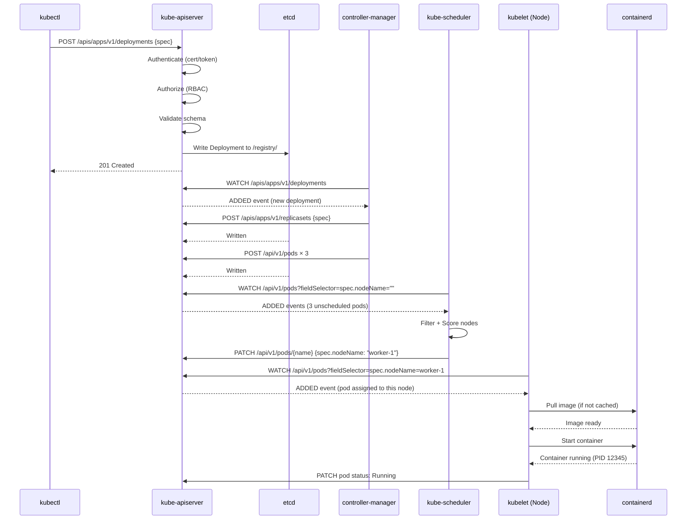

# How a Kubernetes Cluster Is Structured

Every Kubernetes cluster consists of two distinct roles. Understanding them deeply is essential for debugging, tuning, and operating a real cluster.



---

## The Control Plane: Five Components

### 1. `kube-apiserver` — The Front Door to Everything

The API server is the **only** component that talks to etcd. Every other component — and every external tool including `kubectl`, Helm, GitHub Actions, Argo CD — communicates exclusively through the API server.

**What it does:**
- Authenticates and authorizes every request (RBAC)
- Validates resource manifests (is this a valid Deployment spec?)
- Reads/writes desired state to etcd
- Sends resource updates to controllers and kubelets via watch streams

**What happens when you run `kubectl apply -f deployment.yaml`:**
```
1. kubectl reads the YAML file
2. kubectl sends a POST/PUT HTTP request to kube-apiserver:6443
3. kube-apiserver authenticates your certificate/token
4. kube-apiserver authorizes the action (RBAC check)
5. kube-apiserver validates the Deployment schema
6. kube-apiserver writes the desired state to etcd
7. kube-apiserver returns 200 OK to kubectl
8. Controller-manager's Deployment controller detects the new resource
9. Scheduler assigns pods to nodes
10. kubelet on each node starts containers
```

---

### 2. `etcd` — The Source of Truth

etcd is a **distributed key-value store** built on the Raft consensus algorithm. It is the single source of truth for the entire cluster state — every Deployment, Service, ConfigMap, Secret, Pod definition, and more.

**Key facts:**
- Stores data as key-value pairs: `/registry/deployments/production/my-api → {spec JSON}`
- Only `kube-apiserver` reads from and writes to etcd directly
- Uses Raft consensus: needs a **quorum** (majority) of nodes to function
  - 1 node: tolerates 0 failures (not HA)
  - 3 nodes: tolerates 1 failure ✅ (minimum for HA)
  - 5 nodes: tolerates 2 failures (large clusters)

**Why etcd backup is critical:**
```bash
# If etcd data is lost, the ENTIRE cluster state is gone:
# - All your Deployments, Services, Secrets
# - All RBAC rules
# - All PVC bindings
# - Everything

# Back up etcd regularly in self-hosted clusters:
ETCDCTL_API=3 etcdctl snapshot save /backup/etcd-snapshot-$(date +%Y%m%d).db \
  --endpoints=https://127.0.0.1:2379 \
  --cacert=/etc/etcd/ca.crt \
  --cert=/etc/etcd/etcd-server.crt \
  --key=/etc/etcd/etcd-server.key
```

---

### 3. `kube-scheduler` — The Pod Placement Engine

The scheduler watches for newly created Pods that have no `nodeName` assigned and picks the best Node to run them.

**Scheduling is a two-phase process:**

```mermaid
flowchart LR
    POD["Unscheduled Pod\n(no nodeName)"] --> FILTER

    subgraph FILTER["Phase 1: Filtering\n(Eliminates ineligible nodes)"]
        F1["NodeSelector matches?"]
        F2["Sufficient CPU?"]
        F3["Sufficient Memory?"]
        F4["Node has required taints?"]
        F5["Affinity rules satisfied?"]
        F6["PVC's topology satisfied?"]
    end

    FILTER --> SCORE

    subgraph SCORE["Phase 2: Scoring\n(Ranks eligible nodes)"]
        S1["Most available CPU → higher score"]
        S2["Node with fewer pods → higher score"]
        S3["Topology spread → balance across zones"]
    end

    SCORE --> BIND["Assign nodeName\nWrite to etcd"]
```



**Common scheduling failures and why:**
```bash
# Pod stuck in Pending? Run this:
kubectl describe pod my-pod-name | grep -A10 "Events:"

# "0/3 nodes are available: 3 Insufficient memory."
# → Your pod's memory request exceeds available capacity on all nodes
# Fix: reduce requests, or add a node

# "0/3 nodes are available: 3 node(s) had untolerated taint"
# → The node has a taint your pod doesn't tolerate
# Fix: add a toleration or remove the taint

# "0/3 nodes are available: 3 node(s) didn't match Pod's node affinity"
# → nodeSelector or affinity rules don't match any node
# Fix: check your nodeSelector labels vs actual node labels
```

---

### 4. `kube-controller-manager` — The Reconciliation Engine

The controller manager runs **20+ control loops** in a single process. Each loop watches a specific resource type and ensures the actual state matches the desired state.

**Key controllers:**

| Controller | Responsibility |
|-----------|---------------|
| **Deployment** controller | Creates/manages ReplicaSets based on Deployment spec |
| **ReplicaSet** controller | Ensures exact pod count matches `replicas` — replaces crashed pods |
| **StatefulSet** controller | Like ReplicaSet but with stable pod names and ordered ops |
| **Job** controller | Runs batch jobs to completion |
| **CronJob** controller | Schedules Jobs on a cron schedule |
| **Namespace** controller | Handles namespace creation/cleanup |
| **Node** controller | Detects node failures, marks pods for eviction |
| **Endpoint** controller | Updates Service endpoint lists as pods come and go |

**The reconciliation loop (pseudocode):**
```go
// This runs continuously, for every controller
for {
    desiredState := apiserver.Get(resourceType)
    actualState  := observation.CurrentState()
    
    if desiredState != actualState {
        actions := computeDiff(desiredState, actualState)
        for _, action := range actions {
            apiserver.Apply(action) // Create/delete/update resources
        }
    }
    
    time.Sleep(15 * time.Second)
}
```

This is the core of Kubernetes' "self-healing" — it never stops watching and never stops reconciling.

---

### 5. `cloud-controller-manager` — The Cloud Integration Layer

When running on a cloud provider (AWS, GCP, Azure), this component bridges Kubernetes abstractions to cloud-specific resources:

| K8s Resource | Cloud Equivalent |
|-------------|-----------------|
| `Service type: LoadBalancer` | Provisions AWS ELB, GCP Load Balancer, Azure LB |
| `PersistentVolumeClaim` | Provisions AWS EBS, GCP PD, Azure Disk |
| `Node` creation | Registers new EC2/GCE instances as Kubernetes nodes |
| Node deletion | Detaches cloud resources when nodes terminate |

In K3s, this is replaced by `klipper-lb` (a simple host-port service load balancer).

---

## Worker Node Components: Three Components

### 1. `kubelet` — The Node Agent

The kubelet is the primary agent running on every worker node. It's the bridge between the Kubernetes control plane and the container runtime on the node.

**What kubelet does:**
1. **Watches** the API server for Pods scheduled to its node
2. **Instructs** the container runtime (containerd) to pull images and start containers
3. **Reports** back: pod status, node resource usage, health
4. **Enforces** resource limits (working with the cgroup subsystem)
5. **Runs** readiness/liveness probes and reports results

```bash
# kubelet runs as a systemd service on every node
systemctl status kubelet

# kubelet logs (very useful for debugging pod startup failures)
journalctl -u kubelet -f
```

---

### 2. `kube-proxy` — The Network Rules Manager

kube-proxy runs on every node and maintains the networking rules that implement the **Service abstraction**. When you create a Service with ClusterIP `10.96.0.1`, kube-proxy programs iptables rules on every node so that connections to `10.96.0.1:80` are load-balanced across the correct pod IPs.

**kube-proxy modes:**
- **iptables** (default): programs Linux iptables rules — O(n) lookup per rule, degrades at thousands of services
- **IPVS** (recommended for large clusters): uses Linux IP Virtual Server — O(1) lookup, handles 10,000+ services efficiently

```bash
# Check kube-proxy mode
kubectl -n kube-system get configmap kube-proxy -o yaml | grep mode
```

---

### 3. Container Runtime (containerd)

The Container Runtime Interface (CRI) implementation that actually runs containers. Modern Kubernetes uses **containerd** directly (Docker was removed as a runtime in K8s 1.24).

```bash
# Check what's running via crictl (containerd's CLI equivalent to docker)
crictl ps

# Pull an image via containerd
crictl pull nginx:alpine

# Check containerd status
systemctl status containerd
```

---

## The Complete Request Flow: `kubectl apply` to Running Container

This is the full lifecycle of deploying a Deployment:



**Total time from `kubectl apply` to running container: typically 10-30 seconds**

---

## The Control Plane in Managed Kubernetes

In cloud-managed Kubernetes (EKS, GKE, AKS), you never see or manage the control plane:

| Aspect | Managed K8s (EKS/GKE/AKS) | Self-Hosted (K3s/kubeadm) |
|--------|--------------------------|--------------------------|
| etcd management | Cloud provider | You |
| Control plane HA | Cloud provider | You (need 3 nodes) |
| Control plane upgrades | Cloud provider (with your approval) | You |
| etcd backups | Cloud provider | You |
| Control plane pricing | $72+/month (EKS) or free (GKE, AKS) | Included in your VPS cost |

With K3s (next course), the entire control plane is a single binary running on your VPS — dramatically simpler to operate.

---

## Hands-On: Inspect Your Cluster Components

```bash
# List all control plane pods (managed K8s shows them differently)
kubectl get pods -n kube-system

# Check control plane component health
kubectl get componentstatuses
# NAME                 STATUS    MESSAGE
# controller-manager   Healthy   ok
# scheduler            Healthy   ok
# etcd-0               Healthy   ok

# View node information (CPU, memory, conditions)
kubectl get nodes -o wide
kubectl describe node <node-name>

# Check resource allocation on a node
kubectl describe node <node-name> | grep -A 10 "Allocated resources:"
# CPU Requests    CPU Limits    Memory Requests    Memory Limits
# 650m (32%)      1600m (80%)   512Mi (25%)        1Gi (50%)

# See all API groups and versions supported by this cluster
kubectl api-versions | sort

# See all resource types the cluster supports
kubectl api-resources | head -30
```

---

## Summary

The Kubernetes control plane consists of five components:
- **kube-apiserver**: the single entry point for all cluster operations — validates, authenticates, authorizes, and stores state in etcd
- **etcd**: the distributed key-value store that is the sole source of truth for all cluster state — back it up in self-hosted setups
- **kube-scheduler**: assigns unscheduled Pods to Nodes using a two-phase filter + score algorithm
- **kube-controller-manager**: runs 20+ reconciliation loops that continuously enforce desired state (self-healing, scaling, rolling updates)
- **cloud-controller-manager**: bridges K8s resources to cloud-provider services (load balancers, disks)

Worker nodes each run three components:
- **kubelet**: the node agent that receives pod specs from the API server and instructs containerd to run containers
- **kube-proxy**: programs iptables/IPVS rules to implement the Service networking abstraction
- **containerd**: the actual container runtime that pulls images and runs containers

In the next lesson, you will install `kubectl` and learn the command-line interface that powers all Kubernetes operations.
