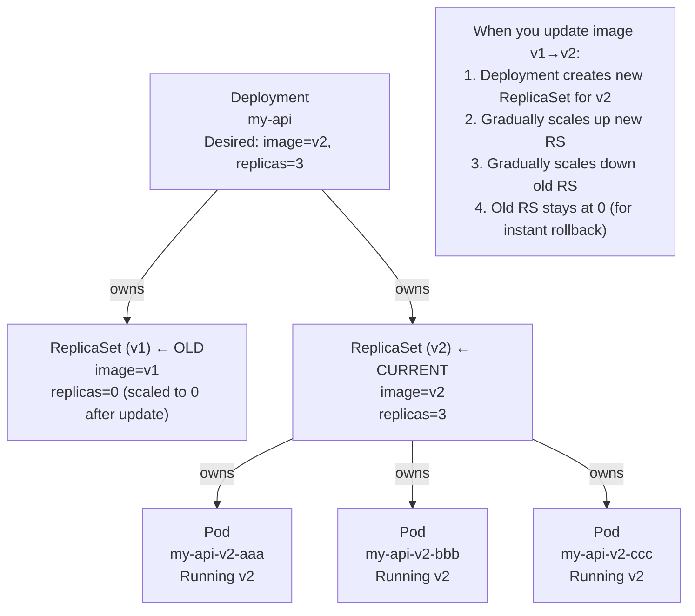
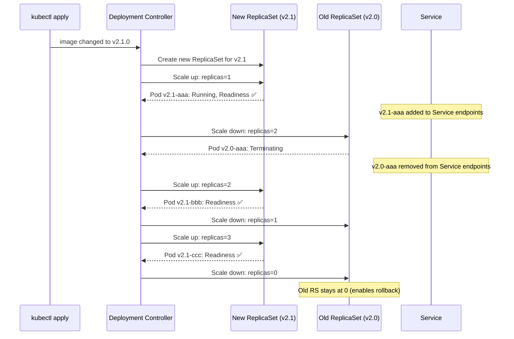

# The Problem: Pods Don't Heal Themselves

If you create a bare Pod and it crashes, it stays dead. Nothing brings it back. For production systems, this is unacceptable. You need a system that:

1. Guarantees a specific number of replicas are **always running**
2. **Automatically replaces** crashed pods — even across node failures
3. Supports **zero-downtime rolling updates** when you ship a new version
4. Enables **instant rollback** if a new version is broken

The answer is the **Deployment** — Kubernetes' most important higher-level resource.

---

## The Deployment → ReplicaSet → Pod Ownership Chain



**The key insight**: A Deployment never directly manages Pods. It manages ReplicaSets. A ReplicaSet manages Pods. This layering is what enables rollbacks — the old ReplicaSet still exists at 0 replicas, and rollback simply scales it back up.

---

## The Complete Production Deployment Manifest

```yaml
# deployment.yaml
apiVersion: apps/v1
kind: Deployment
metadata:
  name: my-api
  namespace: production
  labels:
    app: my-api
    tier: backend
  annotations:
    # Appears in `kubectl rollout history` — always set this before applying
    kubernetes.io/change-cause: "v2.0.1: Add pagination to /items endpoint"

spec:
  # ── Replica Count ─────────────────────────────────────────────────────
  replicas: 3

  # ── Pod Selection ─────────────────────────────────────────────────────
  selector:
    matchLabels:
      app: my-api       # This MUST match template.metadata.labels
                        # Immutable after creation

  # ── Update Strategy ───────────────────────────────────────────────────
  strategy:
    type: RollingUpdate
    rollingUpdate:
      maxSurge: 1          # Allow 1 extra pod above replicas during update
      maxUnavailable: 0    # Never remove a pod before a new one is Ready
                           # Guarantees zero downtime

  # ── Rollout History ───────────────────────────────────────────────────
  revisionHistoryLimit: 10   # Keep 10 old ReplicaSets for rollback
                              # (each RS is kept at 0 replicas)

  # ── Pod readiness window ──────────────────────────────────────────────
  minReadySeconds: 10        # A pod must be Ready for 10s before counting as available
                             # Prevents premature "done" on slow-starting apps

  # ── Pod Template (this is the Pod spec) ───────────────────────────────
  template:
    metadata:
      labels:
        app: my-api            # Must match spec.selector.matchLabels
        version: "2.0.1"
      annotations:
        prometheus.io/scrape: "true"
        prometheus.io/port: "9090"

    spec:
      terminationGracePeriodSeconds: 30   # SIGTERM → wait 30s → SIGKILL

      containers:
        - name: api
          image: ghcr.io/youruser/my-api:v2.0.1
          imagePullPolicy: Always
          ports:
            - name: http
              containerPort: 3000
            - name: metrics
              containerPort: 9090

          env:
            - name: NODE_ENV
              value: "production"
            - name: DATABASE_URL
              valueFrom:
                secretKeyRef:
                  name: app-secret
                  key: DATABASE_URL

          resources:
            requests:
              cpu: "100m"
              memory: "128Mi"
            limits:
              cpu: "500m"
              memory: "512Mi"

          # Startup probe prevents other probes from running until app is ready
          startupProbe:
            httpGet:
              path: /health
              port: 3000
            failureThreshold: 12
            periodSeconds: 5

          readinessProbe:
            httpGet:
              path: /health
              port: 3000
            initialDelaySeconds: 5
            periodSeconds: 10
            failureThreshold: 3

          livenessProbe:
            httpGet:
              path: /health
              port: 3000
            initialDelaySeconds: 30
            periodSeconds: 30
            failureThreshold: 3

          securityContext:
            runAsNonRoot: true
            runAsUser: 1001
            readOnlyRootFilesystem: true
            allowPrivilegeEscalation: false
            capabilities:
              drop: ["ALL"]

          volumeMounts:
            - name: tmp
              mountPath: /tmp

      volumes:
        - name: tmp
          emptyDir:
            medium: Memory
            sizeLimit: 50Mi

      affinity:
        podAntiAffinity:
          requiredDuringSchedulingIgnoredDuringExecution:
            - labelSelector:
                matchLabels:
                  app: my-api
              topologyKey: kubernetes.io/hostname
```

---

## Apply and Observe

```bash
# Deploy
kubectl apply -f deployment.yaml

# Watch pods come up in real time
kubectl get pods -n production -l app=my-api -w
# NAME               READY   STATUS              RESTARTS   AGE
# my-api-v2-aaa      0/1     ContainerCreating   0          2s
# my-api-v2-aaa      0/1     Running             0          5s
# my-api-v2-aaa      1/1     Running             0          15s  ← readiness probe passed
# my-api-v2-bbb      0/1     ContainerCreating   0          16s
# my-api-v2-bbb      1/1     Running             0          26s
# my-api-v2-ccc      1/1     Running             0          36s

# Check deployment health
kubectl get deployment my-api -n production
# NAME     READY   UP-TO-DATE   AVAILABLE   AGE
# my-api   3/3     3            3           2m
# ↑        ↑       ↑            ↑
# desired  running  updated      serving traffic

# Check the ReplicaSet owned by this Deployment
kubectl get replicasets -n production -l app=my-api
# NAME             DESIRED   CURRENT   READY   AGE
# my-api-v2-xxx    3         3         3       2m
```

---

## The Rolling Update: Step by Step

Trigger a rolling update by changing the image tag:

```bash
# Method 1: Imperative (quick, useful for hotfixes)
kubectl set image deployment/my-api api=ghcr.io/youruser/my-api:v2.1.0 -n production

# Always annotate the change cause (shows in rollout history)
kubectl annotate deployment/my-api \
  kubernetes.io/change-cause="v2.1.0: Fix pagination off-by-one bug" \
  -n production --overwrite

# Method 2: Declarative (preferred — update the YAML, then apply)
# Edit image tag in deployment.yaml → kubectl apply -f deployment.yaml
```

What happens internally:



```bash
# Watch the rolling update live
kubectl rollout status deployment/my-api -n production
# Waiting for deployment "my-api" rollout to finish: 1 out of 3 new replicas have been updated...
# Waiting for deployment "my-api" rollout to finish: 2 out of 3 new replicas have been updated...
# Waiting for deployment "my-api" rollout to finish: 1 old replicas are pending termination...
# deployment "my-api" successfully rolled out ✅

# Watch pods side-by-side during update
kubectl get pods -n production -l app=my-api -w
```

---

## Rollback: Instant Version Revert

If the new version is broken (smoke tests fail, errors spike), rollback in seconds:

```bash
# View revision history (shows change-cause annotations)
kubectl rollout history deployment/my-api -n production
# REVISION  CHANGE-CAUSE
# 1         v2.0.0: Initial deployment
# 2         v2.0.1: Add pagination
# 3         v2.1.0: Fix pagination off-by-one bug

# Rollback to the immediately previous revision
kubectl rollout undo deployment/my-api -n production

# Rollback to a specific revision
kubectl rollout undo deployment/my-api --to-revision=2 -n production

# Watch the rollback (same rolling update process, but in reverse)
kubectl rollout status deployment/my-api -n production

# Verify you're now running the old version
kubectl get pods -n production -l app=my-api -o jsonpath='{.items[0].spec.containers[0].image}'
# ghcr.io/youruser/my-api:v2.0.1
```

---

## Pausing and Resuming Rollouts

If you notice issues partway through a rollout, pause it immediately:

```bash
# Pause (stops the rolling update mid-way — some pods are v2, some are v1)
kubectl rollout pause deployment/my-api -n production

# Inspect the current state
kubectl get pods -n production -l app=my-api
# Some pods will be v2.1, some v2.0 — traffic is split between them

# If you decide v2.1 is bad, rollback while paused:
kubectl rollout undo deployment/my-api -n production

# If you decide v2.1 is fine, resume the rollout:
kubectl rollout resume deployment/my-api -n production
```

---

## Scaling

```bash
# Scale imperatively (immediate — useful for incident response)
kubectl scale deployment/my-api --replicas=10 -n production

# Scale declaratively (preferred — update deployment.yaml, then apply)
# Change replicas: 3 → 10 in your YAML, then:
kubectl apply -f deployment.yaml

# Auto-scaling based on CPU (HPA — covered in the multi-node lesson)
kubectl autoscale deployment/my-api --min=3 --max=10 --cpu-percent=70 -n production
```

---

## The Self-Healing Demo

```bash
# Deploy with 3 replicas
kubectl apply -f deployment.yaml

# Delete a pod manually — watch it get immediately replaced
kubectl get pods -n production -l app=my-api
# NAME               READY   STATUS    RESTARTS   AGE
# my-api-v2-aaa      1/1     Running   0          5m
# my-api-v2-bbb      1/1     Running   0          5m
# my-api-v2-ccc      1/1     Running   0          5m

kubectl delete pod my-api-v2-aaa -n production

kubectl get pods -n production -l app=my-api -w
# NAME               READY   STATUS    RESTARTS   AGE
# my-api-v2-bbb      1/1     Running   0          5m
# my-api-v2-ccc      1/1     Running   0          5m
# my-api-v2-aaa      0/1     Terminating  0       5m   ← Dying
# my-api-v2-ddd      0/1     Pending      0       1s   ← New pod starting!
# my-api-v2-ddd      1/1     Running      0       15s  ← Running again

# The ReplicaSet controller detected 2 running < 3 desired, created a new pod
# Total downtime for the service: 0 (2 other replicas kept serving traffic)
```

---

## Common Deployment Issues

### "Deployment stuck rolling out"

```bash
kubectl describe deployment my-api -n production | grep -A5 "Conditions:"
# DeploymentAvailable: True
# DeploymentProgressing: True (stuck here — new pods aren't becoming Ready)

# Find which pod isn't becoming Ready
kubectl get pods -n production -l app=my-api
# my-api-v2-new-xxx   0/1   Running   0   5m  ← Stuck at 0/1 (not Ready)

# Check why
kubectl describe pod my-api-v2-new-xxx -n production | tail -20
# Readiness probe failing: connection refused on :3000
# Check: does the new image expose the right port? Is /health implemented?
```

### "Pods OOMKilled after update"

```bash
kubectl get pods -n production
# my-api-v2-xxx   0/1   OOMKilled   3   10m

# The new version uses more memory than the limit
# Fix: increase limits in deployment.yaml
kubectl set resources deployment/my-api -c api \
  --limits=memory=1Gi -n production
```

### "Image pull fails"

```bash
kubectl describe pod my-api-xxx -n production | grep -A5 "Events:"
# Warning  Failed  pod/my-api-xxx  Error: ErrImagePull
# Warning  Failed  pod/my-api-xxx  Error response from daemon: pull access denied

# Cause: private registry, no pull secret configured
# Fix: create an image pull secret
kubectl create secret docker-registry ghcr-pull-secret \
  --docker-server=ghcr.io \
  --docker-username=YOUR_GITHUB_USERNAME \
  --docker-password=YOUR_GITHUB_PAT \
  -n production

# Add to deployment spec:
# spec:
#   imagePullSecrets:
#     - name: ghcr-pull-secret
```

---

## Summary

Deployments are the primary way to run stateless applications in Kubernetes:
- A **Deployment** manages **ReplicaSets** which manage **Pods** — three layers of abstraction
- Setting `replicas: 3` guarantees exactly 3 pods are running at all times — the ReplicaSet controller continuously enforces this
- **Rolling updates** replace pods one at a time — `maxUnavailable: 0` + readiness probes = zero-downtime deployments
- Old **ReplicaSets** are preserved at 0 replicas — enabling **instant rollback** with `kubectl rollout undo`
- `revisionHistoryLimit: 10` keeps 10 revisions; `minReadySeconds: 10` prevents premature "success" on slow starters
- Annotate every deploy with `kubernetes.io/change-cause` to maintain a clean audit trail

In the next lesson, you will expose your Deployment to network traffic using **Services** — Kubernetes' stable networking abstraction.
