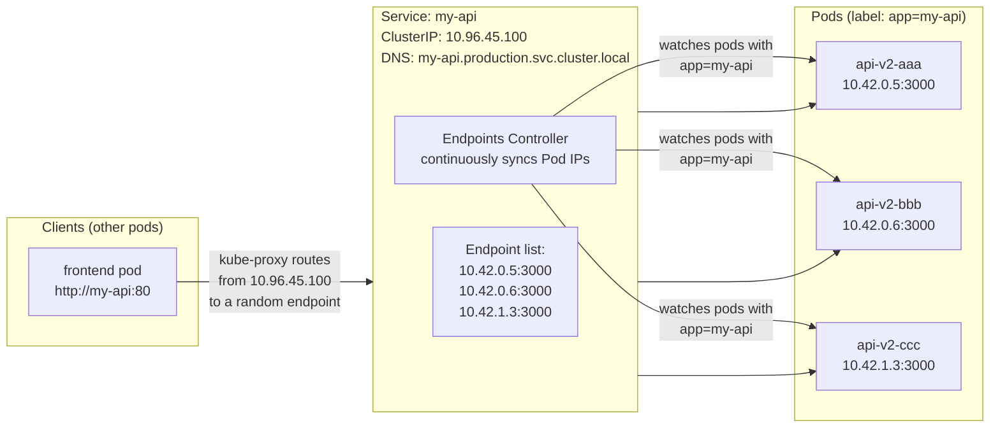

# The Problem: Pod IPs Are Ephemeral

Every Pod gets a random IP address when it starts. When it crashes and is replaced by the ReplicaSet controller, the new Pod gets a **completely different IP address**. If your frontend directly calls `http://10.42.0.15:3000` (the backend Pod's IP), that address breaks the moment the pod restarts.

Additionally, you have 3 backend replicas running at different IPs. Who decides which replica gets each request?

A **Kubernetes Service** solves both problems by providing:
1. A **stable virtual IP** (ClusterIP) that never changes, regardless of how many times the underlying pods restart
2. **Automatic load balancing** across all healthy pod endpoints
3. A **DNS name** that resolves to the stable IP — discoverable by name from anywhere in the cluster

---

## How Services Work Under the Hood

A Service uses a **label selector** to identify which Pods it routes traffic to. The Endpoints controller continuously watches for pods matching the selector and updates the Service's endpoint list.



When a Pod restarts with a new IP:
1. The Endpoints controller removes the old IP from the endpoint list
2. The Endpoints controller adds the new Pod's IP (once Ready)
3. kube-proxy updates iptables rules on every node
4. New requests go to the new IP — clients notice nothing

---

## Service Type 1: ClusterIP (Default)

**Internal-only**. The Service gets a virtual IP that only exists within the cluster's network. Pods inside the cluster can reach it; nothing outside can.

```yaml
# clusterip-service.yaml
apiVersion: v1
kind: Service
metadata:
  name: my-api
  namespace: production
  labels:
    app: my-api
spec:
  type: ClusterIP          # Default — can be omitted
  selector:
    app: my-api            # Routes to pods with this label
  ports:
    - name: http
      port: 80             # Port the Service listens on (stable)
      targetPort: 3000     # Port the container actually listens on
      protocol: TCP
    - name: metrics
      port: 9090
      targetPort: 9090
```

```bash
kubectl apply -f clusterip-service.yaml
kubectl get svc my-api -n production
# NAME     TYPE        CLUSTER-IP      EXTERNAL-IP   PORT(S)   AGE
# my-api   ClusterIP   10.96.45.100    <none>        80/TCP    5s

# Other pods reach this service by:
# Option A: Short name (same namespace): http://my-api
# Option B: Full DNS: http://my-api.production.svc.cluster.local
# Option C: ClusterIP directly: http://10.96.45.100

# Test connectivity from another pod
kubectl run curl-test -n production --image=curlimages/curl --restart=Never --rm -it -- \
  curl http://my-api/health
# {"status":"ok"}
```

### Understanding Kubernetes DNS

CoreDNS provides automatic DNS for all Services:

```
Full DNS format:
<service-name>.<namespace>.svc.<cluster-domain>

Examples:
my-api.production.svc.cluster.local       # Full name, works from any namespace
my-api.production                         # Shortened — works from any namespace
my-api                                    # Works only from same namespace (production)

# Pods also get DNS names (less commonly used):
<pod-ip-dashes>.<namespace>.pod.cluster.local
# E.g.: 10-42-0-5.production.pod.cluster.local
```

```bash
# Verify DNS resolution from inside the cluster
kubectl run dns-test -n production --image=busybox:latest --restart=Never --rm -it -- \
  nslookup my-api
# Server:    10.96.0.10
# Address 1: 10.96.0.10 kube-dns.kube-system.svc.cluster.local
# Name:      my-api
# Address 1: 10.96.45.100 my-api.production.svc.cluster.local

# Test cross-namespace access (frontend namespace → production)
kubectl run cross-ns-test -n frontend --image=curlimages/curl --restart=Never --rm -it -- \
  curl http://my-api.production.svc.cluster.local/health
```

---

## Service Type 2: NodePort

**External access via a high-numbered port** on every Node. When you create a NodePort service, every node in the cluster opens the same port (in the range 30000-32767) and routes traffic to the service's pods.

```yaml
# nodeport-service.yaml
apiVersion: v1
kind: Service
metadata:
  name: my-api-nodeport
  namespace: production
spec:
  type: NodePort
  selector:
    app: my-api
  ports:
    - port: 80              # ClusterIP port (internal access)
      targetPort: 3000      # Container port
      nodePort: 30080       # Port opened on EVERY node (30000-32767)
                            # Omit for K8s to assign randomly
```

```bash
kubectl apply -f nodeport-service.yaml
kubectl get svc my-api-nodeport -n production
# NAME              TYPE       CLUSTER-IP     EXTERNAL-IP   PORT(S)        AGE
# my-api-nodeport   NodePort   10.96.45.101   <none>        80:30080/TCP   5s

# Access from outside the cluster (replace with any node's IP)
curl http://NODE_IP:30080/health

# NodePort traffic flow:
# Client → NodeIP:30080 → kube-proxy iptables → Pod:3000
```

<Callout type="warning" title="NodePort Is for Testing Only">
NodePort exposes a high-numbered port on **every node** — even nodes not running your app. It has no SSL termination, no hostname routing, no rate limiting. In production, use an Ingress Controller (Lesson 8) instead, which provides all of these features through a single entry point.
</Callout>

---

## Service Type 3: LoadBalancer

**Provisions a cloud load balancer** and assigns a public IP/hostname. This is the right choice for exposing TCP/UDP services (not HTTP) in cloud environments.

```yaml
# loadbalancer-service.yaml
apiVersion: v1
kind: Service
metadata:
  name: my-api-lb
  namespace: production
  annotations:
    # AWS-specific: make it internet-facing (vs internal)
    service.beta.kubernetes.io/aws-load-balancer-scheme: "internet-facing"
    # Use NLB instead of classic ELB (better performance)
    service.beta.kubernetes.io/aws-load-balancer-type: "nlb"
spec:
  type: LoadBalancer
  selector:
    app: my-api
  ports:
    - port: 80
      targetPort: 3000
```

```bash
kubectl apply -f loadbalancer-service.yaml

# Watch until the cloud assigns an external IP (1-3 minutes on AWS/GCP)
kubectl get svc my-api-lb -n production -w
# NAME        TYPE           CLUSTER-IP     EXTERNAL-IP   PORT(S)        AGE
# my-api-lb   LoadBalancer   10.96.45.102   <pending>     80:31234/TCP   10s
# my-api-lb   LoadBalancer   10.96.45.102   1.2.3.4       80:31234/TCP   2m  ← Got IP!

# Access via the public IP
curl http://1.2.3.4/health
```

**When to use LoadBalancer:**
- Exposing a non-HTTP protocol (PostgreSQL, Redis, game servers, gRPC without HTTP)
- You want a single, dedicated IP for one service
- Running in a cloud environment that charges per load balancer

**Cost consideration**: Each `LoadBalancer` service provisions a separate cloud load balancer:
- AWS ALB: ~$16-22/month + data transfer
- AWS NLB: ~$16-22/month + data transfer
- GCP Load Balancer: ~$18/month

For HTTP workloads, use an Ingress Controller (one load balancer shared by all services).

---

## Service Type 4: Headless Service (No ClusterIP)

Set `clusterIP: None` to create a **headless service** — CoreDNS returns pod IPs directly instead of the virtual IP. Used for StatefulSets where each pod needs its own stable DNS name.

```yaml
# headless-service.yaml (for PostgreSQL StatefulSet)
apiVersion: v1
kind: Service
metadata:
  name: postgres
  namespace: production
spec:
  clusterIP: None          # Headless — no virtual IP
  selector:
    app: postgres
  ports:
    - port: 5432
      targetPort: 5432
```

With a headless service for a StatefulSet named `postgres`:
```bash
# Each pod gets a stable DNS name:
postgres-0.postgres.production.svc.cluster.local  # Pod 0
postgres-1.postgres.production.svc.cluster.local  # Pod 1
postgres-2.postgres.production.svc.cluster.local  # Pod 2

# DNS query on the service returns all pod IPs (round-robin)
nslookup postgres.production.svc.cluster.local
# Address: 10.42.0.15  ← pod 0
# Address: 10.42.1.5   ← pod 1
# Address: 10.42.1.6   ← pod 2
```

---

## The Endpoints Object: What Actually Gets Updated

```bash
# View the Endpoints object that the Service uses internally
kubectl get endpoints my-api -n production
# NAME     ENDPOINTS                                   AGE
# my-api   10.42.0.5:3000,10.42.0.6:3000,10.42.1.3:3000   5m

# If Endpoints is <none>, the label selector doesn't match any pods:
kubectl get endpoints my-api -n production
# NAME     ENDPOINTS   AGE
# my-api   <none>      5m

# Debug: compare selector vs pod labels
kubectl get svc my-api -n production -o jsonpath='{.spec.selector}'
# {"app":"my-api"}
kubectl get pods -n production -l app=my-api --show-labels
# (if no output: no pods match the label — fix your selector or pod labels)
```

---

## Practical: Deployment + Service Together

The standard pattern — always deploy them together in one file:

```yaml
# api-full.yaml
---
apiVersion: apps/v1
kind: Deployment
metadata:
  name: my-api
  namespace: production
spec:
  replicas: 3
  selector:
    matchLabels:
      app: my-api
  template:
    metadata:
      labels:
        app: my-api
    spec:
      containers:
        - name: api
          image: ghcr.io/youruser/my-api:v2.0.1
          ports:
            - containerPort: 3000
          readinessProbe:
            httpGet:
              path: /health
              port: 3000
            initialDelaySeconds: 5
            periodSeconds: 10
          resources:
            requests: { cpu: "100m", memory: "128Mi" }
            limits: { cpu: "500m", memory: "512Mi" }
---
apiVersion: v1
kind: Service
metadata:
  name: my-api
  namespace: production
spec:
  selector:
    app: my-api         # Must match Deployment's pod labels
  ports:
    - name: http
      port: 80
      targetPort: 3000
```

```bash
kubectl apply -f api-full.yaml

# Verify the service has endpoints
kubectl describe svc my-api -n production | grep Endpoints
# Endpoints: 10.42.0.5:3000,10.42.0.6:3000,10.42.1.3:3000

# Test from inside the cluster
kubectl run curl -n production --image=curlimages/curl --restart=Never --rm -it -- \
  curl http://my-api/health
```

---

## Service Troubleshooting

| Symptom | Cause | Fix |
|---------|-------|-----|
| `Endpoints: <none>` | Label selector doesn't match pods | Check `spec.selector` vs pod `.metadata.labels` |
| `Connection refused` | Service routes to wrong port | Check `targetPort` matches container's `containerPort` |
| `NXDOMAIN` from DNS | Wrong service name or namespace | Use full DNS: `service.namespace.svc.cluster.local` |
| `503 No healthy upstreams` | All pods failing readiness probe | Check pod readiness probe logs |
| `Connection timed out` | NetworkPolicy blocking traffic | Check NetworkPolicy rules |
| External IP `<pending>` forever | No cloud LB controller (on-prem/K3s) | Use NodePort or MetalLB |

---

## Service Summary Table

| Type | Reachable From | Use Case | Cost |
|------|---------------|----------|------|
| **ClusterIP** | Inside cluster only | Inter-service communication, databases | Free |
| **NodePort** | NodeIP:Port from outside | Dev/testing, quick external access | Free |
| **LoadBalancer** | Public IP from internet | Production TCP/UDP, dedicated IPs | Cloud LB cost |
| **Headless** | Inside cluster, direct pod IPs | StatefulSets, Cassandra, Redis Cluster | Free |
| **Ingress** (next lesson) | Public domain via HTTP | Production HTTP/HTTPS — shared LB | Cloud LB / free on K3s |

---

## Summary

Kubernetes Services solve the fundamental problem of Pod IP instability:
- **ClusterIP**: stable virtual IP + DNS name inside the cluster — the default type, used for all inter-service communication
- **NodePort**: opens a high port on every node — for testing only
- **LoadBalancer**: provisions a cloud load balancer with a public IP — for non-HTTP protocols in cloud environments
- **Headless** (`clusterIP: None`): CoreDNS returns pod IPs directly — required for StatefulSets

The **label selector** is the key mechanism: the Endpoints controller continuously syncs pods matching the selector into the Service's endpoint list — enabling zero-configuration service discovery.

Debug connectivity issues by always checking: `kubectl describe svc` (look at Endpoints), `kubectl get pods --show-labels`, and pod readiness probe status.

In the next lesson, you will decouple your application's configuration from its container image using **ConfigMaps** and **Secrets**.
