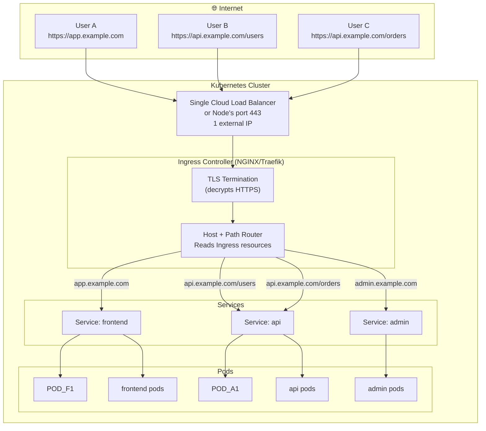

# Why You Need an Ingress Controller

After Lesson 6, you know that `LoadBalancer` Services provision cloud load balancers. But a naive approach of one `LoadBalancer` Service per application quickly becomes expensive and unmaintainable:

```
Without Ingress:
- Service A (frontend) → $18/month LB → 1.2.3.4
- Service B (API) → $18/month LB → 1.2.3.5
- Service C (admin) → $18/month LB → 1.2.3.6
Total: $54/month in load balancers + no hostname routing + no TLS termination

With Ingress:
- 1 LB → Ingress Controller → routes by hostname/path to all 3 services
Total: $18/month, full hostname routing, TLS, rate limiting, auth headers
```

An **Ingress** resource defines HTTP routing rules. An **Ingress Controller** is the reverse proxy (NGINX, Traefik, HAProxy) that implements those rules. Together they give you:

- Route by **hostname**: `api.example.com` → API service, `app.example.com` → frontend
- Route by **URL path**: `/api/*` → API service, `/admin/*` → admin service
- **TLS termination** at the edge
- **HTTP→HTTPS redirect**
- **Rate limiting**, **authentication**, **headers** via annotations
- All through a **single load balancer**

---

## How the Ingress Architecture Works



---

## Step 1: Install an Ingress Controller

### NGINX Ingress Controller (Most Common)

```bash
# For cloud providers (AWS, GCP, Azure) — uses a cloud LoadBalancer
kubectl apply -f https://raw.githubusercontent.com/kubernetes/ingress-nginx/controller-v1.10.1/deploy/static/provider/cloud/deploy.yaml

# For bare-metal / K3s — uses NodePort instead
kubectl apply -f https://raw.githubusercontent.com/kubernetes/ingress-nginx/controller-v1.10.1/deploy/static/provider/baremetal/deploy.yaml

# Verify controller is running
kubectl get pods -n ingress-nginx
# NAME                                        READY   STATUS    RESTARTS   AGE
# ingress-nginx-controller-xxx                1/1     Running   0          2m

# Get the external IP (may take 1-3 minutes on cloud)
kubectl get svc -n ingress-nginx ingress-nginx-controller
# NAME                       TYPE           CLUSTER-IP    EXTERNAL-IP   PORT(S)
# ingress-nginx-controller   LoadBalancer   10.96.x.x     1.2.3.4       80:32xxx,443:32yyy
```

### Traefik (Built Into K3s)

```bash
# In K3s, Traefik is pre-installed — no setup needed
kubectl get pods -n kube-system -l app.kubernetes.io/name=traefik
# traefik-xxx   1/1   Running

# Use ingressClassName: traefik instead of nginx
```

---

## Step 2: Write Ingress Resources

### Host-Based Routing (Multiple Domains)

```yaml
# host-ingress.yaml
apiVersion: networking.k8s.io/v1
kind: Ingress
metadata:
  name: multi-host-ingress
  namespace: production
  annotations:
    # NGINX-specific annotations
    nginx.ingress.kubernetes.io/proxy-body-size: "10m"
    nginx.ingress.kubernetes.io/proxy-read-timeout: "60"
    nginx.ingress.kubernetes.io/proxy-send-timeout: "60"
spec:
  ingressClassName: nginx     # Which controller handles this (use "traefik" for K3s)
  rules:
    - host: app.example.com
      http:
        paths:
          - path: /
            pathType: Prefix
            backend:
              service:
                name: frontend
                port:
                  number: 80

    - host: api.example.com
      http:
        paths:
          - path: /
            pathType: Prefix
            backend:
              service:
                name: api
                port:
                  number: 80

    - host: admin.example.com
      http:
        paths:
          - path: /
            pathType: Prefix
            backend:
              service:
                name: admin
                port:
                  number: 80
```

### Path-Based Routing (Single Domain)

```yaml
# path-ingress.yaml
apiVersion: networking.k8s.io/v1
kind: Ingress
metadata:
  name: path-ingress
  namespace: production
  annotations:
    nginx.ingress.kubernetes.io/rewrite-target: /$2    # Strip path prefix
spec:
  ingressClassName: nginx
  rules:
    - host: example.com
      http:
        paths:
          # /api/anything → api service (preserves path)
          - path: /api(/|$)(.*)
            pathType: ImplementationSpecific
            backend:
              service:
                name: api
                port:
                  number: 80

          # /admin/anything → admin service
          - path: /admin(/|$)(.*)
            pathType: ImplementationSpecific
            backend:
              service:
                name: admin
                port:
                  number: 80

          # Everything else → frontend
          - path: /
            pathType: Prefix
            backend:
              service:
                name: frontend
                port:
                  number: 80
```

### pathType Explained

| `pathType` | Behavior |
|-----------|---------|
| `Exact` | Only matches the exact path. `/app` does NOT match `/app/` |
| `Prefix` | Matches the path and any subpaths. `/app` matches `/app`, `/app/`, `/app/users` |
| `ImplementationSpecific` | Behavior defined by the Ingress controller (supports regex in NGINX) |

---

## Step 3: Add TLS with cert-manager

For production HTTPS with automatic Let's Encrypt certificates:

```bash
# Install cert-manager (if not already installed)
kubectl apply -f https://github.com/cert-manager/cert-manager/releases/download/v1.14.5/cert-manager.yaml

# Create a ClusterIssuer
kubectl apply -f - <<EOF
apiVersion: cert-manager.io/v1
kind: ClusterIssuer
metadata:
  name: letsencrypt-prod
spec:
  acme:
    server: https://acme-v02.api.letsencrypt.org/directory
    email: you@example.com
    privateKeySecretRef:
      name: letsencrypt-prod-key
    solvers:
      - http01:
          ingress:
            ingressClassName: nginx
EOF
```

```yaml
# tls-ingress.yaml — Full production Ingress with automatic TLS
apiVersion: networking.k8s.io/v1
kind: Ingress
metadata:
  name: secure-ingress
  namespace: production
  annotations:
    cert-manager.io/cluster-issuer: "letsencrypt-prod"    # Triggers cert issuance
    nginx.ingress.kubernetes.io/ssl-redirect: "true"      # HTTP → HTTPS redirect
    nginx.ingress.kubernetes.io/force-ssl-redirect: "true"
spec:
  ingressClassName: nginx
  tls:
    - hosts:
        - app.example.com
        - api.example.com
      secretName: example-com-tls    # cert-manager creates this automatically
  rules:
    - host: app.example.com
      http:
        paths:
          - path: /
            pathType: Prefix
            backend:
              service:
                name: frontend
                port:
                  number: 80

    - host: api.example.com
      http:
        paths:
          - path: /
            pathType: Prefix
            backend:
              service:
                name: api
                port:
                  number: 80
```

```bash
kubectl apply -f tls-ingress.yaml

# Watch certificate being issued (1-2 minutes)
kubectl get certificate -n production -w
# NAME              READY   SECRET            AGE
# example-com-tls   False   example-com-tls   5s
# example-com-tls   True    example-com-tls   45s   ← Certificate issued!

# Test HTTPS
curl https://app.example.com/health
# {"status":"ok"}
```

---

## Step 4: Useful Annotations

### NGINX Ingress Annotations

```yaml
annotations:
  # Authentication
  nginx.ingress.kubernetes.io/auth-type: "basic"
  nginx.ingress.kubernetes.io/auth-secret: "basic-auth-secret"
  nginx.ingress.kubernetes.io/auth-realm: "Protected Area"

  # Rate limiting
  nginx.ingress.kubernetes.io/limit-rps: "20"              # 20 requests/second per IP
  nginx.ingress.kubernetes.io/limit-connections: "5"        # 5 concurrent connections per IP

  # Timeouts
  nginx.ingress.kubernetes.io/proxy-connect-timeout: "10"
  nginx.ingress.kubernetes.io/proxy-read-timeout: "60"
  nginx.ingress.kubernetes.io/proxy-send-timeout: "60"

  # Body size (for file uploads)
  nginx.ingress.kubernetes.io/proxy-body-size: "50m"

  # CORS
  nginx.ingress.kubernetes.io/enable-cors: "true"
  nginx.ingress.kubernetes.io/cors-allow-origin: "https://app.example.com"
  nginx.ingress.kubernetes.io/cors-allow-methods: "GET, PUT, POST, DELETE, PATCH, OPTIONS"

  # WebSocket support
  nginx.ingress.kubernetes.io/proxy-http-version: "1.1"
  nginx.ingress.kubernetes.io/configuration-snippet: |
    proxy_set_header Upgrade $http_upgrade;
    proxy_set_header Connection "upgrade";

  # Security headers (apply to all responses)
  nginx.ingress.kubernetes.io/server-snippet: |
    add_header X-Frame-Options "SAMEORIGIN";
    add_header X-Content-Type-Options "nosniff";
    add_header Strict-Transport-Security "max-age=31536000; includeSubDomains; preload";
```

---

## Testing Locally Without a Domain

While developing, use `/etc/hosts` to fake DNS:

```bash
# On your local machine: add fake DNS entry
echo "127.0.0.1  app.example.com api.example.com" | sudo tee -a /etc/hosts

# Port-forward the ingress controller
kubectl port-forward -n ingress-nginx svc/ingress-nginx-controller 80:80 443:443 &

# Now test as if it were a real domain
curl http://app.example.com/health     # Routed through Ingress!
curl http://api.example.com/users      # Routes to api service

# Clean up /etc/hosts when done
sudo sed -i '' '/app.example.com/d' /etc/hosts
```

---

## Inspecting and Debugging

```bash
# List all Ingresses (and the IP/hostname they resolve to)
kubectl get ingress -A
# NAMESPACE    NAME               CLASS   HOSTS                    ADDRESS     PORTS
# production   secure-ingress     nginx   app.example.com,api...   1.2.3.4     80,443

# Check Ingress details (TLS, backend services, rules)
kubectl describe ingress secure-ingress -n production

# Check the Ingress controller logs for routing decisions
kubectl logs -n ingress-nginx -l app.kubernetes.io/component=controller --tail=50

# Check controller's real-time configuration (nginx.conf)
kubectl exec -n ingress-nginx \
  $(kubectl get pods -n ingress-nginx -l app.kubernetes.io/component=controller -o name) \
  -- nginx -T | grep -A5 "server_name app.example.com"
```

### Debugging Checklist

| Problem | Likely Cause | How to Check |
|---------|-------------|-------------|
| `404 Not Found` | No matching Ingress rule | `kubectl describe ingress` — check host and path |
| `503 Service Unavailable` | Backend service has no endpoints | `kubectl describe svc BACKEND` — look at Endpoints |
| `502 Bad Gateway` | Pod is crashing or not ready | `kubectl get pods` — check READY column |
| TLS shows wrong cert | cert-manager didn't issue | `kubectl get certificate -n production` |
| `Connection refused` on port 443 | Ingress controller not running | `kubectl get pods -n ingress-nginx` |

---

## Ingress Controller Comparison

| Controller | Default In | TLS Termination | CRDs | Annotations | Performance |
|-----------|-----------|----------------|------|-------------|-------------|
| **NGINX** | Cloud K8s | ✅ cert-manager | ❌ Standard only | ✅ Rich | ✅ Excellent |
| **Traefik** | K3s | ✅ Native + cert-manager | ✅ IngressRoute | ✅ Rich | ✅ Excellent |
| **HAProxy** | — | ✅ cert-manager | ✅ | ✅ | ✅ Very fast |
| **Istio** | — | ✅ | ✅ VirtualService | ✅ | ✅ Best (but complex) |
| **Kong** | — | ✅ | ✅ | ✅ Very rich | ✅ |

---

## Summary

Ingress gives you production-grade HTTP routing for your entire cluster through a single entry point:
- **One Ingress Controller** (NGINX/Traefik/HAProxy) handles all HTTP/HTTPS traffic
- **Ingress resources** define routing rules by host and URL path
- **cert-manager** automatically provisions and renews Let's Encrypt TLS certificates
- **Annotations** add rate limiting, authentication, CORS, and security headers without changing application code
- All three `pathType` values (`Exact`, `Prefix`, `ImplementationSpecific`) give full control over URL matching

In the next lesson, you will learn how to manage the CPU and memory resources each Pod consumes — essential for cluster stability and fair resource sharing.
