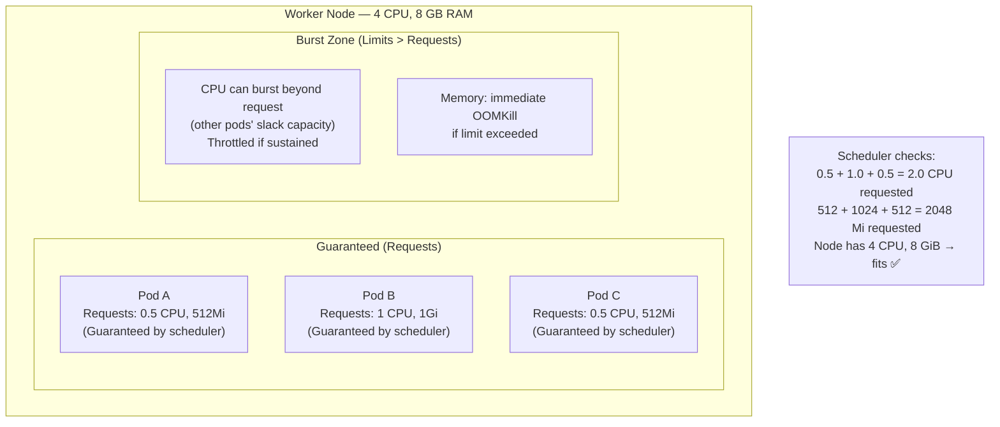
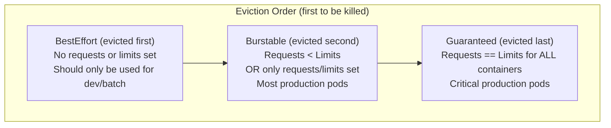

# Why Resource Management Is Non-Negotiable

Without resource management, a single misbehaving application can consume all CPU and memory on a node, causing every other workload on that node to fail. This is the **"noisy neighbor" problem** — one Pod that leaks memory or enters a CPU-spinning loop takes down unrelated services sharing the same machine.

Kubernetes solves this with a two-tier resource management system: **Requests** (guarantees) and **Limits** (caps).

---

## Requests vs Limits: The Core Distinction



| Setting | Used By | CPU behavior | Memory behavior |
|---------|---------|-------------|-----------------|
| **Request** | Scheduler (placement decisions) | Guaranteed minimum | Guaranteed minimum |
| **Limit** | kubelet (runtime enforcement) | Throttled (slowed down) if exceeded | **OOMKilled** (container killed) if exceeded |

**Key insight**: CPU is _compressible_ — it can be throttled without killing the process. Memory is _incompressible_ — if you need more than you have, the only option is to kill the process.

---

## CPU Units: Millicores

```
1000m  = 1 CPU core  (1 full vCPU)
 500m  = 0.5 CPU core
 250m  = 0.25 CPU core
 100m  = 0.1 CPU core  (one-tenth of a core)
  10m  = 0.01 CPU core (minimum practical granularity)

# Equivalently:
1.0    = 1 CPU core
0.5    = half a core
```

**CPU throttling** happens at the kernel cgroup level when a container exceeds its limit. The container's process is still running but gets fewer CPU time slices — it appears slow. For CPU-bound apps (image processing, data transformation), throttling causes latency spikes. For I/O-bound apps (most web APIs), throttling rarely matters.

## Memory Units

```
128Mi  = 128 Mebibytes  (1 Mi = 1,048,576 bytes)
256Mi  = 256 Mebibytes
512Mi  = 512 Mebibytes
1Gi    = 1 Gibibyte = 1,073,741,824 bytes
4Gi    = 4 Gibibytes

# Also valid (metric units, slightly different):
128M   = 128 Megabytes (1 M = 1,000,000 bytes)
1G     = 1 Gigabyte
```

**OOMKill** (Out of Memory Kill): when a container's memory usage exceeds its limit, the Linux kernel immediately sends SIGKILL to the container process. Kubernetes then restarts the container (CrashLoopBackOff if it keeps happening).

---

## Setting Resources in a Deployment

```yaml
# deployment-with-resources.yaml
apiVersion: apps/v1
kind: Deployment
metadata:
  name: my-api
  namespace: production
spec:
  replicas: 3
  selector:
    matchLabels:
      app: my-api
  template:
    metadata:
      labels:
        app: my-api
    spec:
      containers:
        - name: api
          image: ghcr.io/youruser/my-api:v2.0.1
          resources:
            requests:
              cpu: "100m"       # Guaranteed: 0.1 vCPU core
              memory: "128Mi"   # Guaranteed: 128 MB RAM
            limits:
              cpu: "500m"       # Throttled if exceeds 0.5 vCPU
              memory: "512Mi"   # OOMKilled if exceeds 512 MB
```

---

## QoS Classes: How K8s Prioritizes Eviction

Kubernetes assigns each Pod a Quality of Service (QoS) class based on its resource configuration. This determines which pods get evicted first when a node runs out of resources:



```yaml
# BestEffort: No resources set (don't do this in production)
resources: {}

# Burstable: requests < limits (most common in production)
resources:
  requests:
    cpu: "100m"
    memory: "128Mi"
  limits:
    cpu: "500m"
    memory: "512Mi"

# Guaranteed: requests == limits (for critical services)
resources:
  requests:
    cpu: "500m"
    memory: "512Mi"
  limits:
    cpu: "500m"     # ← Same as request
    memory: "512Mi" # ← Same as request
```

---

## How the Scheduler Uses Requests

When you create a Pod, the scheduler evaluates every node's **allocatable** resources vs your pod's requests:

```bash
# See total allocatable resources on each node
kubectl describe node worker-1 | grep -A8 "Allocatable:"
# Allocatable:
#   cpu:               3920m     ← 4 vCPU minus OS overhead
#   memory:            7461Mi    ← 8 GiB minus OS overhead
#   pods:              110

# See what's already allocated (requests of all running pods)
kubectl describe node worker-1 | grep -A10 "Allocated resources:"
# Allocated resources:
#   Resource           Requests       Limits
#   --------           --------       ------
#   cpu                1250m (31%)    2500m (63%)
#   memory             1792Mi (24%)   3Gi (41%)

# Available for new pods:
# CPU: 3920m - 1250m = 2670m
# Memory: 7461Mi - 1792Mi = 5669Mi
```

If a Pod's requests exceed what's available on any node, it stays in **Pending** state:
```bash
kubectl get pod my-pod -n production
# NAME     READY   STATUS    RESTARTS   AGE
# my-pod   0/1     Pending   0          3m

kubectl describe pod my-pod -n production | grep -A5 "Events:"
# Warning  FailedScheduling  default-scheduler  0/3 nodes are available:
#   3 Insufficient memory.
# Fix: reduce memory request or add a node
```

---

## LimitRange: Namespace-Wide Defaults

Instead of configuring resources on every individual Pod, set namespace defaults with `LimitRange`. Pods without explicit resources get these defaults applied automatically:

```yaml
# limitrange.yaml
apiVersion: v1
kind: LimitRange
metadata:
  name: production-limits
  namespace: production
spec:
  limits:
    - type: Container
      # Default request (applied to containers with no request specified)
      defaultRequest:
        cpu: "100m"
        memory: "128Mi"

      # Default limit (applied to containers with no limit specified)
      default:
        cpu: "500m"
        memory: "512Mi"

      # Hard maximum per container (applying higher limits will be rejected)
      max:
        cpu: "2"
        memory: "2Gi"

      # Hard minimum per container
      min:
        cpu: "10m"
        memory: "16Mi"

    - type: Pod
      # Maximum total resources for all containers in a pod
      max:
        cpu: "4"
        memory: "4Gi"

    - type: PersistentVolumeClaim
      max:
        storage: "50Gi"     # Maximum PVC size in this namespace
      min:
        storage: "1Gi"
```

```bash
kubectl apply -f limitrange.yaml

# Verify LimitRange is active
kubectl describe limitrange production-limits -n production

# A container without resources now gets:
# Request: 100m CPU, 128Mi memory
# Limit:   500m CPU, 512Mi memory
```

---

## ResourceQuota: Cap the Entire Namespace

Prevent a single team or application from monopolizing cluster resources:

```yaml
# resourcequota.yaml
apiVersion: v1
kind: ResourceQuota
metadata:
  name: production-quota
  namespace: production
spec:
  hard:
    # Compute resources
    requests.cpu: "10"              # Max 10 CPU cores total requested in namespace
    requests.memory: "20Gi"        # Max 20 GiB RAM total requested
    limits.cpu: "20"               # Max 20 CPU cores total limits
    limits.memory: "40Gi"          # Max 40 GiB RAM total limits

    # Object counts
    pods: "50"                     # Max 50 pods in namespace
    services: "20"                 # Max 20 services
    persistentvolumeclaims: "10"   # Max 10 PVCs
    secrets: "50"                  # Max 50 secrets
    configmaps: "50"               # Max 50 configmaps

    # Storage
    requests.storage: "200Gi"      # Max 200 GiB total PVC storage
```

```bash
kubectl apply -f resourcequota.yaml

# See current usage vs quota
kubectl describe resourcequota production-quota -n production
# Name:              production-quota
# Namespace:         production
# Resource           Used    Hard
# --------           ----    ----
# limits.cpu         2500m   20
# limits.memory      3Gi     40Gi
# pods               8       50
# requests.cpu       1250m   10
# requests.memory    1792Mi  20Gi

# If quota is exceeded, kubectl apply will fail:
# Error from server (Forbidden): error when creating "deployment.yaml":
# pods "my-api-xxx" is forbidden: exceeded quota: production-quota,
# requested: requests.memory=1Gi, used: requests.memory=19Gi, limited: requests.memory=20Gi
```

---

## Measuring Actual Resource Usage

Before setting requests and limits, measure your app's actual usage:

```bash
# Requires metrics-server to be installed
kubectl top pods -n production
# NAME               CPU(cores)   MEMORY(bytes)
# api-v2-aaa         45m          183Mi
# api-v2-bbb         52m          197Mi
# api-v2-ccc         38m          176Mi
# postgres-0         125m         512Mi

kubectl top nodes
# NAME        CPU(cores)   CPU%   MEMORY(bytes)   MEMORY%
# worker-1    450m         11%    3412Mi          43%
# worker-2    280m         7%     2048Mi          26%

# For historical data, use Prometheus PromQL:
# P95 CPU usage over the last week:
# quantile_over_time(0.95, rate(container_cpu_usage_seconds_total{container="api"}[5m])[7d:5m])
# P95 memory:
# quantile_over_time(0.95, container_memory_working_set_bytes{container="api"}[7d:5m])
```

**Rules of thumb for setting resources:**
```
Request CPU    = P50 (median) CPU usage from metrics
Request Memory = P90 memory usage (memory grows over time — use higher percentile)
Limit CPU      = 2-5× request (allows bursting; CPU throttle is acceptable)
Limit Memory   = 1.5-2× request (keep tight — OOMKill is preferable to swapping)
```

---

## Debugging Resource Issues

### OOMKilled

```bash
kubectl get pods -n production
# NAME         READY   STATUS      RESTARTS   AGE
# api-xxx      0/1     OOMKilled   3          15m

kubectl describe pod api-xxx -n production | grep -A10 "Last State:"
# Last State:     Terminated
#   Reason:       OOMKilled
#   Exit Code:    137       ← Signal 9 (SIGKILL from kernel)
#   Started:      Mon, 18 Aug 2026 10:00:00 +0000
#   Finished:     Mon, 18 Aug 2026 10:00:30 +0000

# Fix options:
# 1. Increase the memory limit
kubectl set resources deployment/api -c api \
  --limits=memory=1Gi -n production

# 2. Find and fix the memory leak in your application
# 3. Enable Heap profiling in your app
```

### CPU Throttling (Latency Spikes)

```bash
# Check if a pod is being CPU throttled
# In Prometheus:
# rate(container_cpu_cfs_throttled_seconds_total{container="api"}[5m])
# / rate(container_cpu_cfs_periods_total{container="api"}[5m])
# If > 0.25 (25% throttled), increase CPU limit

# Or check via kubectl
kubectl exec api-xxx -n production -- cat /sys/fs/cgroup/cpu/cpu.stat
# nr_throttled: 12345  ← Number of throttled periods
# throttled_time: 123456789  ← Total nanoseconds throttled
```

### Pod Stuck in Pending (Insufficient Resources)

```bash
kubectl describe pod my-pod -n production | tail -10
# Events:
#   Warning  FailedScheduling  0/3 nodes are available:
#     1 Insufficient cpu, 2 node(s) didn't match Pod's node affinity.

# Check available resources across all nodes
kubectl describe nodes | grep -A5 "Allocated resources:"

# Options:
# 1. Reduce requests in deployment.yaml
# 2. Add a new node to the cluster
# 3. Check if a PodAntiAffinity rule is unnecessarily restrictive
```

---

## Complete Resource Configuration for a Production Stack

```yaml
# Typical resource profile for a Node.js API:
resources:
  requests:
    cpu: "100m"      # 0.1 core — typical idle usage for a Node.js API
    memory: "200Mi"  # 200 MB — typical for a warmed-up Node process
  limits:
    cpu: "500m"      # 0.5 core — allows bursting during traffic spikes
    memory: "512Mi"  # 512 MB — tight enough to catch memory leaks early

# Typical resource profile for a PostgreSQL database:
resources:
  requests:
    cpu: "250m"      # Databases need more consistent CPU
    memory: "512Mi"  # PostgreSQL keeps indexes in shared_buffers
  limits:
    cpu: "2000m"     # Allow bursting for complex queries
    memory: "2Gi"    # Memory limit = shared_buffers + work_mem + overhead

# Typical resource profile for a Redis cache:
resources:
  requests:
    cpu: "100m"
    memory: "256Mi"
  limits:
    cpu: "500m"
    memory: "512Mi"  # Set maxmemory in Redis config to 80% of this limit
```

---

## Summary

Resource management is essential for cluster stability:
- **Requests** = guaranteed resources; the scheduler uses them to place pods on nodes with enough capacity
- **Limits** = enforcement at runtime; CPU is throttled, Memory causes OOMKill
- **QoS Classes**: `Guaranteed` (req=limit) is evicted last; `BestEffort` (no resources) is evicted first
- **LimitRange** sets namespace-level defaults so developers can't accidentally run resource-unconstrained pods
- **ResourceQuota** caps total namespace consumption — prevents one team from starving another
- Always measure actual usage first (`kubectl top pods`) before setting values; use P50 for CPU request, P90 for memory request

In the next lesson, you will learn how Kubernetes determines whether your containers are healthy using **Liveness**, **Readiness**, and **Startup** probes — the mechanism that makes rolling updates safe.
