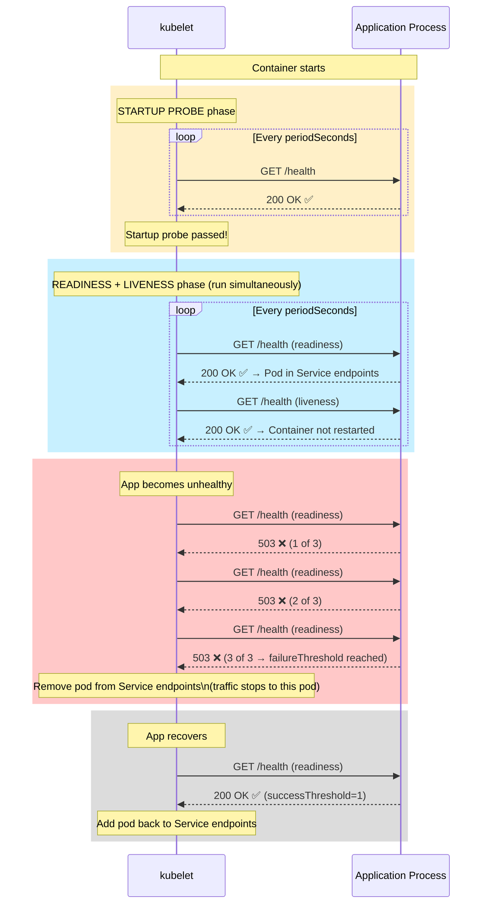
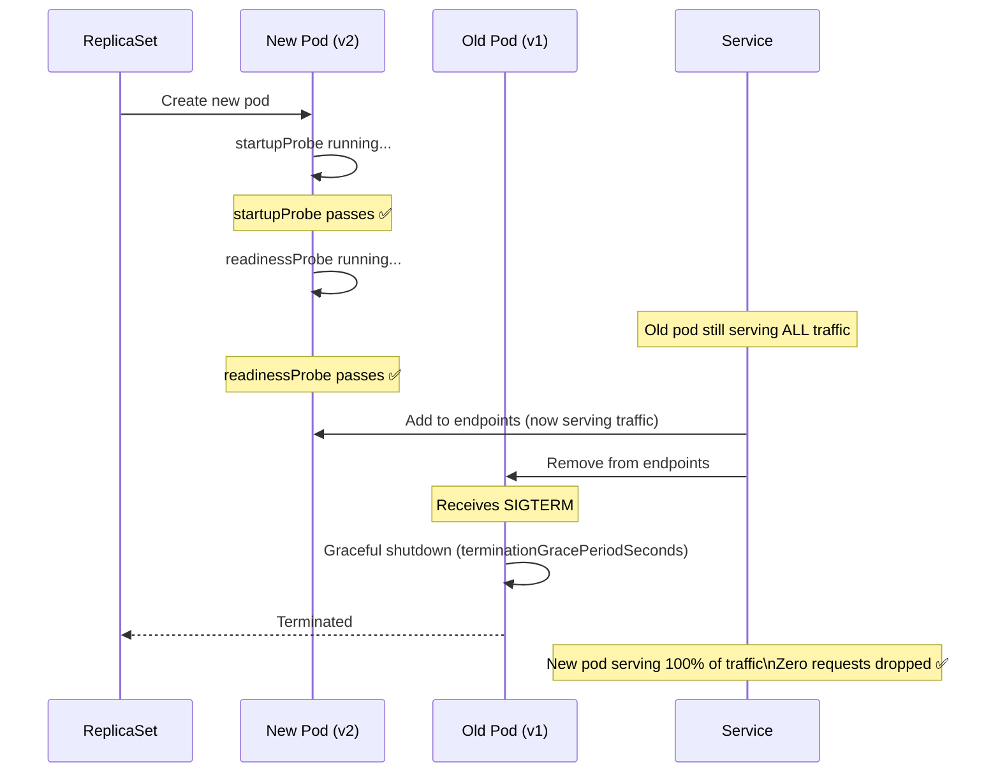

# How Kubernetes Knows Your App Is Healthy

Without health probes, Kubernetes has no way to know whether your application is actually working. It only knows whether the container process is running — not whether the application inside is healthy, connected to its database, or ready to serve requests.

Health probes give Kubernetes that visibility:

| Probe | Question It Answers | Action on Failure |
|-------|--------------------|--------------------|
| **Startup** | "Has the app finished starting up?" | Delays liveness/readiness until it passes |
| **Readiness** | "Is the app ready to receive traffic?" | Removes pod from Service endpoints (traffic stops) |
| **Liveness** | "Is the app alive and not deadlocked?" | Restarts the container |

---

## The Three Probes: Timing and Interaction



---

## Probe Mechanisms

Kubernetes supports three ways to check health:

### HTTP GET (Most Common)

```yaml
readinessProbe:
  httpGet:
    path: /health        # URL path to probe
    port: 3000           # Port (or named port like "http")
    scheme: HTTP         # HTTP or HTTPS
    httpHeaders:         # Optional custom headers
      - name: X-Health-Check
        value: kubernetes
```

Response codes `200-399` = success; `400+` = failure.

### TCP Socket

Kubernetes attempts to open a TCP connection to the specified port. If it succeeds, the probe passes. Use for non-HTTP servers (Redis, PostgreSQL, gRPC):

```yaml
readinessProbe:
  tcpSocket:
    port: 5432    # PostgreSQL
```

### Exec (Shell Command)

Runs a command inside the container. Exit code `0` = success; non-zero = failure:

```yaml
readinessProbe:
  exec:
    command:
      - /bin/sh
      - -c
      - "pg_isready -U $POSTGRES_USER -d $POSTGRES_DB"

# Another example: check if a PID file exists
livenessProbe:
  exec:
    command:
      - /bin/sh
      - -c
      - "test -f /tmp/healthy && [ $(( $(date +%s) - $(stat -c %Y /tmp/healthy) )) -lt 30 ]"
```

### gRPC Health Check (Kubernetes 1.24+)

```yaml
readinessProbe:
  grpc:
    port: 5000
    service: "my.grpc.service"  # Optional: specific gRPC service name
```

---

## Probe Configuration Fields

```yaml
readinessProbe:
  httpGet:
    path: /health
    port: 3000

  # How long to wait after container starts before first probe attempt
  # Give your app time to start before Kubernetes marks it as failed
  initialDelaySeconds: 5

  # How often to run the probe
  periodSeconds: 10

  # How long to wait for a probe response before marking it as failed
  timeoutSeconds: 3

  # How many consecutive successes count as passing (usually 1)
  successThreshold: 1

  # How many consecutive failures before taking action
  failureThreshold: 3
  # Total time to failure: periodSeconds × failureThreshold = 10 × 3 = 30 seconds
```

---

## Startup Probe: For Slow-Starting Applications

**The Problem Without Startup Probe:**
If your app takes 60 seconds to start (loading models, warming caches, running migrations), and your liveness probe fires after 30 seconds and fails, Kubernetes will restart the container — resetting the 60-second startup. You get stuck in an endless restart loop.

**The Solution: Startup Probe**

The startup probe delays liveness and readiness probes until the startup probe passes. It has its own, more generous timing:

```yaml
spec:
  containers:
    - name: slow-starter
      image: my-app:v2
      
      # Startup probe: allows up to 2 minutes for startup
      # (failureThreshold=24 × periodSeconds=5 = 120 seconds max)
      startupProbe:
        httpGet:
          path: /health
          port: 3000
        failureThreshold: 24    # Allow 24 failures before giving up
        periodSeconds: 5        # Check every 5 seconds
        # Total startup budget: 24 × 5 = 120 seconds

      # Readiness and Liveness only start AFTER startup probe passes
      readinessProbe:
        httpGet:
          path: /health
          port: 3000
        initialDelaySeconds: 0  # No delay needed — startup probe already waited
        periodSeconds: 10
        failureThreshold: 3

      livenessProbe:
        httpGet:
          path: /health
          port: 3000
        initialDelaySeconds: 0
        periodSeconds: 30
        failureThreshold: 3
```

---

## Readiness Probe: Remove Unhealthy Pods from Traffic

The readiness probe controls whether a pod receives traffic from its Service. A pod whose readiness probe fails is **removed from the Service's endpoint list** — requests stop being routed to it.

**Critical use cases:**
1. **Rolling updates** — new pod only receives traffic after readiness passes
2. **Database connectivity** — if the DB is down, the pod becomes unready (traffic stops, prevents cascading errors)
3. **Circuit breaking** — overloaded pods can signal they're at capacity

```yaml
readinessProbe:
  httpGet:
    path: /ready    # Use a separate /ready endpoint (not /health) for nuance:
    port: 3000      # /ready checks DB connectivity, cache warm-up, etc.
                    # /health checks the process is alive

  initialDelaySeconds: 5   # Start checking 5s after container starts
  periodSeconds: 10        # Check every 10s
  timeoutSeconds: 3        # Fail if no response in 3s
  successThreshold: 1      # 1 success = ready again
  failureThreshold: 3      # 3 failures = remove from service endpoints
```

### Implementing a Proper Health Endpoint

```typescript
// app/api/health/route.ts (Next.js App Router)
import { pool } from "@/lib/db";
import { NextResponse } from "next/server";

export async function GET() {
  const health = {
    status: "ok",
    timestamp: new Date().toISOString(),
    version: process.env.APP_VERSION ?? "unknown",
    checks: {} as Record<string, { status: string; latencyMs?: number }>,
  };

  // Check database connectivity
  try {
    const start = Date.now();
    await pool.query("SELECT 1");
    health.checks.database = {
      status: "connected",
      latencyMs: Date.now() - start,
    };
  } catch (err) {
    health.status = "degraded";
    health.checks.database = { status: "disconnected" };
  }

  // Add more checks: Redis, external APIs, etc.

  const statusCode = health.status === "ok" ? 200 : 503;
  return NextResponse.json(health, { status: statusCode });
}
```

This endpoint:
- Returns `200` when everything is healthy → pod stays in Service endpoints
- Returns `503` when the DB is down → pod is removed from Service endpoints
- Prevents incoming requests from hitting a pod with no database connection

---

## Liveness Probe: Restart Deadlocked Containers

The liveness probe answers: "Is this container still alive?" If it fails `failureThreshold` times, kubelet **kills and restarts** the container.

Use liveness probes to detect:
- **Deadlocks** — process is running but not processing requests
- **Infinite loops** — process is busy but doing nothing useful
- **Resource exhaustion** — process is alive but out of file descriptors

```yaml
livenessProbe:
  httpGet:
    path: /health     # Same endpoint is fine — just checks the process is responsive
    port: 3000
  
  initialDelaySeconds: 30   # Give the app 30s after readiness passes before liveness starts
  periodSeconds: 30         # Check every 30s (less frequent than readiness)
  timeoutSeconds: 5
  failureThreshold: 3       # Restart after 3 consecutive failures (90s of being dead)
```

<Callout type="warning" title="Don't Make Liveness Too Aggressive">
Setting `failureThreshold: 1` or `timeoutSeconds: 1` means a single slow response will restart your container. During a traffic spike, your pod might be slow but still healthy — a too-aggressive liveness probe makes the situation worse by restarting it.

**Recommended**: set `failureThreshold: 3` and `periodSeconds: 30` — only restart if the app is unresponsive for 90 seconds.
</Callout>

---

## Complete Production Probe Configuration

```yaml
# Best practice configuration for a typical Node.js/Go/Java API:
spec:
  containers:
    - name: api
      image: my-api:v2.0.1
      
      # Startup probe: allow up to 60 seconds for app to initialize
      # (DB connections, cache warm-up, migration check)
      startupProbe:
        httpGet:
          path: /health
          port: 3000
        failureThreshold: 12   # 12 × 5s = 60s
        periodSeconds: 5

      # Readiness probe: check every 10s, fail after 3 misses (30s)
      # Controls: is this pod receiving traffic?
      readinessProbe:
        httpGet:
          path: /health
          port: 3000
        initialDelaySeconds: 0   # Startup probe handled the delay
        periodSeconds: 10
        timeoutSeconds: 3
        successThreshold: 1
        failureThreshold: 3

      # Liveness probe: check every 30s, restart after 3 misses (90s)
      # Controls: should this container be killed and restarted?
      livenessProbe:
        httpGet:
          path: /health
          port: 3000
        initialDelaySeconds: 0
        periodSeconds: 30
        timeoutSeconds: 5
        successThreshold: 1
        failureThreshold: 3
```

---

## Probes and Rolling Updates: The Safety Net



**Without readiness probes**: Kubernetes routes traffic to the new pod as soon as it's `Running` — but the app may not have finished connecting to the database yet. Users get errors.

**With readiness probes**: Traffic only reaches the new pod once it responds `200 OK` to the readiness check. Zero user-visible errors during updates.

---

## Debugging Probe Failures

```bash
# Pod in CrashLoopBackOff — liveness probe killing it repeatedly
kubectl describe pod api-xxx -n production | grep -A15 "Events:"
# Warning  Unhealthy  Liveness probe failed: HTTP probe failed with statuscode: 500
# Warning  Killing    Container api failed liveness probe, will be restarted

# Pod not getting traffic (stuck at 0/1 READY)
kubectl describe pod api-xxx -n production | grep -A5 "Conditions:"
# ContainersReady: False
# Events:
# Warning  Unhealthy  Readiness probe failed: connection refused 127.0.0.1:3000

# What's listening on port 3000 inside the container?
kubectl exec api-xxx -n production -- ss -tlnp | grep 3000
# If nothing: app failed to bind to the port

# Test the health endpoint manually
kubectl exec api-xxx -n production -- wget -qO- http://localhost:3000/health
# Or
kubectl exec api-xxx -n production -- curl -s http://localhost:3000/health

# Port-forward and test from your laptop
kubectl port-forward pod/api-xxx 3000:3000 -n production
curl http://localhost:3000/health
```

---

## Summary

Health probes are the mechanism that makes Kubernetes safe for production:

| Probe | When it runs | Failure action | Primary use |
|-------|-------------|----------------|-------------|
| **Startup** | From container start until it passes | Delays other probes; restarts on `failureThreshold` | Slow-starting apps (Java, AI models) |
| **Readiness** | After startup probe passes, continuously | Removes pod from Service endpoints | Rolling updates, traffic management |
| **Liveness** | After startup probe passes, continuously | Kills and restarts the container | Deadlock recovery |

Production best practices:
- Always implement a `/health` endpoint that checks real dependencies (DB, cache)
- Use all three probes for production workloads
- Set `failureThreshold: 3` and generous `periodSeconds` for liveness — avoid aggressive restarts
- Use `startupProbe` for any app that takes more than 20 seconds to initialize

In the next lesson, you will learn how to provide durable storage to your stateful workloads using **PersistentVolumes** and **PersistentVolumeClaims**.
