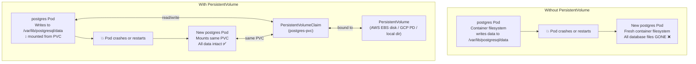
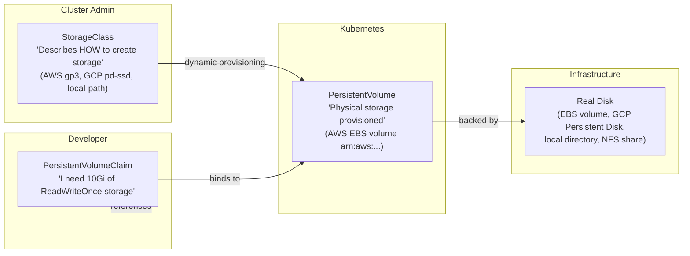

# Why Containers Need Persistent Storage

Container filesystems are **ephemeral** — when a container restarts (crash, update, node migration), every file written to the container's filesystem is gone. For stateless applications like APIs, this is fine. For databases, this is catastrophic.



---

## The Storage Abstraction Layers

Kubernetes separates "what storage is available" from "what storage an application needs":



### The Three Layers Explained

**StorageClass**: Defines the "class" of storage — its provisioner, performance tier, reclaim policy, and topology constraints. Created by cluster admins once; referenced by developers in PVCs.

**PersistentVolume (PV)**: Represents actual physical storage. In cloud clusters, created automatically by the StorageClass when a PVC is submitted (dynamic provisioning). In on-prem clusters, manually created by admins.

**PersistentVolumeClaim (PVC)**: A storage request by a developer/application. Specifies how much storage and what access mode is needed. The Kubernetes volume controller matches it to (or creates) a PV.

---

## StorageClasses

```bash
# List available StorageClasses
kubectl get storageclass
# NAME                   PROVISIONER              RECLAIMPOLICY   VOLUMEBINDINGMODE
# standard (default)     kubernetes.io/gce-pd     Delete          Immediate
# premium-rwo            pd.csi.storage.gke.io    Delete          WaitForFirstConsumer
# local-path             rancher.io/local-path    Delete          WaitForFirstConsumer ← K3s default

# Mark a StorageClass as default
kubectl patch storageclass local-path \
  -p '{"metadata":{"annotations":{"storageclass.kubernetes.io/is-default-class":"true"}}}'
```

### Common StorageClasses by Platform

| Platform | StorageClass Name | Disk Type | Use For |
|----------|------------------|-----------|---------|
| **AWS EKS** | `gp3` | GP3 SSD | General purpose |
| **AWS EKS** | `io1` | Provisioned IOPS | High-perf databases |
| **GKE** | `standard-rwo` | Balanced PD | General purpose |
| **GKE** | `premium-rwo` | SSD PD | Low-latency workloads |
| **AKS** | `managed-premium` | Azure Premium SSD | General/databases |
| **K3s** | `local-path` | Local node disk | Single-node dev/prod |

---

## PersistentVolumeClaims

### Creating a PVC

```yaml
# postgres-pvc.yaml
apiVersion: v1
kind: PersistentVolumeClaim
metadata:
  name: postgres-pvc
  namespace: production
spec:
  accessModes:
    - ReadWriteOnce     # See Access Modes table below
  storageClassName: gp3  # Use "local-path" for K3s
  resources:
    requests:
      storage: 20Gi    # Request 20 GiB of storage
```

### Access Modes

| Mode | Abbreviation | Meaning | Use For |
|------|-------------|---------|---------|
| `ReadWriteOnce` | RWO | One **node** can read+write | PostgreSQL, MySQL, most databases |
| `ReadOnlyMany` | ROX | Multiple nodes can read | Shared config, static assets |
| `ReadWriteMany` | RWX | Multiple nodes can read+write | NFS, AWS EFS — shared uploads, logs |
| `ReadWriteOncePod` | RWOP | Only one **pod** can read+write (K8s 1.22+) | Critical single-writer workloads |

<Callout type="warning" title="ReadWriteOnce ≠ One Pod">
`ReadWriteOnce` means only one **node** can mount the volume for writing — not one Pod. If two pods on the **same node** reference the same PVC (both deployed on worker-1), they can both mount it. But pods on different nodes cannot.

This is why databases must use `replicas: 1` with RWO storage, or use `ReadWriteOncePod` if on Kubernetes 1.22+.
</Callout>

---

## Using a PVC in a Deployment

```yaml
# postgres-deployment.yaml
apiVersion: apps/v1
kind: Deployment
metadata:
  name: postgres
  namespace: production
spec:
  replicas: 1      # MUST be 1 with ReadWriteOnce — only one writer allowed
  selector:
    matchLabels:
      app: postgres
  template:
    metadata:
      labels:
        app: postgres
    spec:
      containers:
        - name: postgres
          image: postgres:16-alpine
          ports:
            - containerPort: 5432
          env:
            - name: POSTGRES_USER
              valueFrom:
                secretKeyRef:
                  name: postgres-secret
                  key: POSTGRES_USER
            - name: POSTGRES_PASSWORD
              valueFrom:
                secretKeyRef:
                  name: postgres-secret
                  key: POSTGRES_PASSWORD
            - name: POSTGRES_DB
              valueFrom:
                secretKeyRef:
                  name: postgres-secret
                  key: POSTGRES_DB
            # Tell PostgreSQL to use a subdirectory (avoids "directory not empty" errors)
            - name: PGDATA
              value: /var/lib/postgresql/data/pgdata

          resources:
            requests: { cpu: "250m", memory: "512Mi" }
            limits: { cpu: "2000m", memory: "2Gi" }

          readinessProbe:
            exec:
              command: ["pg_isready", "-U", "$(POSTGRES_USER)"]
            initialDelaySeconds: 10
            periodSeconds: 10
            failureThreshold: 5

          volumeMounts:
            - name: postgres-storage
              mountPath: /var/lib/postgresql/data   # Where PostgreSQL writes data

      volumes:
        - name: postgres-storage
          persistentVolumeClaim:
            claimName: postgres-pvc   # Reference the PVC we created
```

```bash
# Apply the PVC first, then the deployment
kubectl apply -f postgres-pvc.yaml
kubectl apply -f postgres-deployment.yaml

# Check PVC status (must be Bound before pod starts)
kubectl get pvc -n production
# NAME            STATUS   VOLUME                                     CAPACITY   ACCESS MODES
# postgres-pvc    Bound    pvc-a1b2c3d4-...                          20Gi       RWO

# Check the PV that was dynamically provisioned
kubectl get pv
# NAME                                       CAPACITY   ACCESS MODES   RECLAIM POLICY   STATUS
# pvc-a1b2c3d4-...                           20Gi       RWO            Delete           Bound

# Verify postgres pod is running and data is persisting
kubectl exec -n production deployment/postgres -- psql -U appuser -d myapp -c "SELECT version();"
```

---

## StatefulSets: The Right Tool for Databases

A `StatefulSet` is like a Deployment but designed for stateful workloads. It provides:

1. **Stable Pod names**: `postgres-0`, `postgres-1` (not random hashes)
2. **Stable DNS names**: `postgres-0.postgres.production.svc.cluster.local`
3. **Ordered pod creation/deletion**: pod-0 must be Ready before pod-1 starts
4. **Per-replica storage**: each replica gets its own PVC via `volumeClaimTemplates`

```yaml
# postgres-statefulset.yaml
apiVersion: apps/v1
kind: StatefulSet
metadata:
  name: postgres
  namespace: production
spec:
  serviceName: postgres        # Must match the headless Service name
  replicas: 1                  # 1 for single-node; use operator for HA PostgreSQL
  selector:
    matchLabels:
      app: postgres
  
  template:
    metadata:
      labels:
        app: postgres
    spec:
      containers:
        - name: postgres
          image: postgres:16-alpine
          ports:
            - containerPort: 5432
          env:
            - name: POSTGRES_USER
              valueFrom:
                secretKeyRef: { name: postgres-secret, key: POSTGRES_USER }
            - name: POSTGRES_PASSWORD
              valueFrom:
                secretKeyRef: { name: postgres-secret, key: POSTGRES_PASSWORD }
            - name: POSTGRES_DB
              valueFrom:
                secretKeyRef: { name: postgres-secret, key: POSTGRES_DB }
            - name: PGDATA
              value: /var/lib/postgresql/data/pgdata
          
          resources:
            requests: { cpu: "250m", memory: "512Mi" }
            limits: { cpu: "2000m", memory: "2Gi" }
          
          readinessProbe:
            exec:
              command: ["pg_isready", "-U", "appuser"]
            initialDelaySeconds: 10
            periodSeconds: 10
          
          volumeMounts:
            - name: postgres-data    # References the volumeClaimTemplate name
              mountPath: /var/lib/postgresql/data

  # Each replica gets its own PVC created automatically
  volumeClaimTemplates:
    - metadata:
        name: postgres-data          # PVC name prefix
      spec:
        accessModes: ["ReadWriteOnce"]
        storageClassName: local-path  # Or gp3 on AWS
        resources:
          requests:
            storage: 20Gi
  # Created PVCs:
  # postgres-data-postgres-0  (for postgres-0)
  # postgres-data-postgres-1  (for postgres-1, if replicas=2)
```

```bash
# Required: headless Service for stable DNS names
kubectl apply -f - <<EOF
apiVersion: v1
kind: Service
metadata:
  name: postgres
  namespace: production
spec:
  clusterIP: None         # Headless
  selector:
    app: postgres
  ports:
    - port: 5432
EOF

kubectl apply -f postgres-statefulset.yaml

# StatefulSet creates pods in order: postgres-0 first, then postgres-1
kubectl get pods -n production -w
# NAME         READY   STATUS    RESTARTS   AGE
# postgres-0   0/1     Pending   0          2s
# postgres-0   0/1     Running   0          5s
# postgres-0   1/1     Running   0          15s   ← Must be Ready before postgres-1 starts

# PVCs are created automatically (one per replica)
kubectl get pvc -n production
# NAME                     STATUS   VOLUME            CAPACITY   ACCESS MODES
# postgres-data-postgres-0 Bound    pvc-abc...        20Gi       RWO

# DNS name for each pod
# postgres-0.postgres.production.svc.cluster.local
# postgres-1.postgres.production.svc.cluster.local
```

---

## The PVC Reclaim Policy

When a PVC is deleted, what happens to the underlying data?

| Reclaim Policy | What Happens | When to Use |
|---------------|-------------|-------------|
| `Delete` | Cloud disk is **deleted** (data gone permanently) | Default in cloud — ephemeral test environments |
| `Retain` | Disk is kept (manual cleanup required) | Production — ensure you don't accidentally lose data |
| `Recycle` | Volume is wiped and made available again (deprecated) | Don't use |

```bash
# Check reclaim policy of your StorageClass
kubectl get storageclass gp3 -o jsonpath='{.reclaimPolicy}'
# Delete  ← Default for most cloud StorageClasses — be careful!

# Create a StorageClass with Retain policy
kubectl apply -f - <<EOF
apiVersion: storage.k8s.io/v1
kind: StorageClass
metadata:
  name: gp3-retain
provisioner: ebs.csi.aws.com
parameters:
  type: gp3
reclaimPolicy: Retain          # ← Don't delete disk when PVC is deleted
volumeBindingMode: WaitForFirstConsumer
allowVolumeExpansion: true
EOF
```

---

## Expanding a PVC (Online Resize)

```bash
# Check if the StorageClass supports expansion
kubectl get storageclass gp3 -o jsonpath='{.allowVolumeExpansion}'
# true

# Expand from 20Gi to 50Gi (edit and re-apply)
kubectl patch pvc postgres-pvc -n production \
  -p '{"spec":{"resources":{"requests":{"storage":"50Gi"}}}}'

# The expansion happens online (no downtime) for cloud volumes
kubectl get pvc postgres-pvc -n production
# NAME           STATUS   VOLUME   CAPACITY   ACCESS MODES
# postgres-pvc   Bound    pvc-...  50Gi       RWO   ← Expanded!
```

---

## PVC Troubleshooting

```bash
# PVC stuck in Pending
kubectl describe pvc postgres-pvc -n production
# Events:
#   Warning  ProvisioningFailed  no persistent volumes available for this claim
# → StorageClass doesn't exist or provisioner is not running

# Check if StorageClass exists
kubectl get storageclass

# PVC Pending with WaitForFirstConsumer
kubectl get pvc postgres-pvc -n production
# STATUS: Pending  ← Normal! Will bind only when a pod uses it

# Container crashes with "Permission denied" on mounted volume
# Fix: set fsGroup to match the container's user
spec:
  securityContext:
    fsGroup: 999   # PostgreSQL runs as UID 999 in the official image
```

---

## Backup Strategies for PVC Data

```bash
# Option A: pg_dump (recommended for PostgreSQL)
kubectl exec -n production postgres-0 -- \
  pg_dump -U appuser myapp --format=custom > /backup/myapp-$(date +%Y%m%d).dump

# Option B: Velero — cluster-wide backup including PVCs
velero backup create daily-backup \
  --include-namespaces production \
  --snapshot-volumes \
  --wait

# Option C: Cloud provider snapshot (AWS EBS snapshot)
aws ec2 create-snapshot \
  --volume-id vol-xxxx \   # The EBS volume backing your PVC
  --description "postgres-pvc-$(date +%Y%m%d)"
```

---

## Summary

Kubernetes storage provides durable persistence for stateful workloads:
- **Container filesystems are ephemeral** — always use PVCs for any data that must survive a pod restart
- **StorageClass** describes how to provision storage (provisioner, disk type, reclaim policy)
- **PVC** is your storage request — Kubernetes dynamically provisions a matching PV
- **Deployment** with `replicas: 1` for single-instance databases; use **StatefulSet** for any HA or clustered databases
- **`ReadWriteOnce`** (one node) is the default for databases; **`ReadWriteMany`** (NFS/EFS) for shared media uploads
- **Reclaim policy `Retain`** protects production data from accidental deletion
- Always use `pg_dump` or Velero for database backups — filesystem snapshots may capture inconsistent state

In the final lesson, you will master zero-downtime rolling updates and instant rollbacks — the culmination of everything learned in this course.
